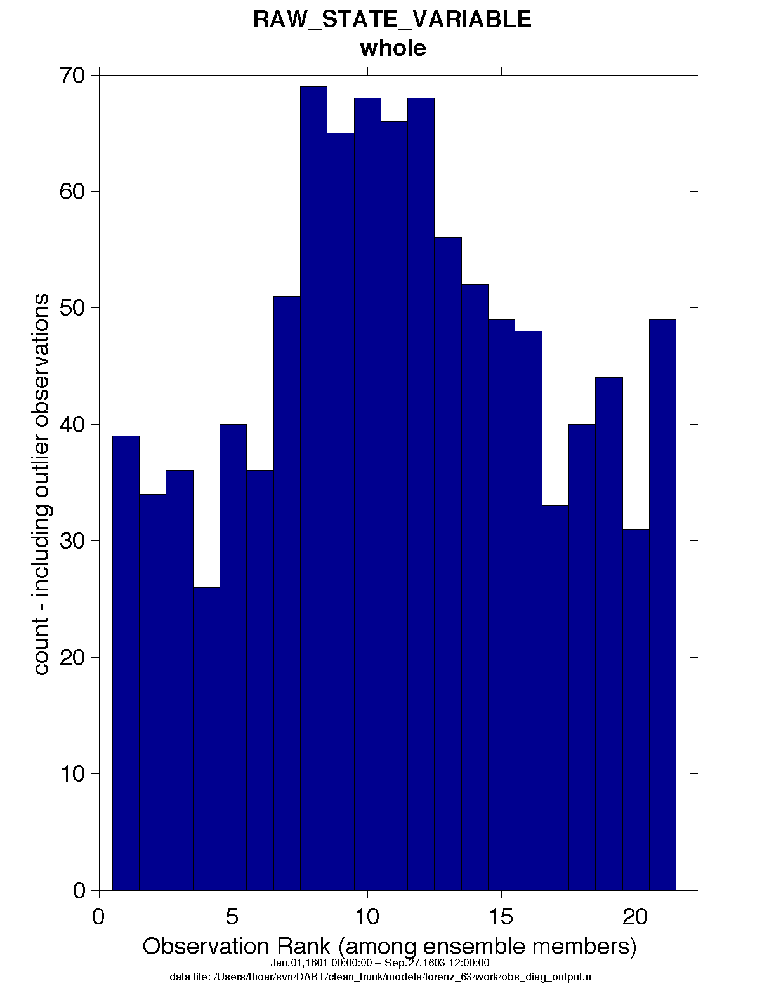

PROGRAM ``obs_diag`` (for 1D observations)
==========================================

Overview/usage
--------------

Main program for observation-space diagnostics for the models with 1D locations. 18 quantities are calculated for each
region for each temporal bin specified by user input. The result of the code is a netCDF file that contains the 18
quantities of the prior (aka 'guess') and posterior (aka 'analysis') estimates as a function of time and region as well
as all the metadata to create meaningful figures. **The 1D version of** ``obs_diag`` **has defaults that automatically set
the first and last bin center based on the first and last observation time in the set of observations being processed.**
This is different behavior than the 3D versions.

Each ``obs_seq.final`` file contains an observation sequence that has multiple 'copies' of the observation. One copy is
the actual observation, another copy is the prior ensemble mean estimate of the observation, one is the spread of the
prior ensemble estimate, one may be the prior estimate from ensemble member 1, ... etc. The only observations for the 1D
models are generally the result of a 'perfect model' experiment, so there is an additional copy called the 'truth' - the
noise-free expected observation given the true model state. Since this copy does not, in general, exist for the
high-order models, all comparisons are made with the copy labelled 'observation'. There is also a namelist variable
(``use_zero_error_obs``) to compare against the 'truth' instead; the observation error variance is then automatically
set to zero.

| Each ensemble member applies a forward observation operator to the state to compute the "expected" value of an
  observation. Please note: the forward observation operator is applied **AFTER** any prior inflation has taken place!
  Similarly, the forward observation operator is applied AFTER any posterior inflation. This has always been the case.
  For a detailed look at the relationship between the observation operators and inflation, please look at the `Detailed
  Program Execution Flow <../../filter/filter.html#DetailedProgramFlow>`__ section of :doc:`../../filter/filter`.
| Given multiple estimates of the observation, several quantities can be calculated. It is possible to compute the
  expected observations from the state vector before assimilating (the "guess", "forecast", or "prior") or after the
  assimilation (the "analysis", or "posterior").

Even with ``input.nml``:``filter_nml:num_output_obs_members`` set to ``0``; the full [prior,posterior] ensemble mean and
[prior,posterior] ensemble spread are preserved in the ``obs_seq.final`` file. Consequently, the ensemble means and
spreads are used to calculate the diagnostics. If the ``input.nml``:``filter_nml:num_output_obs_members`` is set to
``80`` (for example); the first 80 ensemble members prior and posterior "expected" values of the observation are also
included. In this case, the ``obs_seq.final`` file contains enough information to calculate a rank histograms, verify
forecasts, etc. The ensemble means are still used for many other calculations.

======== ========
|image1| |image2|
======== ========

Since this program is fundamentally interested in the response as a function of region, there are three versions of this
program; one for each of the ``oned, threed_sphere, or threed_cartesian`` location modules (``location_mod.f90``). It
did not make sense to ask the ``lorenz_96`` model what part of North America you'd like to investigate or how you would
like to bin in the vertical. The low-order models write out similar netCDF files and the Matlab scripts have been
updated accordingly. The oned observations have locations conceptualized as being on a unit circle, so only the namelist
input variables pertaining to longitude are used.

``obs_diag`` is designed to explore the effect of the assimilation in two ways; 1) as a function of time for a
particular variable (this is the figure on the left), and sometimes 2) in terms of a rank histogram - "Where does the
actual observation rank relative to the rest of the ensemble?" (figure on the right). The figures were created by
Matlab® scripts that query the ``obs_diag_output.nc`` file:
*DART/diagnostics/matlab/*\ `plot_evolution.m <../../../../diagnostics/matlab/plot_evolution.m>`__ and
`plot_rank_histogram.m <../../../../diagnostics/matlab/plot_rank_histogram.m>`__. Both of these takes as input a file
name and a 'quantity' to plot ('rmse','spread','totalspread', ...) and exhaustively plots the quantity (for every
variable, every region) in a single matlab figure window - and creates a series of .ps files with multiple pages for
each of the figures. The directory gets cluttered with them.

The observation sequence files contain only the time of the observation, nothing of the assimilation interval, etc. - so
it requires user guidance to declare what sort of temporal binning for the temporal evolution plots. I do a 'bunch' of
arithmetic on the namelist times to convert them to a series of temporal bin edges that are used when traversing the
observation sequence. The actual algorithm is that the user input for the start date and bin width set up a sequence
that ends in one of two ways ... the last time is reached or the number of bins has been reached. **NOTE:** for the
purpose of interpretability, the 1D ``obs_diag`` routines saves 'dates' as GREGORIAN dates despite the fact these
systems have no concept of a calendar.

``obs_diag`` reads ``obs_seq.final`` files and calculates the following quantities (in no particular order) for an
arbitrary number of regions and levels. ``obs_diag`` creates a netCDF file called ``obs_diag_output.nc``. It is
necessary to query the ``CopyMetaData`` variable to determine the storage order (i.e. "which copy is what?") if you want
to use your own plotting routines.

.. container:: unix

   ncdump -f F -v CopyMetaData obs_diag_output.nc

| 

+-----------------+---------------------------------------------------------------------------------------------------+
| **Nposs**       | The number of observations available to be assimilated.                                           |
+-----------------+---------------------------------------------------------------------------------------------------+
| **Nused**       | The number of observations that were assimilated.                                                 |
+-----------------+---------------------------------------------------------------------------------------------------+
| **rmse**        | The root-mean-squared error (the horizontal wind components are also used to calculate the vector |
|                 | wind velocity and its RMS error).                                                                 |
+-----------------+---------------------------------------------------------------------------------------------------+
| **bias**        | The simple sum of forecast - observation. The bias of the horizontal wind speed (not velocity) is |
|                 | also computed.                                                                                    |
+-----------------+---------------------------------------------------------------------------------------------------+
| **spread**      | The standard deviation of the univariate obs. DART does not exploit the bivariate nature of U,V   |
|                 | winds and so the spread of the horizontal wind is defined as the sum of the spreads of the U and  |
|                 | V components.                                                                                     |
+-----------------+---------------------------------------------------------------------------------------------------+
| **totalspread** | The total standard deviation of the estimate. We pool the ensemble variance of the observation    |
|                 | plus the observation error variance and take the square root.                                     |
+-----------------+---------------------------------------------------------------------------------------------------+
| **NbadDARTQC**  | the number of observations that had a DART QC value (> 1 for a prior, > 3 for a posterior)        |
+-----------------+---------------------------------------------------------------------------------------------------+
| **observation** | the mean of the observation values                                                                |
+-----------------+---------------------------------------------------------------------------------------------------+
| **ens_mean**    | the ensemble mean of the model estimates of the observation values                                |
+-----------------+---------------------------------------------------------------------------------------------------+
| **N_trusted**   | the number of implicitly trusted observations, regardless of DART QC                              |
+-----------------+---------------------------------------------------------------------------------------------------+
| **N_DARTqc_0**  | the number of observations that had a DART QC value of 0                                          |
+-----------------+---------------------------------------------------------------------------------------------------+
| **N_DARTqc_1**  | the number of observations that had a DART QC value of 1                                          |
+-----------------+---------------------------------------------------------------------------------------------------+
| **N_DARTqc_2**  | the number of observations that had a DART QC value of 2                                          |
+-----------------+---------------------------------------------------------------------------------------------------+
| **N_DARTqc_3**  | the number of observations that had a DART QC value of 3                                          |
+-----------------+---------------------------------------------------------------------------------------------------+
| **N_DARTqc_4**  | the number of observations that had a DART QC value of 4                                          |
+-----------------+---------------------------------------------------------------------------------------------------+
| **N_DARTqc_5**  | the number of observations that had a DART QC value of 5                                          |
+-----------------+---------------------------------------------------------------------------------------------------+
| **N_DARTqc_6**  | the number of observations that had a DART QC value of 6                                          |
+-----------------+---------------------------------------------------------------------------------------------------+
| **N_DARTqc_7**  | the number of observations that had a DART QC value of 7                                          |
+-----------------+---------------------------------------------------------------------------------------------------+
| **N_DARTqc_8**  | the number of observations that had a DART QC value of 8                                          |
+-----------------+---------------------------------------------------------------------------------------------------+

The DART QC flag is intended to provide information about whether the observation was assimilated, evaluated only,
whether the assimilation resulted in a 'good' observation, etc. 
DART QC values **<2** indicate the prior and posteriors are OK.
DART QC values **>3** were **not** assimilated or evaluated. Here is the table that
should explain things more fully:

+--------------------+------------------------------------------------------------------+
| DART QC flag value | meaning                                                          |
+====================+==================================================================+
| 0                  | observation assimilated                                          |
+--------------------+------------------------------------------------------------------+
| 1                  | observation evaluated only (because of namelist settings)        |
+--------------------+------------------------------------------------------------------+
| 2                  | assimilated, but the posterior forward operator failed           |
+--------------------+------------------------------------------------------------------+
| 3                  | evaluated only, but the posterior forward operator failed        |
+--------------------+------------------------------------------------------------------+
| 4                  | prior forward operator failed                                    |
+--------------------+------------------------------------------------------------------+
| 5                  | not used because observation type not listed in namelist         |
+--------------------+------------------------------------------------------------------+
| 6                  | rejected because incoming observation QC too large               |
+--------------------+------------------------------------------------------------------+
| 7                  | rejected because of a failed outlier threshold test              |
+--------------------+------------------------------------------------------------------+
| 8                  | vertical conversion failed                                       |
+--------------------+------------------------------------------------------------------+
| 9+                 | reserved for future use                                          |
+--------------------+------------------------------------------------------------------+

What is new in the Manhattan release
------------------------------------

#. Support for DART QC = 8 (failed vertical conversion). This is provided simply to make the netCDF files as consistent
   as needed for plotting purposes.
#. Simplified input file specification.
#. Some of the internal variable names have been changed to make it easier to distinguish between variances and standard
   deviations.

What is new in the Lanai release
--------------------------------

``obs_diag`` has several improvements:

#. Support for 'trusted' observations. Trusted observation types may be specified in the namelist and all observations
   of that type will be counted in the statistics despite the DART QC code (as long as the forward observation operator
   succeeds). See namelist variable ``trusted_obs``.
#. Support for 'true' observations (i.e. from an OSSE). If the 'truth' copy of an observation is desired for comparison
   (instead of the default copy) the observation error variance is set to 0.0 and the statistics are calculated relative
   to the 'truth' copy (as opposed to the normal 'noisy' or 'observation' copy). See namelist variable
   ``use_zero_error_obs``.
#. discontinued the use of ``rat_cri`` and ``input_qc_threshold`` namelist variables. Their functionality was replaced
   by the DART QC mechanism long ago.
#. The creation of the rank histogram (if possible) is now namelist-controlled by namelist variable
   ``create_rank_histogram``.

Namelist
--------

This namelist is read from the file ``input.nml``. Namelists start with an ampersand '&' and terminate with a slash '/'.
Character strings that contain a '/' must be enclosed in quotes to prevent them from prematurely terminating the
namelist.

::

   &obs_diag_nml
      obs_sequence_name     = ''
      obs_sequence_list     = ''
      bin_width_days        = -1
      bin_width_seconds     = -1
      init_skip_days        = 0
      init_skip_seconds     = 0
      max_num_bins          = 9999
      Nregions              = 3
      lonlim1               = 0.0, 0.0, 0.5
      lonlim2               = 1.0, 0.5, 1.0
      reg_names             = 'whole', 'yin', 'yang'
      trusted_obs           = 'null'
      use_zero_error_obs    = .false.
      create_rank_histogram = .true.
      outliers_in_histogram = .true.
      verbose               = .false.
      /

| 

The allowable ranges for the region boundaries are: lon [0.0, 1.0). The 1D locations are conceived as the distance
around a unit sphere. An observation with a location exactly ON a region boundary cannot 'count' for both regions. The
logic used to resolve this is:

   if((lon ≥ lon1) .and. (lon < lon2)) keeper = .true.

| Consequently, if you want to include an observation precisely AT 1.0, (for example), you need to specify something a
  little larger than 1.0.
| You can only specify **either** ``obs_sequence_name`` **or** ``obs_sequence_list`` -- not both. One of them has to be
  an empty string ... i.e. ``''``.

.. container::

   +-----------------------------------+---------------------------------------+---------------------------------------+
   | Item                              | Type                                  | Description                           |
   +===================================+=======================================+=======================================+
   | obs_sequence_name                 | character(len=256), dimension(100)    | An array of names of observation      |
   |                                   |                                       | sequence files. These may be relative |
   |                                   |                                       | or absolute filenames. If this is     |
   |                                   |                                       | set, ``obs_sequence_list`` must be    |
   |                                   |                                       | set to ' ' (empty string).            |
   +-----------------------------------+---------------------------------------+---------------------------------------+
   | obs_sequence_list                 | character(len=256)                    | Name of an ascii text file which      |
   |                                   |                                       | contains a list of one or more        |
   |                                   |                                       | observation sequence files, one per   |
   |                                   |                                       | line. If this is specified,           |
   |                                   |                                       | ``obs_sequence_name`` must be set to  |
   |                                   |                                       | ' '. Can be created by any method,    |
   |                                   |                                       | including sending the output of the   |
   |                                   |                                       | 'ls' command to a file, a text        |
   |                                   |                                       | editor, or another program. If this   |
   |                                   |                                       | is set, ``obs_sequence_name`` must be |
   |                                   |                                       | set to ' ' (empty string).            |
   +-----------------------------------+---------------------------------------+---------------------------------------+
   | bin_width_days, bin_width_seconds | integer                               | Specifies the width of the analysis   |
   |                                   |                                       | window. All observations within a     |
   |                                   |                                       | window centered at the observation    |
   |                                   |                                       | time +/- bin_width_[days,seconds] is  |
   |                                   |                                       | used. If both values are 0, half the  |
   |                                   |                                       | separation between observation times  |
   |                                   |                                       | as defined in the observation         |
   |                                   |                                       | sequence file is used for the bin     |
   |                                   |                                       | width (i.e. all observations used).   |
   +-----------------------------------+---------------------------------------+---------------------------------------+
   | init_skip_days, init_skip_seconds | integer                               | Ignore all observations before this   |
   |                                   |                                       | time. This allows one to skip the     |
   |                                   |                                       | 'spinup' or stabilization period of   |
   |                                   |                                       | an assimilation.                      |
   +-----------------------------------+---------------------------------------+---------------------------------------+
   | max_num_bins                      | integer                               | This provides a way to restrict the   |
   |                                   |                                       | number of temporal bins. If           |
   |                                   |                                       | ``max_num_bins`` is set to '10', only |
   |                                   |                                       | 10 timesteps will be output, provided |
   |                                   |                                       | there are that many.                  |
   +-----------------------------------+---------------------------------------+---------------------------------------+
   | Nregions                          | integer                               | The number of regions for the unit    |
   |                                   |                                       | circle for which you'd like           |
   |                                   |                                       | observation-space diagnostics. If 3   |
   |                                   |                                       | is not enough increase ``MaxRegions`` |
   |                                   |                                       | in ``obs_diag.f90`` and recompile.    |
   +-----------------------------------+---------------------------------------+---------------------------------------+
   | lonlim1                           | real(r8) array of length(Nregions)    | starting value of coordinates         |
   |                                   |                                       | defining 'regions'. A value of -1     |
   |                                   |                                       | indicates the start of 'no region'.   |
   +-----------------------------------+---------------------------------------+---------------------------------------+
   | lonlim2                           | real(r8) array of length(Nregions)    | ending value of coordinates defining  |
   |                                   |                                       | 'regions'. A value of -1 indicates    |
   |                                   |                                       | the end of 'no region'.               |
   +-----------------------------------+---------------------------------------+---------------------------------------+
   | reg_names                         | character(len=6), dimension(Nregions) | Array of names for each of the        |
   |                                   |                                       | regions. The default example has the  |
   |                                   |                                       | unit circle as a whole and divided    |
   |                                   |                                       | into two equal parts, so there are    |
   |                                   |                                       | only three regions.                   |
   +-----------------------------------+---------------------------------------+---------------------------------------+
   | trusted_obs                       | character(len=32), dimension(5)       | Array of names for observation TYPES  |
   |                                   |                                       | that will be included in the          |
   |                                   |                                       | statistics if at all possible (i.e.   |
   |                                   |                                       | the forward observation operator      |
   |                                   |                                       | succeeds). For 1D observations the    |
   |                                   |                                       | only choices in the code as           |
   |                                   |                                       | distributed are 'RAW_STATE_VARIABLE'  |
   |                                   |                                       | and/or 'RAW_STATE_1D_INTEGRAL'.       |
   |                                   |                                       | (Additional 1D observation types can  |
   |                                   |                                       | be added by the user.)                |
   +-----------------------------------+---------------------------------------+---------------------------------------+
   | use_zero_error_obs                | logical                               | if ``.true.``, the observation copy   |
   |                                   |                                       | used for the statistics calculations  |
   |                                   |                                       | will be 'truth'. Only 'perfect'       |
   |                                   |                                       | observations (from                    |
   |                                   |                                       | ``perfect_model_obs``) have this      |
   |                                   |                                       | copy. The observation error variance  |
   |                                   |                                       | will be set to zero.                  |
   +-----------------------------------+---------------------------------------+---------------------------------------+
   | create_rank_histogram             | logical                               | if ``.true.`` and there are actual    |
   |                                   |                                       | ensemble estimates of the             |
   |                                   |                                       | observations in the ``obs_seq.final`` |
   |                                   |                                       | (i.e.                                 |
   |                                   |                                       | ``filter_nml:num_output_obs_members`` |
   |                                   |                                       | is larger than zero), a rank          |
   |                                   |                                       | histogram will be created.            |
   +-----------------------------------+---------------------------------------+---------------------------------------+
   | outliers_in_histogram             | logical                               | if ``.true.`` the observations that   |
   |                                   |                                       | have been rejected by the outlier     |
   |                                   |                                       | threshhold mechanism will be          |
   |                                   |                                       | *included* in the calculation of the  |
   |                                   |                                       | rank histogram.                       |
   +-----------------------------------+---------------------------------------+---------------------------------------+
   | verbose                           | logical                               | switch controlling amount of run-time |
   |                                   |                                       | output.                               |
   +-----------------------------------+---------------------------------------+---------------------------------------+

Modules directly used
---------------------

::

   types_mod
   obs_sequence_mod
   obs_def_mod
   obs_kind_mod
   location_mod
   time_manager_mod
   utilities_mod
   sort_mod
   random_seq_mod

Modules indirectly used
-----------------------

::

   assim_model_mod
   cov_cutoff_mod
   model_mod
   null_mpi_utilities_mod

Files
-----

-  ``input.nml`` is used for ``obs_diag_nml``
-  ``obs_diag_output.nc`` is the netCDF output file
-  ``dart_log.out`` list directed output from the obs_diag.
-  ``LargeInnov.txt`` contains the distance ratio histogram -- useful for estimating the distribution of the magnitudes
   of the innovations.

Discussion of obs_diag_output.nc
~~~~~~~~~~~~~~~~~~~~~~~~~~~~~~~~

Every observation type encountered in the observation sequence file is tracked separately, and aggregated into temporal
and spatial bins. There are two main efforts to this program. One is to track the temporal evolution of any of the
quantities available in the netCDF file for any possible observation type:

.. container:: unix

   ncdump -v CopyMetaData,ObservationTypes obs_diag_output.nc

The other is to explore the vertical profile of a particular observation kind. By default, each observation kind has a
'guess/prior' value and an 'analysis/posterior' value - which shed some insight into the innovations.

Temporal evolution
^^^^^^^^^^^^^^^^^^

The ``obs_diag_output.nc`` output file has all the metadata I could think of, as well as separate variables for every
observation type in the observation sequence file. Furthermore, there is a separate variable for the 'guess/prior' and
'analysis/posterior' estimate of the observation. To distinguish between the two, a suffix is appended to the variable
name. An example seems appropriate:

::

     ...
     char CopyMetaData(copy, stringlength) ;
             CopyMetaData:long_name = "quantity names" ;
     ...
     int rank_bins(rank_bins) ;
             rank_bins:long_name = "rank histogram bins" ;
             rank_bins:comment = "position of the observation among the sorted noisy ensemble members" ;
     float RAW_STATE_VARIABLE_guess(time, copy, region) ;
             RAW_STATE_VARIABLE_guess:_FillValue = -888888.f ;
             RAW_STATE_VARIABLE_guess:missing_value = -888888.f ;
     float RAW_STATE_VARIABLE_analy(time, copy, region) ;
             RAW_STATE_VARIABLE_analy:_FillValue = -888888.f ;
             RAW_STATE_VARIABLE_analy:missing_value = -888888.f ;
     ...

Rank histograms
^^^^^^^^^^^^^^^

If it is possible to calculate a rank histogram, there will also be :

::

      ...
     int RAW_STATE_VARIABLE_guess_RankHist(time, rank_bins, region) ;
      ...

as well as some global attributes. The attributes reflect the namelist settings and can be used by plotting routines to
provide additional annotation for the histogram.

::

                   :DART_QCs_in_histogram = 0, 1, 2, 3, 7 ;
                   :outliers_in_histogram = "TRUE" ;

| Please note:
| netCDF restricts variable names to 40 characters, so '_Rank_Hist' may be truncated.

References
----------

#. none

Private components
------------------

N/A

.. |image1| image:: ../../../../guide/images/lorenz_63_rmse_evolution.png
   :width: 300px

