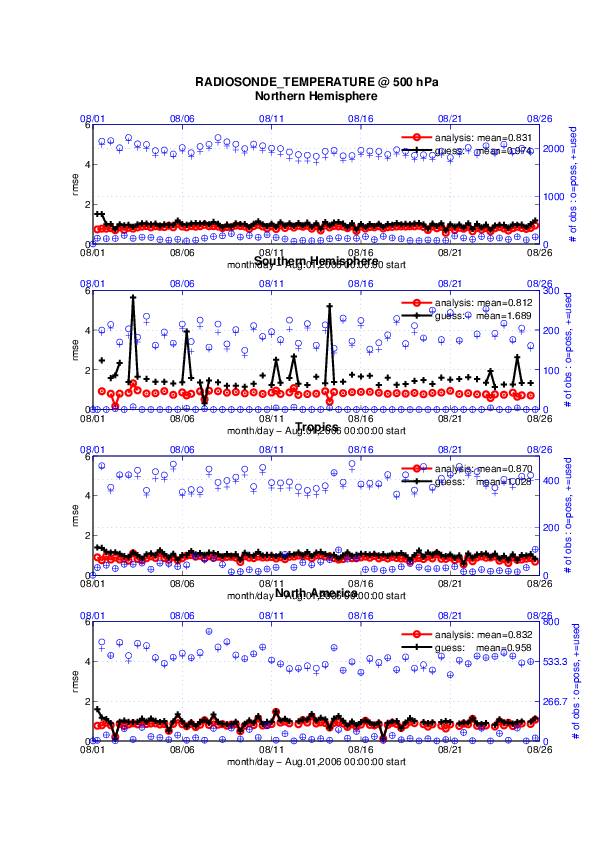

PROGRAM ``obs_diag`` (for observations that use the threed_sphere location module)
==================================================================================

Overview
--------

Main program for evaluating filter performance in observation space. Primarily, the prior or posterior ensemble mean
(and spread) are compared to the observation and several quantities are calculated. These quantities are then saved in a
netCDF file that has all the metadata to create meaningful figures.

Each ``obs_seq.final`` file contains an observation sequence that has multiple 'copies' of the observation. One copy is
the actual observation, another copy is the prior ensemble mean estimate of the observation, one is the spread of the
prior ensemble estimate, one may be the prior estimate from ensemble member 1, ... etc. If the original observation
sequence is the result of a 'perfect model' experiment, there is an additional copy called the 'truth' - the noise-free
expected observation given the true model state. Since this copy does not, in general, exist for the high-order models,
all comparisons are made with the copy labelled 'observation'. There is also a namelist variable
(``use_zero_error_obs``) to compare against the 'truth' instead; the observation error variance is then automatically
set to zero.

| Each ensemble member applies a forward observation operator to the state to compute the "expected" value of an
  observation. Please note: the forward observation operator is applied **AFTER** any prior inflation has taken place!
  Similarly, the forward observation operator is applied AFTER any posterior inflation. This has always been the case.
  For a detailed look at the relationship between the observation operators and inflation, please look at the `Detailed
  Program Execution Flow <../../filter/filter.html#DetailedProgramFlow>`__ section of :doc:`../../filter/filter`.
| Given multiple estimates of the observation, several quantities can be calculated. It is possible to compute the
  expected observations from the state vector before assimilating (the "guess", "forecast", or "prior") or after the
  assimilation (the "analysis", or "posterior").

Even with ``input.nml``:``filter_nml:num_output_obs_members`` set to ``0``; the full [prior,posterior] ensemble mean and
[prior,posterior] ensemble spread are preserved in the ``obs_seq.final`` file. Consequently, the ensemble means and
spreads are used to calculate the diagnostics. If the ``input.nml``:``filter_nml:num_output_obs_members`` is set to
``80`` (for example); the first 80 ensemble members prior and posterior "expected" values of the observation are also
included. In this case, the ``obs_seq.final`` file contains enough information to calculate a rank histograms, verify
forecasts, etc. The ensemble means are still used for many other calculations.

Since this program is fundamentally interested in the response as a function of region, there are three versions of this
program; one for each of the ``oned, threed_sphere, or threed_cartesian`` location modules (``location_mod.f90``). It
did not make sense to ask the ``lorenz_96`` model what part of North America you'd like to investigate or how you would
like to bin in the vertical. The low-order models write out similar netCDF files and the Matlab scripts have been
updated accordingly. The oned observations have locations conceptualized as being on a unit circle, so only the namelist
input variables pertaining to longitude are used.

Identity observations (only possible from "perfect model experiments") are already explored with state-space
diagnostics, so ``obs_diag`` simply skips them.
The notable exception to this is a program specifically written
for streamflow observations taken at gauge locations as represented by the 'channel-only' configuration of WRF-Hydro.
There is a separate program *DART/assimilation_code/programs/obs_diag/stream_flow/streamflow_obs_diag.f90* 
specifically for those observations, since the model is designed to run **at** the USGS gauge locations.

``obs_diag`` is designed to explore the effect of the assimilation in three ways: 
---------------------------------------------------------------------------------

1) as a function of time for a particular variable and level 
~~~~~~~~~~~~~~~~~~~~~~~~~~~~~~~~~~~~~~~~~~~~~~~~~~~~~~~~~~~~

|image1|

2) as a time-averaged vertical profile
~~~~~~~~~~~~~~~~~~~~~~~~~~~~~~~~~~~~~~

|image2|

3) and in terms of a rank histogram - 
~~~~~~~~~~~~~~~~~~~~~~~~~~~~~~~~~~~~~
"Where does the actual observation rank relative to the rest of the ensemble?"

+-------------+------------+
|  |image3|   |  |image4|  |
+-------------+------------+

The figures in sections 1 and 2 were created by Matlab® scripts that
query the ``obs_diag_output.nc`` file:
``DART/diagnostics/matlab/plot_evolution.m`` and
``plot_profile.m``. Both of these takes as input a file name and a
'quantity' to plot ('rmse','spread','totalspread', ...) and exhaustively plots 
the quantity (for every variable, every level, every region) in a single matlab 
figure window - and creates a series of .ps files with multiple pages for each
of the figures. The directory gets cluttered with them. The rank histogram 
information in ``obs_diag_output.nc`` can easily be plotted with
`ncview <http://meteora.ucsd.edu/~pierce/ncview_home_page.html>`__ (left), 
a free third-party piece of software or with ``plot_rank_histogram.m`` (right).
See the `Rank histograms`_ section for more information and links to instructions.

``obs_diag`` can be configured to compare the ensemble estimates against the 'observation' copy or the 'truth' copy
based on the setting of the ``use_zero_error_obs`` namelist variable.

The observation sequence files contain only the time of the observation, nothing of the assimilation interval, etc. - so
it requires user guidance to declare what sort of temporal binning for the temporal evolution plots. I do a 'bunch' of
arithmetic on the namelist times to convert them to a series of temporal bin edges that are used when traversing the
observation sequence. The actual algorithm is that the user input for the start date and bin width set up a sequence
that ends in one of two ways ... the last time is reached or the number of bins has been reached.

``obs_diag`` reads ``obs_seq.final`` files and calculates the following quantities (in no particular order) for an
arbitrary number of regions and levels. ``obs_diag`` creates a netCDF file called ``obs_diag_output.nc``. It is
necessary to query the ``CopyMetaData`` variable to determine the storage order (i.e. "which copy is what?") if you want
to use your own plotting routines.

.. container:: unix

   ncdump -f F -v CopyMetaData obs_diag_output.nc

| 

+-----------------+---------------------------------------------------------------------------------------------------+
| **Nposs**       | The number of observations available to be assimilated.                                           |
+-----------------+---------------------------------------------------------------------------------------------------+
| **Nused**       | The number of observations that were assimilated.                                                 |
+-----------------+---------------------------------------------------------------------------------------------------+
| **NbadUV**      | the number of velocity observations that had a matching component that was not assimilated;       |
+-----------------+---------------------------------------------------------------------------------------------------+
| **NbadLV**      | the number of observations that were above or below the highest or lowest model level,            |
|                 | respectively;                                                                                     |
+-----------------+---------------------------------------------------------------------------------------------------+
| **rmse**        | The root-mean-squared error (the horizontal wind components are also used to calculate the vector |
|                 | wind velocity and its RMS error).                                                                 |
+-----------------+---------------------------------------------------------------------------------------------------+
| **bias**        | The simple sum of forecast - observation. The bias of the horizontal wind speed (not velocity) is |
|                 | also computed.                                                                                    |
+-----------------+---------------------------------------------------------------------------------------------------+
| **spread**      | The standard deviation of the univariate obs. DART does not exploit the bivariate nature of U,V   |
|                 | winds and so the spread of the horizontal wind is defined as the sum of the spreads of the U and  |
|                 | V components.                                                                                     |
+-----------------+---------------------------------------------------------------------------------------------------+
| **totalspread** | The total standard deviation of the estimate. We pool the ensemble variance of the observation    |
|                 | plus the observation error variance and take the square root.                                     |
+-----------------+---------------------------------------------------------------------------------------------------+
| **NbadDARTQC**  | the number of observations that had a DART QC value (> 1 for a prior, > 3 for a posterior)        |
+-----------------+---------------------------------------------------------------------------------------------------+
| **observation** | the mean of the observation values                                                                |
+-----------------+---------------------------------------------------------------------------------------------------+
| **ens_mean**    | the ensemble mean of the model estimates of the observation values                                |
+-----------------+---------------------------------------------------------------------------------------------------+
| **N_trusted**   | the number of implicitly trusted observations, regardless of DART QC                              |
+-----------------+---------------------------------------------------------------------------------------------------+
| **N_DARTqc_0**  | the number of observations that had a DART QC value of 0                                          |
+-----------------+---------------------------------------------------------------------------------------------------+
| **N_DARTqc_1**  | the number of observations that had a DART QC value of 1                                          |
+-----------------+---------------------------------------------------------------------------------------------------+
| **N_DARTqc_2**  | the number of observations that had a DART QC value of 2                                          |
+-----------------+---------------------------------------------------------------------------------------------------+
| **N_DARTqc_3**  | the number of observations that had a DART QC value of 3                                          |
+-----------------+---------------------------------------------------------------------------------------------------+
| **N_DARTqc_4**  | the number of observations that had a DART QC value of 4                                          |
+-----------------+---------------------------------------------------------------------------------------------------+
| **N_DARTqc_5**  | the number of observations that had a DART QC value of 5                                          |
+-----------------+---------------------------------------------------------------------------------------------------+
| **N_DARTqc_6**  | the number of observations that had a DART QC value of 6                                          |
+-----------------+---------------------------------------------------------------------------------------------------+
| **N_DARTqc_7**  | the number of observations that had a DART QC value of 7                                          |
+-----------------+---------------------------------------------------------------------------------------------------+
| **N_DARTqc_8**  | the number of observations that had a DART QC value of 8                                          |
+-----------------+---------------------------------------------------------------------------------------------------+

The temporal evolution of the above quantities for every observation type (RADIOSONDE_U_WIND_COMPONENT,
AIRCRAFT_SPECIFIC_HUMIDITY, ...) is recorded in the output netCDF file - ``obs_diag_output.nc``. This netCDF file can
then be loaded and displayed using the Matlab® scripts in ``..../DART/diagnostics/matlab``. (which may depend on
functions in ``..../DART/matlab``). The temporal, geographic, and vertical binning are under namelist control. Temporal
averages of the above quantities are also stored in the netCDF file. Normally, it is useful to skip the 'burn-in' period
- the amount of time to skip is under namelist control.

The DART QC flag is intended to provide information about whether the observation was assimilated, evaluated only,
whether the assimilation resulted in a 'good' observation, etc. DART QC values **<2** indicate the prior
and posteriors are OK. DART QC values **>3** were **not** assimilated or evaluated. Here is the table that
should explain things more fully:

+--------------------+------------------------------------------------------------------+
| DART QC flag value | meaning                                                          |
+====================+==================================================================+
| 0                  | observation assimilated                                          |
+--------------------+------------------------------------------------------------------+
| 1                  | observation evaluated only (because of namelist settings)        |
+--------------------+------------------------------------------------------------------+
| 2                  | assimilated, but the posterior forward operator failed           |
+--------------------+------------------------------------------------------------------+
| 3                  | evaluated only, but the posterior forward operator failed        |
+--------------------+------------------------------------------------------------------+
| 4                  | prior forward operator failed                                    |
+--------------------+------------------------------------------------------------------+
| 5                  | not used because observation type not listed in namelist         |
+--------------------+------------------------------------------------------------------+
| 6                  | rejected because incoming observation QC too large               |
+--------------------+------------------------------------------------------------------+
| 7                  | rejected because of a failed outlier threshold test              |
+--------------------+------------------------------------------------------------------+
| 8                  | vertical conversion failed                                       |
+--------------------+------------------------------------------------------------------+
| 9+                 | reserved for future use                                          |
+--------------------+------------------------------------------------------------------+

What is new in the Manhattan release
------------------------------------

#. Support for DART QC = 8 (failed vertical conversion).
#. Simplified input file specification.
#. Removed ``rat_cri`` and ``input_qc_threshold`` from the namelists. They had been deprecated for quite some time.
#. Some of the internal variable names have been changed to make it easier to distinguish between variances and standard
   deviations.

What is new in the Lanai release
--------------------------------

``obs_diag`` has several improvements:

#. Improved vertical specification. Namelist variables ``[h,p,m]level_edges`` allow fine-grained control over the
   vertical binning. It is not allowed to specify both the edges and midpoints for the vertical bins.
#. Improved error-checking for input specification, particularly the vertical bins. Repeated values are squeezed out.
#. Support for 'trusted' observations. Trusted observation types may be specified in the namelist and all observations
   of that type will be counted in the statistics despite the DART QC code (as long as the forward observation operator
   succeeds). See namelist variable ``trusted_obs``. For more details, see the section on Trusted observations.
#. Support for 'true' observations (i.e. from an OSSE). If the 'truth' copy of an observation is desired for comparison
   (instead of the default copy) the observation error variance is set to 0.0 and the statistics are calculated relative
   to the 'truth' copy (as opposed to the normal 'noisy' or 'observation' copy). See namelist variable
   ``use_zero_error_obs``.
#. discontinued the use of ``rat_cri`` and ``input_qc_threshold`` namelist variables. Their functionality was replaced
   by the DART QC mechanism long ago.
#. The creation of the rank histogram (if possible) is now namelist-controlled by namelist variable
   ``create_rank_histogram``.

Namelist
--------

This namelist is read from the file ``input.nml``. Namelists start with an ampersand '&' and terminate with a slash '/'.
Character strings that contain a '/' must be enclosed in quotes to prevent them from prematurely terminating the
namelist.

::

   &obs_diag_nml
      obs_sequence_name     = ''
      obs_sequence_list     = ''
      first_bin_center      =  2003, 1, 1, 0, 0, 0
      last_bin_center       =  2003, 1, 2, 0, 0, 0
      bin_separation        =     0, 0, 0, 6, 0, 0
      bin_width             =     0, 0, 0, 6, 0, 0
      time_to_skip          =     0, 0, 1, 0, 0, 0
      max_num_bins          = 1000
      plevel                = -888888.0
      hlevel                = -888888.0
      mlevel                = -888888
      plevel_edges          = -888888.0
      hlevel_edges          = -888888.0
      mlevel_edges          = -888888
      Nregions              = 0
      lonlim1               = -888888.0
      lonlim2               = -888888.0
      latlim1               = -888888.0
      latlim2               = -888888.0
      reg_names             = 'null'
      trusted_obs           = 'null'
      create_rank_histogram = .true.
      outliers_in_histogram = .false.
      use_zero_error_obs    = .false.
      verbose               = .false.
      /

| 

| The date-time integer arrays in this namelist have the form (YYYY, MM, DY, HR, MIN, SEC).
| The allowable ranges for the region boundaries are: latitude [-90.,90], longitude [0.,Inf.]

You can only specify **either** ``obs_sequence_name`` **or** ``obs_sequence_list`` -- not both. One of them has to be an
empty string ... i.e. ``''``.

.. container::

   +-----------------------+------------------------------------+-------------------------------------------------------+
   | Item                  | Type                               | Description                                           |
   +=======================+====================================+=======================================================+
   | obs_sequence_name     | character(len=256), dimension(100) | An array of names of observation sequence files.      |
   |                       |                                    | These may be relative or absolute filenames. If this  |
   |                       |                                    | is set, ``obs_sequence_list`` must be set to ' '      |
   |                       |                                    | (empty string).                                       |
   +-----------------------+------------------------------------+-------------------------------------------------------+
   | obs_sequence_list     | character(len=256)                 | Name of an ascii text file which contains a list of   |
   |                       |                                    | one or more observation sequence files, one per line. |
   |                       |                                    | If this is specified, ``obs_sequence_name`` must be   |
   |                       |                                    | set to ' '. Can be created by any method, including   |
   |                       |                                    | sending the output of the 'ls' command to a file, a   |
   |                       |                                    | text editor, or another program. If this is set,      |
   |                       |                                    | ``obs_sequence_name`` must be set to ' ' (empty       |
   |                       |                                    | string).                                              |
   +-----------------------+------------------------------------+-------------------------------------------------------+
   | first_bin_center      | integer, dimension(6)              | first timeslot of the first obs_seq.final file to     |
   |                       |                                    | process. The six integers are: year, month, day,      |
   |                       |                                    | hour, hour, minute, second, in that order.            |
   |                       |                                    | ``obs_diag`` has improved run-time output that        |
   |                       |                                    | reports the time and date of the first and last       |
   |                       |                                    | observations in every observation sequence file. Look |
   |                       |                                    | for the string 'First observation date' in the        |
   |                       |                                    | logfile. If the ``verbose`` is 'true', it is also     |
   |                       |                                    | written to the screen.                                |
   +-----------------------+------------------------------------+-------------------------------------------------------+
   | last_bin_center       | integer, dimension(6)              | last timeslot of interest. (reminder: the last        |
   |                       |                                    | timeslot of day 1 is hour 0 of day 2) The six         |
   |                       |                                    | integers are: year, month, day, hour, hour, minute,   |
   |                       |                                    | second, in that order. This does not need to be       |
   |                       |                                    | exact, the values from ``first_bin_center`` and       |
   |                       |                                    | ``bin_separation`` are used to populate the time      |
   |                       |                                    | array and stop on or before the time defined by       |
   |                       |                                    | ``last_bin_center``. See also ``max_num_bins``.       |
   +-----------------------+------------------------------------+-------------------------------------------------------+
   | bin_separation        | integer, dimension(6)              | Time between bin centers. The year and month values   |
   |                       |                                    | *must* be zero.                                       |
   +-----------------------+------------------------------------+-------------------------------------------------------+
   | bin_width             | integer, dimension(6)              | Time span around bin centers in which obs will be     |
   |                       |                                    | compared. The year and month values *must* be zero.   |
   |                       |                                    | Frequently, but not required to be, the same as the   |
   |                       |                                    | values for bin_separation. 0                          |
   +-----------------------+------------------------------------+-------------------------------------------------------+
   | time_to_skip          | integer, dimension(6)              | Time span at the beginning to skip when calculating   |
   |                       |                                    | vertical profiles of rms error and bias. The year and |
   |                       |                                    | month values *must* be zero. Useful because it takes  |
   |                       |                                    | some time for the assimilation to settle down from    |
   |                       |                                    | the climatological spread at the start.               |
   |                       |                                    | ``time_to_skip`` is an amount of time AFTER the first |
   |                       |                                    | edge of the first bin.                                |
   +-----------------------+------------------------------------+-------------------------------------------------------+
   | max_num_bins          | integer                            | This provides an alternative way to declare the       |
   |                       |                                    | ``last_bin_center``. If ``max_num_bins`` is set to    |
   |                       |                                    | '10', only 10 timesteps will be output - provided     |
   |                       |                                    | ``last_bin_center`` is set to some later date.        |
   +-----------------------+------------------------------------+-------------------------------------------------------+
   | plevel                | real, dimension(50)                | The midpoints defining the pressure levels for the    |
   |                       |                                    | vertical binning. There is no specification of bin    |
   |                       |                                    | width - a continuum is used. If a single midpoint     |
   |                       |                                    | value is entered, the bin edges are +/- 10% of the    |
   |                       |                                    | midpoint value. If you'd like to change that see the  |
   |                       |                                    | routine *Rmidpoints2edges()*. You may specify either  |
   |                       |                                    | ``plevel`` or ``plevel_edges``, but not both.         |
   +-----------------------+------------------------------------+-------------------------------------------------------+
   | plevel_edges          | real, dimension(51)                | The edges defining the pressure levels for the        |
   |                       |                                    | vertical binning. You may specify either ``plevel``   |
   |                       |                                    | or ``plevel_edges``, but not both.                    |
   +-----------------------+------------------------------------+-------------------------------------------------------+
   | hlevel                | real, dimension(50)                | Same, but for observations that have height(m) or     |
   |                       |                                    | depth(m) as the vertical coordinate.                  |
   +-----------------------+------------------------------------+-------------------------------------------------------+
   | hlevel_edges          | real, dimension(51)                | The edges defining the height (or depth) levels for   |
   |                       |                                    | the vertical binning. You may specify either          |
   |                       |                                    | ``hlevel`` or ``hlevel_edges``, but not both.         |
   +-----------------------+------------------------------------+-------------------------------------------------------+
   | mlevel                | real, dimension(50)                | Same, but for observations that have model level as   |
   |                       |                                    | the vertical coordinate.                              |
   +-----------------------+------------------------------------+-------------------------------------------------------+
   | mlevel_edges          | real, dimension(51)                | The edges defining the model levels for the vertical  |
   |                       |                                    | binning. You may specify either ``mlevel`` or         |
   |                       |                                    | ``mlevel_edges``, but not both.                       |
   +-----------------------+------------------------------------+-------------------------------------------------------+
   | Nregions              | integer                            | Number of regions of the globe for which obs space    |
   |                       |                                    | diagnostics are computed separately. Must be between  |
   |                       |                                    | [1,50]. If 50 is not enough, increase                 |
   |                       |                                    | ``obs_diag.f90``\ ``MaxRegions`` and recompile.       |
   +-----------------------+------------------------------------+-------------------------------------------------------+
   | lonlim1               | real, dimension(50)                | Westernmost longitudes of each of the regions.        |
   +-----------------------+------------------------------------+-------------------------------------------------------+
   | lonlim2               | real, dimension(50)                | Easternmost longitudes of each of the regions. *If    |
   |                       |                                    | any of these values is*\ **less than**\ *the          |
   |                       |                                    | westernmost values, it defines a region that spans    |
   |                       |                                    | the prime meridian.* e.g. a specification of          |
   |                       |                                    | ``lonlim1 = 330 , lonlim2 = 50`` could identify a     |
   |                       |                                    | region like "Africa".                                 |
   +-----------------------+------------------------------------+-------------------------------------------------------+
   | latlim1               | real, dimension(50)                | Southernmost latitudes of the regions.                |
   +-----------------------+------------------------------------+-------------------------------------------------------+
   | latlim2               | real, dimension(50)                | Northernmost latitudes of the regions.                |
   +-----------------------+------------------------------------+-------------------------------------------------------+
   | reg_names             | character(len=129), dimension(50)  | Array of names for the regions to be analyzed. Will   |
   |                       |                                    | be used for plot titles.                              |
   +-----------------------+------------------------------------+-------------------------------------------------------+
   | trusted_obs           | character(len=32), dimension(50)   | list of observation types that **must** participate   |
   |                       |                                    | in the calculation of the statistics, regardless of   |
   |                       |                                    | the DART QC (provided that the forward observation    |
   |                       |                                    | operator can still be applied without failure). e.g.  |
   |                       |                                    | 'RADIOSONDE_TEMPERATURE', ... For more details, see   |
   |                       |                                    | the section on Trusted observations.                  |
   +-----------------------+------------------------------------+-------------------------------------------------------+
   | use_zero_error_obs    | logical                            | if ``.true.``, the observation copy used for the      |
   |                       |                                    | statistics calculations will be 'truth'. Only         |
   |                       |                                    | 'perfect' observations (from ``perfect_model_obs``)   |
   |                       |                                    | have this copy. The observation error variance will   |
   |                       |                                    | be set to zero.                                       |
   +-----------------------+------------------------------------+-------------------------------------------------------+
   | create_rank_histogram | logical                            | if ``.true.`` and there are actual ensemble estimates |
   |                       |                                    | of the observations in the ``obs_seq.final`` (i.e.    |
   |                       |                                    | ``filter_nml:num_output_obs_members`` is larger than  |
   |                       |                                    | zero), a rank histogram will be created.              |
   +-----------------------+------------------------------------+-------------------------------------------------------+
   | outliers_in_histogram | logical                            | if ``.true.`` the observations that have been         |
   |                       |                                    | rejected by the outlier threshhold mechanism will be  |
   |                       |                                    | *included* in the calculation of the rank histogram.  |
   +-----------------------+------------------------------------+-------------------------------------------------------+
   | verbose               | logical                            | switch controlling amount of run-time output.         |
   +-----------------------+------------------------------------+-------------------------------------------------------+

Other modules used
------------------

::

   obs_sequence_mod
   obs_kind_mod
   obs_def_mod (and possibly other obs_def_xxx mods)
   assim_model_mod
   random_seq_mod
   model_mod
   location_mod
   types_mod
   time_manager_mod
   utilities_mod
   sort_mod

Files
-----

-  ``input.nml`` is used for ``obs_diag_nml``
-  ``obs_diag_output.nc`` is the netCDF output file
-  ``dart_log.out`` list directed output from the obs_diag.
-  ``LargeInnov.txt`` contains the distance ratio histogram -- useful for estimating the distribution of the magnitudes
   of the innovations.

Obs_diag may require a model input file from which to get grid information, metadata, and links to modules providing the
models expected observations. It all depends on what's needed by the ``model_mod.f90``

Discussion of obs_diag_output.nc
~~~~~~~~~~~~~~~~~~~~~~~~~~~~~~~~

Every observation type encountered in the observation sequence file is tracked separately, and aggregated into temporal
and 3D spatial bins. There are two main efforts to this program. One is to track the temporal evolution of any of the
quantities available in the netCDF file for any possible observation type:

.. container:: unix

   ncdump -v CopyMetaData,ObservationTypes obs_diag_output.nc

The other is to explore the vertical profile of a particular observation kind. By default, each observation kind has a
'guess/prior' value and an 'analysis/posterior' value - which shed some insight into the innovations.

Temporal evolution
^^^^^^^^^^^^^^^^^^

The ``obs_diag_output.nc`` output file has all the metadata I could think of, as well as separate variables for every
observation type in the observation sequence file. Furthermore, there is a separate variable for the 'guess/prior' and
'analysis/posterior' estimate of the observation. To distinguish between the two, a suffix is appended to the variable
name. An example seems appropriate:

::

     ...
     char CopyMetaData(copy, stringlength) ;
             CopyMetaData:long_name = "quantity names" ;
     char ObservationTypes(obstypes, stringlength) ;
             ObservationTypes:long_name = "DART observation types" ;
             ObservationTypes:comment = "table relating integer to observation type string" ;
     float RADIOSONDE_U_WIND_COMPONENT_guess(time, copy, plevel, region) ;
             RADIOSONDE_U_WIND_COMPONENT_guess:_FillValue = -888888.f ;
             RADIOSONDE_U_WIND_COMPONENT_guess:missing_value = -888888.f ;
     float RADIOSONDE_V_WIND_COMPONENT_guess(time, copy, plevel, region) ;
             RADIOSONDE_V_WIND_COMPONENT_guess:_FillValue = -888888.f ;
             RADIOSONDE_V_WIND_COMPONENT_guess:missing_value = -888888.f ;
     ...
     float MARINE_SFC_ALTIMETER_guess(time, copy, surface, region) ;
             MARINE_SFC_ALTIMETER_guess:_FillValue = -888888.f ;
             MARINE_SFC_ALTIMETER_guess:missing_value = -888888.f ;
     ...
     float RADIOSONDE_WIND_VELOCITY_guess(time, copy, plevel, region) ;
             RADIOSONDE_WIND_VELOCITY_guess:_FillValue = -888888.f ;
             RADIOSONDE_WIND_VELOCITY_guess:missing_value = -888888.f ;
     ...
     float RADIOSONDE_U_WIND_COMPONENT_analy(time, copy, plevel, region) ;
             RADIOSONDE_U_WIND_COMPONENT_analy:_FillValue = -888888.f ;
             RADIOSONDE_U_WIND_COMPONENT_analy:missing_value = -888888.f ;
     float RADIOSONDE_V_WIND_COMPONENT_analy(time, copy, plevel, region) ;
             RADIOSONDE_V_WIND_COMPONENT_analy:_FillValue = -888888.f ;
             RADIOSONDE_V_WIND_COMPONENT_analy:missing_value = -888888.f ;
     ...

There are several things to note:

#. the 'WIND_VELOCITY' component is nowhere 'near' the corresponding U,V components.
#. all of the 'guess' variables come before the matching 'analy' variables.
#. surface variables (i.e. ``MARINE_SFC_ALTIMETER`` have a coordinate called 'surface' as opposed to 'plevel' for the
   others in this example).

Vertical profiles
^^^^^^^^^^^^^^^^^

Believe it or not, there are another set of netCDF variables specifically for the vertical profiles, essentially
duplicating the previous variables but **without the 'time' dimension**. These are distinguished by the suffix added to
the observation kind - 'VPguess' and 'VPanaly' - 'VP' for Vertical Profile.

::

     ...
     float SAT_WIND_VELOCITY_VPguess(copy, plevel, region) ;
             SAT_WIND_VELOCITY_VPguess:_FillValue = -888888.f ;
             SAT_WIND_VELOCITY_VPguess:missing_value = -888888.f ;
     ...
     float RADIOSONDE_U_WIND_COMPONENT_VPanaly(copy, plevel, region) ;
             RADIOSONDE_U_WIND_COMPONENT_VPanaly:_FillValue = -888888.f ;
             RADIOSONDE_U_WIND_COMPONENT_VPanaly:missing_value = -888888.f ;
     ...

Observations flagged as 'surface' do not participate in the vertical profiles (Because surface variables cannot exist on
any other level, there's not much to plot!). Observations on the lowest level DO participate. There's a difference!

Rank histograms
^^^^^^^^^^^^^^^

If it is possible to calculate a rank histogram, there will also be :

::

      ...
      int RADIOSONDE_U_WIND_COMPONENT_guess_RankHi(time, rank_bins, plevel, region) ;
      ...
      int RADIOSONDE_V_WIND_COMPONENT_guess_RankHi(time, rank_bins, plevel, region) ;
      ...
      int MARINE_SFC_ALTIMETER_guess_RankHist(time, rank_bins, surface, region) ;
      ...

as well as some global attributes. The attributes reflect the namelist settings and can be used by plotting routines to
provide additional annotation for the histogram.

::

                   :DART_QCs_in_histogram = 0, 1, 2, 3, 7 ;
                   :outliers_in_histogram = "TRUE" ;

Please note:

#. netCDF restricts variable names to 40 characters, so '_Rank_Hist' may be truncated.
#. It is sufficiently vague to try to calculate a rank histogram for a velocity derived from the assimilation of U,V
   components such that NO rank histogram is created for velocity. A run-time log message will inform as to which
   variables are NOT having a rank histogram variable preserved in the ``obs_diag_output.nc`` file - IFF it is possible
   to calculate a rank histogram in the first place.

+-----------+----------------------------------------------------------------------------------------------------------+
| |image3|  | `Instructions for viewing the rank histogram with                                                        |
|           | ncview <http://www.image.ucar.edu/DAReS/DART/DART2_Documentation.php#ncview_histogram>`__.               |
+-----------+----------------------------------------------------------------------------------------------------------+
| |image4|  | `Instructions for viewing the rank histogram with                                                        |
|           | Matlab <http://www.image.ucar.edu/DAReS/DART/DART2_Documentation.php#mat_obs>`__.                        |
+-----------+----------------------------------------------------------------------------------------------------------+

"trusted" observation types
^^^^^^^^^^^^^^^^^^^^^^^^^^^

This needs to be stated up front: ``obs_diag`` is a post-processor; it cannot influence the assimilation. One
interpretation of a TRUSTED observation is that the assimilation should **always** use the observation, even if it is
far from the ensemble. At present (23 Feb 2015), the filter in DART does not forcibly assimilate any one observation and
selectively assimilate the others. Still, it is useful to explore the results using a set of 'trusted type'
observations, whether they were assimilated, evaluated, or rejected by the outlier threshhold. This is the important
distinction. The diagnostics can be calculated differently for each *observation type*.

The normal diagnostics calculate the metrics (rmse, bias, etc.) only for the 'good' observations - those that were
assimilated or evaluated. The ``outlier_threshold`` essentially defines what observations are considered too far from
the ensemble **prior** to be useful. These observations get a DART QC of 7 and are not assimilated. The observations
with a DART QC of 7 do not contribute the the metrics being calculated. Similarly, if the forward observation operator
fails, these observations cannot contribute. When the operator fails, the 'expected' observation value is 'MISSING', and
there is no ensemble mean or spread.

'Trusted type' observation metrics are calculated using all the observations that were assimilated or evaluated **AND**
the observations that were rejected by the outlier threshhold. ``obs_diag`` can post-process the DART QC and calculate
the metrics appropriately for **observation types** listed in the ``trusted_obs`` namelist variable. If there are
trusted observation types specified for ``obs_diag``, the ``obs_diag_output.nc`` has global metadata to indicate that a
different set of criteria were used to calculate the metrics. The individual variables also have an extra attribute. In
the following output, ``input.nml:obs_diag_nml:trusted_obs`` was set:
``trusted_obs = 'RADIOSONDE_TEMPERATURE', 'RADIOSONDE_U_WIND_COMPONENT'``

::

     ...
           float RADIOSONDE_U_WIND_COMPONENT_guess(time, copy, plevel, region) ;
                   RADIOSONDE_U_WIND_COMPONENT_guess:_FillValue = -888888.f ;
                   RADIOSONDE_U_WIND_COMPONENT_guess:missing_value = -888888.f ;
                   RADIOSONDE_U_WIND_COMPONENT_guess:TRUSTED = "TRUE" ;
           float RADIOSONDE_V_WIND_COMPONENT_guess(time, copy, plevel, region) ;
                   RADIOSONDE_V_WIND_COMPONENT_guess:_FillValue = -888888.f ;
                   RADIOSONDE_V_WIND_COMPONENT_guess:missing_value = -888888.f ;
     ...
   // global attributes:
     ...
                   :trusted_obs_01 = "RADIOSONDE_TEMPERATURE" ;
                   :trusted_obs_02 = "RADIOSONDE_U_WIND_COMPONENT" ;
                   :obs_seq_file_001 = "cam_obs_seq.1978-01-01-00000.final" ;
                   :obs_seq_file_002 = "cam_obs_seq.1978-01-02-00000.final" ;
                   :obs_seq_file_003 = "cam_obs_seq.1978-01-03-00000.final" ;
     ...
                   :MARINE_SFC_ALTIMETER = 7 ;
                   :LAND_SFC_ALTIMETER = 8 ;
                   :RADIOSONDE_U_WIND_COMPONENT--TRUSTED = 10 ;
                   :RADIOSONDE_V_WIND_COMPONENT = 11 ;
                   :RADIOSONDE_TEMPERATURE--TRUSTED = 14 ;
                   :RADIOSONDE_SPECIFIC_HUMIDITY = 15 ;
                   :AIRCRAFT_U_WIND_COMPONENT = 21 ;
     ...

+---------------------------------------------------------------------------------------------------------+-----------+
| The Matlab scripts try to ensure that the trusted observation graphics clarify that the metrics plotted | |image5|  |
| are somehow 'different' than the normal processing stream. Some text is added to indicate that the      |           |
| values include the outlying observations. **IMPORTANT:** The interpretation of the number of            |           |
| observations 'possible' and 'used' still reflects what was used **in the assimilation!** The number of  |           |
| observations rejected by the outlier threshhold is not explicilty plotted. To reinforce this, the text  |           |
| for the observation axis on all graphics has been changed to ``"o=possible, *=assimilated"``. In short, |           |
| the distance between the number of observations possible and the number assimilated still reflects the  |           |
| number of observations rejected by the outlier threshhold and the number of failed forward observation  |           |
| operators.                                                                                              |           |
+---------------------------------------------------------------------------------------------------------+-----------+

There is ONE ambiguous case for trusted observations. There may be instances in which the observation fails the outlier
threshhold test (which is based on the prior) and the posterior forward operator fails. DART does not have a QC that
explicilty covers this case. The current logic in ``obs_diag`` correctly handles these cases **except** when trying to
use 'trusted' observations. There is a section of code in ``obs_diag`` that may be enabled if you are encountering this
ambiguous case. As ``obs_diag`` runs, a warning message is issued and a summary count is printed if the ambiguous case
is encountered. What normally happens is that if that specific observation type is trusted, the posterior values include
a MISSING value in the calculation which makes them inaccurate. If the block of code is enabled, the DART QC is recast
as the PRIOR forward observation operator fails. This is technically incorrect, but for the case of trusted
observations, it results in only calculating statistics for trusted observations that have a useful prior and posterior.
**This should not be used unless you are willing to intentionally disregard 'trusted' observations that were rejected by
the outlier threshhold.** Since the whole point of a trusted observation is to *include* observations potentially
rejected by the outlier threshhold, you see the problem. Some people like to compare the posteriors. *THAT* can be the
problem.

::

   if ((qc_integer == 7) .and. (abs(posterior_mean(1) - MISSING_R8) < 1.0_r8)) then
               write(string1,*)'WARNING ambiguous case for obs index ',obsindex
               string2 = 'obs failed outlier threshhold AND posterior operator failed.'
               string3 = 'Counting as a Prior QC == 7, Posterior QC == 4.'
               if (trusted) then
   ! COMMENT      string3 = 'WARNING changing DART QC from 7 to 4'
   ! COMMENT      qc_integer = 4
               endif
               call error_handler(E_MSG,'obs_diag',string1,text2=string2,text3=string3)
               num_ambiguous = num_ambiguous + 1
            endif

Usage
-----

``obs_diag`` is built in .../DART/models/*your_model*/work, in the same way as the other DART components.

Multiple observation sequence files
~~~~~~~~~~~~~~~~~~~~~~~~~~~~~~~~~~~

There are two ways to specify input files for ``obs_diag``. You can either specify the name of a file containing a list
of files (in ``obs_sequence_list``), or you may specify a list of files via ``obs_sequence_name``.

Example: observation sequence files spanning 30 days
~~~~~~~~~~~~~~~~~~~~~~~~~~~~~~~~~~~~~~~~~~~~~~~~~~~~

+---------------------------------------------------------------------------------------------------------+-----------+
| In this example, we will be accumulating metrics for 30 days. The ``obs_diag_output.nc`` file will have | |image4|  |
| exactly ONE timestep in it (so it won't be much use for the ``plot_evolution`` functions) - but the     |           |
| ``plot_profile`` functions and the ``plot_rank_histogram`` function will be used to explore the         |           |
| assimilation. By way of an example, we will NOT be using outlier observations in the rank histogram.    |           |
| Lets presume that all your ``obs_seq.final`` files are in alphabetically-nice directories:              |           |
+---------------------------------------------------------------------------------------------------------+-----------+

::

   /Exp1/Dir01/obs_seq.final
   /Exp1/Dir02/obs_seq.final
   /Exp1/Dir03/obs_seq.final
   ...
   /Exp1/Dir99/obs_seq.final

The first step is to create a file containing the list of observation sequence files you want to use. This can be done
with the unix command 'ls' with the -1 option (that's a number one) to put one file per line.

.. container:: unix

   ls -1 /Exp1/Dir*/obs_seq.final > obs_file_list.txt

It is necessary to turn on the verbose option to check the first/last times that will be used for the histogram. Then,
the namelist settings for 2008 07 31 12Z through 2008 08 30 12Z are:

.. container:: routine

   ::

      &obs_diag_nml
         obs_sequence_name     = ''
         obs_sequence_list     = 'obs_file_list.txt'
         first_bin_center      =  2008, 8,15,12, 0, 0
         last_bin_center       =  2008, 8,15,12, 0, 0
         bin_separation        =     0, 0,30, 0, 0, 0
         bin_width             =     0, 0,30, 0, 0, 0
         time_to_skip          =     0, 0, 0, 0, 0, 0
         max_num_bins          = 1000
         Nregions              = 1
         lonlim1               =   0.0
         lonlim2               = 360.0
         latlim1               = -90.0
         latlim2               =  90.0
         reg_names             = 'Entire Domain'
         create_rank_histogram = .true.
         outliers_in_histogram = .false.
         verbose               = .true.
         /

then, simply run ``obs_diag`` in the usual manner - you may want to save the run-time output to a file. Here is a
portion of the run-time output:

.. container:: unix

   ::

      ...
      Region  1 Entire Domain                    (WESN):     0.0000   360.0000   -90.0000    90.0000
       Requesting            1  assimilation periods.

      epoch      1  start day=148865, sec=43201
      epoch      1 center day=148880, sec=43200
      epoch      1    end day=148895, sec=43200
      epoch      1  start 2008 Jul 31 12:00:01
      epoch      1 center 2008 Aug 15 12:00:00
      epoch      1    end 2008 Aug 30 12:00:00
      ...
      MARINE_SFC_HORIZONTAL_WIND_guess_RankHis has            0 "rank"able observations.
      SAT_HORIZONTAL_WIND_guess_RankHist       has            0 "rank"able observations.
      ...

| Discussion: It should be pretty clear that there is exactly 1 assimilation period, it may surprise you that the start
  is 1 second past 12Z. This is deliberate and reflects the DART convention of starting intervals 1 second after the end
  of the previous interval. The times in the netCDF variables reflect the defined start/stop of the period, regardless
  of the time of the first/last observation.
| Please note that none of the 'horizontal_wind' variables will have a rank histogram, so they are not written to the
  netCDF file. ANY variable that does not have a rank histogram with some observations will NOT have a rank histogram
  variable in the netCDF file.
| Now that you have the ``obs_diag_output.nc``, you can explore it with ``plot_profile.m, plot_bias_xxx_profile.m, or
  plot_rmse_xxx_profile.m``,
  rank histograms with `ncview <http://meteora.ucsd.edu/~pierce/ncview_home_page.html>`__ or ``plot_rank_histogram.m``.

References
----------

#. none

Private components
------------------

N/A

.. |image2| image:: ../../../../guide/images/obs_diag_profile_example.png
   :width: 600px
.. |image3| image:: ../../../../guide/images/RankHistogram_ncview.png
   :width: 600px
.. |image4| image:: ../../../../guide/images/RankHistogram_matlab.png
   :width: 600px
.. |image5| image:: ../../../../guide/images/RAD_T_trusted_bias_evolution.png
   :width: 600px
