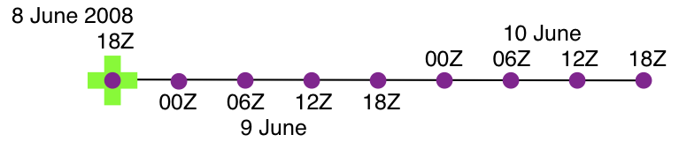

.. role:: bolditalic
  :class: bolditalic

program ``obs_seq_coverage``
============================

Overview
--------

``obs_seq_coverage`` queries a set of observation sequence files to determine which observation locations report
frequently enough to be useful for a verification study. The big picture is to be able to pare down a large set of
observations into a compact observation sequence file to run through :doc:`../filter/filter` with all of the intended
observation types flagged as *evaluate_only*. DART's forward operators then get applied and all the forecasts are
preserved in a standard ``obs_seq.final`` file - perhaps more appropriately called ``obs_seq.forecast``! Paring down the
input observation sequence file cuts down on the unnecessary application of the forward operator to create observation
copies that will not be used anyway ...

|forecast evaluation schematic|

``obs_seq_coverage`` results in two output files:

-  ``obsdef_mask.txt`` contains the list of observation definitions (but not the observations themselves) that are
   desired. The observation definitions include the locations and times for each of the desired observation types. This
   file is read by :doc:`../../../assimilation_code/programs/obs_selection/obs_selection` and combined with the raw
   observation sequence files to create the observation sequence file appropriate for use in a forecast.
-  ``obsdef_mask.nc`` contains information needed to be able to plot the times and locations of the observations in a
   manner to help explore the design of the verification locations/network. ``obsdef_mask.nc`` is *required* by
   :doc:`../../../assimilation_code/programs/obs_seq_verify/obs_seq_verify`, the program that reorders the observations
   into a structure that makes it easy to calculate statistics like ROC, etc.

| The following section explains the strategy and requirements for determining what observations will be used to verify
  a forecast. Since it is 'standard practice' to make several forecasts to build statistical strength, it is important
  to use the SAME set of observation locations for all the forecasts that will be verified together. To make the
  discussion easier, let's define the *verification network* as the set of locations and times for a particular
  observation type.
| The entire discussion about finding locations that are repeatedly observed through time boils down to the simple
  statement that if the observation is within about 500cm of a previous observation, they are treated as co-located
  observations. For some very high resolution applications, this may be insufficient, but there it is. For observations
  at pressure levels, see the Word about vertical levels.
| The only complicated part of determining the verification network is the temporal component. The initial time (usually
  an *analysis time* from a previous assimilation), the *verification interval*, and the *forecast length* completely
  specify the temporal aspect of a forecast. The following example has a verification interval of 6 hours and a forecast
  length of 24 hours. We adopt the convention of also including the initial conditions (a "nowcast") in the "forecast",
  so there are 5 times of interest - which we will call *verification times* and are represented by |verification icon|.
  The candidate observation sequence files are scanned to select all the observations that are **closest** to the
  verification times. The difference in time between the "nowcast" and the "forecast" is the *forecast lead*.
| |simple forecast|
| So - that is simple enough if there is only one forecast, but this is rarely the case. Let's say we have a second
  forecast. Ideally, we'd like to verify at exactly the same locations and forecast leads - otherwise we're not really
  comparing the same things. If the second verification network happens to be at locations that are easy to predict,
  we're comparing apples and oranges. The *fair* way to proceed is to determine the verification network that is the
  same for all forecasts. This generally results in a pretty small set of observations - a problem we will deal with
  later.
| The diagram below illustrates the logic behind determining the list of verification times for a pretty common
  scenario: a 24-hour forecast with a forecast lead of 6 hours, repeated the next day. The *first_analysis* is at VT1 -
  let's call it 00Z day 1. We need to have observations available at:
| VT1 (00Z day1), VT2 (06Z day1), VT3 (12Z day1), VT4 (18Z day1), and VT5 (24Z day1 / 00Z day2). The *last_analysis*
  starts at VT5 00Z day 2 and must verify at
| VT5 (00Z day2), VT6 (06Z day2), VT7 (12Z day2), VT8 (18Z day2), and VT9 (24Z day2 / 00Z day3).
| |coverage timetable|
| Note that, if you wanted to, you could launch forecasts at VT2, VT3, and VT4 without adding extra constraints on the
  verification network. ``obs_seq_coverage`` simply provides these possible forecasts "for free", there is no assumption
  about **needing** them. We will use the variable *verification_times* to describe the complete set of times for all
  possible forecasts. In our example above, there are 5 possible forecasts, each forecast consisting of 5 verification
  times (the analysis time and the 4 forecast lead times). As such, there are 9 unique verification times.
| Note that no attempt is made at checking the QC value of the candidate observations. One of the common problems is
  that the region definition does not mesh particularly well with the model domain and the DART forward operator fails
  because it would have to extrapolate (which is not allowed). Without checking the QC value, this can mean there are a
  lot of 'false positives'; observations that seemingly could be used to validate, but are actually just outside the
  model domain. I'm working on that ....
| The USAGE section has more on the actual use of ``obs_seq_coverage``.

Namelist
--------

This namelist is read from the file ``input.nml``. Namelists start with an ampersand '&' and terminate with a slash '/'.
Character strings that contain a '/' must be enclosed in quotes to prevent them from prematurely terminating the
namelist.

::

   &obs_seq_coverage_nml
      obs_sequences     = ''
      obs_sequence_list = ''
      obs_of_interest   = ''
      textfile_out      = 'obsdef_mask.txt'
      netcdf_out        = 'obsdef_mask.nc'
      calendar          = 'Gregorian'
      first_analysis    =  2003, 1, 1, 0, 0, 0
      last_analysis     =  2003, 1, 2, 0, 0, 0
      forecast_length_days          = 1
      forecast_length_seconds       = 0
      verification_interval_seconds = 21600
      temporal_coverage_percent     = 100.0
      lonlim1                       =  -888888.0
      lonlim2                       =  -888888.0
      latlim1                       =  -888888.0
      latlim2                       =  -888888.0
      verbose                       = .false.
      debug                         = .false.
     /

| 

Note that -888888.0 is not a useful number. To use the defaults delete these lines from the namelist, or set them to
0.0, 360.0 and -90.0, 90.0.

The date-time integer arrays in this namelist have the form (YYYY, MM, DD, HR, MIN, SEC).

The allowable ranges for the region boundaries are: latitude [-90.,90], longitude [0.,Inf.]

You can specify **either** *obs_sequences* **or** *obs_sequence_list* -- not both. One of them has to be an empty string
... i.e. *''*.

+---------------------------------------+---------------------------------------+--------------------------------------------------------------------------+
| Item                                  | Type                                  | Description                                                              |
+=======================================+=======================================+==========================================================================+
| obs_sequences                         | character(len=256)                    | Name of the observation sequence                                         |
|                                       |                                       | file(s).                                                                 |
|                                       |                                       | This may be a relative or absolute                                       |
|                                       |                                       | filename. If the filename contains a                                     |
|                                       |                                       | '/', the filename is considered to be                                    |
|                                       |                                       | comprised of everything to the right,                                    |
|                                       |                                       | and a directory structure to the                                         |
|                                       |                                       | left. The directory structure is then                                    |
|                                       |                                       | queried to see if it can be                                              |
|                                       |                                       | incremented to handle a sequence of                                      |
|                                       |                                       | observation files. The default                                           |
|                                       |                                       | behavior of ``obs_seq_coverage`` is                                      |
|                                       |                                       | to look for additional files to                                          |
|                                       |                                       | include until the files are exhausted                                    |
|                                       |                                       | or an ``obs_seq.final`` file is found                                    |
|                                       |                                       | that contains observations beyond the                                    |
|                                       |                                       | timeframe of interest.                                                   |
|                                       |                                       | e.g. 'obsdir_001/obs_seq.final' will                                     |
|                                       |                                       | cause ``obs_seq_coverage`` to look                                       |
|                                       |                                       | for 'obsdir_002/obs_seq.final', and                                      |
|                                       |                                       | so on.                                                                   |
|                                       |                                       | If this is set, *obs_sequence_list*                                      |
|                                       |                                       | must be set to ' '.                                                      |
+---------------------------------------+---------------------------------------+--------------------------------------------------------------------------+
| obs_sequence_list                     | character(len=256)                    | Name of an ascii text file which                                         |
|                                       |                                       | contains a list of one or more                                           |
|                                       |                                       | observation sequence files, one per                                      |
|                                       |                                       | line. If this is specified,                                              |
|                                       |                                       | *obs_sequences* must be set to ' '.                                      |
|                                       |                                       | Can be created by any method,                                            |
|                                       |                                       | including sending the output of the                                      |
|                                       |                                       | 'ls' command to a file, a text                                           |
|                                       |                                       | editor, or another program.                                              |
+---------------------------------------+---------------------------------------+--------------------------------------------------------------------------+
| obs_of_interest                       | character(len=32), dimension(:)       | These are the observation types that                                     |
|                                       |                                       | will be verified. It is an array of                                      |
|                                       |                                       | character strings that must match the                                    |
|                                       |                                       | standard DART observation types.                                         |
|                                       |                                       | Simply add as many or as few                                             |
|                                       |                                       | observation types as you need. Could                                     |
|                                       |                                       | be 'METAR_U_10_METER_WIND',                                              |
|                                       |                                       | 'METAR_V_10_METER_WIND',..., for                                         |
|                                       |                                       | example.                                                                 |
+---------------------------------------+---------------------------------------+--------------------------------------------------------------------------+
| textfile_out                          | character(len=256)                    | The name of the file that will                                           |
|                                       |                                       | contain the observation definitions                                      |
|                                       |                                       | of the verfication observations. Only                                    |
|                                       |                                       | the metadata from the observations                                       |
|                                       |                                       | (location, time, obs_type) are                                           |
|                                       |                                       | preserved in this file. They are in                                      |
|                                       |                                       | no particular order.                                                     |
|                                       |                                       | :doc:`../../../assimilation_code/programs/obs_selection/obs_selection`   |
|                                       |                                       | will use this file as a 'mask' to                                        |
|                                       |                                       | extract the real observations from                                       |
|                                       |                                       | the candidate observation sequence                                       |
|                                       |                                       | files.                                                                   |
+---------------------------------------+---------------------------------------+--------------------------------------------------------------------------+
| netcdf_out                            | character(len=256)                    | The name of the file that will                                           |
|                                       |                                       | contain the observation definitions                                      |
|                                       |                                       | of the unique locations that match                                       |
|                                       |                                       | **any** of the verification times.                                       |
|                                       |                                       | This file is used in conjunction with                                    |
|                                       |                                       | :doc:`../../../assimilation_code/programs/obs_seq_verify/obs_seq_verify` |
|                                       |                                       | to reorder the ``obs_seq.forecast``                                      |
|                                       |                                       | into a structure that will facilitate                                    |
|                                       |                                       | calculating the statistics and scores                                    |
|                                       |                                       | of the forecasts.                                                        |
+---------------------------------------+---------------------------------------+--------------------------------------------------------------------------+
| calendar                              | character(len=129)                    | The type of the calendar used to                                         |
|                                       |                                       | interpret the dates.                                                     |
+---------------------------------------+---------------------------------------+--------------------------------------------------------------------------+
| first_analysis                        | integer, dimension(6)                 | The start time of the first forecast.                                    |
|                                       |                                       | Also known as the analysis time of                                       |
|                                       |                                       | the first forecast. The six integers                                     |
|                                       |                                       | are: year, month, day, hour, hour,                                       |
|                                       |                                       | minute, second -- in that order.                                         |
+---------------------------------------+---------------------------------------+--------------------------------------------------------------------------+
| last_analysis                         | integer, dimension(6)                 | The start time of the last forecast.                                     |
|                                       |                                       | The six integers are: year, month,                                       |
|                                       |                                       | day, hour, hour, minute, second -- in                                    |
|                                       |                                       | that order. This needs to be a                                           |
|                                       |                                       | perfect multiple of the                                                  |
|                                       |                                       | *verification_interval_seconds* from                                     |
|                                       |                                       | the start of *first_analysis*.                                           |
+---------------------------------------+---------------------------------------+--------------------------------------------------------------------------+
| forecast_length_days                  | integer                               | both values are used to determine the                                    |
| forecast_length_seconds               |                                       | **total** length of any single                                           |
|                                       |                                       | forecast.                                                                |
+---------------------------------------+---------------------------------------+--------------------------------------------------------------------------+
| verification_interval_seconds         | integer                               | The number of seconds between each                                       |
|                                       |                                       | verification.                                                            |
|                                       |                                       |                                                                          |
|                                       |                                       | -  1 h == 3600s                                                          |
|                                       |                                       | -  2 h == 7120s                                                          |
|                                       |                                       | -  3 h == 10800s                                                         |
|                                       |                                       | -  6 h == 21600s                                                         |
|                                       |                                       | -  12 h == 43200s                                                        |
+---------------------------------------+---------------------------------------+--------------------------------------------------------------------------+
| temporal_coverage_percent             | real                                  | While it is possible to specify that                                     |
|                                       |                                       | you do not need an observation at                                        |
|                                       |                                       | **every** time, it makes the most                                        |
|                                       |                                       | sense. This is not actually                                              |
|                                       |                                       | **required** to be 100% but 100%                                         |
|                                       |                                       | results in the most robust                                               |
|                                       |                                       | comparison.                                                              |
+---------------------------------------+---------------------------------------+--------------------------------------------------------------------------+
| lonlim1                               | real                                  | Westernmost longitude of desired                                         |
|                                       |                                       | region.                                                                  |
+---------------------------------------+---------------------------------------+--------------------------------------------------------------------------+
| lonlim2                               | real                                  | Easternmost longitude of desired                                         |
|                                       |                                       | region. *If this value is* :bolditalic:`less                             |
|                                       |                                       | than` *the westernmost value, it                                         |
|                                       |                                       | defines a region that spans the prime                                    |
|                                       |                                       | meridian.* It is perfectly acceptable                                    |
|                                       |                                       | to specify lonlim1 = 330 , lonlim2 =                                     |
|                                       |                                       | 50 to identify a region like                                             |
|                                       |                                       | "Africa".                                                                |
+---------------------------------------+---------------------------------------+--------------------------------------------------------------------------+
| latlim1                               | real                                  | Southernmost latitude of desired                                         |
|                                       |                                       | region.                                                                  |
+---------------------------------------+---------------------------------------+--------------------------------------------------------------------------+
| latlim2                               | real                                  | Northernmost latitude of desired                                         |
|                                       |                                       | region.                                                                  |
+---------------------------------------+---------------------------------------+--------------------------------------------------------------------------+
| verbose                               | logical                               | Print extra run-time information.                                        |
+---------------------------------------+---------------------------------------+--------------------------------------------------------------------------+
| debug                                 | logical                               | Enable debugging messages. May                                           |
|                                       |                                       | generate a lot of output.                                                |
+---------------------------------------+---------------------------------------+--------------------------------------------------------------------------+

For example:

::

   &obs_seq_coverage_nml
      obs_sequences     = ''
      obs_sequence_list = 'obs_coverage_list.txt'
      obs_of_interest   = 'METAR_U_10_METER_WIND',
                          'METAR_V_10_METER_WIND'
      textfile_out      = 'obsdef_mask.txt'
      netcdf_out        = 'obsdef_mask.nc'
      calendar          = 'Gregorian'
      first_analysis    =  2003, 1, 1, 0, 0, 0
      last_analysis     =  2003, 1, 2, 0, 0, 0
      forecast_length_days          = 1
      forecast_length_seconds       = 0
      verification_interval_seconds = 21600
      temporal_coverage_percent     = 100.0
      lonlim1    =    0.0
      lonlim2    =  360.0
      latlim1    =  -90.0
      latlim2    =   90.0
      verbose    = .false.
      /

| 

Other modules used
------------------

::

   assim_model_mod
   types_mod
   location_mod
   model_mod
   null_mpi_utilities_mod
   obs_def_mod
   obs_kind_mod
   obs_sequence_mod
   random_seq_mod
   time_manager_mod
   utilities_mod

Files
-----

-  ``input.nml`` is used for *obs_seq_coverage_nml*
-  A text file containing the metadata for the observations to be used for forecast evaluation is created. This file is
   subsequently required by :doc:`../../../assimilation_code/programs/obs_selection/obs_selection` to subset the set of
   input observation sequence files into a single observation sequence file (``obs_seq.evaluate``) for the forecast
   step.
   (``obsdef_mask.txt`` is the default name)
-  A netCDF file containing the metadata for a much larger set of observations that may be used is created. This file is
   subsequently required by :doc:`../../../assimilation_code/programs/obs_seq_coverage/obs_seq_coverage` to define the
   desired times and locations for the verification.
   (``obsdef_mask.nc`` is the default name)

Usage
-----

| ``obs_seq_coverage`` is built in .../DART/models/*your_model*/work, in the same way as the other DART components.
| There is no requirement on the reporting time/frequence of the candidate voxels. Once the verification times have been
  defined, the observation **closest in time** to the verification time is selected, the others are ignored. Only
  observations within half the verification interval are eligible to be considered "close".
| **A word about vertical levels.** If the desired observation type has UNDEFINED or SURFACE for the vertical coordinate
  system, there is no concern about trying to match the vertical. If the desired observation types use PRESSURE; the
  following 14 levels are used as the standard levels: 1000, 925, 850, 700, 500, 400, 300, 250, 200, 150, 100, 70, 50,
  10 (all hPa). **No other vertical coordinate system is supported.**

Example: a single 48-hour forecast that is evaluated every 6 hours
~~~~~~~~~~~~~~~~~~~~~~~~~~~~~~~~~~~~~~~~~~~~~~~~~~~~~~~~~~~~~~~~~~

| |Example 1|
| In this example, we are generating an ``obsdef_mask.txt`` file for a single forecast. All the required input
  observation sequence filenames will be contained in a file referenced by the *obs_sequence_list* variable. We'll also
  restrict the observations to a specific rectangular (in Lat/Lon) region at a particular level. It is convenient to
  turn on the verbose option the first time to get a feel for the logic. Here are the namelist settings if you want to
  verify the METAR_U_10_METER_WIND and METAR_V_10_METER_WIND observations over the entire globe every 6 hours for 2 days
  starting 18Z 8 Jun 2008:

.. container:: routine

   ::

      &obs_seq_coverage_nml
         obs_sequences      = ''
         obs_sequence_list  = 'obs_file_list.txt'
         obs_of_interest    = 'METAR_U_10_METER_WIND',
                              'METAR_V_10_METER_WIND'
         textfile_out       = 'obsdef_mask.txt'
         netcdf_out         = 'obsdef_mask.nc'
         calendar           = 'Gregorian'
         first_analysis     =  2008, 6, 8, 18, 0, 0 
         last_analysis      =  2008, 6, 8, 18, 0, 0 
         forecast_length_days          = 2
         forecast_length_seconds       = 0
         verification_interval_seconds = 21600
         temporal_coverage_percent     = 100.0
         lonlim1            =    0.0
         lonlim2            =  360.0
         latlim1            =  -90.0
         latlim2            =   90.0
         verbose            = .true.
         /

The first step is to create a file containing the list of observation sequence files you want to use. This can be done
with the unix command 'ls' with the -1 option (that's a number one) to put one file per line, particularly if the files
are organized in a nice fashion. If your observation sequence are organized like this:

::

   /Exp1/Dir20080101/obs_seq.final
   /Exp1/Dir20080102/obs_seq.final
   /Exp1/Dir20080103/obs_seq.final
   ...
   /Exp1/Dir20081231/obs_seq.final

then

.. container:: unix

   ls -1 /Exp1/Dir*/obs_seq.final > obs_file_list.txt

creates the desired file. Then, simply run ``obs_seq_coverage`` - you may want to save the run-time output to a file. It
is convenient to turn on the verbose option the first time. Here is a portion of the run-time output:

.. container:: unix

   ::

      [thoar@mirage2 work]$ ./obs_seq_coverage | & tee my.log
       Starting program obs_seq_coverage
       Initializing the utilities module.
       Trying to log to unit           10
       Trying to open file dart_log.out
       
       --------------------------------------
       Starting ... at YYYY MM DD HH MM SS = 
                       2011  2 22 13 15  2
       Program obs_seq_coverage
       --------------------------------------
       
       set_nml_output Echo NML values to log file only
       Trying to open namelist log dart_log.nml
       location_mod: Ignoring vertical when computing distances; horizontal only
       ------------------------------------------------------
       
       
       -------------- ASSIMILATE_THESE_OBS_TYPES --------------
       RADIOSONDE_TEMPERATURE
       RADIOSONDE_U_WIND_COMPONENT
       RADIOSONDE_V_WIND_COMPONENT
       SAT_U_WIND_COMPONENT
       SAT_V_WIND_COMPONENT
       -------------- EVALUATE_THESE_OBS_TYPES --------------
       RADIOSONDE_SPECIFIC_HUMIDITY
       ------------------------------------------------------
       
       METAR_U_10_METER_WIND is type           36
       METAR_V_10_METER_WIND is type           37
       
       There are            9  verification times per forecast.
       There are            1  supported forecasts.
       There are            9  total times we need observations.
       
       At least           9  observations times are required at:
       verification #            1 at 2008 Jun 08 18:00:00
       verification #            2 at 2008 Jun 09 00:00:00
       verification #            3 at 2008 Jun 09 06:00:00
       verification #            4 at 2008 Jun 09 12:00:00
       verification #            5 at 2008 Jun 09 18:00:00
       verification #            6 at 2008 Jun 10 00:00:00
       verification #            7 at 2008 Jun 10 06:00:00
       verification #            8 at 2008 Jun 10 12:00:00
       verification #            9 at 2008 Jun 10 18:00:00
       
       obs_seq_coverage  opening obs_seq.final.2008060818
       QC index           1  NCEP QC index
       QC index           2  DART quality control
       
      First observation time day=148812, sec=64380
      First observation date 2008 Jun 08 17:53:00
       Processing obs        10000  of        84691
       Processing obs        20000  of        84691
       Processing obs        30000  of        84691
       Processing obs        40000  of        84691
       Processing obs        50000  of        84691
       Processing obs        60000  of        84691
       Processing obs        70000  of        84691
       Processing obs        80000  of        84691
       obs_seq_coverage  doneDONEdoneDONE does not exist. Finishing up.
       
       There were          442  voxels matching the input criterion.
      ...

Discussion
^^^^^^^^^^

| Note that the values of ``ASSIMILATE_THESE_OBS_TYPES`` and ``EVALUATE_THESE_OBS_TYPES`` are completely irrelevant -
  since we're not actually doing an assimilation. The **BIG** difference between the two output files is that
  ``obsdef_mask.txt`` contains the metadata for just the matching observations while ``obsdef_mask.nc`` contains the
  metadata for all candidate locations as well as a lot of information about the desired verification times. It is
  possible to explore ``obsdef_mask.nc`` to review the selection criteria to include observations/"voxels" that do not
  perfectly match the original selection criteria.
| Now that you have the ``obsdef_mask.nc``, you can explore it with
  `ncdump <http://www.unidata.ucar.edu/software/netcdf/old_docs/docs_4_1/netcdf/ncdump.html>`__.

.. container:: unix

   ::

      netcdf obsdef_mask {
      dimensions:
              voxel = UNLIMITED ; // (512 currently)
              time = 9 ;
              analysisT = 1 ;
              forecast_lead = 9 ;
              nlevels = 14 ;
              linelen = 256 ;
              nlines = 446 ;
              stringlength = 32 ;
              location = 3 ;
      variables:
              int voxel(voxel) ;
                      voxel:long_name = "desired voxel flag" ;
                      voxel:description = "1 == good voxel" ;
              double time(time) ;
                      time:long_name = "verification time" ;
                      time:units = "days since 1601-1-1" ;
                      time:calendar = "GREGORIAN" ;
              double analysisT(analysisT) ;
                      analysisT:long_name = "analysis (start) time of each forecast" ;
                      analysisT:units = "days since 1601-1-1" ;
                      analysisT:calendar = "GREGORIAN" ;
              int forecast_lead(forecast_lead) ;
                      forecast_lead:long_name = "current forecast length" ;
                      forecast_lead:units = "seconds" ;
              double verification_times(analysisT, forecast_lead) ;
                      verification_times:long_name = "verification times during each forecast run" ;
                      verification_times:units = "days since 1601-1-1" ;
                      verification_times:calendar = "GREGORIAN" ;
                      verification_times:rows = "each forecast" ;
                      verification_times:cols = "each verification time" ;
              float mandatory_level(nlevels) ;
                      mandatory_level:long_name = "mandatory pressure levels" ;
                      mandatory_level:units = "Pa" ;
              char namelist(nlines, linelen) ;
                      namelist:long_name = "input.nml contents" ;
              char obs_type(voxel, stringlength) ;
                      obs_type:long_name = "observation type string at this voxel" ;
              double location(voxel, location) ;
                      location:description = "location coordinates" ;
                      location:location_type = "loc3Dsphere" ;
                      location:long_name = "threed sphere locations: lon, lat, vertical" ;
                      location:storage_order = "Lon Lat Vertical" ;
                      location:units = "degrees degrees which_vert" ;
              int which_vert(voxel) ;
                      which_vert:long_name = "vertical coordinate system code" ;
                      which_vert:VERTISUNDEF = -2 ;
                      which_vert:VERTISSURFACE = -1 ;
                      which_vert:VERTISLEVEL = 1 ;
                      which_vert:VERTISPRESSURE = 2 ;
                      which_vert:VERTISHEIGHT = 3 ;
                      which_vert:VERTISSCALEHEIGHT = 4 ;
              int ntimes(voxel) ;
                      ntimes:long_name = "number of observation times at this voxel" ;
              double first_time(voxel) ;
                      first_time:long_name = "first valid observation time at this voxel" ;
                      first_time:units = "days since 1601-1-1" ;
                      first_time:calendar = "GREGORIAN" ;
              double last_time(voxel) ;
                      last_time:long_name = "last valid observation time at this voxel" ;
                      last_time:units = "days since 1601-1-1" ;
                      last_time:calendar = "GREGORIAN" ;
              double ReportTime(voxel, time) ;
                      ReportTime:long_name = "time of observation" ;
                      ReportTime:units = "days since 1601-1-1" ;
                      ReportTime:calendar = "GREGORIAN" ;
                      ReportTime:missing_value = 0. ;
                      ReportTime:_FillValue = 0. ;

      // global attributes:
                      :creation_date = "YYYY MM DD HH MM SS = 2011 03 01 09 28 40" ;
                      :obs_seq_coverage_source = "$URL$" ;
                      :obs_seq_coverage_revision = "$Revision$" ;
                      :obs_seq_coverage_revdate = "$Date$" ;
                      :min_steps_required = 9 ;
                      :forecast_length_days = 2 ;
                      :forecast_length_seconds = 0 ;
                      :verification_interval_seconds = 21600 ;
                      :obs_of_interest_001 = "METAR_U_10_METER_WIND" ;
                      :obs_of_interest_002 = "METAR_V_10_METER_WIND" ;
                      :obs_seq_file_001 = "obs_seq.final.2008060818" ;
      data:

       time = 148812.75, 148813, 148813.25, 148813.5, 148813.75, 148814, 148814.25, 
          148814.5, 148814.75 ;

       forecast_lead = 0, 21600, 43200, 64800, 86400, 108000, 129600, 151200, 172800 ;
      }

| The first thing to note is that there are more voxels (512) than reported during the run-time output (442). Typically,
  there will be many more voxels in the netCDF file than will meet the selection criteria - but this is just an example.
  Some of the voxels in the netCDF file do not meet the selection criteria - meaning they do not have observations at
  all 9 required times. Furthermore, there are 512 locations for ALL of the desired observation types. In keeping with
  the DART philosophy of scalar observations, each observation type gets a separate voxel. There are **not** 512
  METAR_U_10_METER_WIND observations and 512 METAR_V_10_METER_WIND observations. There are N METAR_U_10_METER_WIND
  observations and M METAR_V_10_METER_WIND observations where N+M = 512. And only 442 of them have observations at all
  the times required for the verification. Dump the *obs_type* variable to see what voxel has what observation type.
| The *voxel* variable is fundamentally a flag that indicates if the station has all of the desired verification times.
  Combine that information with the *obs_type* and *location* to determine where your verifications of any particular
  observation type will take place.
| Now that you have the ``obsdef_mask.txt``, you can run
  :doc:`../../../assimilation_code/programs/obs_selection/obs_selection` to subset the observation sequence files into
  one compact file to use in your ensemble forecast.

References
----------

-  none - but this seems like a good place to start: `The Centre for Australian Weather and Climate Research - Forecast
   Verification Issues, Methods and FAQ <http://www.cawcr.gov.au/projects/verification/>`__

.. |forecast evaluation schematic| image:: ../../../guide/images/forecasting_diagram.png
   :width: 90.0%
.. |verification icon| image:: ../../../guide/images/verification_time_icon.png
   :width: 3.0%
.. |simple forecast| image:: ../../../guide/images/simple_forecast.png
   :width: 60.0%
.. |coverage timetable| image:: ../../../guide/images/obs_seq_coverage_diagram.png
   :width: 100.0%

