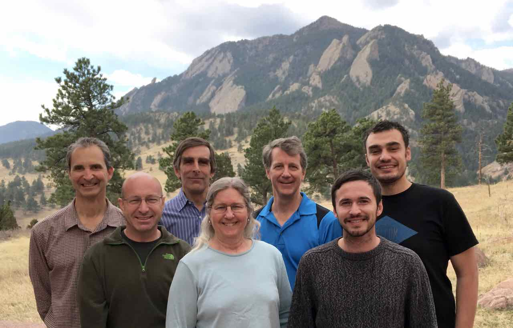

# NCAR's Data Assimilation Research Section - DAReS

The NCAR Data Assimilation Initiative was founded to create and to then
lead a research community for data assimilation where individuals benefit
from sharing ideas, methodologies, and software tools as well as access to
a data assimilation testbed. NCAR has a large number of researchers for
whom data assimilation is an essential part of their ongoing or planned
research. New developments in theoretical data assimilation and in software
engineering are making collaborations between data assimilation experts,
modelers, observational specialists and statisticians easier and more
productive than was possible in the past.
The maturation of the Initiative resulted in the 
**Data Assimilation Research Section (DAReS)**.
The primary goal of DAReS is to continue to advance the theory and
practice of ensemble data assimilation.
Also, DAReS accelerates the progress of many other NCAR
projects by providing a centralized data assimilation expertise which can
be coordinated with existing observational and modeling expertise. 

from left to right: [Kevin Raeder](http://staff.ucar.edu/users/raeder),
[Glen Romine](http://staff.ucar.edu/users/romine),
[Jeff Anderson](http://staff.ucar.edu/users/jla),
[Nancy Collins](http://staff.ucar.edu/users/nancy),
[Tim Hoar](http://staff.ucar.edu/users/thoar),
Jonathan Hendricks, and
[Moha El Gharamti](http://staff.ucar.edu/users/gharamti).  

   

Our small group is comprised of experts in software design,
algorithm development, large-model implementation and execution,
observations and observation operators, and hardware/software portability.
We have given many presentations on DART - our software facility for 
ensemble data assimilation, and have held several workshops for young 
researchers interested in DA.

<!-- FIXME advertise the AMS 2020 workshop --> 

Our central email address is **dart@ucar.edu**, which will hit
'everyone' and find its way to the best person.
The categories that follow are not set in stone, everyone has some
expertise in all areas.  

   

DAReS Staff (alphabetically)                                                          
 - [Jeff Anderson](http://staff.ucar.edu/users/jla), Scientist, algorithms
 - [Nancy Collins](http://staff.ucar.edu/users/nancy), Software Engineer, platforms/mpi
 - [Moha El Gharamti](http://staff.ucar.edu/users/gharamti), Scientist, algorithms
 - [Tim Hoar](http://staff.ucar.edu/users/thoar), Associate Scientist, diagnostics, documentation
 - [Ben Johnson](http://staff.ucar.edu/users/johnsonb), Associate Scientist
 - [Kevin Raeder](http://staff.ucar.edu/users/raeder), Associate Scientist, CAM
 - [Glen Romine](http://staff.ucar.edu/users/romine), Project Scientist, WRF  

   

DAReS Support (alphabetically)
 - [Elizabeth Chapin](http://staff.ucar.edu/users/echapin), Senior Business Analyst
 - [Lisa Larson](http://staff.ucar.edu/users/larsonl), Administrative Assistant
 - [Taysia Peterson](http://staff.ucar.edu/users/taysiana), Administrative Assistant
 - [Mary Pronk](http://staff.ucar.edu/users/pronk), Administrator

   

### Shipping information:

| postal address           | "overnight" deliveries   | electronic methods   |
| :----------------------- | :----------------------- | :------------------- |
| Lisa Larson              | Lisa Larson              | larsonl @ ucar . edu |
| NCAR                     | NCAR                     | 303 497 185          |
| P.O. Box 3000            | 1850 Table Mesa Dr.      | 303 497 2483 (FAX)   |
| Boulder, CO 80307-3000   | Boulder, CO 80305        |                      |
        
---

