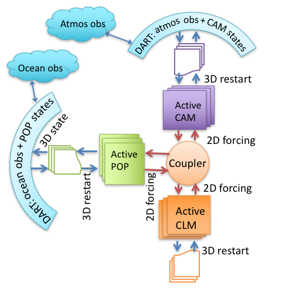

# CESM+DART setup

[SET-UP](#CESM%20MODES) / [CESM+DART MODELS](#CESM+DART%20MODELS) /
[SET-UP](#SETUP) / [INITIAL ENSEMBLE](#INITIALFILES) / [OUTPUT
DIRECTORY](#OUTPUTDIRECTORY) / [HINTS](#HINTS) / [SPACE](#SPACE) /
[TERMS OF USE](#Legalese) 

## CESM+DART Setup Overview

If you found your way to this file without reading more basic DART help
files, please read those first. $DART/README.md is a good place to find
pointers to those files. This document gives specific help in setting up
a CESM+DART assimilation for the first time. Unless you just came from
there, also see the ../{your_model(s)}/model_mod.html documentation
about the code-level interfaces and namelist values.

#### CESM context

Most other models are either called by DART (low order models), or are
run by DART via a shell script command (e.g. WRF). In contrast, CESM
runs its forecast, and then calls DART to do the assimilation. The
result is that assimilation set-up scripts for CESM components focus on
modifying the set-up and build of CESM to accommodate DART's needs, such
as multi-instance forecasts, stopping at the assimilation times to run
filter, and restarting with the updated model state. The amount of
modification of CESM depends on which version of CESM is being used.
Later versions require fewer changes because CESM has accommodated more
of DART's needs with each CESM release. This release of DART focuses on
selected CESM versions from 1_2_1 onward, through CESM2 (June, 2017)
and versions to be added later. Using this DART with other CESM versions
will quite possibly fail.

Since the ability to use DART has not been completely integrated into
CESM testing, it is necessary to use some CESM fortran subroutines which
have been modified for use with DART. These must be provided to CESM
through the SourceMods mechanism. SourceMods for selected versions of
CESM are available from the DART website. They can often be used as a
template for making a SourceMods for a different CESM version. If you
have other CESM modifications, they must be merged with the DART
modifications.

#### CESM2

CESM2 (expected release May, 2017) has several helpful improvements,
from DART's perspective.

  - Reduced number of subroutines in DART's SourceMods.
  - "Multi-instance" capability enables the ensemble forecasts DART
    needs.
  - Cycling capability, enabling multiple assimilation cycles in a
    single job, which reduces the frequency of waiting in the queue.
  - Removal of the short term archiver from the run script so that the
    MPI run doesn't need to idle while the single task archiver runs.
    This significantly reduces the core hours required.
  - CESM's translation of the short term archiver to python, and control
    of it to an xml file ($caseroot/env_archive.xml), so that DART
    modifications to the short term archiver are more straight-forward.
  - The creation of a new component class, "External Statistical
    Processing" ("esp"), of which DART is the first instance, integrates
    DART more fully into the CESM development, testing, and running
    environment. This is the same as the atm class, which has CAM as an
    instance. This will help make DART available in the most recent
    tagged CESM versions which have the most recent CESM component
    versions.

These have been exploited most fully in the CAM interfaces to DART,
since the other components' interfaces still use older CESMs. The
cam-fv/shell_scripts can be used as a template for updating other
models' scripting. The multi-cycling capability, with the short- and
long-term archivers running as separate jobs at the end, results in
assimilation jobs which rapidly fill the scratch space. Cam-fv's and
POP's assimilate.csh scripts have code to remove older and unneeded CESM
restart file sets during the run. All of DART's output and user
selected, restart file sets are preserved.

DART's Manhattan release includes the change to hard-wired input and
output filenames in filter. Cam-fv's assimilate.csh renames these files
into the CESM file format:  
$case.$component{_$instance}.$filetype.$date.nc.  
DART's hard-wired names are used as new filetypes, just like CESM's
existing "r", "h0", etc. For example, preassim_mean.nc from a CAM
assimilation named Test0 will be renamed  
Test0.cam.preassim_mean.2013-03-14-21600.nc  
The obs_seq files remain an exception to this renaming, since they are
not in NetCDF format (yet).

## CESM Component Combinations

CESM can be configured with many combinations of its components (CAM,
CLM, POP, CICE, ...) some of which may be 'data' components, which
merely read in data from some external source and pass it to the other,
active, components to use. The components influence each other only
through the coupler. There are several modes of assimilating
observations in this context.

#### Single-Component Assimilation

The first, and simplest, consists of assimilating relevant observations
into one active component. Most/all of the rest of the components are
'data'. For example, observations of the oceans can be assimilated into
the POP model state, while the atmospheric forcing of the ocean comes
from CAM re-analysis files, and is not changed by the observations. A
variation of this is used by CAM assimilations. A CAM forecast usually
uses an active land component (CLM) as well as an active atmospheric
component. Atmospheric observations are assimilated only into the CAM
state, while the land state is modified only through its interactions
with CAM through the coupler. Each of these assimilations is handled by
one of $DART/models/{cam-fv, POP, clm, ...} If you want to use an
unusual combination of active and data components, you may need to (work
with us to) modify the setup
scripts.

|    |         |
| ------------- | --------------- |
|  |  |

#### Multi-Component Assimilation (aka "weakly coupled")

|          |             |
| ------------------------- | ----------------------- |
|  | It's also possible to assimilate observations into multiple active components, but restricting the impact of observations to only "their own" component. So in a "coupled" CESM with active CAM and POP, atmospheric observations change only the CAM model state while oceanic observations change only the POP model state. This mode uses multiple DART models; cam-fv and POP in this example to make a filter for each model. |

#### Cross-Component Assimilation (aka "strongly coupled")

|                |                  |
| ----------------------------- | --------------------------- |
|  | Work is underway to enable the assimilation of all observations into multiple active CESM components. So observations of the atmosphere would directly change the POP state variables and vice versa. Some unresolved issues include defining the "distance" between an observation in the atmosphere and a grid point in the ocean (for localization), and how frequently to assimilate in CAM versus POP. This mode will use code in this models/CESM directory. |

[Go to cam-fv/model_mod page](../../models/cam-fv/model_mod.html)

-----

## $DART/models/{CESM components} organization

~~~
SCRIPT                          NOTES

$DART/models/**cam-fv**/        A 'model' for each CAM dynamical core (see note below this outline)
   model_mod.\*                 The fortran interface between CAM-FV and DART
   shell_scripts/
      no_assimilate.csh,...     Independent_of_cesm_version
      cesm1_5/
        setup_hybrid,...        Dependent on CESM version
      cesm2_0/
        setup_hybrid,...        Dependent on CESM version

$DART/models/**POP**/           A 'model' for each ocean model (MOM may be interfaced next)
   model_mod.\*                 The fortran interface between CAM-FV and DART
   shell_scripts/
      no_assimilate.csh,...     Independent_of_cesm_version
      cesm1_5/
        setup_hybrid,...        Dependent on CESM version
      cesm2_0/
        setup_hybrid,...        Dependent on CESM version
~~~

~~~
For each CAM dynamical core "model", e.g. "cam-fv",  the scripts  in cesm#_# will handle:
    all CAM variants + vertical resolutions (*dy-core is NOT part of this.*):
        CAM5.5, CAM6, ...
        WACCM4, WACCM6, WACCM-X...
        CAM-Chem,
        ...
    all horizontal resolutions of its dy-core:
        1.9x2.5, 0.9x1.25, ..., for cam-fv
        ne30np4, ne0_CONUS,..., for cam-se
~~~

-----

## Assimilation Set-up Procedure

Here is a list of steps to set up an assimilation from scratch, except
that it assumes you have downloaded DART and learned how to use it with
low order models. Some of the steps can be skipped if you have a
suitable replacement, as noted.

1.  Decide which component(s) you want to use as the assimilating
    model(s). (The rest of this example assumes that you're building a
    cam-fv assimilation.) Look in models/cam-fv/shell_scripts to see
    which CESM versions are supported.
2.  CESM: locate that version on your system, or check it out from
    http://www.cesm.ucar.edu/models/current.html
3.  Choose a start date for your assimilation. Choosing/creating the
    initial ensemble is a complicated issue.
      - It's simpler for CAM assimilations. If you don't have an initial
        state and/or ensemble for this date, build a single instance of
        CESM (Fxxxx compset for cam-fv) and run it from the default Jan
        1 start date until 2-4 weeks before your start date. Be sure to
        set the cam namelist variable inithist = 'ENDOFRUN' during the
        last stage, so that CAM will write an "initial" file, which DART
        needs.
      - For ocean and land assimilations,which use an ensemble of data
        atmospheres, creating usable initial ensemble is a different
        process.
4.  Put the entire cam-fv restart file set (including the initial file)
    where it won't be scrubbed before you want to use it. Create a
    pseudo-ensemble by linking files with instance numbers in them to
    the restart file set (which has no instance number) using
    CESM/shell_scripts/link_ens_to_single.csh
5.  Choose the options in $DART/mkmf/mkmf.template that are best for
    your assimilation. These will not affect the CESM build, only
    filter.
6.  In models/cam-fv/work/input.nml, be sure to include all of your
    required obs_def_${platform}_mod.f90 file names in
    preprocess_nml:input_files. It's also useful to modify the rest of
    input.nml to make it do what you want for the first assimilation
    cycle. This input.nml will be copied to the $case_root directory
    and used by assimilate.csh.
7.  Build the DART executables using quickbuild.csh.
8.  Follow the directions in
    models/cam-fv/shell_scripts/cesm\#_\#/setup_hybrid to set up the
    assimilation and build of CESM. We recommend a tiny ensemble to
    start with, to more quickly test whether everything is in order.
9.  After convincing yourself that the CESM+DART framework is working
    with no_assimilate.csh, activate the assimilation by changing
    CESM's env_run.xml:DATA_ASSIMILATION_SCRIPT to use
    assimilate.csh.
10. After the first forecast+assimilation cycle finishes correctly,
    change the input.nml, env_run.xml and env_batch.xml to do
    additional cycle(s) without the perturbation of the initial state,
    and with using the just created restart files. You may also want to
    turn on the st_archive program. Instructions are in setup_hybrid
    and cam-fv/work/input.nml.
11. Finally, build a new case with the full ensemble, activate the
    assimilate.csh script and repeat the steps in step 10.

-----

## CAM Initial Ensembles

Strategies for generating an initial ensemble from which DART can
start.  

1.  MINIMAL WORK; Get an ensemble of CAM/CLM/CICE/POP/... initial and
    restart files from someone else (DART has a few dates for a few
    model cores and resolutions
    [here](http://www.image.ucar.edu/pub/DART/Obs_sets). This limits the
    investigations you can undertake, but is the fastest and cheapest
    way to start assimilating.

2.  MINIMAL CAM COMPUTING; an assimilation can be started from a single
    CAM (+CLM\[+CICE\]) initial file. The single model state is randomly
    perturbed to make as many ensemble members as are requested in the
    *ens_size* variable in the *filter_nml* namelist. Create a
    *filter_ic* file from the CAM initial file (dart_to_cam.f90).
    Create an *obs_seq.out* file which has a single observation with a
    large observational error variance, valid at least a week after the
    start date for the spin-up. This will make the ensemble advance long
    enough to balance the fields, without being perturbed by the
    assimilation of any observations.

~~~    
&filter_nml
    ...
    start_from_restart       = .false.,
    restart_in_file_name     = "filter_ic",
    ...
/
&model_nml
   ...
   pert_names         = 'T       ','US      ','VS      '
   pert_sd           = 1.0d0,2.0d0,2.0d0
   ...
/
~~~

Note that *start_from_restart* is false ("don't start from a
pre-existing \*ensemble\*"), but a restart file (*filter_ic*) is
still needed for filter to have something realistic to perturb.
*pert_names* specifies which fields will be perturbed. CAM field
names are used. *pert_sd* \> 0 allows each point of the pert_names
fields of each ensemble member to be randomly perturbed with a
standard deviation of pert_sd. Other fields can be used, but
moisture variables are tricky because of their variation with height
by orders of magnitude. Regardless of which fields are specified,
the spin-up period will allow the fields to come into balance with
respect to the model, so the perturbations will propagate into all fields.

3.  FULL FUNCTION ENSEMBLE; In order to have, on hand, initial ensembles
    of any practical size, for any date of the year, we recommend the
    following. Scripts for doing this are available in
    .../DART/models/cam/make_ensemble. See the README there for more
    details. They are not highly documented or elegent, but offer a
    starting point. Make 20 successive 1-year free CAM runs (MPI CAM
    highly recommended, NO_LEAP calender), saving the initial files
    every 5 days. ? ? Or 5 years, saving every day. Then pull together
    all of the, e.g., Jan 6ths (00Z) into a 20 (5) member ensemble
    (numbered 1...20(5)).
    
    When you need an ensemble of, say 60 members for June 1 then
    retrieve the 20 members from each of May 26, May 31, and June 5,
    renumbering them 1,...,60. \--\> 
    
    

-----

## Output Directory

CESM's short term archiver (st_archive) is controlled by its
*env_archive.xml*. DART's setup scripts modify that file to archive
DART output along with CESM's. (See the [list of RMA
changes](../../../documentation/html/rma.html) for a description of
DART's output). DART's output is archived in
*$arch_dir/dart/{hist,rest,logs,...}*, where arch_dir is defined in
*setup_{hybrid,advanced}*, *hist* contains all of the state space and
observation space output, and *rest* contains the inflation restart
files.

Central directory  

User Location of scripts and pass-through point for files during execution.
Typically named according defining characteristics of a \*set\* of
experiments; resolution, model, obs being assimilated, unique model
state variables, etc. \--\>  

The cam-XX assimilate.csh scripts also make a copy of the obs_seq.final
files in a scratch space ($scratch/$case/Obs_seqs) which won't be
removed by CESM's long term archiver, if that is run.

-----

## Helpful Hints

-----

## Space Requirements

Space requirements (Gb per ensemble member) for several CAM resolutions.

There are, no doubt, things missing from these lists, so don't struggle
too long before contacting dart'at'ucar.edu.

-----
