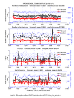
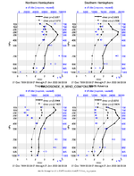
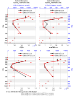
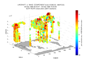
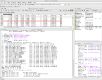
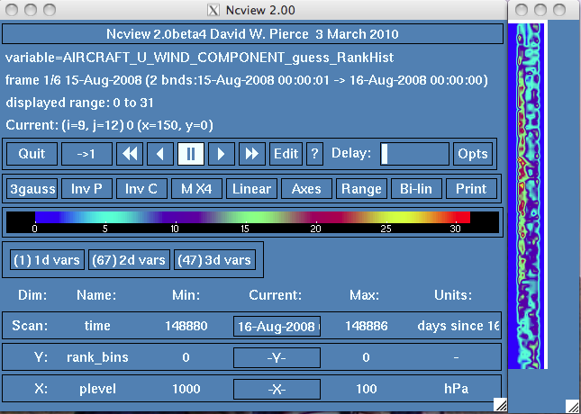
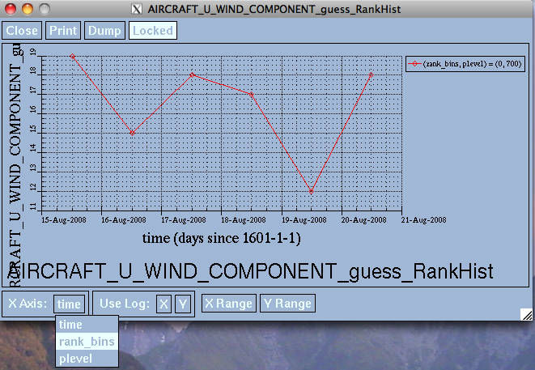
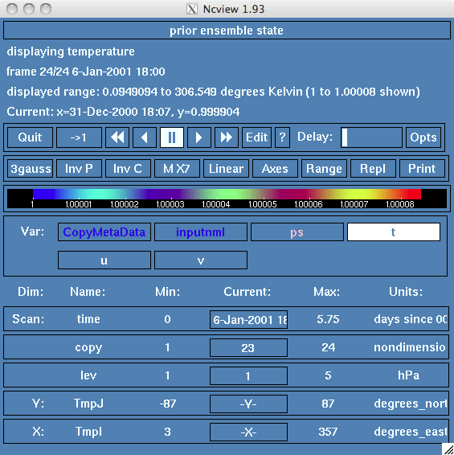
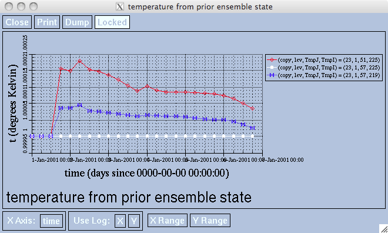
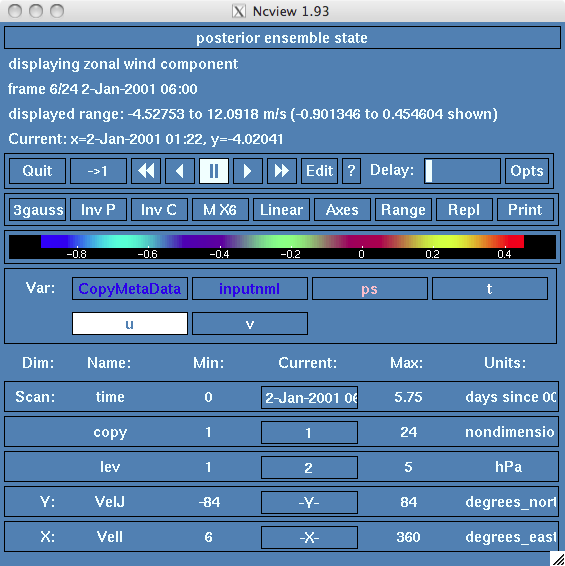

# Did my experiment work?

## *filter* ran and produced output files, now what?

One of the most requested features for DART has been finer control of
what information is written and when. Do you want the input ensemble
spread before the application of prior inflation? After prior inflation
but before the assimilation? After the assimilation but before posterior
inflation? After posterior inflation? etc. There are several namelist
settings that control what files are output. 
[Section 16](../tutorials/section_16.pdf) of the DART
tutorial has a more detailed explanation.  
  
From a computational perspective, there are two broad situations:

1.  *filter* is called for a single assimilation and each ensemble
    member is in its own file (both ```single_file_in = .false.``` and
    ```single_file_out = .false.```.), and
2.  *filter* is called once for multiple assimilation cycles and writes
    a single output file containing information for all the ensemble
    members (```single_file_out = .true.```) **for each stage\!** Depending
    on what you choose to write, this actually results in more than a
    single file.

**```single_file_out = .false.```** :  *filter* is usually called for a single
assimilation cycle by 'large' models or in cases where it is beneficial
to run different number of MPI tasks for the model advances and the
assimilation. In this case, there can be a substantial computational
efficiency to have each ensemble member write its information to a
separate file, and each file can be written simultaneously by different
tasks. The tradeoff (at the moment) is that each of the files can only
have a single timestep in them. Consequently, some files are redundant
and should not be output.
See the [section 16](../tutorials/section_16.pdf) of the DART
tutorial for a more detailed explanation.  
  
**```single_file_out = .true.```** :  When *filter* is used for a long
assimilation experiment (as in the case for the low-order models), it is
possible to consolidate all the information for a particular stage into
a single file that contains all the ensemble members, the mean, spread,
inflation, etc. This results in far fewer files, and each file may
contain multiple timesteps to encompass the entirety of the experiment.
Since a single task must write each file, there is some computational
overhead.  
  
Perhaps somewhat paradoxically, *single_file_out* only refers to the
output **for a particular stage**. So even if you set
```single_file_out = .true.``` , you can get *several* output files -
one per stage. However, if you set ```single_file_out = .false.``` ,
be prepared for a deluge of files.
Be careful about what stages you choose to write.

### What output and diagnostic files are produced:

#### When *single_file_out = .false.*

| from *perfect_model_obs* |      |      |
| ------------------------ | ---- | ---- |
| *obs_seq.out* | | the synthetic observations at some predefined times and locations |
| *perfect_output.nc* | 1 timestep | a netCDF file containing the model trajectory - the true state |

There are some namelist settings that control what files are output.
        Depending on the settings for *input.nml&filter_nml:stages_to_write* and others ...
        
| from *filter* |      |      |
| ------------- | ---- | ---- |
| *forecast_member_\#\#\#\#.nc* | 1 timestep | the ensemble forecast, each ensemble member is a separate file |
| *forecast_\[mean,sd\].nc*     | 1 timestep | the mean and standard deviation (spread) of the ensemble forecast |
| *forecast_priorinf_\[mean,sd\].nc* | 1 timestep | the prior inflation information before assimilation |
| *forecast_postinf_\[mean,sd\].nc* | 1 timestep | the posterior inflation information before assimilation |
| *preassim_member_\#\#\#\#.nc* | 1 timestep | the model states after any prior inflation but before assimilation |
| *preassim_\[mean,sd\].nc* | 1 timestep | the mean and standard deviation (spread) of the ensemble after any prior inflation but before assimilation |
| *preassim_priorinf_\[mean,sd\].nc* | 1 timestep | the prior inflation information before assimilation |
| *preassim_postinf_\[mean,sd\].nc* | 1 timestep | the posterior inflation information before assimilation |
| *postassim_member_\#\#\#\#.nc* | 1 timestep | the model states after assimilation but before posterior inflation |
| *postassim_\[mean,sd\].nc* | 1 timestep | the mean and standard deviation (spread) of the ensemble after assimilation but before posterior inflation |
| *postassim_priorinf_\[mean,sd\].nc* | 1 timestep | the (new) prior inflation information after assimilation |
| *postassim_postinf_\[mean,sd\].nc* | 1 timestep | the (new) posterior inflation information after assimilation |
| *analysis_member_\#\#\#\#.nc* | 1 timestep | the model states after assimilation and after any posterior inflation |
| *analysis_\[mean,sd\].nc* | 1 timestep | the mean and standard deviation (spread) of the ensemble after assimilation and after posterior inflation |
| *analysis_priorinf_\[mean,sd\].nc* | 1 timestep | the (new) prior inflation information after assimilation |
| *analysis_postinf_\[mean,sd\].nc* | 1 timestep | the (new) posterior inflation information after assimilation |
| *output_\[mean,sd\].nc* | 1 timestep | the mean and spread of the posterior ensemble |
| *output_priorinf_\[mean,sd\].nc* | 1 timestep | the (new) prior inflation information after assimilation |
| *output_priorinf_\[mean,sd\].nc* | 1 timestep | the (new) posterior inflation information after assimilation |
| *obs_seq.final* | | the model estimates of the observations (an integral part of the data assimilation process) |

| from both | |
| ------------- | --- |
| *dart_log.out* | the 'important' run-time output (each run of *filter* appends to this file; remove it or start at the bottom to see the latest values) |
| *dart_log.nml* | the input parameters used for an experiment |

#### When *single_file_out = .true.*

All the information for each stage is contained in a single file that
*may* have multiple timesteps.

| from *perfect_model_obs* | | |
| ---------------------------- | --- | --- |
| *obs_seq.out* | | the synthetic observations at some predefined times and locations |
| *perfect_output.nc* | N timesteps | a netCDF file containing the model trajectory - the true state |

There are some namelist settings that control what files are output. Depending on the settings for
      *input.nml &filter_nml:stages_to_write* and others ...

| from *filter* | | |
| -------------- | ---- | ---- |
| *filter_input.nc* | single timestep | The starting condition of the experiment. All ensemble members, \[optionally\] the input mean and standard deviation (spread), \[optionally\] the prior inflation values, \[optionally\] the posterior inflation values |
| *forecast.nc* | N timesteps | The ensemble forecast. All ensemble members, the mean and standard deviation (spread), the prior inflation values, the posterior inflation values |
| *preassim.nc* | N timesteps | After any prior inflation but before assimilation. All ensemble members, the mean and standard deviation (spread) of the ensemble, the prior inflation values, the posterior inflation values |
| *postassim.nc* | N timesteps | After assimilation but before posterior inflation. All ensemble members, the mean and standard deviation (spread) of the ensemble, the (new) prior inflation values, the (new) posterior inflation values |
| *analysis.nc* | N timesteps | After assimilation and after any posterior inflation. All ensemble members, the mean and standard deviation (spread) of the ensemble, the (new) prior inflation values, the (new) posterior inflation values |
| *filter_output.nc* | single timestep | After assimilation and after any posterior inflation. All ensemble members, the mean and standard deviation (spread) of the ensemble, the (new) prior inflation values, the (new) posterior inflation values |
| *obs_seq.final* | | the model estimates of the observations (an integral part of the data assimilation process) |


| from both | |
| ------------- | --- |
| *dart_log.out* | the 'important' run-time output (each run of *filter* appends to this file; remove it or start at the bottom to see the latest values) |
| *dart_log.nml* | the input parameters used for an experiment |

### First questions to ask

**NOTE: the remainder of this document is written from the perspective
of an experiment run with *single_file_out = .true.*. The permutations
of the file names is just too great to write exhaustive documentation.**

After *filter* executes without error and produces an *obs_seq.final*
file, a *preassim.nc* file, and an *analysis.nc* file, the first
questions to ask are:

1.  "Is the model state output from *filter* different from the input?",
    and
2.  "Were any observations successfully assimilated?".

One way to check if the output model state data was changed by the
assimilation is to use the 'ncdiff' tool to difference the *preassim.nc*
and *analysis.nc* files:

> ncdiff analysis.nc preassim.nc Innov.nc  
>ncview Innov.nc

If your model can run under *single_file_\[in,out\]* Look at the
ensemble mean variables. If all values are 0, then the assimilation
changed nothing in the state. If your model writes multiple output
files, diff the *preassim_mean.nc* and *output_mean.nc*.

<span id="debugging" class="anchor"></span> 

-----

#### Debugging hints:

You may need to rerun *filter* multiple times to diagnose this. The
fastest way to get to the answer is to make *filter* very fast to run.
You can do this by:

1.  make an observation sequence file with only 1 or a just a few observations in
    it, and
2.  configure a run so *filter* does a single assimilation and exits,
    without having to advance the ensemble of models or do other work.

##### To make an obs file with a single observation, use one of these methods:

1.  run *create_obs_sequence* to make a new, short, observation sequence file
2.  Use the *obs_sequence_tool* to cut your existing obs_seq.out file
    down to just a few obs by selecting only a subset of the types and
    setting a very short time window (just a second or two where you
    know there are obs).

##### To make the *filter* program only do an assimilation:

1.  Edit the *input.nml* and in the *&filter_nml* namelist set the
    *init_time_days* and *init_time_seconds* to match the
    observation time in the truncated observation sequence file. This overrides any
    times in the input files and ensures that *filter* will only
    assimilate and not try to advance the model.
2.  Make sure the truncated observation sequence file contains only 1 obs, a few obs
    at the same time, or obs close enough together in time to fit into a
    single assimilation window.

If there are no changes in the model state after assimilation, then
examine the *obs_seq.final* file. There are two ways to do this. 1) If
you are testing with a single observation, just look in the file. If
this file is in binary format, change the namelist so the output
observation sequence file will be written in ascii:

~~~
&obs_sequence_nml
    write_binary_obs_sequence = .false.
   /
~~~

and rerun *filter* to regenerate an obs_seq.final file in ascii. [These
diagrams](DART2_Observations.html#obs_seq_overview) help to understand
an *obs_seq.final* file. 2) If you are using many observations, run the
[obs_diag.f90](https://ncar.github.io/DART/api/v2.1.10/program/obs_diag.html)
appropriate for your model. There are some [diagnostic
scripts](#mat_obs) to help summarize and explore what is going on.

If all the prior and posterior mean values are -888888.0 (the DART
"missing data" value), those observations were not assimilated. *Note:
some observations have precomputed values and the posterior values for
these will always be -888888.0, no matter if the observation was
assimilated or not.* If it is not already set, change *&filter_nml
num_output_obs_members* to be the same as the ensemble size. This
will give you all the forward operator values for all the ensemble
members. You can determine if all ensemble members are failing in the
same way, or if only a few are problematic.

For the failing observations, the 'DART QC' may indicate the reason.
([How to locate the different values in an obs_seq.final
file.](DART2_Observations.html#obs_seq_overview) The 'DART QC' field is
usually the second of the 2 "quality control" copies.) A list of all the
DART QC values can be found in [this table](#qc_table).

  - If the DART QC values are 4, the forward operators have failed. Look
    at the *model_interpolate()* routine in your model_mod.f90 file,
    or the forward operator code in
    *observations/forward_operators/obs_def_xxx_mod.f90* for your
    observation type. A successful forward operator must return a valid
    obs_val and an *istatus = 0*. If the forward operator code returns
    different istatus values for different error types, you can set
    *&filter_nml :: output_forward_op_errors = *.true.** and rerun
    *filter* to see exactly what error istatus codes are being set. See
    [the filter
    webpage](https://ncar.github.io/DART/api/v2.1.10/program/filter.html)
    for more information on how to use the 'output_forward_op_errors'
    option. Negative istatus values are reserved for the system,
    *istatus = 0* is success, and any positive value indicates a failed
    forward operator. The code is free to use different positive values
    to signal different types of errors.  
      
  - If the DART QC values are 5, those observation types were
    intentionally ignored because they were not listed in the
    &obs_kind_nml namelist, in the 'assimilate_these_obs_types'
    stringlist.  
      
  - If the DART QC values are 6, the data quality control that came with
    the original observation data indicates this is a bad quality
    observation and it was skipped for this reason.  
      
  - If the DART QC values are 7, the observation value is too far away
    from the ensemble mean. Set the &filter_nml :: outlier_threshold
    value to -1 to ignore this for now and rerun. In general, this is
    not the optimal strategy as the number of observations inconsistent
    with the ensemble is a very powerful indicator of the success or
    failure of the assimilation.

If the prior and posterior values in the obs_seq.final are not
-888888.0 but are identical, your obs are being assimilated but are
having no impact.  
  
The most common reasons assimilated obs have no impact on the model
state include:

  - **Zero spread in ensemble members**  
    Your initial ensemble members must have different values for each
    state item. If all members have identical values, the observations
    cannot make a change. To diagnose this condition, look at the prior
    ensemble spread. This is either in *preassim.nc* or
    *preassim_sd.nc*, depending on your model. If all the values are 0,
    this is your problem. One way to generate an ensemble with some
    spread is to set *&filter_nml ::
    perturb_from_single_instance = .false.,* (which will still
    require a single filter initial condition file) but then the
    *filter* code will add random gaussian perturbations to each state
    vector item to generate an initial ensemble with spread. The
    magnitude of the gaussian noise added is controlled by the
    *&ensemble_manager :: perturbation_amplitude*. It is also
    possible to write your own perturbation routine in your
    model_mod.f90 code.
  - **Cutoff value too small**  
    If the localization radius is too small, the observation may not be
    'close enough' to the model grid to be able to impact the model.
    Check the localization radius (*&assim_tools_nml cutoff*). Set it
    to a very large number (e.g. 100000) and rerun. If there is now an
    impact, the cutoff was restricting the items in the state vector so
    your obs had no impact before. Cutoff values are dependent on the
    location type being used. It is specified in radians for the
    threed_sphere locations module (what most large models use), or in
    simple distance (along a unit circle) if using a low order model
    (lorenz, ikeda, etc).
  - **Obs error values too large (less likely)**  
    If the observation error is very large, it will have no impact on
    the model state. This is less likely a cause than other
    possibilities.
  - **No correlation (unlikely)**  
    If there is no correlation between the distribution of the forward
    observation values and the state vector values, the increments will
    be very tiny. However there are generally still tiny increments
    applied, so this is also a low likelyhood case.
  - **Errors in forward operator location computations, or
    *get_close_obs()***  
    If there is an error in the *model_mod.f90* code in either
    *get_state_meta_data()*, *model_interpolate()*, or the vertical
    conversion code in *get_close_obs()*, it is possible for the
    forward operators to appear to be working correctly, but the
    distances computed for the separation between the obs and the state
    vector values can be incorrect. The most frequent problem is that
    the wrong locations are being passed back from
    *get_state_meta_data()*. This can result in the increments being
    applied in the wrong locations or not at all. This is usually one of
    the things to test carefully when developing a new model interface,
    and usually why we recommend starting with a single observation at a
    known location.
  - **Incorrect vertical conversion**  
    If the model is using 3d coordinates and needs the capability to
    convert between pressure, height, and/or model level, the conversion
    may be incorrect. The state vector locations can appear to be too
    high or too low to be impacted by an observation. Some models have a
    height limit built into their model_mod code to avoid trying to
    assimilate observations at the model top. The observations cannot
    make meaningful changes to the model state there and trying to
    assimilate them can lead to problems with the inflation. If the code
    in the model_mod is excluding observations incorrectly, or you are
    testing with observations at the model top, this can result in no
    impact on the model state.

### How is the output different from the input?

If you compute the difference between the prior and posterior diagnostic
files by this process:

> ncdiff analysis.nc preassim.nc Innov.nc  
> ncview Innov.nc

and you see a difference, is it correct?

If you run with a single observation, you should be able to easily see
the impact - generally it's a mostly spherical or circular ring around
the observation location depending on your vertical localization, you
may or may not see an impact in the vertical. Using
*&location_nml::horiz_dist_only=*.true.** is usually a good idea for
a full 3d model to start out, and then add vertical localization once
you believe the horizontal impact makes sense. Without any vertical
localization, the observation should have an impact along the entire
vertical column. (For lower order models this doesn't apply.) If you
change the cutoff distances you should be able to watch the change in
impact on the state and make sure that it's something reasonable.  
  
Now you can use the observation space diagnostics, and the state space
diagnostics to get more information about what the impact was, and
whether it's doing the right thing or not.

<span id="DidItWork" class="anchor"></span> 

-----

# Was the Assimilation Effective?

If your filter run finished, and the Posterior is now different from the
Prior, now what? This section presumes that you have debugged your
model/DART interfaces or are using a model that came with the DART
distribution. A *working* implementation.  
  
**There is no single metric that can declare success.**  
  
[The DART Tutorial](dart_tutorial.html) has the
best explanation of what to look for, what to change to improve the next
experiment, etc. DART has an extensive set of diagnostics implemented in
MATLAB®. To use them, make sure you have read the 
[Configuring MATLAB®](DART2_Starting.html#matlab) section.

### The Observations are the Key.

My own (Tim's) personal view is that the first thing to check is to see
how many observations are getting rejected by the assimilation in
addition to the RMSE and spread of the ensemble. A natural part of the
DART framework is that these metrics are calculated automatically and
are readily available in the *obs_seq.final* files. Checking the
temporal evolution of the RMSE and observation rejection characteristics
is a first-order metric for determining the health of the assimilation
system.

1.  Use
    [obs_diag.f90](https://ncar.github.io/DART/api/v2.1.10/program/obs_diag.html)
    to process the collection of *obs_seq.final* files for regions and
    times of interest. Edit the *input.nml:obs_diag_nml* namelist to
    reflect the details of your experiment, and then run *obs_diag* to
    create a netCDF file *obs_diag_output.nc* that contains the
    summaries.
2.  Make sure the spread of the ensemble does not collapse. Use
    *plot_evolution.m* with *copystring = 'spread';* to explore
    *obs_diag_output.nc*. It is normal (and desirable\!) for the
    spread to decrease somewhat from the initial value, but it should
    not decrease to a small value. Insufficient spread leads to filter
    divergence and a large observation rejection rate.
    *plot_evolution.m* automatically plots the number of observations
    available and the number of observations successfully assimilated.
3.  Make sure the RMSE of the ensemble does not collapse. Use
    *plot_evolution.m* with *copystring = 'rmse';* to explore
    *obs_diag_output.nc*. It is important to interpret the RMSE in
    light of the number of observations successfully assimilated. It is
    possible to have a very low RMSE if the assimilation system rejects
    all of the observations that are in disagreement\! A low RMSE is
    desirable and is a much stronger result if most/all of the
    observations are being assimilated successfully. Also - the RMSE of
    the **prior** is a much stronger result. Any method can overfit the
    observations (match them perfectly) - what is important is that the
    **forecast** is a good forecast\!
4.  Make sure the RMSE of the ensemble does not continually increase.
    *plot_evolution.m* with *copystring = 'rmse';* to explore
    *obs_diag_output.nc*. It is natural for the RMSE to vary in time
    in response to the changing number and location of the observations,
    the phenomenon being modeled, etc. ... but it should not generally
    increase as the system evolves. Once the system has 'burned in', the
    RMSE should be relatively stable.
5.  Check to make sure the observations that are getting rejected are
    getting rejected for the right reasons. Run *obs_seq_to_netcdf*
    to convert the *obs_seq.final* files into netCDF files that can be
    explored with *link_obs.m* or *plot_obs_netcdf.m*. Both of these
    tools will allow you to isolate the rejected observations and
    determine if the observations are being rejected because they are in
    disagreement with the ensemble (DART QC = 7) or they were rejected
    because of a namelist setting (DART QC = 5), or incoming QC value
    (DART QC = 6), or were they simply outside the domain (DART
    generally only interpolates, not extrapolate) or ...
6.  Check that the ensemble spread captures the 'truth' as determined by
    the observations. Use *obs_diag* to create the data for a rank
    histogram. [Plot the histograms with ncview](#ncview_histogram) or
    [plot_rank_histogram.m](#mat_obs)

Generally speaking, the observation-space diagnostics provide the first
and best metrics for the assimilation system. We always have
observations, we rarely have the 'truth' in a full state-space
representation. Personally, I rarely see value when comparing to some
other gridded product - as it surely has its own set of deficiencies or
assumptions. Observations aren't perfect - but they are still best.

**NOTE:** Combining observations from multiple sources can lead to the
same observation type begin defined with *different* vertical coordinate
systems. While this does not pose a problem for assimilation, it *does*
pose a problem for the diagnostics. The current
[obs_diag.f90](https://ncar.github.io/DART/api/v2.1.10/program/obs_diag.html)
cannot (vertically) bin the same observation type that exploits two
different vertical coordinate systems. If you get a WARNING from
*obs_diag:CheckVertical()* you should know that the observation
triggering the warning uses a different vertical coordinate system that
the first observation encountered of that same type. If the *termlevel*
is set to be 1, this is a fatal error, not a warning. The following
example is one where observation 7113 defined the vertical coordinate
system to be VERTISSURFACE (i.e. -1) and observation 7150 was created
using VERTISPRESSURE. The messages take the form:

~~~
WARNING FROM:
  routine: CheckVertical
  message: obs 7150 type  42 changing from -1 to pressure - def by obs 7113
~~~

### State-Space Diagnostics

If you're reading this, it means you have an assimilation that is not
rejecting too many observations, the ensemble spread is relatively
constant and is not too small, and presumably the RMSE is stable if not
decreasing. Now it is time to assess the affect the assimilation has on
your model - the whole point of data assimilation.  
  
DART produces (sometimes many) netCDF files: ```preassim.nc``` and
```analysis.nc```. Your files many have slightly different names depending
on the namelist settings you have chosen. You should get familiar with
what is available in the files you have created. Please read the
documentation for
[&filter_nml](https://ncar.github.io/DART/api/v2.1.10/program/filter.html),
especially for the variables: *stages_to_write*, *output_members*,
*output_mean*, *output_sd*, and *single_file_out*. You should
experiment and become familiar with **ALL** the namelist variables
controlling what gets written. The ability to explore the ensemble at
various parts of the assimilation process and/or restrict the volume of
data being written has been on of our most-requested
enhancements.

| unix command  | meaning |
| --------------| ------- |
| ncdump -v MemberMetadata preassim.nc     |  to check which copy you want to explore |
| ncdiff analysis.nc preassim.nc Innov.nc  |  ncdiff comes from NCO, not DART         |
| ncview Innov.nc                          |  ncview is another 'third-party' tool.   |

See the expanded section on 
[DART state-space diagnostics](#ss_diagnostics) for more.

<span id="obs_diagnostics" class="anchor"></span>
<span id="qc_table" class="anchor"></span>  

-----

### Observation-Space Diagnostics.

**The DART QC table is an important piece of information.**

| QC value | meaning |
| -------- | ------- |
| 0,1 == both Prior and Posterior are good. |
| 0 | Assimilated O.K. |
| 1 | Evaluated O.K., not assimilated because namelist specified evaluate only. |
| 2,3 == Prior OK, but Posterior failed. |
| 2 | Assimilated O.K. BUT posterior forward operator failed. |
| 3 | Evaluated O.K. BUT posterior forward operator failed. |
| 4 or higher == both Prior and Posterior have failed |
| 4 | Prior forward operator failed. |
| 5 | Not used because of namelist control. |
| 6 | Rejected because of incoming data QC higher than namelist control. |
| 7 | Rejected because of outlier threshold test. |
| 8 | Vertical conversion failed. |
| 9 and above | reserved for future use. |

It is required to post-process the ```obs_seq.final``` file(s) with
[obs_diag](https://ncar.github.io/DART/api/v2.1.10/program/obs_diag.html)
to generate a netCDF file containing accumulated diagnostics for
specified regions, etc. Since the experiment information (assimilation
interval, assimilating model, etc.) are not recorded in the
```obs_seq.final``` file, the
[obs_diag_nml](https://ncar.github.io/DART/api/v2.1.10/program/obs_diag.html)
namelist has a section that allows specification of the necessary
quantities.  
  
The following quantities are normally
diagnosed:

|              |                                                                                                      |
| ------------ | ---------------------------------------------------------------------------------------------------- |
| Nposs        | the number of observations for each assimilation period;                                             |
| Nused        | the number of observations successfully assimilated each assimilation period;                        |
| NbigQC       | the number of observations that had an undesirable (original) QC value;                              |
| NbadIZ       | the number of observations that had an undesirable Innovation Z;                                     |
| NbadUV       | the number of velocity observations that had a matching component that was not assimilated;          |
| NbadLV       | the number of observations that were above or below the highest or lowest model level, respectively; |
| rmse         | the rmse of the ensemble;                                                                            |
| bias         | the bias of the ensemble (forecast-observation);                                                     |
| spread       | the spread of the ensemble;                                                                          |
| totalspread  | the pooled spread of the observation (knowing its observational error) and the ensemble.             |
| NbadDARTQC   | the number of observations that had a DART QC value (\> 1 for a prior, \> 3 for a posterior)         |
| observation  | the mean of the observation values                                                                   |
| ens_mean     | the ensemble mean of the model estimates of the observation values                                   |
| N_DARTqc_0   | the number of observations that had a DART QC value of 0                                             |
| N_DARTqc_1   | the number of observations that had a DART QC value of 1                                             |
| N_DARTqc_2   | the number of observations that had a DART QC value of 2                                             |
| N_DARTqc_3   | the number of observations that had a DART QC value of 3                                             |
| N_DARTqc_4   | the number of observations that had a DART QC value of 4                                             |
| N_DARTqc_5   | the number of observations that had a DART QC value of 5                                             |
| N_DARTqc_6   | the number of observations that had a DART QC value of 6                                             |
| N_DARTqc_7   | the number of observations that had a DART QC value of 7                                             |
| N_DARTqc_8   | the number of observations that had a DART QC value of 8                                             |

<span id="mat_obs" class="anchor"></span>

The observation-space functions are in the *DART/diagnostics/matlab*
directory. Once you have processed the ```obs_seq.final``` files into a
single ```obs_diag_output.nc```, you can use that as input to your own
plotting routines or use the following DART MATLAB® routines:

[plot_evolution.m](../../diagnostics/matlab/plot_evolution.m) plots the temporal evolution 
    of any of the quantities above for each variable for specified levels.
    The number of observations possible and used are plotted on the same axis.

~~~
fname      = 'POP11/obs_diag_output.nc';        % netcdf file produced by 'obs_diag'
copystring = 'rmse';                            % 'copy' string == quantity of interest
plotdat    = plot_evolution(fname,copystring);  % -- OR --
plotdat    = plot_evolution(fname,copystring,'obsname','RADIOSONDE_TEMPERATURE');
~~~

[](../images/science_nuggets/plot_evolution_example.png)


[plot_profile.m](../../diagnostics/matlab/plot_profile.m) plots the spatial and temporal 
    average of any specified quantity as a function of height. The number 
    of observations possible and used are plotted on the same axis.

[](../images/science_nuggets/plot_profile_example.png)

~~~
fname      = 'POP11/obs_diag_output.nc';        % netcdf file produced by 'obs_diag'
copystring = 'rmse';                            % 'copy' string == quantity of interest
plotdat    = plot_profile(fname,copystring);
~~~

[plot_rmse_xxx_evolution.m](../../diagnostics/matlab/plot_rmse_xxx_evolution.m) same as *plot_evolution.m* 
    but will overlay **rmse** on the same axis.

[plot_rmse_xxx_profile.m](../../diagnostics/matlab/plot_rmse_xxx_profile.m) same as *plot_profile.m* 
    with an overlay of **rmse**.

[plot_bias_xxx_profile.m](../../diagnostics/matlab/plot_bias_xxx_profile.m) same as *plot_profile.m* 
    with an overlay of **bias**.

[two_experiments_evolution.m](../../diagnostics/matlab/two_experiments_evolution.m) same as 
    *plot_evolution.m* but will overlay multiple (more than two, actually) 
    experiments (i.e. multiple ```obs_diag_output.nc``` files) on the same 
    axis. A separate figure is created for each region in the 
    ```obs_diag_output.nc``` file.

~~~
files    = {'POP12/obs_diag_output.nc','POP11/obs_diag_output.nc'};
titles   = {'CAM4','CAM3.6.71'};
varnames = {'ACARS_TEMPERATURE'};
qtty     = 'rmse';
prpo     = 'prior';
levelind = 5;
two_experiments_evolution(files, titles,{'ACARS_TEMPERATURE'}, qtty, prpo, levelind)
~~~

[](../images/science_nuggets/two_experiments_evolution_example.png)


[two_experiments_profile.m](../../diagnostics/matlab/two_experiments_profile.m) same as 
    *plot_profile.m* but will overlay multiple (more than two, actually)
    experiments (i.e. multiple *obs_diag_output.nc* files) on the same 
    axis. If the *obs_diag_output.nc* file was created with multiple 
    regions, there are multiple axes on a single figure.

~~~
files    = {'POP12/obs_diag_output.nc','POP11/obs_diag_output.nc'};
titles   = {'CAM4','CAM3.6.71'};
varnames = {'ACARS_TEMPERATURE'};
qtty     = 'rmse';
prpo     = 'prior';
two_experiments_profile(files, titles, varnames, qtty, prpo)
~~~
 
[](../images/science_nuggets/two_experiments_profile_example.png)


[plot_rank_histogram.m](../../diagnostics/matlab/plot_rank_histogram.m) will create rank histograms 
    for any variable that has that information present in ```obs_diag_output.nc```.

~~~
fname     = 'obs_diag_output.nc'; % netcdf file produced by 'obs_diag'
timeindex = 3;                    % plot the histogram for the third timestep
plotdat   = plot_rank_histogram(fname, timeindex, 'RADIOSONDE_TEMPERATURE');
~~~

[](../images/science_nuggets/rank_hist_matlab_example.png)

 
You may also convert observation sequence files to netCDF by using
[obs_seq_to_netcdf](https://ncar.github.io/DART/api/v2.1.10/program/obs_seq_to_netcdf.html).
All of the following routines will work on observation sequences files
AFTER an assimilation (i.e. *obs_seq.final* files that have been
converted to netCDF), and some of them will work on *obs_seq.out*-type
files that have been converted.

<span id="read_obs_netcdf"></span> 
<span id="plot_obs_netcdf"></span>

[read_obs_netcdf.m](../../diagnostics/matlab/read_obs_netcdf.m) reads a particular variable 
    and copy from a netCDF-format observation sequence file and returns a 
    single structure with useful bits for plotting/exploring. 
    This routine is the back-end for ```plot_obs_netcdf``` .

~~~
fname         = 'obs_sequence_001.nc';
ObsTypeString = 'RADIOSONDE_U_WIND_COMPONENT';   % or 'ALL' ...
region        = [0 360 -90 90 -Inf Inf];
CopyString    = 'NCEP BUFR observation';
QCString      = 'DART quality control';
verbose       = 1;   % anything > 0 == 'true'
obs = read_obs_netcdf(fname, ObsTypeString, region, CopyString, QCString, verbose);
~~~
 
[plot_obs_netcdf.m](../../diagnostics/matlab/plot_obs_netcdf.m) creates a 3D scatterplot of 
    the observation locations, color-coded to the observation values.
    A second axis will also plot the QC values if desired.

~~~
fname         = 'POP11/obs_epoch_011.nc';
region        = [0 360 -90 90 -Inf Inf];
ObsTypeString = 'AIRCRAFT_U_WIND_COMPONENT';
CopyString    = 'NCEP BUFR observation';
QCString      = 'DART quality control';
maxgoodQC     = 2;
verbose       = 1;   % > 0 means 'print summary to command window'
twoup         = 1;   % > 0 means 'use same Figure for QC plot'
bob = plot_obs_netcdf(fname, ObsTypeString, region, CopyString, ...
                  QCString, maxgoodQC, verbose, twoup);
~~~
 
[](../images/science_nuggets/plot_obs_netcdf_example.png)


[plot_obs_netcdf_diffs.m](../../diagnostics/matlab/plot_obs_netcdf_diffs.m) creates a 3D 
    scatterplot of the difference between two 'copies' of an observation.

~~~
fname         = 'POP11/obs_epoch_011.nc';
region        = [0 360 -90 90 -Inf Inf];
ObsTypeString = 'AIRCRAFT_U_WIND_COMPONENT';
CopyString1   = 'NCEP BUFR observation';
CopyString2   = 'prior ensemble mean';
QCString      = 'DART quality control';
maxQC         = 2;
verbose       = 1;   % > 0 means 'print summary to command window'
twoup         = 0;   % > 0 means 'use same Figure for QC plot'
bob = plot_obs_netcdf_diffs(fname, ObsTypeString, region, CopyString1, CopyString2, ...
                            QCString, maxQC, verbose, twoup);
~~~
 
[](../images/science_nuggets/plot_obs_netcdf_diffs_example.png)


[plot_wind_vectors.m](../../diagnostics/matlab/plot_wind_vectors.m) creates a 2D 'quiver' 
    plot of a wind field. This function is in the *matlab/private* 
    directory - but if you want to use it, you can move it out.
    I find it has very little practical value.

~~~
fname       = 'obs_epoch_001.nc';
platform    = 'SAT';    % usually 'RADIOSONDE', 'SAT', 'METAR', ...
CopyString  = 'NCEP BUFR observation';
QCString    = 'DART quality control';
region      = [210 310 12 65 -Inf Inf];
scalefactor = 5;     % reference arrow magnitude
bob = plot_wind_vectors(fname, platform, CopyString, QCString, ...
                        'region', region, 'scalefactor', scalefactor);
~~~

[](../images/science_nuggets/plot_wind_vectors_example.pdf)

[link_obs.m](../../diagnostics/matlab/link_obs.m) creates multiple figures that have linked 
    attributes. This is my favorite function. Click on the little paintbrush 
    icon in any of the figure frames and select all the observations with 
    DART QC == 4 in one window, and those same observations are highlighted
    in all the other windows (for example). The 3D scatterplot can be 
    rotated around with the mouse to really pinpoint exactly where the 
    observations are getting rejected, for example. All the images are 
    links to larger versions - the image on the right has the MATLAB® call.
    If the data browser (the spreadsheet-like panel) is open, the selected 
    observations get highlighted there too ...

[](../images/science_nuggets/link_obs_example_F2.png)
[](../images/science_nuggets/link_obs_example_F1.png)
[](../images/science_nuggets/link_obs_example_F0.png)


[ObsTimeCheck.m](../../diagnostics/matlab/ObsTimeCheck.m) is an example of a trivial little 
    script to wrap around ```plot_obs_netcdf.m``` that allows you to explorex
    the spatial distribution of your observation sequences. Since 
    *obs_seq_to_netcdf* doesn't know anything about assimilation windows;
    the idea is to create separate netCDF files for each assimilation window 
    and then explore a sequence of windows. Since ```ObsTimeCheck.m``` is 
    under version control, you should feel free to edit it/modify it to 
    your heart's desire. If there are no observations of that type in a 
    particular assimilation window, the MATLAB® Command window will have 
    a comment to that effect.

[](../images/science_nuggets/ObsTimeCheck_Fig1.png)
[](../images/science_nuggets/ObsTimeCheck_Fig2.png)
[](../images/science_nuggets/ObsTimeCheck_Fig3.png)
[](../images/science_nuggets/ObsTimeCheck_Fig4.png)

<span id="obs_diag_output_explanation" class="anchor"></span>

-----

#### Understanding what's in ```obs_diag_output.nc```

After you create ```obs_diag_output.nc``` with
[obs_diag](Manhattan/assimilation_code/programs/obs_diag/threed_sphere/obs_diag.html)
it is important to understand what is contained in
```obs_diag_output.nc```. Remember, this is just a dump of the *header* of the file\!

~~~
[work]$ ncdump -v CopyMetaData obs_diag_output.nc
netcdf obs_diag_output {
dimensions:
        copy = 21 ;
        obstypes = 78 ;
        region = 1 ;
        surface = 1 ;
        undef = 1 ;
        mlevel = 11 ;
        mlevel_edges = 12 ;
        plevel = 11 ;
        plevel_edges = 12 ;
        hlevel = 11 ;
        hlevel_edges = 12 ;
        time = UNLIMITED ; // (6 currently)
        bounds = 2 ;
        stringlength = 32 ;
        rank_bins = 97 ;
variables:
        int copy(copy) ;
                copy:explanation = "see CopyMetaData" ;
        int obstypes(obstypes) ;
                obstypes:explanation = "see ObservationTypes" ;
        int region(region) ;
                region:long_name = "model region" ;
                region:units = "nondimensional" ;
                region:valid_range = 1, 1 ;
        int mlevel(mlevel) ;
                mlevel:long_name = "model level" ;
                mlevel:units = "model level" ;
                mlevel:axis = "Z" ;
                mlevel:valid_range = 1, 11 ;
        float mlevel_edges(mlevel_edges) ;
                mlevel_edges:long_name = "model level edges" ;
                mlevel_edges:units = "model level" ;
                mlevel_edges:axis = "Z" ;
                mlevel_edges:valid_range = 0.5, 11.5 ;
        float plevel(plevel) ;
                plevel:long_name = "pressure bin midpoints" ;
                plevel:units = "hPa" ;
                plevel:axis = "Z" ;
                plevel:valid_range = 100., 1000. ;
        float plevel_edges(plevel_edges) ;
                plevel_edges:long_name = "pressure bin edges" ;
                plevel_edges:units = "hPa" ;
                plevel_edges:axis = "Z" ;
                plevel_edges:valid_range = 75., 1025. ;
        float hlevel(hlevel) ;
                hlevel:long_name = "height bin midpoints" ;
                hlevel:units = "m" ;
                hlevel:axis = "Z" ;
                hlevel:valid_range = 1000., 11000. ;
        float hlevel_edges(hlevel_edges) ;
                hlevel_edges:long_name = "height bin edges" ;
                hlevel_edges:units = "m" ;
                hlevel_edges:axis = "Z" ;
                hlevel_edges:valid_range = 500., 11500. ;
        int bounds(bounds) ;
                bounds:valid_range = 1, 2 ;
        double time(time) ;
                time:standard_name = "time" ;
                time:long_name = "temporal bin midpoints" ;
                time:units = "days since 1601-1-1" ;
                time:calendar = "Gregorian" ;
                time:axis = "T" ;
                time:bounds = "time_bounds" ;
                time:valid_range = 148880.5, 148885.5 ;
        double time_bounds(time, bounds) ;
                time_bounds:long_name = "temporal bin edges" ;
                time_bounds:units = "days since 1601-1-1" ;
                time_bounds:calendar = "Gregorian" ;
                time_bounds:valid_range = 148880.000011574, 148886. ;
        char region_names(region, stringlength) ;
                region_names:long_name = "region names" ;
        char CopyMetaData(copy, stringlength) ;
                CopyMetaData:long_name = "quantity names" ;
        char ObservationTypes(obstypes, stringlength) ;
                ObservationTypes:long_name = "DART observation types" ;
                ObservationTypes:comment = "table relating integer to observation type string" ;
        int rank_bins(rank_bins) ;
                rank_bins:long_name = "rank histogram bins" ;
                rank_bins:comment = "position of the observation among the sorted noisy ensemble members" ;
        float RADIOSONDE_U_WIND_COMPONENT_guess(time, copy, plevel, region) ;
              RADIOSONDE_U_WIND_COMPONENT_guess:_FillValue = -888888.f ;
              RADIOSONDE_U_WIND_COMPONENT_guess:missing_value = -888888.f ;
        int   RADIOSONDE_U_WIND_COMPONENT_guess_RankHi(time, rank_bins, plevel, region) ;
...
        float AIRCRAFT_U_WIND_COMPONENT_guess(time, copy, plevel, region) ;
              AIRCRAFT_U_WIND_COMPONENT_guess:_FillValue = -888888.f ;
              AIRCRAFT_U_WIND_COMPONENT_guess:missing_value = -888888.f ;
        int   AIRCRAFT_U_WIND_COMPONENT_guess_RankHist(time, rank_bins, plevel, region) ;
...
        float RADIOSONDE_U_WIND_COMPONENT_analy(time, copy, plevel, region) ;
              RADIOSONDE_U_WIND_COMPONENT_analy:_FillValue = -888888.f ;
              RADIOSONDE_U_WIND_COMPONENT_analy:missing_value = -888888.f ;
...
        float AIRCRAFT_U_WIND_COMPONENT_analy(time, copy, plevel, region) ;
              AIRCRAFT_U_WIND_COMPONENT_analy:_FillValue = -888888.f ;
              AIRCRAFT_U_WIND_COMPONENT_analy:missing_value = -888888.f ;
...
        float RADIOSONDE_U_WIND_COMPONENT_VPguess(copy, plevel, region) ;
              RADIOSONDE_U_WIND_COMPONENT_VPguess:_FillValue = -888888.f ;
              RADIOSONDE_U_WIND_COMPONENT_VPguess:missing_value = -888888.f ;
...
        float RADIOSONDE_U_WIND_COMPONENT_VPanaly(copy, plevel, region) ;
              RADIOSONDE_U_WIND_COMPONENT_VPanaly:_FillValue = -888888.f ;
              RADIOSONDE_U_WIND_COMPONENT_VPanaly:missing_value = -888888.f ;
...
...
    
// global attributes:
                :creation_date = "YYYY MM DD HH MM SS = 2011 03 18 13 37 34" ;
                :obs_diag_source = "URL: blah_blah_blah/diagnostics/threed_sphere/obs_diag.html $" ;
                :obs_diag_revision = "$Revision$" ;
                :obs_diag_revdate = "$Date$" ;
                :bias_convention = "model - observation" ;
                :horizontal_wind = "vector wind derived from U,V components" ;
                :horizontal_wind_bias = "definition : sum[sqrt(u**2 + v**2) - obsspeed]/nobs" ;
                :horizontal_wind_rmse = "definition : sqrt(sum[(u-uobs)**2 + (v-vobs)**2]/nobs)" ;
                :horizontal_wind_spread = "definition : sqrt(sum[var(u) + var(v)]/nobs)" ;
                :DART_QCs_in_histogram = 0, 1, 2, 3 ;
                :outliers_in_histogram = "FALSE" ;
                :first_bin_center = 2008, 8, 15, 12, 0, 0 ;
                :last_bin_center = 2008, 8, 20, 12, 0, 0 ;
                :bin_separation = 0, 0, 1, 0, 0, 0 ;
                :bin_width = 0, 0, 1, 0, 0, 0 ;
                :time_to_skip = 0, 0, 0, 0, 0, 0 ;
                :max_num_bins = 1000 ;
                :rat_cri = 5000. ;
                :input_qc_threshold = 3. ;
                :lonlim1 = 0. ;
                :lonlim2 = 360. ;
                :latlim1 = -90. ;
                :latlim2 = 90. ;
                :obs_seq_file_001 = "/ptmp/thoar/HuiGPS/08_01/obs_seq.final" ;
...
...
data:
    
  CopyMetaData =
  "Nposs                           ",
  "Nused                           ",
  "NbigQC                          ",
  "NbadIZ                          ",
  "NbadUV                          ",
  "NbadLV                          ",
  "rmse                            ",
  "bias                            ",
  "spread                          ",
  "totalspread                     ",
  "NbadDARTQC                      ",
  "observation                     ",
  "ens_mean                        ",
  "N_DARTqc_0                      ",
  "N_DARTqc_1                      ",
  "N_DARTqc_2                      ",
  "N_DARTqc_3                      ",
  "N_DARTqc_4                      ",
  "N_DARTqc_5                      ",
  "N_DARTqc_6                      ",
  "N_DARTqc_7                      " ;
}
~~~

There are **many** more variables in this particular netCDF file -
indicated by the '...' (the ellipsis).  
Every observation type is preserved in its own set of variables with the
following suffixes:

| suffix     | description                                 |
| ---------- | ------------------------------------------- |
| \_guess    | prior, forecast                             |
| \_analy    | posterior, analysis                         |
| \_VPguess  | vertical profile only - prior, forecast     |
| \_VPanaly  | vertical profile only - posterior, analysis |
| \_RankHist | rank histogram - prior                      |


What is really important to note is that each observation variable has a
       *copy* dimension - and each copy description is contained in the
       *CopyMetaData* variable. A dump of that variable provides information
       about what quantities are directly available. In the above example, the
       *rmse* is copy **7** . You should never assume this information, you
       should always check the *CopyMetaData* variable to find the appropriate 
       copy index. Let's look at the *RADIOSONDE_U_WIND_COMPONENT_guess* 
       variable in the example. It has 4 dimensions:
\[time, copy, plevel, region\]. Since 'plevel' is one of the
dimensions, the appropriate levels are defined by the coordinate
variable of the same name. The *RADIOSONDE_U_WIND_COMPONENT_VPguess*
variable has 3 dimensions: \[copy, plevel, region\]. The 'time'
dimension has been averaged out such that a single **V**ertical
**P**rofile (VP) is defined for the entire timeframe specified in the
namelist. If I were a better man, I'd put the averaging interval in the
variable metadata to have a hope of complying with convention; instead,
it is only in the global metadata for the entire netCDF file as
*first_bin_center, last_bin_center*, and *time_to_skip*. Add the
*time_to_skip* to the *first_bin_center* to derive the start of the
averaging period. This allows one to ignore the effects of spinup.  

The *RADIOSONDE_U_WIND_COMPONENT_guess_RankHi* variable name has
been cut short by the netCDF restriction that variable names can only
contain 40 characters. The *_RankHist* variables are only present if
the input *obs_seq.final* files have multiple ensemble members present.
You cannot derive this information unless the assimilation was performed
with *filter_nml:num_output_obs_members* equal to something like the
ensemble size.

<span id="ncview_histogram" class="anchor"></span>

-----

#### Viewing the rank histogram information with 'ncview'

After you create ```obs_diag_output.nc``` with *obs_diag* you can view
the rank histograms in the following way:

> ncview obs_diag_output.nc

Note that in this particular file, there are forty-seven 3D variables.
Pick one. In this case, I selected *AIRCRAFT_U_WIND_COMPONENT_guess_RankHist*  

  

Navigate to the time of interest (these are the arrows next to the QUIT
button.) If *ncview* was built with *udunits* support, the actual
calendar dates and times should be shown next to the frame counter. That
should generate something like the graphic on the right below. Since the
default axes are (Y == histogram_bins, X == levels) and there are many
more ensemble members (96) than vertical levels (20) in this netCDF
file, the graphic appears tall and narrow.  

  

Click anywhere on the graphic and something like the following is
displayed:  

  

Change the "X Axis:" to "rank_bins" and a new graphic will display the
rank histogram.  

  

If you continue to click on the "tall,skinny" graphic, the histogram for
that level will be added to the rank histogram window. Remember, levels
are along the X axis on the "tall,skinny" graphic. Viola'\!

<span id="ss_diagnostics" class="anchor"></span>
<span id="ss_diagnostics_matlab" class="anchor"></span>

-----

### State-Space diagnostics for High-order Models.

Vary model-by-model. This section is under construction.

### State-Space diagnostics for Low-order Models.

#### MATLAB®

There are a set of MATLAB® functions to help explore the assimilation
performance in state-space, which is very useful for OSSE's (i.e. when
you know the true model state). The general guideline here is that
anything that computes an 'error' requires the truth. There are some
functions that work without a true state.  
  
In order to use any of these functions, the scripts need to know how to
interpret the layout of the netCDF file - which is usually
model-dependent. See the section on 
[Adding MATLAB® support for your own model](DART2_Documentation.html#model_matlab_support) 
if you are not using one of the supported DART models.  
  
The state-space functions are in the *```DART/diagnostics/matlab```*
directory. They all have the expected 'help' file accessible by simply
typing *help* *\[function_of_interest\]* at the Matlab prompt.  

|     |     |
| --- | --- |
| *plot_total_err.m* | plots the evolution of the error (un-normalized) and ensemble spread of all state variables. |
| *plot_bins.m* | plots the rank histograms for a set of state variables. |
| *plot_ens_time_series.m* | plots the evolution of a set of state variables - all ensemble members, the ensemble mean (and Truth, if available). |
| *plot_ens_mean_time_series.m* | plots the evolution of a set of state variables - just the ensemble mean (and Truth, if available). |
| *plot_ens_err_spread.m* | plots the evolution of the ensemble error and spread for a select set of state variables. |
| *plot_correl.m* | plots the correlation through time of a state variable and the rest of the state. |
| *plot_var_var_correl.m* | plots the correlation between two variables at a particular location. |
| *plot_jeff_correl.m* | plots the correlation through time of a state variable at a particular time and any state variable. |
| *plot_sawtooth.m* | plots the trajectory of any set of state variables highlighting the assimilation 'increment'. |
| *plot_phase_space.m* | plots the trajectory of any two or three state variables. The classic attractor diagram. |
| *plot_smoother_err.m* | plots the error of the ensemble smoother - which uses observations in the future as well as the present. |

netCDF files are self-describing, so it is imperative that you
understand the structure of the netCDF files and variables. fact that it
might be the ensemble mean, the ensemble spread, ensemble member 43, the
inflation values ... a whole host of possibilities. For instance:

~~~
0[1020] swordfish:models/wrf/work % ncdump -v member,MemberMetadata preassim.nc
netcdf preassim {
dimensions:
        metadatalength = 64 ;
        member = 3 ;
        time = UNLIMITED ; // (1 currently)
        NMLlinelen = 129 ;
        NMLnlines = 203 ;
        domain = 1 ;
        west_east_d01 = 267 ;
        west_east_stag_d01 = 268 ;
        south_north_d01 = 215 ;
        south_north_stag_d01 = 216 ;
        bottom_top_d01 = 35 ;
        bottom_top_stag_d01 = 36 ;
variables:
        int member(member) ;
                member:long_name = "ensemble member or copy" ;
                member:units = "nondimensional" ;
                member:valid_range = 1, 100 ;
        char MemberMetadata(member, metadatalength) ;
                MemberMetadata:long_name = "Metadata for each copy/member" ;
        ...
        float U_d01(time, member, bottom_top_d01, south_north_d01, west_east_stag_d01) ;
        ...
  member = 1, 2, 3 ;
    
  MemberMetadata =
  "ensemble member      1                                          ",
  "ensemble member      2                                          ",
  "ensemble member      3                                          ",
}
~~~

<span id="alt_diagnostics" class="anchor"></span>
<span id="ss_diagnostics_nonmatlab" class="anchor"></span>

-----

#### Non-MATLAB® state-space diagnostics

The innovations to the model state are easy to derive. Use the
[NCO Operator](http://nco.sourceforge.net/) *ncdiff* to difference the two
DART diagnostic netCDF files to create the innovations. Be sure to check
the *CopyMetaData* variable to figure out what *copy* is of interest.
Then, use *ncview* to explore the innovations or the inflation values or ...  
  
If the assimilation used state-space inflation, the inflation fields
will be added as additional 'copies'. A sure sign of trouble is if the
inflation fields grow without bound. As the observation network changes,
expect the inflation values to change.  
  
The only other thing I look for in state-space is that the increments
are 'reasonable'. As the assimilation 'burns in', the increments are
generally larger than increments from an assimilation that has been
cycling for a long time. If the increments keep getting bigger, the
ensemble is continually drifting away from the observation. Not good. In
*ncview*, it is useful to navigate to the copy/level of interest and
re-range the data to values appropriate to the current data and then hit
the '\>\>' button to animate the image. It should be possible to get a
sense of the magnitude of the innovations as a function of time.  
  
**Example from a model of intermediate complexity: the bgrid model.**  
I ran a perfect model experiment with the bgrid model in the
DART-default configuration and turned on some adaptive inflation for
this example. To fully demonstrate the adaptive inflation, it is useful
to have an observation network that changes through time. I created two
observation sequence files: one that had a single
'RADIOSONDE_TEMPERATURE' observation at the surface with an observation
error variance of 1.5 degrees Kelvin - repeated every 6 hours for 6 days
(24 timesteps); and one that had 9 observations locations clustered in
about the same location that repeated every 6 hours for 1.5 days (6
timesteps). I merged the two observation sequences into one using
[obs_sequence_tool](https://ncar.github.io/DART/api/v2.1.10/program/obs_sequence_tool.html)
and ran them through *perfect_model_obs* to derive the observation
values and create an *obs_seq.out* file to run through *filter*.
**NOTE:** Other models may have their ensemble means and spreads and
inflation values in separate files. [See the table of possible
filenames.](#FilenameTable)

~~~
0[1074] models/bgrid_solo/work %  ncdiff analysis.nc preassim.nc Innov.nc
0[1075] models/bgrid_solo/work %  ncview preassim.nc &
0[1076] models/bgrid_solo/work %  ncview Innov.nc &
0[1077] models/bgrid_solo/work %  ncdump -v MemberMetadata preassim.nc
netcdf preassim {
dimensions:
        metadatalength = 64 ;
        member = 20 ;
        time = UNLIMITED ; // (24 currently)
        NMLlinelen = 129 ;
        NMLnlines = 303 ;
        StateVariable = 28200 ;
        TmpI = 60 ;
        TmpJ = 30 ;
        lev = 5 ;
        VelI = 60 ;
        VelJ = 29 ;
variables:
        char MemberMetadata(member, metadatalength) ;
                MemberMetadata:long_name = "Metadata for each copy/member" ;
        ...
        double ps(time, member, TmpJ, TmpI) ;
                ps:long_name = "surface pressure" ;
                ps:units = "Pa" ;
                ps:units_long_name = "pascals" ;
        double t(time, member, lev, TmpJ, TmpI) ;
                t:long_name = "temperature" ;
                t:units = "degrees Kelvin" ;
        double u(time, member, lev, VelJ, VelI) ;
                u:long_name = "zonal wind component" ;
                u:units = "m/s" ;
        double v(time, member, lev, VelJ, VelI) ;
                v:long_name = "meridional wind component" ;
                v:units = "m/s" ;
        double ps_mean(time, TmpJ, TmpI) ;        The ensemble mean   is now a separate variable.
        double t_mean(time, lev, TmpJ, TmpI) ;    The ensemble spread is now a separate variable.
        double u_mean(time, lev, VelJ, VelI) ;    If I was using inflation, they would also be separate variables.
        double v_mean(time, lev, VelJ, VelI) ;
        double ps_sd(time, TmpJ, TmpI) ;
        double t_sd(time, lev, TmpJ, TmpI) ;
        double u_sd(time, lev, VelJ, VelI) ;
        double v_sd(time, lev, VelJ, VelI) ;
    
data:
  MemberMetadata =
  "ensemble member      1 ",
  "ensemble member      2 ",
  "ensemble member      3 ",
  "ensemble member      4 ",
  "ensemble member      5 ",
  "ensemble member      6 ",
  "ensemble member      7 ",
  "ensemble member      8 ",
  "ensemble member      9 ",
  "ensemble member     10 ",
  "ensemble member     11 ",
  "ensemble member     12 ",
  "ensemble member     13 ",
  "ensemble member     14 ",
  "ensemble member     15 ",
  "ensemble member     16 ",
  "ensemble member     17 ",
  "ensemble member     18 ",
  "ensemble member     19 ",
  "ensemble member     20 " ;
}
~~~






This is an exploration of the ```preassim.nc``` file. Note that I selected
the '**t**' field, turned the coastlines 'off' under the 'Opts' button,
used the 'Repl' instead of 'Bi-lin' (to more faithfully represent the
model resolution), *navigated to copy 23 of 24 (in this case, the
**inflation mean**)* select the **inflation mean variable of your
choice** and advanced to the last timestep. The image plot is pretty
boring, but does indicate that the inflation values are restricted to
where I put the observations. Right-clicking on the 'Range' button
automatically re-ranges the colorbar to the min/max of the current data.
Clicking on any location generates a time series figure.


This is an exploration of the ```Innov.nc``` file as created by *ncdiff*.
Note that the titles are somewhat misleading because they reflect
information from the first file given to *ncdiff*. This time I left the
rendering as 'Bi-lin' (which obfuscates the model resolution),
*navigated to copy 1 of 24 (in this case, the **ensemble mean**)*
selected the **t_mean** variable and advanced to the 6th timestep.
Right-click on the 'Range' button to reset the colorbar. The image plot
confirms that the innovations are restricted to a local region. Clicking
on any location generates a time series.




This is fundamentally the same as the previous panel except that I have
now selected the '***u***' **u_mean** variable. Despite the fact the
observations were only of '**t**', the assimilation has generated
(rightly so) increments to the '**u**' state variable.

-----
