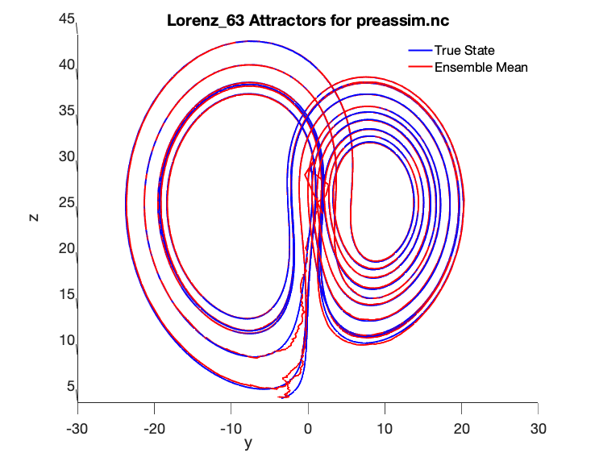
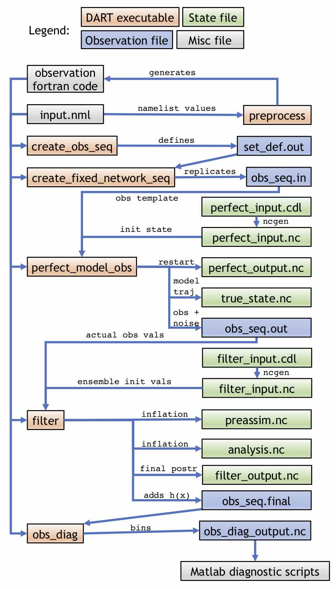
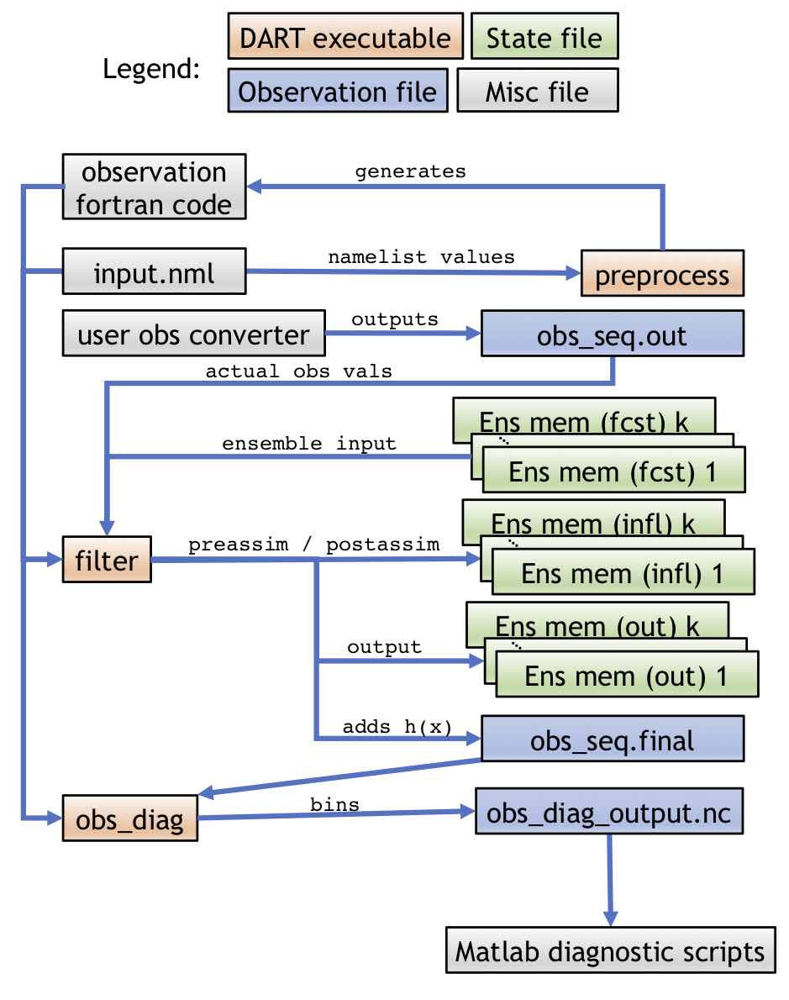

<span id="top" class="anchor"></span>[](#top)

# Getting Started with DART

The Data Assimilation Research Testbed (DART) is an open-source, freely
available community facility for ensemble data assimilation (DA) developed and
maintained by the
[Data Assimilation Research Section (DAReS)](https://www.image.ucar.edu/DAReS/)
at the [National Center for Atmospheric Research (NCAR)](https://ncar.ucar.edu)
and released under the open-source
[Apache License v2.0](https://www.apache.org/licenses/LICENSE-2.0).
DART provides modelers, observational scientists, and geophysicists with
powerful, flexible DA tools that are easy to use and can be customized to
support efficient and reliable DA applications. DART is primarily oriented for
DA research but has also been used in operational settings. DART is a software
environment that makes it easy to explore a variety of data assimilation
methods and observations with different numerical models and is designed to
facilitate the combination of assimilation algorithms, models, and real (as well
as synthetic) observations to allow increased understanding of all three. DART
includes extensive documentation, a comprehensive tutorial, and a variety of
models and observation sets that can be used to introduce new users or graduate
students to ensemble DA. DART also provides a framework for developing, testing,
and distributing advances in ensemble DA to a broad community of users by
removing the implementation-specific peculiarities of one-off DA systems.

DART is intended for use by DA beginners as well as experts, students as well
as teachers, national labs and centers as well as university research labs, and
everything in between; thus, different users may have different goals in
"getting started." We have therefore broken the process into the following
sections, each of which can be read independently:

* [Quick-start instructions for the impatient](#QuickStart)
* [More detailed DART setup instructions](#DetailedSetup)
    *  [On conventions used within this document](#conventions).
    *  [Check your system requirements](#system).
    *  [Determine which F90 compiler is available](#fortran90).
    *  [Determine the location of (or build) the netCDF library](#netCDFlib).
    *  [Download the DART software](#download).
    *  [Building and testing DART](#testing).
    *  [Verifying the DART installation](#verify).
* [What is data assimilation?](#WhatIsDA)
    * [Introduction to ensemble DA](#EnsDAIntro)
    * [The Lorenz 63 model: what is it and why should we care?](#Lorenz63)
    * [Data assimilation in DART using the Lorenz 63 model](#DAForLorenz63)
* [What is DART?](#WhatIsDART)
    * [Why should I use DART for my project?](#whyDart)
    * [A brief history of DART](#dartHistory)
    * [High-level DA workflows in DART](#dartWorkflow)
    * [DART's design philosophy](#dartDesign)
    * [Important capabilities of DART](#dartCapabilities)
    * [How to cite DART](#citeDart)
* [How do I run DART with my model?](#RunWithMyModel)
    * [Required `model_mod` routines](#requiredRoutines)
    * [Suggestions for a "simple" model](#simpleModel)
    * [Suggestions for a "complex" model](#complexModel)
    * [How to test your `model_mod` routines](#howToTestModelMod)
* [How do I add my observations to DART?](#RunWithMyObs)
    * [Background on DART observations](#obsBackground)
    * [Simple observation definitions](#simpleObs)
    * [Obs definitions for observations needing special handling](#complexObs)
    * [Example observation definition](#exampleObsDef)
    * [Observation sequence file](#obsSeqFile)
* [How would I use DART for teaching students and/or myself?](#DartForEducation)
    * [The DART tutorial](#dartTutorial)
    * [DART_LAB](#dartLab)
* [How can I contribute to DART?](#ContributeToDart)

---

<span id="QuickStart" class="anchor"></span> [](#QuickStart)

## Quick-start instructions for the impatient

\[[top](#top)\]

This section details how to get started with DART as quickly as possible. This
section may be for you if you want to see that DART works before spending a lot
of time learning about the details. However, if this level of detail is too
sparse for you or if you run into any problems, please refer to
[More detailed DART setup instructions](#DetailedSetup).

The DART source code is distributed on the GitHub repository
[NCAR/DART](https://github.com/NCAR/DART)
with the documentation served through GitHub Pages at
[https://ncar.github.io/DART](https://ncar.github.io/DART).

Go to https://github.com/NCAR/DART, click "Clone or download", and click
"Download ZIP" to download the latest release of DART; alternately, you can
clone the DART repository. Unzip or clone in your desired location. Take note
of the directory you installed into, which is referred to as *DARTHOME* below.

:exclamation: *IMPORTANT*: If you are interested in contributing to DART, when
you are ready you will need to follow a different workflow to obtain the code in
order to send your changes. See
[How can I contribute to DART?](#ContributeToDart) for more information.

Your `DARTHOME` directory will now contain the latest release of DART.

Go into the `build_templates` subdirectory and copy over the closest `mkmf.template.<compiler system>` file into `mkmf.template`.

Edit `mkmf.template` to set the `NETCDF` directory location if not in
`/usr/local` or comment it out and set `$NETCDF` in your environment.

:warning: *WARNING*: Your netCDF library must have been compiled with the
same compiler (including version) that you will use to compile DART and also
must include the F90 interfaces. In practice this means that even if you have a
netCDF distribution on your system, you may need to recompile netCDF in a
separate location to match the compiler you will use for DART.

As an optional step, if you are interested in running *bgrid_solo*, *cam-fv*, or
testing the *NCEP/prep_bufr* observation converter, you will need to download a
supplemental archive file. There are several large files that are needed to run
some of these DART tests and examples that are not included on Github in order
to keep the repository as small as possible. These files are available at:

| Release                | Size   | Filename  |
| :--------------        | :----- | :-------- |
| "Manhattan"        |  189M  | [Manhattan_large_files.tar.gz](https://www.image.ucar.edu/pub/DART/Release_datasets/Manhattan_large_files.tar.gz) |
| "wrf-chem.r13172"  |  141M  | [wrf-chem.r13172_large_files.tar.gz](https://www.image.ucar.edu/pub/DART/Release_datasets/wrf-chem.r13172_large_files.tar.gz) |
| "Lanai"            |  158M  | [Lanai_large_files.tar.gz](https://www.image.ucar.edu/pub/DART/Release_datasets/Lanai_large_files.tar.gz) |
| "Kodiak"           |  158M  | [Kodiak_large_files.tar.gz](https://www.image.ucar.edu/pub/DART/Release_datasets/Kodiak_large_files.tar.gz) |
| "Jamaica"          |   32M  | [Jamaica_large_files.tar.gz](https://www.image.ucar.edu/pub/DART/Release_datasets/Jamaica_large_files.tar.gz) |
| "Hawaii"           |   32M  | [Hawaii_large_files.tar.gz](https://www.image.ucar.edu/pub/DART/Release_datasets/Hawaii_large_files.tar.gz) |

If so desired, download the appropriate tar file and untar it into your
`DARTHOME` directory. Ignore any warnings about
```
tar: Ignoring unknown extended header keyword
```

You are now ready to start building the DART code. Go into
`models/lorenz_63/work` and run *quickbuild.csh*.

> cd models/lorenz_63/work  
> ./quickbuild.csh  

If it compiles, *:tada:*  If not, see the next section for more information.
Run this series of commands to do a very basic test:

> ./perfect_model_obs  
> ./filter  

If that runs, *:tada:* again!  Finally, if you have Matlab installed on
your system add '$DARTHOME/diagnostics/matlab' to your matlab search path with
the command

> addpath('path_to_dart/diagnostics/matlab','-BEGIN')  

replacing `path_to_dart` with your actual DARTHOME installation directory.

In Matlab, run the `plot_total_err` diagnostic script while in the
`models/lorenz_63/work` directory.  If the output plots and looks
reasonable (error level stays around 2 and doesn't grow unbounded)
you're great!  Congrats.

If you are planning to run one of the models that uses MPI and want to
use the Lorenz 63 model as a test, run ```./quickbuild.csh -mpi```.
It will build filter and any other MPI-capable executables with MPI.

:warning: *WARNING*: The underlying compiler used by *mpif90* must match the
same compiler that you use for DART and netCDF.

If any of these steps fail or you don't know how to do them, you can see
much more detailed instructions in the next section that hopefully
should get you over any bumps you encountered in the process.

---
<span id="DetailedSetup" class="anchor"></span> [](#DetailedSetup)

## More detailed DART setup description

\[[top](#top)\]

This section is a more detailed description of the steps in the previous
section, [Quick-start instructions for the impatient](#QuickStart). In
particular, you can refer to these instructions if anything in the previous
section failed or if you want a more complete picture of how DART is configured.

The getting started process is summarized in the following steps:

0.  [On conventions used within this document](#conventions).
1.  [Check your system requirements](#system).
2.  [Determine which F90 compiler is available](#fortran90).
3.  [Determine the location of (or build) the netCDF library](#netCDFlib).
4.  [Download the DART software](#download).
5.  [Modify certain DART files to reflect the available F90 compiler and location of the appropriate libraries](#customizations).
6.  [Build the executables](#building).
7.  [Verify the DART installation](#verify).

----
<span id="conventions" class="anchor"></span> [](#conventions)

### On conventions used within this document

This getting started document is intended to be used as a reference by users of
different levels and backgrounds. By design, this page is mostly
"self-contained" as a single page so that users can navigate through the
document links without becoming lost. Some sections contain helpful
information, while others contain step-by-step instructions to run programs
or shell commands.

In order to make the tutorial-style sections more clear, the following
conventions are used within this document:

Commands to be **typed at the command line** will appear in *blockquote*. For example:

> my_command.exe run_it.nml  

The **contents of a file** will be *enclosed in a box* as follows (for some hypothetical namelist file):

~~~
&hypothetical_nml
  obs_seq_in_file_name = "obs_seq.in",
  obs_seq_out_file_name = "obs_seq.out",
  init_time_days = 0,
  init_time_seconds = 0,
  output_interval = 1
&end
~~~

The **names of files** or environment variables will appear in a *code-block*
as in `filename`.

The *names of executables* will be italicized (although note that italic
will also be used for emphasis where there is no potential for confusion).

:dart: *NOTE*: "pro-tip" information to note will be written like this.

:exclamation: *IMPORTANT*: important information will be written like this.

:warning: *WARNING*: don't miss out on warnings which will be written like this.

----
<span id="system" class="anchor"></span> [](#system)

### System Requirements

The DART software is intended to compile and run on many different
Unix/Linux operating systems with little to no change. At this point we have no
plans to port DART to Windows machines, although Windows 10
users may be interested in the free
[Windows Subsystem For Linux](https://docs.microsoft.com/en-us/windows/wsl/about)
which allows developers to "run a GNU/Linux environment &mdash; including most
command-line tools, utilities, and applications &mdash; directly on Windows,
unmodified, without the overhead of a virtual machine" (see
<https://docs.microsoft.com/en-us/windows/wsl/about> for more details)

:warning: *DISCLAIMER:* we have tried to make the DART code as portable as
possible, but we do not have access to all compilers on all platforms, so
unfortunately we cannot guarantee that the code will work correctly on your
particular system. We are genuinely interested in your experience building the
system, so we welcome you to send us an email with your experiences at
dart @ ucar .edu, which we will endeavor to incorporate into future versions of
this guide.

Minimally, you will need:

1.  [a Fortran90 compiler](#fortran90),
2.  the [netCDF libraries](http://www.unidata.ucar.edu/software/netcdf/)
    built with the F90 interface,
3.  *perl* (just about any version),
4.  an environment that understands *csh*, *tcsh*, *sh*, and *ksh*
5.  the long-lived Unix build tool *make*
6.  and up to 1 Gb of disk space for the DART distribution.

History has shown that it is a very good idea to remove the stack and heap
limits in your run-time environment with the following terminal commands:

~~~
limit stacksize unlimited  
limit datasize unlimited
~~~

Additionally, the following tools have proven to be *nice* (but are not
required to run DART):

1.  [ncview](http://meteora.ucsd.edu/~pierce/ncview_home_page.html): a
    great visual browser for netCDF files.
2.  [the netCDF Operators (NCO)](http://nco.sourceforge.net/): tools to
    perform operations on netCDF files like concatenating, slicing, and
    dicing
3.  Some sort of MPI environment. In other words, DART does not come
    with *MPICH*, *LAM-MPI*, or *OpenMPI*, but many users of DART rely on these
    MPI distributions to run DART in a distributed-memory parallel setting. In
    order to use MPI with DART, please refer to [the DART MPI introduction](dart_mpi.md).
4.  If you want to use the DART diagnostic scripts, you will need a
    basic MATLAB® installation. No additional toolboxes are required, and no
    third-party toolboxes are required.

----

<span id="fortran90" class="anchor"></span> [](#fortran90)

### Requirements: a Fortran90 compiler

The DART software is written in standard Fortran 90, with no compiler-specific
extensions. It has been compiled and run with several versions of each of the
following:
* [GNU Fortran Compiler ("gfortran")](http://gcc.gnu.org/fortran) (free)
* [Intel Fortran Compiler for Linux and OSX](http://software.intel.com/en-us/intel-composer-xe)
* [IBM XL Fortran Compiler](http://www-01.ibm.com/software/awdtools/fortran/)
* [Portland Group Fortran Compiler](http://www.pgroup.com/)
* [Lahey Fortran Compiler](http://www.lahey.com/)
* [NAG Fortran compiler](https://www.nag.com/nag-compiler)
* [PathScale Fortran compiler](https://en.wikipedia.org/wiki/PathScale)

Since recompiling the code is a necessity to experiment with different models,
there are no DART binaries to distribute. If you are unfamiliar with Fortran
and/or wonder why we would choose this language, see
[Why Fortran?](#whyFortran) for more information.

<span id="netCDFlib" class="anchor"></span> [](#netCDFlib)

### Requirements: the netCDF library

DART uses the [netCDF](https://www.unidata.ucar.edu/software/netcdf/)
self-describing data format for storing the results of assimilation experiments.
These files have the extension *.nc* and can be read by a number of
standard data analysis tools. In particular, DART also makes use of the
F90 NetCDF interface which is available through the `netcdf.mod`
and `typesizes.mod` modules and the `libnetcdf` library. Depending on the
version, the `libnetcdff` library is also often required.

If the netCDF library does not exist on your system, you must build it
(as well as the F90 interface modules).

:warning: *WARNING*: You must build netCDF
with the same compiler (including version) you plan to use for compiling DART.
In practice this means that even if you have a netCDF
distribution on your system, you may need to recompile netCDF in a separate
location to match the compiler you will use for DART. The library and
instructions for building the library or installing from a package manager  may
be found at the netCDF home page:
<https://www.unidata.ucar.edu/software/netcdf/>

:exclamation: *IMPORTANT*: the normal location for the NetCDF Fortran modules
and libraries would be in the `include` and `lib` subdirectories of the NetCDF
installation. However, different compilers or package managers sometimes
place the modules and/or libraries into non-standard locations. It is required
that both modules and the libraries be present.

:dart: *NOTE:* The location of the netCDF library, `libnetcdf.a`, and the
locations of both `netcdf.mod` and `typesizes.mod` will be needed later.
Depending on the version of netCDF and the build options selected, the
Fortran interface routines may be in a separate library named
`libnetcdff.a` (note the two F's). In this case both libraries are
required to build executables.

<span id="download" class="anchor"></span> [](#download)

### Download DART

The DART source code is distributed on the GitHub repository
[NCAR/DART](https://github.com/NCAR/DART)
with the documentation served through GitHub Pages at
[https://ncar.github.io/DART](https://ncar.github.io/DART).

Go to https://github.com/NCAR/DART, click "Clone or download", and click
"Download ZIP" to download the latest release of DART. Alternately, to view
the history of the code, you can "clone" the DART repo. Be aware that while
the ZIP file is approximately 300 Mb, the full DART history from a clone adds
approximately another 450 Mb. We therefore recommend that users who are not
interested in the version control history download the ZIP file.

:exclamation: *IMPORTANT*: If you are interested in contributing to DART, when
you are ready you will need to follow a different workflow to obtain the code in
order to send your changes. See
[How can I contribute to DART?](#ContributeToDart) for more information.

Unzip or clone the distribution in your desired directory, which we refer to as
"DARTHOME" in this document. Compiling the code in this tree (as is usually the
case) may require a large amount of additional disk space (up to the 1 Gb
required for DART), so be aware of any disk quota restrictions before
continuing.

<span id="testing" class="anchor"></span> [](#testing)

### Building and testing DART

Now that the DART code has been downloaded and the prerequisites have been
verified, you can now begin building and verifying the DART installation.

<span id="customizations" class="anchor"></span> [](#customizations)

#### Customizing the build scripts &mdash; overview

DART executable programs are constructed using two tools: *mkmf*, and
*make*. The *make* utility is a very commonly used tool that
requires a user-defined input file (a `Makefile`) that records dependencies
between different source files. *make* then performs actions to the source
hierarchy, in order of dependence, when one or more of the source files is
modified. *mkmf* is a *perl* script that generates a *make* input file (named
*Makefile*) and an example namelist `input.nml.<program>_default` with the
appropriate default values.

*mkmf* (think *"make makefile"*) requires two separate input files. The
first is a template file which specifies the commands required for a specific
Fortran90 compiler and may also contain pointers to directories containing pre-
compiled utilities required by the DART system. **This template file will need to be modified to reflect your system as detailed in the next section**.

The second input file is a `path_names` file which is
supplied by DART and can be used without modification. An *mkmf* command
is executed which uses the `path_names` file and the mkmf template file
to produce a `Makefile` which is subsequently used by the standard
*make* utility.

Shell scripts that execute the *mkmf* command for all standard DART
executables are provided with the standard DART distribution. For more
information on the [mkmf](https://github.com/NOAA-GFDL/mkmf) tool please
see the [mkmf documentation](https://extranet.gfdl.noaa.gov/~vb/mkmf.html).

<span id="template" class="anchor"></span> [](#template)

#### Building and Customizing the 'mkmf.template' file

A series of templates for different compilers/architectures can be found in
the *DARTHOME/build_templates* directory and have names with extensions
that identify the compiler, the architecture, or both. This is how you
inform the build process of the specifics of your system. **Our intent
is that you copy one that is similar to your system into
`DARTHOME/build_templates/mkmf.template` and customize it.** For the
discussion that follows, knowledge of the contents of one of these
templates (e.g. `DARTHOME/build_templates/mkmf.template.intel.linux`) is
needed. Note that only the LAST lines of the file are shown here.
The first portion of the file is a large comment block that provides valuable
advice on how to customize the *mkmf* template file if needed.

~~~
...
MPIFC = mpif90
MPILD = mpif90
FC = ifort
LD = ifort
NETCDF = /usr/local
INCS = -I${NETCDF}/include
LIBS = -L${NETCDF}/lib -lnetcdf -lnetcdff
FFLAGS = -O2 $(INCS)
LDFLAGS = $(FFLAGS) $(LIBS)
~~~

| variable | value |
| :------- | :---- |
| FC       | the Fortran compiler |
| LD       | the name of the loader; typically, the same as the Fortran compiler |
| MPIFC    | the MPI Fortran compiler; see [the DART MPI introduction](dart_mpi.md) for more info|
| MPILD    | the MPI loader; see [the DART MPI introduction](dart_mpi.md) for more info|
| NETCDF   | the location of your root netCDF installation, which is assumed to contain `netcdf.mod` and `typesizes.mod` in the include subdirectory. Note that the value of the NETCDF variable will be used by the "INCS" and "LIBS" variables. |
| INCS     | the includes passed to the compiler during compilation. Note you may need to change this if your netCDF includes `netcdf.mod` and `typesizes.mod` are not in the standard location under the `include` subdirectory of NETCDF. |
| LIBS     | the libraries passed to "FC" (or "MPIFC") during compilation. Note you may need to change this if the netCDF libraries `libnetcdf` and `libnetcdff` are not in the standard location under the "lib" subdirectory of NETCDF. |
| FFLAGS   | the Fortran flags passed to "FC" (or "MPIFC") during compilation. There are often flags used for optimized code versus debugging code. See your particular compiler's documentation for more information. |
| LDFLAGS  | the linker flags passed to *LD* during compilation. See your particular linker's documentation for more information. |

<span id="path_names" class="anchor"></span> [](#path_names)

#### Customizing the 'path_names_\*' files

Several `path_names_*`  files are provided in the "work" directory for
each specific model. In this case, the directory of interest is
`DARTHOME/models/lorenz_63/work` (see the next section). Since each model comes
with its own set of files, the `path_names_*` files typically need no
customization. However, modifying these files will be required if you wish to
add your model to DART. See [How do I run DART with my model?](#RunWithMyModel)
for more information.

<span id="building" class="anchor"></span> [](#building)

### Building the Lorenz_63 DART project.

In order to get started with DART, here we use the Lorenz 63 model, which is a
simple ODE model with only three variables. DART supports models with many
orders of magnitude more variables than three, but if you can compile and run
the DART code for any ONE of the models, you should be able to compile and run
DART for ANY of the models. For time-dependent filtering known as
**cycling**, where observations are iteratively assimilated at multiple time
steps, DART requires the ability to move the model state forward in time. For
low-order models, this may be possible with a Fortran function call, but for
higher-order models, this is typically done outside of DART's execution
control. However, the assimilation itself is conducted the same way for **all**
models. For this reason, here we focus solely on the Lorenz 63 model. If
so desired, see
[The Lorenz 63 model: what is it and why should we care?](#Lorenz63) for
more information on this simple yet surprisingly relevant model. See
[A high-level workflow of DA in DART](#dartWorkflow) for further information
regarding the DART workflow if you prefer to do so before building the code.

There are seven separate, stand-alone programs that are typically necessary for
the end-to-end execution of a DART experiment; see below or the
[What is DART?](#WhatIsDART) section for more information on these programs and
their interactions. All DART programs are compiled the same way, and each model
directory has a directory called `work` that has the components necessary to
build the executables.

:dart: *NOTE:* some higher-order models have many more than seven programs; for
example, the Weather Research and Forecasting (WRF) model, which is run
operationally around the world to predict regional weather, has 28
separate programs. Nonetheless, each of these programs are built the same way.

The `quickbuild.csh` in each directory builds all seven programs necessary for
Lorenz 63. Describing what the `quickbuild.csh` script does is useful for
understanding how to get started with DART.

The following sequence of shell commands shows how to build two of these seven
programs for the lorenz_63 model: *preprocess* and *obs_diag*. *preprocess* is
a special program that needs to be built and run to automatically generate
Fortran code that is used by DART to support a subset of observations - which
are (potentially) different for every model. Once *preprocess* has been run and
the required Fortran code has been generated, any of the other DART programs may
be built in the same way as *obs_diag* in this example. The following shell
commands runs *mkmf* for *preprocess*, makes the *preprocess* `Makefile`, runs
*preprocess* (thus generating the Fortran observation code), runs *mkmf* for
*obs_diag*, then makes the *obs_diag* program.

> cd DARTHOME/models/lorenz_63/work  
> ./mkmf_preprocess  
> make  
> ./preprocess  
> ./mkmf_obs_diag  
> make  

The remaining executables are built in the same fashion as *obs_diag*: run
the particular *mkmf* script to generate a Makefile, then execute *make* to
build the corresponding program.

Currently, DART executables are built in a `work` subdirectory under the
directory containing code for the given model. The Lorenz_63 model has
seven `mkmf_xxxxxx` files for the following programs:

| Program | Purpose |
| :------ | :------ |
| [preprocess](https://ncar.github.io/DART/api/v0.0.6/program/preprocess.html) | creates custom source code for just the observations of interest |
| [create_obs_sequence](https://ncar.github.io/DART/api/v0.0.6/program/create_obs_sequence.html) | specify a (set) of observation characteristics taken by a particular (set of) instruments |
| [create_fixed_network_seq](https://ncar.github.io/DART/api/v0.0.6/program/create_fixed_network_seq.html) | specify the temporal attributes of the observation sets |
| [perfect_model_obs](https://ncar.github.io/DART/api/v0.0.6/program/perfect_model_obs.html) | spinup and generate "true state" for synthetic observation experiments |
| [filter](https://ncar.github.io/DART/api/v0.0.6/program/filter.html) | perform data assimilation analysis |
| *obs_diag* | creates observation-space diagnostic files to be visualized by the MATLAB® scripts. |
| [obs_sequence_tool](https://ncar.github.io/DART/api/v0.0.6/program/obs_sequence_tool.html) | manipulates observation sequence files. This tool is not generally required (particularly for low-order models) but can be used to combine observation sequences or convert from ASCII to binary or vice-versa. Since this is a rather specialized routine, we will not cover its use further in this document. |

As mentioned above, `quickbuild.csh` is a script that will build every
executable in the directory. There is an optional argument that will
additionally build the MPI-enabled versions which will not be covered in this
set of instructions. See [The DART MPI introduction](dart_mpi.md) page for more
information on using DART with MPI.

Running `quickbuild.csh` will compile all the executables mentioned above for
the lorenz_63 model:

> cd DARTHOME/models/lorenz_63/work  
> ./quickbuild.csh

The result (hopefully) is that seven executables now reside in your work
directory.

:dart: *NOTE*: The most common problem is that the netCDF libraries and/or
include files were not found in the specified location(s). The second most
common problem is that the netCDF libraries were built with a different
compiler than the one used for DART. Find (or compile) a compatible NetCDF
library, edit the `DARTHOME/build_templates/mkmf.template` to point to the
correct locations of the includes and library files, recreate the `Makefile`s,
and try again.

<span id="runningSomething" class="anchor"></span> [](#runningSomething)

### Checking the build &mdash; running something.

The `DARTHOME/models/lorenz_63/work` directory is distributed with input files
ready to run a simple experiment: use 20 ensemble members to assimilate
observations "every 6 hours" for 50 days. Simply run the programs
*perfect_model_obs* and *filter* to generate the results to compare against
known results. Note that this section is not intended to provide any details of
why you are doing what you are doing - this is sort of a "black-box" test. See
[The Lorenz 63 model: what is it and why should we care?](#lorenz63) to see
more about what this "physically" means for this low-order model, and
[Data assimilation in DART using the Lorenz 63 model](#DAForLorenz63) for a
more in-depth view of this process.

The Manhattan release uses netCDF files for the input/output file formats.
There is a helpful tool packaged with any netCDF installation to create netCDF
files from an ASCII representation named *ncgen*. The *lorenz_63*
`quickbuild.csh` script already runs this command, but it is repeated here for
clarity. Once the necessary netCDF input files are created from the ASCII
`.cdl` text files, run *perfect_model_obs* to generate the "true state" and *filter* to run the data assimilation:

> ncgen -o perfect_input.nc perfect_input.cdl  
> ncgen -o filter_input.nc filter_input.cdl  
> ./perfect_model_obs  
> ./filter  

There should now be the following output files:

|                     |                   |
| :------             | :------           |
| **from executable "perfect_model_obs"** |       |
| `perfect_output.nc` | A netCDF file containing the model trajectory - the **truth** |
| `obs_seq.out`       | The observations that were harvested as the true model was advanced (and which will be assimilated). |
| **from executable "filter"** |      |
| `preassim.nc`       | A netCDF file of the ensemble of model states just before assimilation. This is the **prior**. |
| `filter_output.nc`  | A netCDF file of the ensemble of model states after assimilation. This is the **posterior**. |
| `obs_seq.final`     | The observations and ensemble estimates of the 'observations'. |
| **from both**       |      |
| `dart_log.out`      | The run-time log of the experiment.  This grows with each execution and may safely be deleted at any time. |
| `dart_log.nml`      | A record of the input settings of the experiment.  This file may safely be deleted at any time. |

Note that if you change the `input.nml` namelist values controlling
inflation (increasing the ensemble spread) and file output, several (perhaps
many) more files may be created. The section
[Data assimilation in DART using the Lorenz 63 model](#DAForLorenz63) below
describes how to make changes to the `input.nml` file and rerun the filter
experiment.

<span id="matlab" class="anchor"></span> [](#matlab)

### Configuring the DART diagnostic tools for MATLAB®

The Manhattan release of DART uses native MATLAB netCDF support and no
longer requires any third-party toolboxes or built-in MATLAB toolboxes.
To allow your environment to seamlessly use the DART MATLAB functions,
your MATLABPATH must be set such that you
have access to several DART directories. At the MATLAB prompt, type the following
(using the real path to your DART installation):

> \>\> addpath('path_to_dart/diagnostics/matlab','-BEGIN')  
> \>\> addpath('path_to_dart/documentation/DART_LAB/matlab','-BEGIN')  

It is very convenient to put these lines in your *\~/matlab/startup.m* file so
they are executed every time MATLAB starts up. DART provides an example
`diagnostics/matlab/startup.m` that you can use, which is internally
documented through file comments.

<span id="verify" class="anchor"></span> [](#verify)

### Verifying the DART installation (requires MATLAB®)

The Lorenz model is notoriously sensitive to very small changes; in fact, the
story of Lorenz discovering this sensitivity is a classic in the annals of the
study of chaos, which in turn was instrumental in the development of data
assimilation as a field of study. See
[The Lorenz 63 model: what is it and why should we care?](#Lorenz63) or
[What is data assimilation?](#WhatIsDA) for more information.

This sensitivity is of practical interest for verifying these results. The
initial conditions files and observations sequences are provided in ASCII,
which is portable across systems, but there may be some machine-specific
round-off error in the conversion from ASCII to machine binary. As Lorenz 63
is such a non-linear model, extremely small differences in the initial
conditions may eventually result in noticeably different model trajectories.
Even different compiler flags may cause tiny differences that ultimately result
in large differences. Your results should start out looking VERY SIMILAR and
may diverge with time.

The simplest way to determine if the installation is successful is to run some
of the functions available in `DARTHOME/diagnostics/matlab/`. Usually, we
launch MATLAB from the `DARTHOME/models/lorenz_63/work` directory and use the
MATLAB *addpath* command to make the `DARTHOME/matlab/` functions available for
execution in any working directory.

In the case of this Lorenz model, we know the "true" (by definition) state of
the model that is consistent with the observations, which was generated by the
*perfect_model_obs* program as described in
[Checking the build &mdash; running something](#runningSomething). The
following MATLAB scripts compare the ensemble members with the truth and can
calculate the error in the assimilation:

<table>
<tr>
<td width="50%">
<pre>
<code>
[unix prompt] cd DARTHOME/models/lorenz_63/work
[unix prompt] matlab -nodesktop
(lots of startup messages I'm skipping)

    >> addpath ../../../diagnostics/matlab
    >> plot_total_err
    Input name of true model trajectory file;
    <cr> for perfect_output.nc
    perfect_output.nc
    Input name of ensemble trajectory file;
    <cr> for preassim.nc
    preassim.nc
    Comparing true_state.nc and
              preassim.nc
    >> plot_ens_time_series
    Input name of ensemble trajectory file;
    <cr> for preassim.nc

    Comparing true_state.nc and
              preassim.nc
    Using Variable state IDs 1  2  3

    pinfo =

      struct with fields:

                     model: 'Lorenz_63'
                   def_var: 'state'
            num_state_vars: 1
                num_copies: 20
           num_ens_members: 20
          ensemble_indices: [1 2 3 ... 18 19 20]
             min_state_var: 1
             max_state_var: 3
            def_state_vars: [1 2 3]
                     fname: 'preassim.nc'
                truth_file: 'true_state.nc'
                diagn_file: 'preassim.nc'
                truth_time: [1 200]
                diagn_time: [1 200]
                      vars: {'state'}
                      time: [200x1 double]
        time_series_length: 200
                       var: 'state'
                  var_inds: [1 2 3]
</code>
</pre>
</td>
<td width="50%">
<br />

</td>
</tr>
</table>

From the above *plot_ens_time_series* graphic, you can see the individual
green ensemble members becoming more constrained with less spread as time
evolves. If your figures look similar to these, you should feel confident that
everything is working as intended. Don't miss the opportunity to rotate the
"butterfly" plot for that classic chaos theory experience (perhaps while
saying, "life, uh, finds a way").

Congratulations! You have now successfully configured DART and are ready to
begin the next phase of your interaction with DART. You may wish to learn more
about:

* [What is data assimilation?](#WhatIsDA) &mdash; a brief introduction to ensemble data assimilation. This section includes more information about the Lorenz 63 model and how to configure the `input.nml` file to play with DA experiments in DART using the Lorenz 63 model.
* [What is DART?](#WhatIsDART) &mdash; This section includes more information about DART and a basic flow chart of the overall DART workflow.
* [How do I run DART with my model?](#RunWithMyModel)
* [How do I add my observations to DART?](#RunWithMyObs)
* [How would I use DART for teaching students and/or myself?](#DartForEducation)
* [How can I contribute to DART?](#ContributeToDart)

:dart: *REQUEST:* In the case that the above instructions had one or more
issues that either did not work for you as intended or were confusing, please
contact the DART software development team at dart @ ucar .edu . We value your
input to make getting started as smooth as possible for new DART users!

-----

<span id="WhatIsDA" class="anchor"></span> [](#WhatIsDA)

## What is data assimilation?

\[[top](#top)\]

As some users may be unfamiliar with data assimilation and/or appreciate a brief
refresher, in this section we provide a (very) basic introduction to the
subject. For additional information, see the section on
[How would I use DART for teaching students and/or myself?](#DartForEducation).

Included in this section are the subsections:

1. [Introduction to ensemble DA](#EnsDAIntro) - a brief introduction to the main concepts of DA
2. [The Lorenz 63 model: what is it and why should we care?](#Lorenz63) -  more information about the Lorenz 63 model and its far-reaching consequences, and
3. [Data assimilation in DART using the Lorenz 63 model](#DAForLorenz63) -  an expanded introduction to DA in DART that opens up the "black box" of the Lorenz 63 model

<span id="EnsDAIntro" class="anchor"></span> [](#EnsDAIntro)

### Introduction to ensemble DA

Data assimilation is a powerful and widely used computational technique that
has many application areas throughout mathematics and science. At a very high
level, data assimilation refers to the process of merging prior
*forecasts* with new *observations*, creating a new analysis that is an
"optimal" blending of the two by taking into account their relative
uncertainties.

The following animated graphic describes the data assimilation process at a
high level:


Shown here are three ensemble members, each of which gives a different initial
prediction at the time *t*<sub>*k*</sub>. Moving these predictions
forward in time to *t*<sub>*k*+1</sub> will give a new forecast distribution
called a *prior*. Suppose at this time there is also an observation, which will
have some uncertainty due to instrument noise, etc. Mapping each of the ensemble
members to the observations with a function *h* and applying **Bayes' rule**
will generate an update to the prior distribution, called here the *state
increment*. Adding the state increment to the ensemble members will give the
new *analysis* (also known as the *posterior*) at time *t*<sub>*k*+1</sub>.
This process can then be repeated for each set of observations as many times as
necessary.

Expanding on this somewhat, let's call the *i*<sup>th</sup>
ensemble member **x**<sub>i</sub> at the time step we are working on. In the
above graphic, there were three ensemble members, but in general there are
usually many more, typically in the range of 20-1000 depending on the
application. Each member **x**<sub>i</sub> can have
*n* components which together make up the **model state**. Each member contains
all the variables you want to find the best fit for at a particular time. These
variables are usually physically meaningful quantities; for example, this might
include the 3D values of water vapor, temperature, wind speed, etc. for an
atmospheric model. These values are expected to be advanced forward in time by
a model, which is why they are called the "model state."

:dart: *NOTE*: we view the "model state" as the minimum amount of information
necessary to restart the model for a new forecast.

At any particular time step there may be *m* **observations** available. These
observations are assumed to relate to the model state and provide "real
world" checks against the model forecast. A "forward operator," represented in
the above diagram by *h*, is a relationship that computes what an
observation is most likely to be given a model state. In other words, *h* maps
between **x**<sub>i</sub> and **y**<sub>j</sub>, giving the "expected
observation" of the *j*<sup>th</sup> observation given the *i*<sup>th</sup>
ensemble member. An observation may be of the same quantity as one found in the
model state at a particular location, in which case the *h* function mapping
them is trivial and the comparison is simple. The vector **y** may also contain
more complex derived functions of the state **x** (for example radar
observations of precipitation), in which case the *h* function that models this
mapping between **x** (in this example precipitation) and **y** (in this
example radar returns) may be an algorithm that is quite complicated.

In practice, observations are never 100% reliable. The observations
themselves will have some uncertainty for example arising from instrument
noise. The instrument noise error variances are typically published
by the instrument manufacturer, and the observation errors are usually assumed
to be independent as true instrument "noise" should not be correlated in time
or space. The potential "likelihood" of the possible values of the observation
forms the **observational error distribution** in the above graphic.

Finally, note that in real-world applications there are typically many fewer
observations than state variables, i.e. *m* is typically **much much less** than
*n*. In practice this means that the observations alone cannot be relied upon
to predict the model state; the ensemble approach with Bayes' rule is necessary.

DART makes it easy to find the optimal solution to the above problem using an
ensemble filter algorithm (the most typically used algorithm is the
**Ensemble Adjustment Kalman Filter**; see
[Important capabilities of DART](#dartCapabilities) for more information). The
user specifies which state variables make up the **x** ensemble vectors, which
observations make up the **y** vector, and the observation error variances. The
ensemble of model states is assumed to be representative of the
uncertainty/spread in the model state. Finally, the user tells DART how to
advance the model from one forecast to the next. Once DART has this
information, it can proceed with optimally blending the observations and model
forecasts &mdash; in other words, performing data assimilation.

The spread of the **ensemble** informs DART of the **uncertainty** in the model
state. This allows for as rich, complex, and meaningful relationships as the
data contained within the ensemble itself. By default, no implicit assumptions
about the relative uncertainties are required, as the data can speak for itself.
Areas of large uncertainty will naturally have large spread, as the ensemble
members will contain very different values at those locations, while areas of
low uncertainty will naturally have low spread due to the ensemble having
relatively similar values at those locations. Furthermore, relationships in
space and between variables can also be meaningfully derived. Of course this
means that the quality of the ensemble is crucial to the success of the DA
process, as uncertainty can only be accurately quantified if the ensemble is
representative of the "true" uncertainty inherent in the system. Due to the fact
that a relatively small number of ensemble members are typically used,
estimated correlations between two distant locations may become unreliable due
to sampling error. Thus, various techniques such as **covariance localization**
may be employed to improve the quality of estimated relationships and increase
skill in prediction. Furthermore, the ensemble spread may sometimes be deemed
"too small" or "too large" by various criteria, in which case a multiplicative
or additive **inflation** or **deflation**, respectively, may be applied.
In practice the ensemble method is usually far more accurate and
less error-prone than the main alternative of manually specifying uncertainty
by some manually-designed algorithm, and it is certainly less labor-intensive
to develop.

This was a brief introduction to the important concepts of DA. For more
information, see
[How would I use DART for teaching students and/or myself?](#DartForEducation).

In the next section, details of the Lorenz 63 model are provided to give a more
concrete illustration of the DA process.

----

<span id="Lorenz63" class="anchor"></span> [](#Lorenz63)

### The Lorenz 63 model: what is it and why should we care?

In this section we present additional detail about the Lorenz 63 model. As we
previously treated this model as a black box, this section will provide
background on this highly relevant chaotic system for the purpose of deepening
understanding of DART and DA in general.

In 1963, Edward Lorenz developed a simplified 3-variable model to investigate
atmospheric convection. By making several simplifications to the Boussinesq
approximation, the Lorenz model was derived for a single thin layer of fluid
uniformly heated from below and cooled from above. The [original paper](https://journals.ametsoc.org/doi/pdf/10.1175/1520-0469%281963%29020%3C0130%3ADNF%3E2.0.CO%3B2)
(Lorenz, E. N. 1963. Deterministic nonperiodic flow. *J. Atmos.
Sci.* **20**, 130-141.) has been cited over 20,000 times.
The relatively simple &mdash; yet non-linear &mdash; system of ordinary
differential equations (ODEs) is:

~~~
X' = sigma*(Y-X)
Y' = -XZ + rX - Y
Z' =  XY - bZ
~~~

where the left-hand sides of the equations are derivatives with respect to time.
Here, `X` is proportional to the rate of convection, `Y` is related to the
horizontal temperature variation, and `Z` is the vertical temperature
variation. There are three constant parameters: `sigma` relates to the Prandtl
number, `r` to the Rayleigh number, and `b` to the physical dimensions of the
layer. Note that `Y'` and `Z'` each have a non-linear term (`-XZ` and `XY`,
respectively).

The numerical investigation of the **chaos** arising from this system of ODEs
unexpectedly launched a revolution in our understanding of nature and lead to
numerous mathematical and scientific breakthroughs. While the chaotic nature of
certain systems such as the three-body problem had been investigated
previously, it was the electronic computer, which could compute thousands of
calculations per second, that allowed these ideas to be formalized. In
particular, Lorenz's model made it clear for the first time how an
infinitesimally small change in the initial conditions could end up having a
huge impact on the final results in certain situations. Lorenz discussed the
strange behavior of this model in
[The Essence of Chaos, University of Washington Press, 1995](https://uwapress.uw.edu/book/9780295975146/the-essence-of-chaos/):

> > At one point I decided to repeat some of the computations in order to
examine what was happening in greater detail. I stopped the computer,
typed in a line of numbers that it had printed out a while earlier, and
set it running again. I went down the hall for a cup of coffee and
returned after about an hour, during which the computer had simulated
about two months of weather. The numbers being printed out were nothing
like the old ones. I immediately suspected a weak vacuum tube or some other
computer trouble, which was not uncommon, but before calling for service
I decided to see just where the mistake had occurred, knowing that this
could speed up the servicing process. Instead of a sudden break, I found
that the new values at first repeated the old ones, but soon afterward had
differed by one and then several units in the last decimal place. …
The numbers I had typed in were not the exact original numbers, but were
the rounded-off values that appeared in the original printout. The initial
round-off errors were the culprits; they were steadily amplifying until
they dominated the solution. In today’s terminology, there was chaos.

Lorenz discovered that even in a model with just three variables, a very small
change in the initial conditions (in this case, the numbers he typed back into
the computer, which were very slightly different from the original numbers)
could cause the entire large-scale behavior to change. Lorenz's discovery has
many important practical implications:

1. If tiny changes can grow to dominate a system, it is no longer possible to find the one set of "perfect" initial conditions and hope to allow the system to run forever with perfect forecasts. Instead, forecasting chaotic systems must be approached **statistically**.
2. There is a practical limit of predictability inherent in chaotic systems. In other words, the non-linear dynamics of a chaotic model are inherently difficult to predict. Multiple evaluations (an **ensemble**) can be run with different plausible initial conditions to quantify this error growth.
3. In order to forecast chaotic systems effectively, periodic observations of the state are required to effectively guide the forecast and narrow the uncertainty. Since in real-world applications observations are almost always sparse compared to the number of state variables, merging observations and forecasts (i.e. **data assimilation**) is required to effectively forecast chaotic systems.

While Lorenz 63 is a simple example of a chaotic system, there are many other
chaotic systems of real practical interest in areas such as weather prediction,
climate, oceanography, hydrology, ecology, biology, ... the list goes on and
on. In short, while the Lorenz model is a simple problem that can easily run
even on the most meager of computers today, it is representative of the same
problem of predictability that can be found throughout science. DART supports
the investigation of forecasting chaotic systems in *any* field where periodic
observations can be used to constrain the uncertainty using an ensemble.

<span id="DAForLorenz63" class="anchor"></span> [](#DAForLorenz63)

### Data assimilation in DART using the Lorenz 63 model

In this section we open the "black box" of the Lorenz model that was previously
used in [Quick-start instructions for the impatient](#QuickStart) and
[More detailed DART setup instructions](#DetailedSetup). This section assumes
you have successfully run the Lorenz 63 model with the example observation
files that were distributed with the DART repository. In this section you will
learn in more detail how DART interacts with the Lorenz 63 model to perform data
assimilation.

#### The input.nml namelist

The `DARTHOME/models/lorenz_63/input.nml` file is the Lorenz model *namelist*,
which is a standard Fortran method for passing parameters from a text file
into a program without needing to recompile. There are many sections within
this file that drive the behavior of DART while using the Lorenz 63 model
for assimilation. Within `input.nml`, there is a section called *model_nml*,
which contains the model-specific parameters:

~~~
&model_nml
   sigma  = 10.0,
   r      = 28.0,
   b      = 2.6666666666667,
   deltat = 0.01,
   time_step_days = 0,
   time_step_seconds = 3600,
   solver = 'RK2'
   /
~~~

Here, you can see the values for the parameters `sigma`, `r`, and `b` that were
discussed in the previous section. These are the original values Lorenz used
in the 1963 paper to create the classic butterfly attractor.

#### The Lorenz 63 model code

The Lorenz 63 model code, which is under
`DARTHOME/models/lorenz_63/model_mod.f90`, contains the lines:

~~~
subroutine comp_dt(x, dt)

real(r8), intent( in) ::  x(:)
real(r8), intent(out) :: dt(:)

! compute the lorenz model dt from standard equations

dt(1) = sigma * (x(2) - x(1))
dt(2) = -x(1)*x(3) + r*x(1) - x(2)
dt(3) = x(1)*x(2) - b*x(3)

end subroutine comp_dt
~~~
which directly translates the above ODE into Fortran.

Note that the routine `comp_dt` does not explicitly depend on the time
variable, only on the state variables (i.e. the Lorenz 63 model is time
invariant).

:dart: *NOTE*: By default, the `model_mod.f90` follows the Lorenz 63 paper to
use the Runge-Kutta 2 scheme (otherwise known as RK2 or the midpoint scheme) to
advance the model.

Since the Lorenz 63 model is time invariant, the RK2 code to advance the ODE
in time can be written as follows, again following the Lorenz 63 paper, for a
`fract` fraction of a time-step (typically equal to 1):

~~~
!------------------------------------------------------------------
!> does single time step advance for lorenz convective 3 variable model
!> using two step rk time step

subroutine adv_single(x, fract)

real(r8), intent(inout) :: x(:)
real(r8), intent(in)    :: fract

real(r8) :: x1(3), x2(3), dx(3)

call comp_dt(x, dx)            !  compute the first intermediate step
x1 = x + fract * deltat * dx

call comp_dt(x1, dx)           !  compute the second intermediate step
x2 = x1 + fract * deltat * dx

!  new value for x is average of original value and second intermediate

x = (x + x2) / 2.0_r8

end subroutine adv_single
~~~

Together, these two code blocks describe how the Lorenz 63 model is advanced
in time. You will see how DART uses this functionality shortly.

#### The model time step and length of the data assimilation

In the original Lorenz 63 paper, the model is run for 50 "days" using a
non-dimensional time-step of 0.01, which is reproduced in the namelist above.
This time-step was assumed equal to 3600 seconds, or one hour, in dimensional
time. This is also set in the namelist above. The Lorenz 63 model observation
file included with the DART repository uses observations of all three state
variables every six hours (so every six model steps) to conduct the
assimilation.

If you were previously able to run the Matlab diagnostic scripts, you may
have noticed that the butterfly attractor for the included example does not
look as smooth as might be desired:

<br />

This is because the model output was only saved once every six "hours" at the
observation times. As an exercise, let's make a nicer-looking plot using the
computational power available today, which even on the most humble of computers
is many times greater than what Lorenz had in 1963. Let's change Lorenz's
classic experiment to the following:

1. Make the non-dimensional timestep 0.001, a factor of 10 smaller, which will
correspond to a dimensional timestep of 360 seconds (6 minutes). This smaller
time-step will lead to a smoother model trajectory.
2. Keep the original ratio of time steps to observations included in the
DART repository of assimilating observations every six time steps, meaning we
will now have observations every 36 minutes.

In order to conduct our new experiment, we will need to regenerate the DART
observations files.

To change the time-step, change the `input.nml` file in `DARTHOME/models/lorenz_63/work` to the following:

~~~
&model_nml
   sigma  = 10.0,
   r      = 28.0,
   b      = 2.6666666666667,
   deltat = 0.001,
   time_step_days = 0,
   time_step_seconds = 360
   /
~~~

:dart: *NOTE*: the changes are to `deltat` and `time_step_seconds`.

:dart: *NOTE*: we do not need to recompile the DART code as the purpose of
namelist files is to pass run-time parameters to a Fortran program without
recompilation.

#### Updating the observation sequence (single copy)

Let's now regenerate the DART observation files with the updated timestep and
observation ratio. In a typical large-scale application, the user will provide
observations to DART in a standardized format called the *Observation Sequence*
file. However, for the low-order models such as Lorenz 63, included with DART
are helpful interactive programs to generate these observation sequence files
for typical research or education-oriented experiments. In such setups,
observations (with noise added) will be generated at regular intervals from a
model "truth". This "truth" will only be available to the experiment through
the noisy observations but can later be used for comparison purposes. The
number of steps necessary for the ensemble members to reach the true model
state's "attractor" can be investigated and, for example, compared between
different DA methods. This is an example of an "OSSE" &mdash; see
[High-level DA workflows in DART](#dartWorkflow) for more information.

Let's now run the DART program `create_obs_sequence` to create a single
observation that we will later replicate in time:

> cd DARTHOME/models/lorenz_63/work  
> ./create_obs_sequence  

The program `create_obs_sequence` will ask for the number of observations.
Since we plan to have 3 observations at each time step (one for each of the
state variables), input **3**:

~~~
set_nml_output Echo NML values to log file only

--------------------------------------------------------
-------------- ASSIMILATE_THESE_OBS_TYPES --------------
  RAW_STATE_VARIABLE
--------------------------------------------------------
-------------- EVALUATE_THESE_OBS_TYPES   --------------
  none
--------------------------------------------------------
---------- USE_PRECOMPUTED_FO_OBS_TYPES   --------------
  none
--------------------------------------------------------

Input upper bound on number of observations in sequence
3
~~~

For this experimental setup, we will not have any additional copies of the
data, nor will we have any quality control fields. So use **0** for both.

~~~
Input number of copies of data (0 for just a definition)
0
Input number of quality control values per field (0 or greater)
0
~~~

We now will setup each of the three observations. The program asks to enter
-1 if there are no additional observations, so input anything else instead
(**1** below). Then enter **-1**, **-2**, and **-3** in sequence for the state
variable index (the observation here is just the values of the state variable).
Use **0 0** for the time (we will setup a regularly repeating observation
after we finish this), and **8** for the error variance for each observation.

Finally, after inputting press enter to use the default output file
`set_def.out`.

Input your values as follows:

~~~
input a -1 if there are no more obs
1
    Input -1 * state variable index for identity observations
    OR input the name of the observation kind from table below:
    OR input the integer index, BUT see documentation...
               1 RAW_STATE_VARIABLE
-1
input time in days and seconds (as integers)
0 0
Input the error variance for this observation definition
8
input a -1 if there are no more obs
1
    Input -1 * state variable index for identity observations
    OR input the name of the observation kind from table below:
    OR input the integer index, BUT see documentation...
               1 RAW_STATE_VARIABLE
-2
input time in days and seconds (as integers)
0 0
Input the error variance for this observation definition
8
input a -1 if there are no more obs
1
    Input -1 * state variable index for identity observations
    OR input the name of the observation kind from table below:
    OR input the integer index, BUT see documentation...
               1 RAW_STATE_VARIABLE
-3
input time in days and seconds (as integers)
0 0
Input the error variance for this observation definition
8
Input filename for sequence (<return> for set_def.out )

write_obs_seq  opening formatted observation sequence file "set_def.out"
write_obs_seq  closed observation sequence file "set_def.out"
create_obs_sequence Finished successfully.
~~~

#### Creating a regular sequence of observations

We will now utilize another DART program that takes this `set_def.out` file as
input. The interactive program  `create_fixed_network_seq` is a helper tool
that can be used to generate a DART observation sequence file made of a set of
regularly repeating observations.

> cd DARTHOME/models/lorenz_63/work  
> ./create_fixed_network_seq  

We want to use the default `set_def.out` file, so press return. We also want a
regularly repeating time sequence, so input **1**.

~~~
set_nml_output Echo NML values to log file only

--------------------------------------------------------
-------------- ASSIMILATE_THESE_OBS_TYPES --------------
  RAW_STATE_VARIABLE
--------------------------------------------------------
-------------- EVALUATE_THESE_OBS_TYPES   --------------
  none
--------------------------------------------------------
---------- USE_PRECOMPUTED_FO_OBS_TYPES   --------------
  none
--------------------------------------------------------

Input filename for network definition sequence (<return> for set_def.out  )

To input a regularly repeating time sequence enter 1
To enter an irregular list of times enter 2
1
~~~

We now will input the number of observations in the file. The purpose of this
exercise is to refine the time step used by Lorenz in 1963 by a factor of 10.
Since we want to keep the ratio of six model steps per observation and run for
50 days, we will need 2000 model observations (360 seconds &times; 6 &times;
  2000 = 50 days).

:dart: *NOTE*: as we specified in `set_def.out`, there are 3 observations per
time step, so a total of 6000 observations will be generated.

:dart: *NOTE*: the Lorenz 63 model dimensional time-step is related to
the observational time *only* through this mechanism. In other words, `deltat`
in the namelist could relate to virtually any dimensional time step
`time_step_seconds` if the observation times were not considered. However, DART
will automatically advance the model state to the observation times in order to
conduct the data assimilation at the appropriate time, then repeat this process
until no additional observations are available, thus indirectly linking
`deltat` to `time_step_seconds`.

Enter **2000** for the number of observation times. The initial time will be
**0 0**, and the input period will be **0** days and **2160** seconds
(36 minutes).

~~~
Input number of observation times in sequence
2000
Input initial time in sequence
input time in days and seconds (as integers)
0 0
Input period of obs in sequence in days and seconds
0 2160
~~~

The numbers 1 to 2000 will then be output by `create_fixed_network_seq`. Press
return to accept the default output name of `obs_seq.in`. The file suffix is
`.in` as this will be the input to the next program, *perfect_model_obs*.

~~~
   1
   2
...
1998
1999
2000
What is output file name for sequence (<return> for obs_seq.in)

  write_obs_seq  opening formatted observation sequence file "obs_seq.in"
  write_obs_seq  closed observation sequence file "obs_seq.in"
  create_fixed_network_seq Finished successfully.
~~~

#### Running perfect_model_obs

We are now ready to run *perfect_model_obs*, which will read in `obs_seq.in`
and generate the observations as well as create the "perfect" model trajectory.
"Perfect" here is a synonym for the known "true" state which is used to generate
the observations. Once noise is added (to represent observational uncertainty),
the output is written to `obs_seq.out`.

> cd DARTHOME/models/lorenz_63/work  
> ./perfect_model_obs  

The output should look like the following:

~~~
set_nml_output Echo NML values to log file only
 initialize_mpi_utilities: Running single process

--------------------------------------------------------
-------------- ASSIMILATE_THESE_OBS_TYPES --------------
   RAW_STATE_VARIABLE
--------------------------------------------------------
-------------- EVALUATE_THESE_OBS_TYPES   --------------
   none
--------------------------------------------------------
---------- USE_PRECOMPUTED_FO_OBS_TYPES   --------------
   none
--------------------------------------------------------

 quality_control_mod: Will reject obs with Data QC larger than    3
 quality_control_mod: No observation outlier threshold rejection will be done
 perfect_main  Model size =                     3
 perfect_read_restart: reading input state from file
 perfect_main  total number of obs in sequence is         6000
 perfect_main  number of qc values is            1

 perfect_model_obs: Main evaluation loop, starting iteration    0
 move_ahead Next assimilation window starts    at:  day=       0 sec=     0
 move_ahead Next assimilation window ends      at:  day=       0 sec=   180
 perfect_model_obs: Model does not need to run; data already at required time
 perfect_model_obs: Ready to evaluate up to       3 observations

 perfect_model_obs: Main evaluation loop, starting iteration    1
 move_ahead Next assimilation window starts    at:  day=       0 sec=  1981
 move_ahead Next assimilation window ends      at:  day=       0 sec=  2340
 perfect_model_obs: Ready to run model to advance data ahead in time
 perfect_model_obs: Ready to evaluate up to       3 observations

...

perfect_model_obs: Main evaluation loop, starting iteration 1999
move_ahead Next assimilation window starts    at:  day=      49 sec= 84061
move_ahead Next assimilation window ends      at:  day=      49 sec= 84420
perfect_model_obs: Ready to run model to advance data ahead in time
perfect_model_obs: Ready to evaluate up to       3 observations

perfect_model_obs: Main evaluation loop, starting iteration 2000
perfect_model_obs: No more obs to evaluate, exiting main loop
perfect_model_obs: End of main evaluation loop, starting cleanup
write_obs_seq  opening formatted observation sequence file "obs_seq.out"
write_obs_seq  closed observation sequence file "obs_seq.out"
~~~

You can now see the files `true_state.nc`, a NetCDF file which has the perfect
model state at all 2000 observation times; `obs_seq.out`, an ASCII file which
contains the 6000 observations (2000 times with 3 observations each) of the
true model state with noise added in; and `perfect_output.nc`, a NetCDF file
with the final true state that could be used to "restart" the experiment from
the final time (49.75 days in this case).

We can now see the relationship between `obs_seq.in` and `obs_seq.out`:
`obs_seq.in` contains a "template" of the desired observation locations and
types, while `obs_seq.out` is a list of the actual observation values, in this
case generated by the *perfect_model_obs* program.

:exclamation: *IMPORTANT*: `create_obs_seq` is used for this low-order model
because there are no real observations for Lorenz 63. For systems that have
real observations, DART provides a variety of *observation converters*
available to convert from native observation formats to the DART format. See
[Observation converters provided by DART](#obsConverters) for a list.

#### Running the filter

Now that `obs_seq.out` and `true_state.nc` have been prepared, DART can perform
the actual data assimilation. This will generate an ensemble of model states,
use the ensemble to estimate the prior distribution, compare to the "expected"
observation of each member, and update the model state according to Bayes'
rule.

> cd DARTHOME/models/lorenz_63/work  
> ./filter  

~~~
set_nml_output Echo NML values to log file only
initialize_mpi_utilities: Running single process

--------------------------------------------------------
-------------- ASSIMILATE_THESE_OBS_TYPES --------------
  RAW_STATE_VARIABLE
--------------------------------------------------------
-------------- EVALUATE_THESE_OBS_TYPES   --------------
  none
--------------------------------------------------------
---------- USE_PRECOMPUTED_FO_OBS_TYPES   --------------
  none
--------------------------------------------------------

quality_control_mod: Will reject obs with Data QC larger than    3
quality_control_mod: No observation outlier threshold rejection will be done
assim_tools_init: Selected filter type is Ensemble Adjustment Kalman Filter (EAKF)
assim_tools_init: The cutoff namelist value is     1000000.000000
assim_tools_init: ... cutoff is the localization half-width parameter,
assim_tools_init: ... so the effective localization radius is     2000000.000000
filter_main: running with an ensemble size of    20
parse_stages_to_write:  filter will write stage : preassim
parse_stages_to_write:  filter will write stage : analysis
parse_stages_to_write:  filter will write stage : output
set_member_file_metadata no file list given for stage "preassim" so using default names
set_member_file_metadata no file list given for stage "analysis" so using default names
Prior inflation: None
Posterior inflation: None
filter_main: Reading in initial condition/restart data for all ensemble members from file(s)

filter: Main assimilation loop, starting iteration    0
move_ahead Next assimilation window starts    at:  day=       0 sec=     0
move_ahead Next assimilation window ends      at:  day=       0 sec=   180
filter: Model does not need to run; data already at required time
filter: Ready to assimilate up to       3 observations
comp_cov_factor: Standard Gaspari Cohn localization selected
filter_assim: Processed       3 total observations

filter: Main assimilation loop, starting iteration    1
move_ahead Next assimilation window starts    at:  day=       0 sec= 21421
move_ahead Next assimilation window ends      at:  day=       0 sec= 21780
filter: Ready to run model to advance data ahead in time
filter: Ready to assimilate up to       3 observations
filter_assim: Processed       3 total observations
...

filter: Main assimilation loop, starting iteration  199
move_ahead Next assimilation window starts    at:  day=      49 sec= 64621
move_ahead Next assimilation window ends      at:  day=      49 sec= 64980
filter: Ready to run model to advance data ahead in time
filter: Ready to assimilate up to       3 observations
filter_assim: Processed       3 total observations

filter: Main assimilation loop, starting iteration  200
filter: No more obs to assimilate, exiting main loop
filter: End of main filter assimilation loop, starting cleanup
write_obs_seq  opening formatted observation sequence file "obs_seq.final"
write_obs_seq  closed observation sequence file "obs_seq.final"
~~~

Based on the default Lorenz 63 `input.nml` namelist for *filter* included in
the DART repository, the assimilation will have three stages:

1. The *preassim* stage, where the ensemble is generated. The file
`preassim.nc`, which contains the pre-assimilation model trajectories for all the ensemble members, will be written.
2. The *analysis* stage, where the data assimilation is conducted. The
post-assimilation model trajectories for all the ensemble members will be
written to `analysis.nc`
3. The *output* stage, which writes the file `obs_seq.final` containing the
actual observations as assimilated plus the ensemble forward-operator expected
values and any quality-control values.

DART has now successfully assimilated our updated observations with a 6 minute
model time step and assimilation every 36 minutes. *:tada:*

#### Verifying the nicer-looking results

You can now run the verification scripts (as in the section
[Verify the results are correct](#verify)) in Matlab with the following
commands:

> \>\> addpath ../../../diagnostics/matlab  
> \>\> plot_ens_time_series  

Some additional commands to view the attractor from the ZY plane were used:

> \>\> set(findall(gca, 'Type', 'Line'),'LineWidth',2);  
> \>\> set(gca,'FontSize',18)  
> \>\> xlabel('x')  
> \>\> ylabel('y')  
> \>\> zlabel('z')  
> \>\> view([90 0])  

We can now see the following smooth Lorenz 63 true state and ensemble mean
comparison with a 6 minute model time step and assimilation every 36 minutes:

<br />

As you can see, the ensemble mean in red matches the true state almost exactly,
although it took a number of assimilation cycles before the blue ensemble mean
was able to reach the red true state "attractor."

You should now be able to play with the Lorenz 63 and/or other models in DART.
For more detailed information on the ins-and-outs of ensemble DA, see
[How would I use DART for teaching students and/or myself?](#DartForEducation).
For more concrete information regarding DART's algorithms and capabilities, see
the next section: [What is DART?](#WhatIsDART). To add your own model to DART,
see [How do I run DART with my model?](#RunWithMyModel). Finally, if you wish
to add your own observations to DART, see [How do I add my observations to DART?](#RunWithMyObs).

----

<span id="WhatIsDART" class="anchor"></span> [](#WhatIsDART)

## What is DART?

\[[top](#top)\]

The Data Assimilation Research Testbed (DART) is an open-source community
facility that provides software tools for data assimilation research,
development, and education. Using DART's carefully engineered ensemble data
assimilation algorithms and diagnostic tools, atmospheric scientists,
oceanographers, hydrologists, chemists, and other geophysicists can construct
state-of-the-art data assimilation systems with unprecedented ease.  

In this section we will introduce DART in further detail. This includes:

1. [Why should I use DART for my project?](#whyDart)
2. [A brief history of DART](#dartHistory)
3. [A high-level workflow of DA in DART](#dartWorkflow)
4. [DART's design philosophy](#dartDesign)
5. [Important capabilities of DART](#dartCapabilities)
6. [How to cite DART](#citeDart)

<span id="whyDart" class="anchor"></span> [](#whyDart)

### Why should I use DART for my project?

A common pitfall for graduate students and professionals alike is to look at
the simplicity of data assimilation, in particular ensemble data assimilation,
and decide they can easily write their own DA system. Indeed, this is true.
After learning of the core algorithms, a talented programmer using their
favorite language could write a functional DA system in a manner of weeks
if not days. However, he or she will soon find that while the core of DA
systems are easy to write, the more "real" the system needs to be, the more
complex it will become. Writing a parallel DA system that can efficiently
utilize multiple cores with MPI is not straight-forward, and adding
covariance localization, observation operators, multiple models, and auxiliary
tools such as quality control and pre-processing will quickly dwarf the amount
of core DA code, not to mention the headaches involved in supporting multiple
computing environments, compilers, etc.

DART employs a modular programming approach to apply an algorithm to nudge the
underlying models toward a state that is more consistent with information from
a set of observations. Models may be swapped in and out, as can different
DA algorithms. The method requires running multiple
instances of a model to generate an ensemble of states. A forward operator
appropriate for the type of observation being assimilated is applied to each of
the states to generate the model's estimate of the observation.

DART remains the top choice for scientists, educators, and mathematicians
seeking mature and robust ensemble DA solutions without reinventing the wheel.
Here are some of the many benefits of using DART:

1. DART is **freely available, open source, and released under the
[Apache 2.0 License](https://www.apache.org/licenses/LICENSE-2.0).** In short
this means that you are granted a copyright license stating you are free to
use, modify, and redistribute any derivative works derived from the DART system
provided that you maintain the license and copyright information. Of course, we
also ask that you credit DART in your publications, and kindly ask that you
contribute your modifications so that other users may benefit. See
[How should I cite DART?](#citeDart) and
[How can I contribute to DART?](#ContributeToDart) for more information.
2. DART is **fully parallel and carefully engineered** to run on systems
ranging from single-core research computers to the top performing multicore
supercomputers in the world. Writing scalable parallel code is arguably the
most difficult and time-consuming task in scientific computing today, but DART
has already carefully implemented and tested this project, and the code is
available for you to use out-of-the-box. For more information on how DART was
written (and continues to be developed), see [DART's design philosophy](#dartDesign).
3. DART contains **numerous tools that accelerate getting started** on both
research and "real-world" problems. Multiple rigorously tested inflation,
localization, perturbation, and other auxiliary data assimilation algorithms
are available for immediate use and testing. See [Important capabilities of DART](#dartCapabilities) for more information.
4. DART **makes adding a new model straightforward**. A new model only needs to
implement a list of (at most) 18 core functions or use the default behavior if
applicable to take advantage of DART's mature and robust DA algorithms. A
basic data assimilation system for a large model can be built in person-weeks,
and comprehensive systems have been built in a few months. See
[How do I run DART with my model?](#RunWithMyModel) for more information.
5. DART **makes it easy to add new observations** in order to test their
potential beneficial impact. Incorporating new observation types only requires
creating a forward operator that computes the expected value of an observation
given a model's state. See
[How do I add my observations to DART?](#RunWithMyObs) for more information.
6. DART **can be used to test new DA algorithms**. Many such algorithms have
been successfully implemented, tested, and published using DART. This is not
covered in this getting started guide as this is an "advanced user"
functionality, so for this purpose it is best to first get in touch with the
DART team at dart @ ucar.edu to make the process as smooth as possible.
7. Finally, and perhaps most importantly, DART **has world-class support**
available from the DART team at NCAR. A talented team of dedicated software
engineers and data assimilation scientists work together to continually improve
DART and support user needs. See the [About us](About_Us.md) for more
information about the DART team.

<span id="dartHistory" class="anchor"></span> [](#dartHistory)

### A brief history of DART

The DART project was initiated in August 2001, and in 2003, the Data
Assimilation Research Section (DAReS) was officially formed at NCAR. In
2004, the first officially supported version of DART was released. Consistent
version control history is available back to 2005, making DART an extremely
long-lived and well-supported software project. Since 2004, there have been
more than a dozen releases. The first release, *Easter*, began the trend of
naming the major releases after islands in alphabetical order in the
following sequence:

| Release          | Date        | Brief description |
| :-------         | :---------- | :---------- |
| Easter           |  8 Mar 2004 | Initial release |
| Fiji             | 29 Apr 2004 | Enhanced portability; support for CAM and WRF |
| Guam             | 12 Aug 2004 | New observation modules |
| Pre-Hawaii       | 20 Dec 2004 | New filtering algorithms |
| Hawaii           | 28 Feb 2005 | New filtering algorithms |
| DA Workshop 2005 | 13 Jun 2005 | Tutorial, observation preprocessing |
| Pre-Iceland      | 20 Oct 2005 | Huge expansion of real observation capability |
| Iceland          | 23 Nov 2005 | Huge expansion of real observation capability, <a href="https://www.image.ucar.edu/DAReS/DART/Lanai/doc/html/history/I_diffs_from_workshop.html">more</a> |
| Post-Iceland     | 20 Jun 2006 | Observation-space adaptive inflation, <a href="https://www.image.ucar.edu/DAReS/DART/Lanai/doc/html/history/PostI_diffs_from_I.html">more</a> |
| Pre-J            | 02 Oct 2006 | Updated scalable filter algorithm |
| Jamaica          | 12 Apr 2007 | Vertical localization, extensive MPI testing, <a href="https://www.image.ucar.edu/DAReS/DART/Lanai/doc/html/history/Jamaica_diffs_from_I.html">more</a> |
| Kodiak           | 30 Jun 2011 | New obs types, new diagnostics, new utilities, much <a href="https://www.image.ucar.edu/DAReS/DART/Lanai/doc/html/history/Kodiak_release.html#CurrentUsers">more</a> |
| Lanai            | 13 Dec 2013 | Support for many new models, chemistry/aerosol types, new diagnostics, new utilities, much <a href="https://www.image.ucar.edu/DAReS/DART/Lanai/doc/html/Lanai_release.html#CurrentUsers">more</a> |
| Manhattan        | 15 May 2017 | Native NetCDF support, better scaling/performance, much <a href="https://www.image.ucar.edu/DAReS/DART/Manhattan/documentation/index.html#Updates">more</a> |

In September 2009, DART was featured on the cover of the Bulletin of the
American Meteorological Society:

<br />

The September 2009 issue of BAMS can be found
[here](https://journals.ametsoc.org/toc/bams/90/9), while the DART article can
be found directly
[here](https://journals.ametsoc.org/doi/full/10.1175/2009BAMS2618.1).

On the [Publications](Publications.md) page there are over 40 example
publications that use DART, although there are many additional publications
using DART not listed. The seminal BAMS paper has over 400 citations according
to [Google Scholar](http://scholar.google.com). The core algorithms used in
DART have also been cited many more times. For example, the core EAKF algorithm
([Anderson 2001](https://journals.ametsoc.org/doi/full/10.1175/1520-0493%282001%29129%3C2884%3AAEAKFF%3E2.0.CO%3B2))
used in DART has over 1500 citations according to Google scholar.

<span id="dartWorkflow" class="anchor"></span> [](#dartWorkflow)

### High-level DA workflows in DART

In this section we present two high-level data assimilation workflows that show
the relevant DART programs with their inputs and outputs. These two workflows
represent two different types of DA experiments typically run.

It is possible to run DART in **Observation System Simulation Experiment
(OSSE)** mode. In OSSE mode, a perfect "true" model trajectory is created, and
synthetic observations are generated from the "truth" with added noise. This
is useful to test the theoretical capability of DA algorithms, observations,
and/or models. In this document so far, we have conducted only OSSEs.

It is also possible to run DART in a more realistic **Observation System
Experiment (OSE)** mode. In an OSE, there is no perfect model truth, which
is similar to real-world situations where the true values of the model state
will likely never be perfectly known. The observations (which again themselves
are noisy and imperfect) are the only way to get a look at the "truth" that is
estimated by the model state. In OSE mode, the user must provide observations
to DART, which are usually from real-world observation systems (which come with
all of their own idiosyncrasies and imperfections). DART can help generate
ensemble perturbations, or the user can specify their own.

The filtering aspect is the same for both OSSE and OSE experiments, and many of
the same tools for data assimilation are available in OSSE and OSE modes. The
core difference, therefore, is the existence of the perfect model "truth."

In addition to (but largely independent from) the question of OSSE vs. OSE, how
the ensemble data is stored may be different in high-order models versus
low-order models. For low-order models, the state for all ensemble members
(and potentially at all time steps) can be combined in a **single NetCDF file**
for each of initialization, prior, forecast, and posterior analysis. For high-
order models, the process needs to be broken into pieces, as a single ensemble
member may take up 100s of Mb of disk space, and it is therefore
inefficient to combine all of the very large NetCDF files together. Instead,
each ensemble member is stored in a **separate file**. The forecast,
pre-assimilation, post-assimilation, and final analysis ensemble members are
each stored in their own file by default.

:dart: *NOTE*: for either the single file or separate files case, the
"preassim" files will be the same as the "forecast" if prior inflation is not
used, and the "postassim" will be the same as the "analysis" if posterior
inflation is not used. The *stages_to_write* variable in the "&filter_nml"
section of the `input.nml` namelist controls which stages are output to file.
For a multi-file case, the potential *stages_to_write* are "input, forecast,
preassim, postassim, analysis, output" while for a single file the same stages
are available with the exception of "input."

For a simple model such as Lorenz 63 investigated above, DART can typically
advance the model time explicitly through a Fortran function call, allowing the
filtering to compute all necessary time steps in sequence without exiting the
DART program. However, for larger models (or those that DART cannot communicate
with through Fortran), a shell-script may be necessary to run the model and
advance the time forward. For the largest models, the model state is typically
advanced in parallel over many computing nodes on a supercomputer. In this more
complex case, DART only considers one step at a time in order to combine the
observations and the prior ensemble to find the posterior analysis, which
will then be used to restart the model and continue the forecast.

#### Simple model workflow with an OSSE

The first workflow is for a simple model with all ensemble members stored in a
single file running an OSSE:

<br />

As shown, the program *preprocess* takes the `input.nml` namelist file and
generates Fortran code for the observations. This code, along with the namelist,
is used by all subsequent programs. *create_obs_seq* is used to define a set
of observations in `set_def.out`, which can be replicated through the program
*create_fixed_network_seq* to create a `obs_seq.in` file. There are two inputs
to *perfect_model_obs*: the `obs_seq.in` file and `perfect_input.nc` (which here
is generated by `perfect_input.cdl` via *ncgen*). `obs_seq.in` provides
*perfect_model_obs* with the observation template (i.e. the location and type
of observations), while `perfect_input.nc` provides the initial state that
will be used to advance the model. On output, the "perfect" model state at
the final time, which can be used as a restart for running this procedure again,
will be written to `perfect_output.nc` (i.e. `perfect_output.nc` could be
renamed to `perfect_input.nc` to run the OSSE again), while the entire state
trajectory will be stored in `true_state.nc`. The observations, now with
concrete values and with added noise will be stored in `obs_seq.out`. The
observation values of `obs_seq.out` will be input to *filter* along with the
`filter_input.nc` (generated by `filter_input.cdl` via *ncgen*), which contains
the initial state for all the ensemble members. The output of *filter* is
`preassim.nc`, which contains the prior state for all the ensemble members
just before applying DA (so including prior inflation if it is being used);
`analysis.nc`, which contains the posterior state for all the ensemble members after assimilation (and including inflation if it is being used);
`filter_output.nc`, which is the final posterior that could be used to restart
the OSSE process; and `obs_seq.final`, which adds the forward-calculated
expected values *h*(**x**) for each observation. The `obs_seq.final` file can
be analyzed and binned by the *obs_diag* program, producing the file
`obs_diag_output.nc` which can be used as input to the Matlab DART diagnostic
files.

#### Complex model workflow with an OSE

The second workflow is for a complex model with all ensemble members stored in
separate files running an OSE. In this case, DART will only operate on one
model output at a time. External programs will advance the model states,
generate the observations, and call DART again. The following diagram in shows
the high-level DART flow in this case:

<br />

Within a single time step, DART will use the *filter* program to run the
"Assimilate" portion of the above diagram or the *obs_diag* program for
the "diagnostics" as follows:

<br />

The single time-step workflow for an OSE experiment within a single step is
slightly simpler than the OSSE equivalent as DART handles less of the process.
Like the OSSE case, the namelist and *preprocess* observation source files are
input to all other DART programs. In the OSE case, however, the user must
provide an **obs converter** that will output a `obs_seq.out` file. There are
many DART utilities to make this process easier, but for the OSE case the
`obs_seq.out` file is ultimately the user's responsibility (to avoid
duplicating effort, see the list of existing observation types in
[Important capabilities of DART](#dartCapabilities)). Here, the option to
run with one file for each ensemble member is demonstrated. There are *k*
ensemble members used as input to *filter*, which also outputs *k* members for
the prior and posterior. The `obs_seq.final` and `obs_diag_output.nc` are used
in the same way as in the OSSE case. The names of the input files and output
files can be controlled by the user through the `filter_input_list.txt` and
`filter_output_list.txt` files, which can contain the user-specified list of
the ensemble input or output files, respectively.

Another view of the filtering process with respect to time (the *diagnostics
cycle*) is shown in the following diagram:

<br />

As shown here, an ensemble forecast is stored in `forecast.nc` ,
to which prior inflation can be applied and stored in `preassim.nc`. Once
assimilation is applied, the output can be stored in `postassim.nc`, and
finally if posterior inflation is applied, the final analysis can be written in
`analysis.nc` . The model forecast will start from the analysis to advance the
model in order to start the cycle over again.

:dart: *NOTE*: in the above cycling diagram, there will actually be one file per
member, which is not shown here in order to simplify the process.

:exclamation: *IMPORTANT*: the decision to store ensemble members as separate
files and whether to run an OSSE or OSE are independent. An OSSE can be run
with multiple files and an OSE can be run with all ensemble members stored in
a single file.

<span id="dartDesign" class="anchor"></span> [](#dartDesign)

### DART's design philosophy

In this section we cover DART's design philosophy. Understanding this philosophy
will make it easier to get started with DART, as you will quickly be able to
predict how and where to find a particular feature of DART.

The main design goals of DART are to:

1. Create a system that is **coherent** and **easy to understand**. DART is carefully engineered to have self-contained programs that each do one job and do it well. Likewise, DART *just does DA, and does it well.*
2. Release source code that is **as compatible as possible** with the widest possible number of systems. The code is written in Fortran 90, which is one of the lowest possible common denominators available on virtually all systems. See the section [Why Fortran?](#whyFortran) if this seems like a questionable decision to you in this modern world of Matlab, C++, Java, Python, Go, etc.
3. Strive to **limit library dependencies**. There is only one required dependency of DART: netCDF. Many modern systems have 10s or 100s of dependencies, each of which introduces complexity and the potential for bugs, lack of support,  broken backwards compatibility, etc. If you've ever been frustrated struggling to debug relationships to packages you've never even heard of, you are likely to appreciate this DART design goal. Of course, there is nothing to stop you from using whatever dependencies you require, for example, to collect observations for the `obs_seq.out` in an OSE case, but DART by design will remain separate from that dependency for you and all other users.
4. Only **compile the code you need**. If you are only using a single model for your experiments, there is no reason to compile or even touch code for another model you never plan to use. Likewise, if you are not using a particular observation operator in your experiment, there is also no need to compile it or let it cause you headaches. DART recognizes this fact, and through the use of the *mkmf* utility and the *preprocess* program, only what you need will ever be compiled.
5. Use **explicit interfaces** to enforce contract programming. In practice this means that it is easy to add new models, observations operators, data assimilation algorithms, etc. as long as they can implement the required interface. This approach *allows all of the benefits of object-oriented programming without the added complexity for the end user.*
6. Provide results that are **reliable** and meaningful. The DART algorithms are carefully tested and maintained in order to be quickly published along with appropriate analysis. In a world of chaos, being able to quantify and shrink forecast uncertainty via data assimilation in a reliable way is a valuable tool for research and operations and everything in between.

In short, DART is designed at each step to make it as easy as possible for
users to get up and running with their models, observations, and possibly even
data assimilation algorithm advances.

<span id="whyFortran" class="anchor"></span> [](#whyFortran)

#### Why Fortran?

Many users new to scientific computing such as graduate students raise their
eyebrows when they first hear that a program uses Fortran for active
development. Fortran is considered by many outside (and some inside) of the
scientific computing community to be a dinosaur, old and decrepit, and not
worthy of serious attention. However, this view is short-sighted. There is a
Chinese idiom 喜新厭舊, which means "to love the new and loathe the old,"
indicating that just because something is old does not automatically make it
bad.

While Fortran does have some outdated features that are far removed from the
mainstream of software engineering (such as implicit typing by first initial of
the variable), these can all be disabled, and the stylistic rules for
easy-to-read, modern Fortran are always followed by DART. On the other hand,
Fortran has many other attractive features that make it a top choice for modern
scientific computing. In particular, Fortran offers vectorization of matrices
that make it possible to operate on entire elements of an array at once or
perform linear algebra operations on multi-dimensional arrays. With or without
the use of the *colon operator* (:), Fortran multi-dimensional array support
makes mathematical algorithms easier to read than the equivalent code written
in many other languages. This highly intuitive Fortran syntax was adopted by
Matlab, NumPy, and other languages. Furthermore, for parallel programs using
distributed memory in *MPI*, Fortran remains a top choice along with C and C++
when considering performance. Python code, for example, remains difficult to
parallelize via MPI, not to mention the difficulties in supporting
Python 2, Python 3, pip, anaconda, virtualenv, ...

Altogether, for large mathematically-oriented programs that need to be
parallel, Fortran remains a top choice, especially considering the needs of
DART:

1. DART does data assimilation, which is primarily mathematically-oriented operations on large data sets.
2. DART needs to be parallel with MPI to run on modern supercomputers.
3. Many users of DART are not software development professionals and appreciate straightforward and easily understandable code.
4. DART source distributions should be easy to compile and run reliably on many
different systems. In practice this means avoiding software features that might
not be supported on all compilers or systems.

With these considerations in mind, the choice of Fortran for DART development
is clear. DART remains highly successful by keeping things simple and *not
fixing what is not broken* even if it isn't shiny and new.

<span id="dartCapabilities" class="anchor"></span> [](#dartCapabilities)

### Important capabilities of DART

In this section we discuss the capabilities of DART that may be of interest to
the user. This is a partial list of all of the functionality that is available
in DART, and additional capabilities and improvements are continually being
added.

As mentioned above, DART allows for both OSSE and OSE systems of models large
and small. This allows users to test both theoretical limits of DA, models, and
observations with idealized experiments as well as to improve actual real-world
forecasts of chaotic systems with real observations.

#### Models supported by DART

A full list of models can be found [here](Models.md), but in brief the
models supported by DART include:

| Model            | Latest version | Model            | Latest version |
| :-------         | :----------    | :-------         | :----------    |
| lorenz_63        |  Manhattan     | lorenz_84        |  Manhattan     |
| lorenz_96        |  Manhattan     | lorenz_96_2scale |  Manhattan     |
| lorenz_04        |  Manhattan     | simple_advection |  Manhattan     |
| bgrid_solo       |  Manhattan     | WRF              |  Manhattan     |
| MPAS             |  Manhattan     | ATM              |  Manhattan     |
| ROMS             |  Manhattan     | CESM             |  Manhattan     |
| CAM-FV           |  Manhattan     | CAM-CHEM         |  Manhattan     |
| WACCM            |  Manhattan     | WACCM-X          |  Manhattan     |
| CICE             |  Manhattan     | CM1              |  Manhattan     |
| FESOM            |  Manhattan     | NOAH-MP          |  Manhattan     |
| WRF-Hydro        |  Manhattan     | GCCOM            |  Lanai         |
| LMDZ             |  Lanai         | MITgcm_ocean     |  Lanai         |
| NAAPS            |  Lanai         | AM2              |  Lanai         |
| CAM-SE           |  Lanai         | CLM              |  Lanai         |
| COAMPS           |  Lanai         | COSMO            |  Lanai         |
| dynamo           |  Lanai         | gitm             |  Lanai         |
| ikeda            |  Lanai         | jules            |  Lanai         |
| mpas_ocean       |  Lanai         | null_model       |  Lanai         |
| openggcm         |  Lanai         | parflow          |  Lanai         |
| sqg              |  Lanai         | tiegcm           |  Lanai         |
| wrf-chem         |  Lanai         | ECHAM            |  Prior to Lanai|
| PBL_1d           |  Prior to Lanai| MITgcm_annulus   |  Prior to Lanai|
| forced_barot     |  Prior to Lanai| pe2lyr           |  Prior to Lanai|
| ROSE             |  Prior to Lanai| CABLE            |  Prior to Lanai|

The models listed as "Prior to Lanai" will take some additional work to
integrate with a supported version of DART; please contact the dart @ ucar.edu
team for more information. The versions listed as "Lanai" will be ported to the
Manhattan version of DART depending on the needs of the user community as well
as the availablity of resources on the DART team.

<span id="obsConverters" class="anchor"></span> [](#obsConverters)

#### Observation converters provided by DART

Any and all observations, in theory, can be assimilated by DART through the
`obs_seq.out` file. In practice this means a user-defined observation converter
is required. DART provides many observation converters to make this process
easier for the user. Under the directory `DARTHOME/observations/obs_converters`
there are multiple subdirectories, each of which has at least one observation
converter. The list of these directories is as follows:

| Observation                                       | Directory      | Format  |
| :-------                                          | :----------    | :------ |
| [Atmospheric Infrared Sounder](https://airs.jpl.nasa.gov/) satellite retrievals | AIRS           | HDF-EOS |
| [Aviso](https://www.aviso.altimetry.fr/en/home.html): satellite derived sea surface height       | Aviso          | NetCDF  |
| Level 4 Flux Tower data from [AmeriFlux](http://ameriflux.lbl.gov)  | Ameriflux      | Comma-separated text |
| Level 2 soil moisture from [COSMOS](http://cosmos.hwr.arizona.edu/)  | COSMOS      | Fixed-width text   |
| Doppler wind lidar | DWL      | Text-file |
| GPS retrievals of precipitable water | GPSPW      | NetCDF |
| GSI observation file | GSI2DART      | Fortran binary |
| Global Temperature-Salinity Profile Program ([GTSPP](http://www.nodc.noaa.gov/GTSPP/index.html)) | GTSPP      | NetCDF |
| Meteorological Assimilation Data Ingest System ([MADIS](http://madis.noaa.gov/)) | MADIS      | NetCDF |
| [MIDAS](https://www.sciencedirect.com/science/article/pii/S0273117712001135) ionospheric obs | MIDAS      | NetCDF |
| [MODIS](https://modis.gsfc.nasa.gov/) satellite retrievals | MODIS      |  Comma-separated text  |
| [NCEP PREPBUFR](https://www.emc.ncep.noaa.gov/mmb/data_processing/prepbufr.doc/document.htm) | NCEP/prep_bufr | PREPBUFR |
| NCEP ASCII observations | NCEP/ascii_to_obs | NCEP text files |
| [ROMS](https://www.myroms.org/) verification observations | ROMS | NetCDF |
| Satellite winds from [SSEC](https://www.ssec.wisc.edu/data/) | SSEC | Generic text |
| Sea surface temperature | SST | NetCDF |
| Special Sensor Ultraviolet Spectrographic Imager ([SSUSI](https://ssusi.jhuapl.edu/)) retrievals | SSUSI | NetCDF |
| World Ocean Database ([WOD](http://www.nodc.noaa.gov/OC5/WOD09/pr_wod09.html)) | WOD | World Ocean Database packed ASCII |
| [National Snow and Ice Data Center](http://nsidc.org/) sea ice obs | cice | Binary sea ice |
| VTEC [Madrigal](http://millstonehill.haystack.mit.edu/) upper atmospheric obs | gnd_gps_vtec | Generic text |
| GPS obs from [COSMIC](http://www.cosmic.ucar.edu) | gps | NetCDF |
| Oklahoma [Mesonet](http://www.mesonet.org/) MDF obs | ok_mesonet | Oklahoma Mesonet MDF files |
| [QuikSCAT](http://winds.jpl.nasa.gov/missions/quikscat/index.cfm) scatterometer winds | quikscat | HDF 4 |
| Radar reflectivity/radial velocity obs | Radar |  WSR-88D (NEXRAD) |
| [MODIS Snowcover Fraction](https://modis.gsfc.nasa.gov/data/dataprod/mod10.php) obs | snow | General text |
| Text file (e.g. spreadsheet) obs | Text | General text |
| Total precipitable water from <a href="http://aqua.nasa.gov/">AQUA</a> | tpw | HDF-EOS |
| Automated Tropical Cyclone Forecast ([ATCF](https://www.nrlmry.navy.mil/atcf_web/)) obs | Tropical Cyclones | Fixed width text |
| [LITTLE_R](http://www2.mmm.ucar.edu/mm5/On-Line-Tutorial/little_r/little_r.html) obs | var | little-r |
| [MM5](http://www2.mmm.ucar.edu/mm5/) 3D-VAR radar obs | var | MM5 3D-VAR 2.0 Radar data files |

#### Data assimilation algorithms available in DART

DART allows users to test the impact of using multiple different types of
algorithms for filtering, inflation/deflation, and covariance localization.

DART offers numerous **filter algorithms**. These determine
how the posterior distribution is updated based on the observations and the
prior ensemble. The following table lists the filters supported in DART along with their type (set by *filter_kind* in `input.nml` under the "assim_tools_nml" section):

| Filter # | Filter Name                              | References  |
| :------- | :----------                              | :---------- |
| 1        | EAKF (Ensemble Adjustment Kalman Filter) | **Anderson, J. L.**, 2001. An Ensemble Adjustment Kalman Filter for Data Assimilation. *Monthly Weather Review*, 129, 2884-2903. https://doi.org/10.1175/1520-0493%282001%29129%3C2884%3AAEAKFF%3E2.0.CO%3B2. <br/><br/>**Anderson, J. L.**, 2003. A local least squares framework for ensemble filtering. *Monthly Weather Review*, 131, 634-642. https://doi.org/10.1175/1520-0493%282003%29131%3C0634%3AALLSFF%3E2.0.CO%3B2<br/><br/>**Anderson, J., Collins, N.**, 2007: Scalable Implementations of Ensemble Filter Algorithms for Data Assimilation. *Journal of Atmospheric and Oceanic Technology*, 24, 1452-1463. https://doi.org/10.1175/JTECH2049.1  |
| 2        | ENKF (Ensemble Kalman Filter)            | **Evensen, G.**, 2003.  The Ensemble Kalman Filter: Theoretical Formulation and Practical Implementation. *Ocean Dynamics*. 53(4), 343–367. https://doi.org/10.1007%2Fs10236-003-0036-9 |
| 3        | Kernel filter                            | |
| 4        | Observation Space Particle filter        | |
| 5        | Random draw from posterior | None. <br/>:exclamation: *IMPORTANT*: (contact dart @ ucar.edu before using) |
| 6        | Deterministic draw from posterior with fixed kurtosis | None. <br/>:exclamation: *IMPORTANT*: (contact dart @ ucar.edu before using) |
| 7        | Boxcar kernel filter | |
| 8        | Rank Histogram filter | **Anderson, J. L.,** 2010. A Non-Gaussian Ensemble Filter Update for Data Assimilation. *Monthly Weather Review*, 139, 4186-4198. https://doi.org/10.1175/2010MWR3253.1  |
| 9        | Particle filter | **Poterjoy, J.**, 2016. A localized particle filter for high-dimensional nonlinear systems. *Monthly Weather Review*, 144 59-76. https://doi.org/10.1175/MWR-D-15-0163.1  |

DART also has several **inflation algorithms** available for both prior (the
first value in the namelist) and posterior (the second value in the namelist).
The following table lists the inflation "flavors" supported in DART along with
their type number (set by *inf_flavor* in `input.nml` under the "filter_nml" section):

| Flavor # | Inflation flavor name                    | References  |
| :------- | :----------                              | :---------- |
| 0        | No inflation                             | n/a         |
| 1        | (Not Supported)                          | n/a         |
| 2        | Spatially-varying state-space (Gaussian) | **Anderson, J. L.**, 2009.
 Spatially and temporally varying adaptive covariance inflation for ensemble filters.
 *Tellus A*, 61, 72-83, https://doi.org/10.1111/j.1600-0870.2008.00361.x |
| 3        | Spatially-fixed state-space (Gaussian)   | **Anderson, J. L.**, 2007. An adaptive covariance inflation error correction algorithm for ensemble filters.
 *Tellus A*, 59, 210-224, https://doi.org/10.1111/j.1600-0870.2006.00216.x |
| 4        | Relaxation to prior spread (posterior inflation only) |  **Whitaker, J.S. and T.M. Hamill**, 2012. Evaluating Methods to Account for System Errors in Ensemble Data Assimilation. *Monthly Weather Review*, 140, 3078–3089, https://doi.org/10.1175/MWR-D-11-00276.1 |
| 5        | Enhanced spatially-varying state-space (inverse gamma) | **El Gharamti M.**, 2018.
 Enhanced Adaptive Inflation Algorithm for Ensemble Filters. *
Monthly Weather Review*, 2, 623-640, https://doi.org/10.1175/MWR-D-17-0187.1 |

DART also offers the ability to correct for sampling errors. DART's
localization and sampling error correction algorithm is described in
**Anderson, J.L.**, 2012. Localization and Sampling Error Correction in
Ensemble Kalman Filter Data Assimilation. *Monthly Weather Review*, 140,
2359–2371. https://doi.org/10.1175/MWR-D-11-00013.1 This behavior
can be turned on or off via the *sampling_error_correction* in `input.nml` under the "assim_tools_nml" section. The following covariance localization options are available (set by *select_localization* in
`input.nml` under the "cov_cutoff_nml" section):

| Loc #    | Localization type                 | References  |
| :------- | :----------                       | :---------- |
|        1 | Gaspari-Cohn eq. 4.10             | **Gaspari, G. and Cohn, S. E.**, 1999. Construction of correlation functions in two and three dimensions. *Quarterly Journal of the Royal Meteorological Society*, 125, 723-757. https://doi.org/10.1002/qj.49712555417 |
|        2 | Box-car                           | None |
|        3 | Ramped box-car                    | None |

The following image depicts all three of these options:


<span id="citeDart" class="anchor"></span> [](#citeDart)

### How to cite DART

In order to cite DART, it is appropriate to cite the DART code itself, which
has a doi number, as: The Data Assimilation Research Testbed (Version X.Y.Z) [Software]. (2019). Boulder, Colorado: UCAR/NCAR/CISL/DAReS. http://doi.org/10.5065/D6WQ0202

:exclamation: *IMPORTANT*: Update the DART version and year as appropriate.

The seminal reference for DART is: **Anderson, J. L., T. Hoar, K. Raeder, H. Liu, N. Collins, R. Torn and A. Arellano**, 2009. The Data Assimilation Research Testbed: A Community Facility. *Bulletin of the American Meteorological Society*, 90, 1283-1296, https://doi.org/10.1175/2009BAMS2618.1

You should also consider citing the algorithm(s) you are using. The citations
for algorithms are available in
[Important capabilities of DART](#dartCapabilities).

----

<span id="RunWithMyModel" class="anchor"></span> [](#RunWithMyModel)

## How do I run DART with my model?

\[[top](#top)\]

In this section, we describe how to add a model to DART. At a high-level, this
comes down to implementing a list of required subroutines or using the default
behaviors if appropriate. To cycle more complex models, additional scripting
may be required, especially if the model is run on a supercomputing queueing
system. Refer to your model's documentation for more information if
necessary.

The following sections cover how to run DART with your model (simple or
complex):

1. [Required `model_mod` routines](#requiredRoutines)
2. [Suggestions for a "simple" model](#simpleModel)
3. [Suggestions for a "complex" model](#complexModel)
4. [How to test your `model_mod` routines](#howToTestModelMod)

<span id="requiredRoutines" class="anchor"></span> [](#requiredRoutines)

### Required `model_mod` routines

There are 18 Fortran subroutines necessary to implement in
order to successfully integrate a model in DART. You will place these routines
in your `model_mod.f90` in a subdirectory with the name of your model in
`DARTHOME/models`. There is often a sensible default implementation that can be
used for each of these routines. For example, in the case of a model that
starts at a time of "0", for the required routine **init_time()** the following
code will use this default implementation:

~~~
use default_model_mod,     only : init_time
~~~
As in all Fortran programs, a comma-separated list of routines can be listed
after the colon.

:exclamation: *IMPORTANT*: do not "use" the entire module without the
keyword "only" in order to avoid including the default behavior for all
subroutines contained in that module (in this example `default_model_mod`).

The following table lists each of the 18 routines, their default modules
relative to `DARTHOME`, and the default behavior. If the default behavior is
not desired, see the section [How to add a "simple" model](#simpleModel) for a
model that DART can advance, or [How to add a "complex" model](#complexModel)
for a model that is advanced externally from DART.

| Routine # / name | Purpose                           | Default module / directory | Default behavior      |
| :----------    | :------------------------------   | :--------------------------------  | :-------------------  |
| 1. **init_time()**  | Set the *initial time* if not read from the restart file. | `default_model_mod` / `models/utilities` | Sets the initial time to 0 days, 0 seconds |
| 2. **init_conditions()**	| For a "cold start" fill in an empty state vector with *initial conditions*. Many models cannot just make up values from thin air and thus choose to fail when this is requested. | `default_model_mod` / `models/utilities` | Sets the initial state to 0. To fail use `init_conditions => fail_init_conditions`. |
| 3. **get_model_size()**  | Return the *number of items in the state vector*. | `default_model_mod` / `models/utilities` | Returns 1; i.e. there is only one item in the state. |
| 4. **static_init_model()**  | *Initialize* DART with information about the model that will be used by the remaining `model_mod` routines. The procedure for doing this will depend on how complex the model is; see below for suggestions for implementation. | `default_model_mod` / `models/utilities` | Does nothing. |
| 5. **get_state_ meta_data()**  | Takes an index into the state vector and returns the *location* corresponding to that value and optionally the *variable type*. See below for suggestions on implementation.   | `default_model_mod` / `models/utilities` | Sets a missing location and the default variable type. |
| 6. **end_model()**  | *Deallocate* any arrays allocated in **static_init_model()**. | `default_model_mod` / `models/utilities` | Does nothing. |
| 7. **adv_1step()**  | If possible, *advance the model* state from one time to another. Complex models will be unable to implement this method and should fail. | `default_model_mod` / `models/utilities` | Call the error handler with the message "unable to advance model". |
| 8. **shortest_time_ between_assimilations()**  | Return a namelist or a fixed value for the *minimum model advance time* between assimilations. Note that complex models will handle advancing the time externally. | `default_model_mod` / `models/utilities` | Returns a time period of 1 day. |
| 9. **model_interpolate()**  | *Interpolate* a requested quantity to the given location to get an array of expected values for all ensemble members. <br/>*NOTE*: this is often the most time consuming method to implement. | `default_model_mod` / `models/utilities` | Fail and set the expected observation to "missing." |
| 10. **nc_write_ model_atts()**  | Add any *additional information* to the NetCDF output diagnostic files. *NOTE*: the state will already be output by other routines, so this method should not create or write the state variables. | `default_model_mod` / `models/utilities` | Does nothing. |
| 11. **read_model_time()**	     | *Read* the model time from a state vector NetCDF file. | `dart_time_io` / `assimilation_code/io/utilities` | Attempt to read the "time" variable from a state file in an intelligent way. |
| 12. **write_model_time()**	  | *Write* the model time to a state vector NetCDF file. | `dart_time_io` / `assimilation_code/io/utilities` | Write the "time" variable from the file according to the DART calendar. |
| 13. **pert_model_copies()**	  | *Perturb* a state vector in order to create an ensemble. | `default_model_mod` / `models/utilities` | Add Gaussian noise with a specified amplitude to all parts of the state vector. |
| 14. **convert_ vertical_obs()** | Some 3D models have multiple vertical coordinates (e.g. pressure, height, or model level); this method *converts observations* between different vertical coordinate systems. | `location_mod/` `assimilation_code/` `location/XXX` | Do no conversion. <br/>*NOTE*: the particular sub-directory of `location` to use is set in `path_names_<program>` for each DART program. |
| 15. **convert_ vertical_state()** | Some 3D models have multiple vertical coordinates (e.g. pressure, height, or model level); this method *converts state* between different vertical coordinate systems. | `location_mod/` `assimilation_code/` `location/XXX` | Do no conversion. <br/>*NOTE*: the particular sub-directory of `location` to use is set in `path_names_<program>` for each DART program. |
| 16. **get_close_obs()** | Calculate *which observations are "close"* to a given location and, optionally, the distance. This is used for localization to reduce sampling error. | `location_mod/` `assimilation_code/` `location/XXX` | Uses the default behavior for determining distance. <br/>*NOTE*: the particular sub-directory of `location` to use is set in `path_names_<program>` for each DART program. |
| 17. **get_close_state()** | Calculate *which state points are "close"* to a given location and, optionally, the distance. This is used for localization to reduce sampling error. | `location_mod/` `assimilation_code/` `location/XXX` | Uses the default behavior for determining distance. <br/>*NOTE*: the particular sub-directory of `location` to use is set in `path_names_<program>` for each DART program. |
| 18. **nc_write_ model_vars()** | This method is not currently called, so just use the default routine for now. This method will be used in a future implementation. | `default_model_mod` / `models/utilities` | Does nothing. |

<span id="simpleModel" class="anchor"></span> [](#simpleModel)

### Suggestions for a "simple" model

A "simple" model is one where DART can advance the model through a function
call. As we saw above, Lorenz 63 falls into this category and can be used
as a reference. Here we provide some further advice on how to add this kind
of model to DART.

The primary consideration with a simple model is how you will store the
state. If you have only a *single type of variable* in your state vector
(for example, the Lorenz 63 model), here are some hints on how to implement
your initialization and meta data routines:

| Routine # / name | Suggested implementation  |
| :----------    | :------------------------------   |
| 4.	**static_init_ model()**	| Your model_size will likely be set by namelist, so read it, allocate an array of that size, and precompute all the locations for each state vector item. Call **add_domain()** with the model size so DART knows how long the state vector is. |
| 5.	**get_state_ meta_data()**	| Return `QTY_STATE_VARIABLE` as the quantity, and return the location for that index through a look-up into the location array created during **static_init_ model()**.

If you have *more than a single type of variable* in the state vector (for
example, "concentration", "wind", etc. as in the
`DARTHOME/models/simple_advection` model):

| Routine # / name | Suggested implementation  |
| :----------    | :------------------------------   |
| 4.	**static_init_ model()**	| Read from the namelist the number of fields to be used in the state vector. Use **add_domain()** to indicate which NetCDF vars should be read. Read in any auxiliary data needed by interpolation code (for example, the grid topology). Cache the grid locations of the state variables as appropriate, and use **get_domain_size()** to compute the model_size. |
| 5. **get_state_ meta_data()**	| Call **get_model_variable_indices()** and **get_state_kind()** to figure out the (*i*,*j*,*k*) indices and which variable this offset is. Use the (*i*,*j*,*k*) index to compute the grid location and return it along with the quantity. |

Now, for either type of simple model, the following applies:

| Routine # / name | Suggested implementation  |
| :----------    | :------------------------------   |
| 6. **end_model()** | Deallocate any arrays allocated in **static_init_model()** |
| 7. **adv_1step()** | If possible, embed the code that computes **x**(*t*+1) = **F**(**x**(*t*)) or call a separate subroutine to advance the model state from one time to another. |
| 8. **shortest_time_ between_assimilations()**	| Return a namelist or a fixed value for the minimum model advance time. |
| 9. **model_interpolate()** | Find the indices which enclose that location and interpolate to get an array of expected values. |
| 10. **nc_write_model_atts()** | Optionally add any desired attributes to the output diagnostic files. |

The remaining routines can mostly use the defaults, except possibly for 11. **read_model_time()** and 12. **write_model_time()**, which may need to be customized
if using a model restart file that already stores time in a particular format.

Note that there is often no need to convert vertical obs or states in a simple
model without vertical coordinate choices.

<span id="complexModel" class="anchor"></span> [](#complexModel)

### Suggestions for a "complex" model

A "complex" model is typically a large geophysical model where the model must
be advanced outside of DART execution control. Here we provide some advice on
how to integrate this kind of model with DART.

First of all, the 4. **static_init_model**, 5. **get_state_meta_data()** and
6. **end_model()** suggestions will match the multiple state variable in the
previous section as complex models will typically have multiple fields.

An additional twist is that complex models may have different grid locations
for different variables, (i.e. grid staggering), but the above instructions
still apply.

The 7. **adv_1step()** method for a complex model should fail, so the default
behavior is sufficient.

The advice for the 8. **shortest_time_between_assimilations()** routine is
similar to the advice for a simple model: read the value from the namelist or
return a fixed time as appropriate.

:dart: *NOTE*: since the model will not be advanced by DART, the value returned
here is irrelevant except for user information purposes.

For the remaining routines, we give the following implementation suggestions:

| Routine # / name | Suggested implementation  |
| :----------    | :------------------------------   |
| 9. **model_ interpolate()** | Find the (*i*,*j*,*k*) indices which enclose that location, or search for the cell number. For some models you can compute (*i*,*j*) directly from a regular lat/lon grid, and in others you may have to search over a deformed grid. Any model code or utilities available for this purpose may prove very helpful as a starting point. If there are multiple vertical options (for example pressure, height, sigma levels, etc.), computation with different ensemble members may result in different vertical levels, so choose carefully and consistently. In the end, you will use **get_state()** to retrieve an ensemble-sized array of values for each offset into the state vector, and then do interpolation to get an array of expected values. |
| 10. **nc_write_ model_atts()** | It is very helpful (but optional) to add grid information to assist in plotting your results. |
| 11.	**read_model_ time()**	  | (see **write_model_time()** below) |
| 12.	**write_model_ time()**	| If the model time is stored in the NetCDF files, supply routines that can read and write it in the correct format. The default routines will work if the model time matches what those routines expect: a time variable with an optional calendar variable. If no calendar is provided, the routine assumes fractional days. If the time variable is an array (i.e. more than one time step is stored in the file), read/write the last one. |
| 13. **pert_model_ copies()**	  | The default of adding Gaussian noise to all state variables may be undesirable. Complex models often have a method to perturb a state according to a particular formula or method. Otherwise, it may be necessary to perturb each variable with separate noise levels, only perturb certain variables, etc. |
| 14. **convert_ vertical_obs()** | (see **convert_vertical_state()** below)|
| 15. **convert_ vertical_state()** | Add code to convert between vertical coordinates (e.g. pressure, height, sigma levels, etc.) if appropriate. Code from the model or a model utility may be a very helpful starting point. |
| 16. **get_close_ obs()** | (see **get_close_state()** below) |
| 17. **get_close_ state()** | If you want to change the localization impact based on something other than the type or kind, put code here. You should test for vertical type and do the conversion on demand if it hasn't already been done. |

As mentioned above, the most difficult routine to implement for a complex model
is typically  9. **model_interpolate()**.

<span id="howToTestModelMod" class="anchor"></span> [](#howToTestModelMod)

### How to test your `model_mod` routines

The program `model_mod_check.f90` can be used to test the routines individually
before running them with *filter*. Add a `mkmf_model_mod_check` and
`path_names_model_mod_check` to your `DARTHOME/models/your_model/work`
subdirectory. You might find it helpful to consult another model matching your
model type (simple or complex). See the documentation for `model_mod_check` in
`DARTHOME/assimilation_code/programs/model_mod_check` for more information on
the tests available.

----

<span id="RunWithMyObs" class="anchor"></span> [](#RunWithMyObs)

## How do I add my observations to DART?

\[[top](#top)\]

In this section we introduce how to add your observations to DART.

1. [Background on DART observations](#obsBackground)
2. [Simple observation definitions](#simpleObs)
3. [Obs definitions for observations needing special handling](#complexObs)
4. [Example observation definition](#exampleObsDef)
5. [Observation sequence file](#obsSeqFile)

<span id="obsBackground" class="anchor"></span> [](#obsBackground)
### Background on DART observations

The Iceland release of DART added a powerful and flexible mechanism to generate
the core observation operator code on the fly using the *preprocess* program.
The use of the *preprocess* program was covered above in
[Building the Lorenz_63 DART project](#building) and
[High-level DA workflows in DART](#dartWorkflow), so it is assumed you are
familiar with the basic workings of the *preprocess* program before continuing.

To add your own observations, you will need to create an *observation
definition*. The DART Fortran90 derived type *obs_def* provides an abstraction
of the definition of an observation. At a higher level, an *observation
sequence* (*obs_seq*) is composed of observation definitions associated with
observed values. The basic operations required to implement an observation
definition are an ability to compute a forward operator given the model state
vector, the ability to read/write the observation definition from/to a file,
and a capability to do a standard input driven interactive definition of the
observation definition.

DART makes a further distinction between specific *observation types* and
generic *quantities*. The role of the various obs_def input files
is to define the mapping between the types and quantities, and optionally to
provide type-specific processing routines.

A single obs_def output module is created by the program *preprocess* from two
kinds of input files. First, a DEFAULT obs_def module (normally called
DEFAULT_obs_def_mod.F90 and documented in the
`DARTHOME/observations/forward_operators` directory) is used as a template into
which the preprocessor incorporates information from zero or more special
obs_def modules (for example, `obs_def_1d_state_mod.f90` or
`obs_def_reanalysis_bufr_mod.f90`) as documented in the
`DARTHOME/observations/forward_operators` directory. If no special obs_def
files are included in the preprocessor namelist, a minimal `obs_def_mod.f90` is
created which can only support identity forward observation operators.

To add a new observation type which does not fit into any of the
already-defined obs_def files, a new file should be created in the
`DARTHOME/observations/forward_operators` directory.
These files are usually named according the the pattern `obs_def_X_mod.f90`,
where the *X* is either an instrument name, a data source, or a class of
observations. See the existing filenames in that directory for ideas. This new
obs_def filename must then be listed in the `input.nml` namelist for the model
in the *&preprocess_nml* section in the *input_files* namelist variable. This
variable is a string list type which can contain multiple obs_def filenames.
Running the preprocess program will then use the contents of the new obs_def
file to generate the needed output files for use in linking to the rest of the DART system.

<span id="simpleObs" class="anchor"></span> [](#simpleObs)
### Simple observation definitions

If the new observation type can be directly interpolated by the *model_mod*
**model_interpolate()** interpolation routine (see [Required `model_mod` routines](#requiredRoutines) for more information) and has no additional
observation-specific code for reading, writing, or initializing the
observation, then the entire contents of the new file is:

~~~
! BEGIN DART PREPROCESS KIND LIST
! type, quantity, COMMON_CODE
! (repeat lines for each type)
! END DART PREPROCESS KIND LIST
~~~

DART will automatically generate all the interface code needed for these new
observation types through *preprocess*. For example, here is a real list of
observation types:

~~~
! BEGIN DART PREPROCESS KIND LIST
!VELOCITY,                     QTY_VELOCITY,              COMMON_CODE
!TRACER_CONCENTRATION,         QTY_TRACER_CONCENTRATION,  COMMON_CODE
!TRACER_SOURCE,                QTY_TRACER_SOURCE,         COMMON_CODE
!MEAN_SOURCE,                  QTY_MEAN_SOURCE,           COMMON_CODE
!OI_SEA_SURFACE_TEMPERATURE,   QTY_TEMPERATURE,           COMMON_CODE
! END DART PREPROCESS KIND LIST
~~~

The first column is the specific observation type and should be unique. The
second column is the generic quantity and must match the list of known
quantities in `obs_kind_mod.f90`. The first and second column often match, but
as shown in the last line this need not be the case. The third column must be
the keyword COMMON_CODE which tells the preprocess program to automatically
generate all necessary interface code for this type.

:dart: *NOTE*: to add a new quantity, the
`DARTHOME/assimilation_code/modules/observations/DEFAULT_obs_kind_mod.F90` file
must be edited to include a unique integer identifier for the quantity.

<span id="complexObs" class="anchor"></span> [](#complexObs)
### Obs definitions for observations needing special handling

For observation types which have observation-specific routines, or must
interpolate using a combination of other generic quantities, or require
additional observation-specific data to compute, the following format is used:

~~~
! BEGIN DART PREPROCESS KIND LIST
! type, quantity
! (repeat lines for each type/quantity pair)
! END DART PREPROCESS KIND LIST
~~~

DART will need user-supplied interface code for each of the listed types. For
example, here is a real list without "COMMON_CODE" in the third column:

~~~
! BEGIN DART PREPROCESS KIND LIST
! DOPPLER_RADIAL_VELOCITY, QTY_VELOCITY
! RADAR_REFLECTIVITY,      QTY_RADAR_REFLECTIVITY
! END DART PREPROCESS KIND LIST
~~~

:dart: *NOTE*: the difference between the simple obs_def case is the lack of
COMMON_CODE in the third column.

In this case, DART needs additional information for how to process these types.
This will include code sections delimited by precisely formatted comments, and
possibly module code sections. This code will be combined by *preprocess* to
make a single observation definition file with only the desired observations.
There are six such locations within `obs_def_XXX.f90` where a new forward
operator should make changes to meet the interface of obs_def.

:exclamation: *IMPORTANT:* as the code in these six comment sections will be
automatically combined with the code of other observation definitions, the
majority of the forward operator code should be defined inside a separate
module to keep variables and other private subroutines from colliding with
unrelated routines and variables in other forward operator files. In other
words, the code in the sections below should primarily call procedures from a
separate module you define.

There are six sections of code inserted into the `DEFAULT_obs_def_mod` for
each of the obs_def modules that are requested. These are:

#### 1. Use statements

*preprocess* automatically collects and combines the *use* statements in all
observations definitions through the following comment block:

~~~
! BEGIN DART PREPROCESS USE OF SPECIAL OBS_DEF MODULE
! END DART PREPROCESS USE OF SPECIAL OBS_DEF MODULE
~~~

Any Fortran use statements for public subroutines or variables from other
modules should be placed between these lines, with comment characters in the
first column.

For example, if the forward operator code includes a module with public
routines then a "use" statement like:

~~~
 use obs_def_1d_state_mod, only : write_1d_integral, read_1d_integral, &
                                  interactive_1d_integral, get_expected_1d_integral
~~~                                  

needs to be added to your `obs_def_mod` so the listed subroutines are available
to be called. This would look like:

~~~
! BEGIN DART PREPROCESS USE OF SPECIAL OBS_DEF MODULE
! use obs_def_1d_state_mod, only : write_1d_integral, read_1d_integral, &
!                                  interactive_1d_integral, get_expected_1d_integral
! END DART PREPROCESS USE OF SPECIAL OBS_DEF MODULE
~~~

#### 2. Code to compute the expected observation

*preprocess* collects and combines the *obs processing* code for all
observations definitions through the following comment block:

~~~
! BEGIN DART PREPROCESS GET_EXPECTED_OBS_FROM_DEF
! END DART PREPROCESS GET_EXPECTED_OBS_FROM_DEF
~~~

These comments must enclose a case statement for each defined type that returns
the expected observation value based on the current values of the state vector.
The code must be in comments, with the comment character in the first column.

The variables available to be passed to subroutines or used in this section of
code are:

| Variable name  | Intent | Description |
| :----------    | :----- | :---------- |
|   state_handle | In     | A handle to access the state vector (including all ensemble members) |
|   ens_size     | In     | The number of ensemble members to operate on  (between 1 and total ensemble size) |
|   copy_indices | In     | The indices the ensemble members (between 1 and total ensemble size) |
|   location     | In     | The observation location |
|   obs_type_ind | In     | The index of the specific type of observation |
|   obs_time     | In     | The time of the observation |
|   error_var    | In     | The observation error variance |
|   isprior      | In     | *true* for prior eval; *false* for posterior |

The routine must fill in the values of these variables:

| Variable name  | Intent | Description                   |
| :----------    | :----- | :---------                    |
| expected_obs   | Out    | The computed forward operator values (between 1 and ens_size) |
| istatus 	     | Out    | Return code: 0=ok, >0 is error, <0 reserved for system use |

To call a model_mod interpolate routine directly, the argument list must match exactly:

~~~
interpolate(state, location, QTY_xxx, obs_val, istatus)
~~~
with the *xxx* replaced with the correct quantity.

This can be useful if the forward operator needs to retrieve values for fields
which are typically found in a model and then compute a derived value from them.

#### 3. Code to read the observation metadata

*preprocess* collects and combines the code to *read the observation metadata*
for all observations definitions through the following comment block:

~~~
! BEGIN DART PREPROCESS READ_OBS_DEF
! END DART PREPROCESS READ_OBS_DEF
~~~

These comments must enclose a case statement for each defined type that reads
any additional data associated with a single observation. If there is no
information beyond that for the basic obs_def type, the case statement must
still be provided, but the code can simply be "continue". The code must be in
comments, with the comment character in the first column.

The variables available to be passed to subroutines or used in this section of
code are:

| Variable name  | Intent     | Description              |
| :----------    | :--------- | :---------               |
| ifile 	       | In         | The open unit number positioned ready to read  |
| obs_def  	     | Inout      | The rest of the *obs_def* derived type for this obs  |
| key 	         | In         | The index observation number in this sequence (read-only) |
| obs_val        | In         | The observation value, if needed |
| is_ascii       | In         | Logical to indicate how the file was opened, formatted or unformatted |

The usual use of this routine is to read in additional metadata per observation
and to set the private key in the obs_def to indicate the metadata index to
use for this observation. Do not confuse the key in the obs_def with the key
argument to this routine; the latter is the global observation sequence number
for this observation.

#### 4. Code to write the observation metadata

*preprocess* collects and combines the code to *write the observation metadata*
for all observations definitions through the following comment block:

~~~
! BEGIN DART PREPROCESS WRITE_OBS_DEF
! END DART PREPROCESS WRITE_OBS_DEF
~~~

These comments must enclose a case statement for each defined type that writes
any additional data associated with a single observation. If there is no
information beyond that for the basic obs_def type, the case statement must
still be provided, but the code can simply be "continue." The code must be in
comments, with the comment character in the first column.

The variables available to be passed to subroutines or used in this section of
code are:

| Variable name  | Intent | Description                           |
| :----------    | :----- | :---------                            |
| ifile 	       | In     | The open unit number positioned ready to write    |
| obs_def   	   | In     | The rest of the obs_def derived type for this obs |
| key 	         | In     | The index observation number in this sequence     |
| is_ascii 	     | In     | A logical value to indicate how the file was opened, formatted or unformatted |

The usual use of this routine is to write the additional metadata for this
observation based on the private key in the obs_def. Do not confuse this with
the key in the subroutine call which is the observation number relative to the
entire observation sequence file.

#### 5. Code to interactively input the observation metadata

*preprocess* collects and combines the code to *read input from the user for
the observation metadata* for all observations definitions through the
following comment block:

~~~
! BEGIN DART PREPROCESS INTERACTIVE_OBS_DEF
! END DART PREPROCESS INTERACTIVE_OBS_DEF
~~~

These comments must enclose a case statement for each defined type that prompts
the user for any additional data associated with a single observation. If there
is no information beyond that for the basic obs_def type, the case statement
must still be provided, but the code can simply be continue. The code must be
in comments, with the comment character in the first column.

The variables available to be passed to subroutines or used in this section of
code are:

| Variable name  | Intent | Description                   |
| :----------    | :----- | :---------                    |
| obs_def  	     | Inout  | The rest of the obs_def derived type for this obs. |
| key 	         | In     | The index observation number in this sequence. |

The DART code will prompt for the rest of the obs_def values (location, type,
value, error) but any additional metadata needed by this observation type
should be prompted to, and read from, the console (e.g. write(\*,\*), and
read(\*,\*)). The code will generally set the obs_def%key value as part of
setting the metadata.

#### 6. Code to preprocess the observations (optional)

*preprocess* collects and combines the code to *preprocess the observation*
for all observations definitions through the following comment block:

~~~
! BEGIN DART PREPROCESS MODULE CODE
! END DART PREPROCESS MODULE CODE
~~~

If the code to process this observation requires module data and/or
subroutines, then these comments must surround the module definitions.
Unlike all the other sections, this comment pair is *optional,* and
if used, the code must **not** be in comments; it will be copied verbatim over
to the output file.

:dart: *NOTE*: the "preprocess" here is for processing specific observations
and should not be confused with the *preprocess* program that generates the
observation Fortran code.

<span id="exampleObsDef" class="anchor"></span> [](#exampleObsDef)

### Example observation definition

This section contains an example observation definition file. As shown here,
it is possible to mix automatic code types and user-supplied code types in the
same list. Simply add the COMMON_CODE keyword on the lines which need no
special data or interfaces. For example, here is an extract from the 1d state
obs_def module, where the raw state variable needs only autogenerated code, but
the 1d integral has user-supplied processing code:

~~~
! BEGIN DART PREPROCESS KIND LIST
! RAW_STATE_VARIABLE,    QTY_STATE_VARIABLE, COMMON_CODE
! RAW_STATE_1D_INTEGRAL, QTY_1D_INTEGRAL
! END DART PREPROCESS KIND LIST


! BEGIN DART PREPROCESS USE OF SPECIAL OBS_DEF MODULE
!   use obs_def_1d_state_mod, only : write_1d_integral, read_1d_integral, &
!                                    interactive_1d_integral, get_expected_1d_integral
! END DART PREPROCESS USE OF SPECIAL OBS_DEF MODULE

! BEGIN DART PREPROCESS GET_EXPECTED_OBS_FROM_DEF
!         case(RAW_STATE_1D_INTEGRAL)                                                         
!            call get_expected_1d_integral(state, location, obs_def%key, obs_val, istatus)  
! END DART PREPROCESS GET_EXPECTED_OBS_FROM_DEF

! BEGIN DART PREPROCESS READ_OBS_DEF
!      case(RAW_STATE_1D_INTEGRAL)
!         call read_1d_integral(obs_def%key, ifile, fileformat)
! END DART PREPROCESS READ_OBS_DEF

! BEGIN DART PREPROCESS WRITE_OBS_DEF
!      case(RAW_STATE_1D_INTEGRAL)
!         call write_1d_integral(obs_def%key, ifile, fileformat)
! END DART PREPROCESS WRITE_OBS_DEF

! BEGIN DART PREPROCESS INTERACTIVE_OBS_DEF
!      case(RAW_STATE_1D_INTEGRAL)
!         call interactive_1d_integral(obs_def%key)
! END DART PREPROCESS INTERACTIVE_OBS_DEF

! BEGIN DART PREPROCESS MODULE CODE
module obs_def_1d_state_mod

use        types_mod, only : r8
use    utilities_mod, only : register_module, error_handler, E_ERR, E_MSG
use     location_mod, only : location_type, set_location, get_location
use  assim_model_mod, only : interpolate
use   cov_cutoff_mod, only : comp_cov_factor

implicit none

public :: write_1d_integral, read_1d_integral, interactive_1d_integral, &
         get_expected_1d_integral

...  (module code here)

end module obs_def_1d_state_mod
! END DART PREPROCESS MODULE CODE
~~~

See the `obs_def_1d_state_mod.f90` documentation for more details and examples
of each section. Also see `obs_def_wind_speed_mod.f90` for an example of a 3D
geophysical forward operator. Both operators are in the
`DARTHOME/observations/forward_operators` directory.

<span id="obsSeqFile" class="anchor"></span> [](#obsSeqFile)

### Observation sequence file creation

DART uses an *observation sequence* file that contains the observations to be
assimilated. An *observation converter* will convert observations from the
native observation format into this DART-specific format. Ultimately, it is the
user's responsibility to convert the observations, but there are many helper tools and utilities to make this process easier.

:dart: *NOTE*: the observation sequence file can be written in either human-
readable ASCII or machine-readable binary. The binary representation will use
approximately two times less disk space. For either representation, the
underlying data is the same. There is a setting in the DART `input.nml` file
under *obs_sequence_nml* called "write_binary_obs_sequence" that can be used to
write the format as either binary (".true.") or ASCII (".false"). When the
observation sequence file is read, the format is detected automatically.

For new obs converters, once you find what format the data is distributed in
you may be able to adapt one of the existing converters here for your own use.
Formats read by the existing converters include NetCDF, HDF, LITTLE_R, text,
PREPBUFR, and many others. The section
[Observation converters provided by DART](#obsConverters) lists the converters
that are already available for DART and the formats of the files. The directory
of the observation converters is `DARTHOME/observations/obs_converters`.

If you have looked and none of the existing converters are right for your data,
here are some suggestions for where to start creating a new converter. Create a
new subdirectory in the `obs_converters` directory. Copy with the recursive
option (`cp -r`) one of the existing converters and adapt to your needs. Our
suggestions for which converter to start from depends on the format of your
input observations to be converted. The following table lists our
recommendations:

| Native format  | Advice                        |
| :----------    | :---------                    |
| netCDF         | Start with the MADIS converters, and in particular try the `convert_madis_profiler.f90` file because it is the most straightforward. Another good option is `SST/oi_sst_to_obs.f90`. |
| Comma separated text | Start with the Ameriflux converter. |
| Generic text   | Start with the text converter. |
| HDF-EOS        | Start with the AIRS converter. |
| BUFR or prepBUFR | Start with the NCEP converter. |
| Dense data, like Satellite swaths | Start with the tpw converter, which includes code that averages the raw data in space and time. |
| Ray-path integrated data | Start with the GPS converter, which includes code that traces a path and integrates values along the ray. |
| World Ocean Database packed ASCII | Start with the WOD converter. |

----

<span id="DartForEducation" class="anchor"></span> [](#DartForEducation)

## How would I use DART for teaching students and/or myself?

\[[top](#top)\]

There are two main methods of learning DART beyond this document:

1. [The DART tutorial](#dartTutorial)
2. [DART_LAB](#dartLab)

<span id="dartTutorial" class="anchor"></span> [](#dartTutorial)

### The DART tutorial

The [DART Tutorial](Tutorial.md) outlines a step-by-step approach to the
concepts of ensemble data assimilation. A set of 26 PDF files guides the user
through a mathematical introduction to Data Assimilation and Ensemble
Kalman Filter concepts. If you've been able to build the Lorenz 63 model, you
have correctly configured your `mkmf.template` and you are now able to run all
of the programs required by the tutorial.

<span id="dartLab" class="anchor"></span> [](#dartLab)

### DART_LAB

[DART_LAB](../DART_LAB/DART_LAB.html) is a set of PDF presentation files and a
set of MATLAB® examples that comprise a fully self-contained introduction to
Data Assimilation and the Ensemble Kalman Filter concepts. These documents are
an excellent way to explore the ins-and-outs of DART and learn about ensemble data assimilation.

----

<span id="ContributeToDart" class="anchor"></span> [](#ContributeToDart)

## How can I contribute to DART?

\[[top](#top)\]

In this section we describe how you can contribute your work to DART. As an
open-source project, we welcome and value your contributions for the benefit
of the community. You may want to get in touch with us at dart @ ucar.edu
before going too far down the development path and make sure you are not
duplicating efforts.

DART development uses the public GitHub project available at
https://github.com/NCAR/DART. Before you get started on developing with us,
it's probably a good idea to be familiar with the
[GitHub workflow](https://guides.github.com/introduction/flow/). Essentially,
you should create a **fork** of the DART project, which is a publically visible
copy of the repository that you will manage. Create a **branch** for your
feature with an appropriate name for your project, and when you are finished
with your changes you can **commit** them to your fork. After testing locally
on your machine, you can push them to your fork. *At this point, everyone can
see the changes you made on your fork.* When you are ready to begin the
conversation about merging your work into the original project (called the DART
repository master), you can create a **pull request**, which will show your
changes. After reviewing and testing your changes, the pull request will be
addressed appropriately by the DART development team.

<span id="privateWorkflow" class="anchor"></span> [](#privateWorkflow)

### What if I want my work to remain private until I publish?

Some DART users want to work on a private branch until their work is ready 
for public viewing.. To accommodate users with these concerns, we describe here an
additional step to temporarily "hide" sensitive code that is intended to be
eventually contributed to DART after publication.

The user interested in maintaining this privacy should create a public fork of
the DART repository as listed above and then create a **private** repository on
GitHub.com, following the steps listed here:
https://help.github.com/en/articles/create-a-repo. The name of this repo is
arbitrary. Now follow the steps at
https://help.github.com/en/articles/adding-a-remote to add the public fork as
a *remote* repository of the private repository. The remote name here could be
"public_fork" or "upstream." Follow the usual steps for pulling/pushing to/from
your private repository as in
https://git-scm.com/book/en/v2/Git-Basics-Working-with-Remotes

The user can then conduct their development on the private repository,
adding additional team members as necessary.

:dart: *NOTE*: only 3 collaborators are allowed on a free non-institutional
private repository. The DART team is happy to collaborate with you on your
private repository, but keep the 3 collaborator limit in mind if you are a free
GitHub.com user.

\[[top](#top)\]
