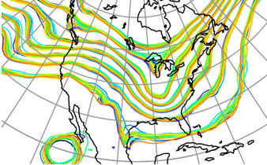
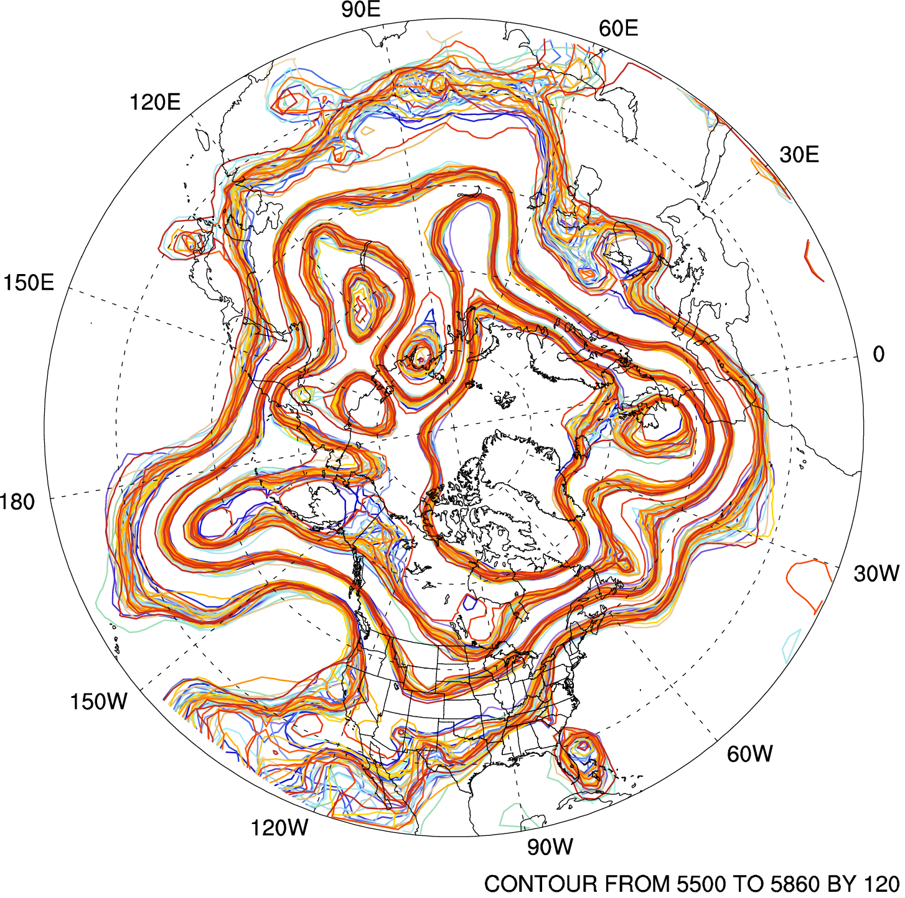
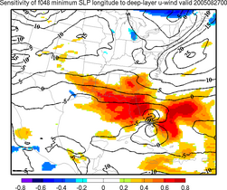
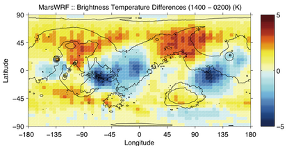
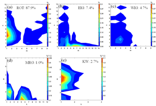
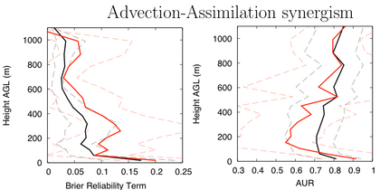

## **R**esearch

DART research is broadly categorized along three avenues: one is the
research toward data assimilation algorithmic and computational
efficiency, another is toward implementing and exploiting the
information in observations with one model or another, and another is to
learn more about the behavior of an individual model - perhaps by
looking at systematic features of the increments.

### If you would like to add your research highlight using DART, please let us know\!

  

-----

### Research Projects involving DART

  - [Model Performance](#modelperformance)
  - [WACCM](#waccm)
  - [MPAS ATM](#mpasatm)
  - [OpenGGCM](#space)
  - [Chemical Transport](#chemistry)
  - [\[novel\] observations like GPS RO](#gpsro)
  - [Sensitivity Analyses](#sensitivity)
  - [Carbon Monoxide](#cmaqco)
  - [Data Assimilation on Mars](#mars)
  - [Inertio-Gravity waves](#gravity)
  - [Boundary Layer projects](#pbl1d)
  - [Lorenz '96](#loworder)
  - \[\[Damped\] Adaptive\] Inflation Algorithms
  - Radar Reflectivity
  - Ocean Modeling
  - Tropical Cyclones

-----

### Model Performance

<table>
<colgroup>
<col style="width: 40%" />
<col style="width: 60%" />
</colgroup>
<tbody>
<tr class="odd">
<td></td>
<td>Ensemble Data assimilation can provide qualitative and quantitative uncertainty for quantities of interest to weather forecasters. <a href="Research/CAM_Raeder/index.html">[link to more information]</a> 
 
Kevin Raeder, raeder@ucar.edu</td>
</tr>
</tbody>
</table>

-----

### Model for Prediction Across Scales (MPAS)

<table>
<colgroup>
<col style="width: 40%" />
<col style="width: 60%" />
</colgroup>
<tbody>
<tr>
<td> 
 Spaghetti diagram of the ensemble analysis in terms of geopotential height at 500 mb valid at 12Z 5 Dec 2008.
</td>
<td>
Data assimilation for MPAS is available as an ensemble Kalman filter (EnKF)
implemented through (Data Assimilation Research Testbed)[http://dart.ucar.edu]

This work is done in a collaborative effort between the
[Mesoscale and Microscale Meteorology (MMM)](http://www.mmm.ucar.edu)
Division and the DART development team. DART support for both MPAS-Atmosphere
and MPAS-Ocean are available as part of the standard DART package.

In collaboration with NOAA's <a href="http://www.esrl.noaa.gov">Earth System Research Laboratory</a>,
related efforts are also underway to explore ensemble data assimilation for MPAS-Atmosphere with the
Gridpoint Statistical Interpolation (GSI) scheme that is operational at
<a href="http://www.ncep.noaa.gov">the National Centers for Environmental Prediction</a>.
</td>

</tr>
</table>

<table style="text-align:" border="0" cellpadding="2" cellspacing="2">
<colgroup>
<col style="width: 40%" />
<col style="width: 60%" />
</colgroup>
<tbody>
<tr>
<td>

Grid structure used in the MPAS/DART interface
</td>
<td style="vertical-align: top">The MPAS/DART interface is
built on MPAS's unstructured centroidal Voronoi mesh,
and does not regrid to latitude-longitude grids. In MPAS, the finite-volume
approach based on a C-grid staggering retains prognostic equations for mass
at the center of finite-volume cells and for the normal component of velocity
(<strong><i>u</i></strong>) at the faces (or edges in 2D) of the cells.
The normal component of velocity (<strong><i>u</i></strong>) at cell edges is then used to
reconstruct zonal and meridional winds at cell centers (<strong><i>V</i></strong>)
 using radial basis functions (RBFs).
To avoid the singularity issue on the poles, the cartesian coordinate is employed.

The forward operators on the unstructured grid mesh are constructed as follows.
The dual of the Voronoi mesh, or the triangular mesh (shown as dashed lines in the
figure), is used to search the closest cell center to an arbitrary (or observation)
point, then find three cell centers of the triangle enclosing the desired point.
Mass fields are then horizontally interpolated from the cell centers to the observation
location using a barycentric (e.g., area-weighted) interpolation.
</td>
</tr>
</table>

While the observed wind quantities are zonal and meridional winds, the normal
component of velocity (<i>u</i>) is the only prognostic wind variable in MPAS,
we thus implement a couple of different ways of assimilating wind observations.
The options determine which wind variables are used in the forward operator to
compute expected observation values; how the horizontal interpolation is computed
in that forward operator; and how the assimilation increments are applied to update
the wind quantities in the state vector of the analysis.

Preliminary results based on real data assimilation experiments indicate that
performance is better when the zonal and meridional winds are used as input to the
forward operator that uses Barycentric interpolation and the prognostic <i>u</i>
wind is incrementally updated. However, there remain scientific questions about
how best to handle the wind fields under different situations.  For the details
on the wind data strategy, refer to the
<a href="https://svn-dares-dart.cgd.ucar.edu/DART/releases/Manhattan/models/mpas_atm/model_mod.html" target="_blank">documentation</a> in DART.

For any questions or future collaboration, please contact either
Soyoung Ha (syha@ucar.edu) or the DART team (dart@ucar.edu)

-----

### Whole Atmosphere Community Climate Model (WACCM)

<table>
<colgroup>
<col style="width: 40%" />
<col style="width: 60%" />
</colgroup>
<tbody>
<tr class="odd">
<td>  </td>
<td><h5 id="excerpt">This is an excerpt from <a href="https://www2.cisl.ucar.edu/news/applying-the-science-and-technology-of-data-assimilation">Applying the science and technology of data assimilation</a> by <em>Brian Bevirt</em> 07/11/2017 as part of a <em>CISL News</em> series describing the many ways CISL improves modeling beyond providing supercomputing systems and facilities.</h5>
These plots show measured and modeled zonal mean temperatures between 70N and 90N during the January 2009 sudden warming of the stratosphere. The bottom plot shows the observed temperatures (in degrees Kelvin, see legend at right), the center plot shows how this state of the atmosphere was simulated by the specified-dynamics version of the WACCM model, and the top plot shows WACCM's improved result after using DART to assimilate middle atmosphere observations. 
 
The key point in this figure is that WACCM+DART captures both the stratosphere warming and mesosphere cooling that are seen in the observations. Also seen in the specified-dynamics version of WACCM, the elevated stratopause that forms at high altitudes around day 30 descends too fast compared to the observations. The elevated stratopause is maintained at a high altitude in the WACCM+DART simulation. This has implications for the descent of species from the mesosphere into the stratosphere. Accurate representation of the mesosphere dynamics is important for the ionosphere variability during sudden stratosphere warming events. (Figure courtesy of Nick Pedatella, HAO) 
 
<a href="Research/WACCM_Pedatella/index.html">[link to more information]</a> 
 
Nick Pedatella, nickp@ucar.edu Hanli Liu, liuh@ucar.edu Jing Liu, jingliu@ucar.edu</td>
</tr>
</tbody>
</table>

-----

### Open Geospace General Circulation Model (thermosphere/ionosphere/magnetosphere)

<table>
<colgroup>
<col style="width: 40%" />
<col style="width: 60%" />
</colgroup>
<tbody>
<tr class="odd">
<td></td>
<td>The primary goal of this project is to combine the OpenGGCM (Open Geospace General Circulation Model) with the NCAR Data Assimilation Research Testbed (DART), which implements an Ensemble Kalman Filter (EnKF) and will enable the sequential assimilation of ionosphere, thermosphere, and magetosphere data. 
 
We will also optimize model parameters by including them into the state vector. This will improve model accuracy even when no data are assimilated. <a href="Research/OpenGGCM_Raeder/index.html">[link to more information]</a> 
 
Jimmy Raeder, J.Raeder@unh.edu</td>
</tr>
</tbody>
</table>

-----

### Chemical Data Assimilation

<table>
<colgroup>
<col style="width: 40%" />
<col style="width: 60%" />
</colgroup>
<tbody>
<tr class="odd">
<td></td>
<td>We are currently applying an ensemble-based chemical data assimilation system, consisting of regional to global chemical transport models (CAM-Chem, WRF-Chem) in conjunction with DART, for a joint assimilation of meteorological observations and satellite-derived CO measurements from MOPITT and aerosol optical depth (AOD) measurements from MODIS. The chemical data assimilation system has been recently used for near-real time chemical forecasting (see <a href="https://espo.nasa.gov/arctas/" class="uri">https://espo.nasa.gov/arctas/</a>) to support flight planning during the NASA Arctic Research of the Composition of the Troposphere from Aircraft and Satellites (ARCTAS). <a href="Research/Chem_Arellano/index.html">[link to more information]</a> 
 
Ave Arellano, arellano@ucar.edu</td>
</tr>
</tbody>
</table>

-----

### GPS RO Observations and Tropical Cyclone Forecasting

<table>
<colgroup>
<col style="width: 40%" />
<col style="width: 60%" />
</colgroup>
<tbody>
<tr class="odd">
<td></td>
<td>Profiles of atmospheric quantities deduced from GPS Radio Occultation data are available in otherwise data-sparse regions and provide information used to forecast the behavior of tropical cyclones. The <a href="http://www.cosmic.ucar.edu/">COSMIC/FORMOSAT-3</a> mission has been providing about 2000 data profiles per day since September 2007. <a href="Research/GPS_Liu/index.html">[link to more information]</a> 
 
Hui Liu, hliu@ucar.edu</td>
</tr>
</tbody>
</table>

-----

### Sensitivity Analyses

<table>
<colgroup>
<col style="width: 40%" />
<col style="width: 60%" />
</colgroup>
<tbody>
<tr class="odd">
<td></td>
<td>Forecast sensitivity analysis provides an objective means of evaluating how initial condition errors affect a forecast and where to gather additional observations to reduce forecast errors. Most sensitivity studies use the adjoint of a linearized forecast model to determine the gradient of a forecast metric with respect to the initial conditions. Adjoints suffer from a number of difficulties including coding, linearity assumptions, and moist processes. Ensemble-based sensitivity analysis provides an attractive alternative to adjoint-based methods because it combines data assimilation and sensitivity analysis in a consistent manner. This image illustrates the effect of zonal winds aloft on the position of Hurricane Katrina. <a href="Research/Katrina_Torn/index.html">[link to more information]</a> 
 
<a href="http://www.atmos.albany.edu/index.php?d=faculty.torn">Ryan Torn</a>, torn@atmos.albany.edu</td>
</tr>
</tbody>
</table>

-----

### Assimilation of CO

<table>
<colgroup>
<col style="width: 40%" />
<col style="width: 60%" />
</colgroup>
<tbody>
<tr class="odd">
<td></td>
<td>This project describes an integrated approach to modeling atmospheric chemistry with trace gas data assimilation. Specifically, we ran CMAQ from within DART to assimilate both synthetic and real observations of CO for the period of June 2001. <a href="Research/CMAQ_Zubrow/index.html">[link to more information]</a> 
 
Alexis Zubrow, azubrow@unc.edu</td>
</tr>
</tbody>
</table>

-----

### Assimilation on MARS

<table>
<colgroup>
<col style="width: 40%" />
<col style="width: 60%" />
</colgroup>
<tbody>
<tr class="odd">
<td></td>
<td>The planetary atmospheres group at Caltech has produced a global and planetary version of NCAR's WRF (Weather Research and Forecasting) Model. We are using DART to attempt data assimilation within the Mars atmosphere using the Mars version of WRF, MarsWRF, as our GCM. <a href="Research/MARS_Lawson/index.html">[link to more information]</a> 
 
<a href="http://www.gps.caltech.edu/people/wglawson/profile">Greg Lawson</a>, wglawson@gps.caltech.edu</td>
</tr>
</tbody>
</table>

  

-----

### Inertio-Gravity waves

<table>
<colgroup>
<col style="width: 40%" />
<col style="width: 60%" />
</colgroup>
<tbody>
<tr class="odd">
<td></td>
<td>This project aims at quantifying the impact of various motion types in analysis and forecast fields by using normal modes. The DART/CAM is the main analysis system used in the project. The first question addressed is about how large part of the atmospheric energy is associated with the inertio-gravity motions, an important part of the global circulation primarily because of their role in the tropical system. <a href="Research/CAM_Zagar/index.html">[link to more information]</a> 
 
<a href="http://www.fmf.uni-lj.si/~zagarn">Nedjeljka Zagar</a>, nedjeljka.zagar@fmf.uni-lj.si</td>
</tr>
</tbody>
</table>

-----

### Planetary Boundary Layer

<table>
<colgroup>
<col style="width: 40%" />
<col style="width: 60%" />
</colgroup>
<tbody>
<tr class="odd">
<td></td>
<td>A long-term goal of this work is to find an efficient system for probabilistic planetary boundary layer (PBL) nowcasting that can be employed wherever surface observations are present. One approach showing promise is the use of a single column model (SCM) and ensemble filter data assimilation techniques. <a href="Research/PBL_JoshDorita/index.html">[link to more information]</a> 
 
Dorita Rostkier-Edelstein, rostkier@ucar.edu 
Josh Hacker, hacker@ucar.edu</td>
</tr>
</tbody>
</table>

  

-----

### The Lorenz '96 model

Lorenz, E. N., and K. A. Emanuel, 1998:  
Optimal sites for supplementary weather observations: Simulations with a small model.  
*J. Atmos. Sci.*, **55**, 399-414.
[10.1175/1520-0469(1998)055\<0399:OSFSWO\>2.0.CO;2](https://doi.org/10.1175/1520-0469(1998)055%3C0399:OSFSWO%3E2.0.CO;2)

<table>
<colgroup>
<col style="width: 33%" />
<col style="width: 33%" />
<col style="width: 33%" />
</colgroup>
<tbody>
<tr class="odd">
<td></td>
<td>The Lorenz '96 model is one of our favorite models. In our implementation, it is a 40-variable model that can be used to test inflation algorithms, the effects of localization schemes, the integrity of the DART installation itself, the state-space diagnostic routines; it is extensively used in the tutorial, <strong>and</strong> can even be run as a standalone executable to test the MPI support on a machine. <a href="Research/Lorenz96/index.html">[link to more information]</a> 
 

Jeff Anderson, jla@ucar.edu, and 
Tim Hoar, thoar@ucar.edu</td>
<td></td>
</tr>
</tbody>
</table>

-----
