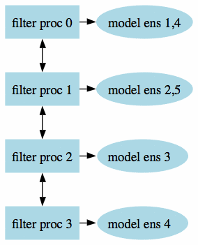
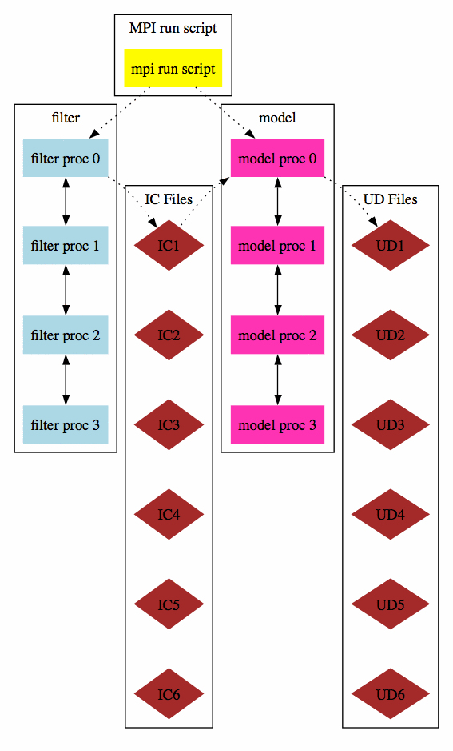

# DART parallelism

This document has two sections, the first is DART's use of MPI for the
core DART routines, and the second section
['Filter&nbsp;"async"&nbsp;Mode&nbsp;Diagrams'](#async0)
describes the options for advancing models that may or may not 
have their own parallel considerations.

## Introduction

The latest release of the DART system includes an MPI option. MPI stands
for 'Message Passing Interface', and is both a library and run-time
system that enables multiple copies of a single program to run in
parallel, exchange data, and combine to solve a problem more quickly.
The latest release of DART does **NOT** require MPI to run; the default
build scripts do not need nor use MPI in any way. However, for larger
models with large state vectors and large numbers of observations, the
data assimilation step will run much faster in parallel, which requires
MPI to be installed and used. However, if multiple ensembles of your
model fit comfortably (in time and memory space) on a single processor,
you need read no further about MPI.

MPI is an open-source standard; there are many implementations of it. If
you have a large single-vendor system it probably comes with an MPI
library by default. For a Linux cluster there are generally more
variations in what might be installed; most systems use a version of MPI
called MPICH. In smaller clusters or dual-processor workstations a
version of MPI called either LAM-MPI or OpenMPI might be installed, or
can be downloaded and installed by the end user. (Note that OpenMP is a
different parallel system; OpenMPI is a recent effort with a confusingly
similar name.)

An "MPI program" makes calls to an MPI library, and needs to be compiled
with MPI include files and libraries. Generally the MPI installation
includes a shell script called *mpif90* which adds the flags and
libraries appropriate for each type of fortran compiler. So compiling an
MPI program usually means simply changing the fortran compiler name to
the MPI script name.

These MPI scripts are built during the MPI install process and are
specific to a particular compiler; if your system has multiple fortran
compilers installed then either there will be multiple MPI scripts
built, one for each compiler type, or there will be an environment
variable or flag to the MPI script to select which compiler to invoke.
See your system documentation or find an example of a successful MPI
program compile command and copy it.

## DART use of MPI

To run in parallel, only the DART *filter* program (and possibly the
companion *wakeup_filter* program) need be compiled with the MPI
scripts. ~~All other DART executables should be compiled with a standard
F90 compiler and are not MPI enabled.~~ (And note again that *filter* can
still be built as a single executable like previous releases of DART;
using MPI and running in parallel is simply an additional option.) To
build a parallel version of the *filter* program, the *mkmf_filter*
command needs to be called with the '-mpi' option to generate a `Makefile`
which compiles with the MPI scripts instead of the basic Fortran compiler.

See the *quickbuild.csh* script in each `$DART/models/*/work` directory
for the commands that need to be edited to enable the MPI utilities. You
will also need to edit the `$DART/build_templates/mkmf.template` file to call the
proper version of the MPI compile script if it does not have the default
name, is not in a standard location on the system, or needs additional
options set to select between multiple Fortran compilers.

MPI programs generally need to be started with a shell script called
*mpirun* or *mpiexec*, but they also interact with any batch control
system that might be installed on the cluster or parallel system.
Parallel systems with multiple users generally run some sort of batch
system (e.g. LSF, PBS, SLURM, POE, LoadLeveler, etc). You submit a job request
to this system and it schedules which nodes are assigned to which jobs.
Unfortunately the details of this vary widely from system to system;
consult your local web pages or knowledgeable system admin for help
here. Generally the run scripts supplied with DART have generic sections
to deal with LSF, PBS, no batch system at all, and sequential execution,
but the details (e.g. the specific queue names, accounting charge codes)
will almost certainly have to be adjusted.

The data assimilation process involves running multiple copies
(ensembles) of a user model, with an assimilation computation
interspersed between calls to the model. There are many possible
execution combinations, including:

  - Compiling the assimilation program *filter* with the model,
    resulting in a single executable. This can be either a sequential or
    parallel program.
  - Compiling *filter* separately from the model, and having 2 separate
    executables. Either or both can be sequential or parallel.

The choice of how to combine the *filter* program and the model has 2
parts: building the executables and then running them. At build time,
the choice of using MPI or not must be made. At execution time, the
setting of the `async` namelist value in the `filter_nml` section
controls how *filter* interacts with the model.

Choices include:

  - **async = 0**  
    The model and *filter* programs are compiled into a single executable,
    and when the model needs to advance, *filter* calls a
    subroutine. See [the async 0 diagram](#async0) which
    illustrates this option.
  - **async = 2**  
    The model is compiled into a sequential (single task) program. If
    *filter* is running in parallel, each filter task will execute the
    model independently to advance the group of ensembles. See
    [the async 2 diagram](#async2) which illustrates this option.
  - **async = 4**  
    The model is compiled into an MPI program (parallel) and only
    filter task 0 tells the startup script when it is time to advance
    the model. Each ensemble is advanced one by one, with the model
    using all the processors to run in parallel. See
    [the async 4 diagram](#async4) which illustrates this option.
  - **async ignored** (sometimes referred to as 'async 5', but not an actual namelist setting)    
    This is the way most large models run now. There is a separate
    script, outside of *filter*, which runs the N copies of the model to
    do the advance. Then *filter* is run, as an MPI program, and it only
    assimilates for a single time and then exits. The external script
    manages the file motion between steps, and calls both the models and
    *filter* in turn.

This release of DART has the restriction that if the model and the
*filter* program are both compiled with MPI and are run in 'async=4'
mode, that they both run on the same number of processors; e.g. if
*filter* is run on 16 processors, the model must be started on 16
processors as well. Alternatively, if the user model is compiled as a
single executable (async=2), *filter* can run in parallel on any number
of processors and each model advance can be executed independently
without the model having to know about MPI or parallelism.

Compiling and running an MPI application can be substantially more
complicated than running a single executable. There are a suite of small
test programs to help diagnose any problems encountered in trying to run
the new version of DART. Look in
[developer_tests/mpi_utilities/tests/README](../../developer_tests/mpi_utilities/tests/README)
for instructions and a set of tests to narrow down any difficulties.

### Performance issues and timing results

Getting good performance from a parallel program is frequently
difficult. Here are a few of reasons why:

  - Amdahl's law
    You can look up the actual formula for this "law" in the Wikipedia,
    but the gist is that the amount of serial code in your program
    limits how much faster your program runs on a parallel machine, and
    at some point (often much sooner than you'd expect) you stop getting
    any speedup when adding more processors.
  - Surface area to volume ratio
    Many scientific problems involve breaking up a large grid or array
    of data and distributing the smaller chunks across the multiple
    processors. Each processor computes values for the data on the
    interior of the chunk they are given, but frequently the data along
    the edges of each chunk must be communicated to the processors which
    hold the neighboring chunks of the grid. As you increase the number
    of processors (and keep the problem size the same) the chunk size
    becomes smaller. As this happens, the 'surface area' around the
    edges decreases slower than the 'volume' inside that one processor
    can compute independently of other processors. At some point the
    communication overhead of exchanging edge data limits your speedup.
  - Hardware architecture system balance
    Raw CPU speeds have increased faster than memory access times, which
    have increased faster than access to secondary storage (e.g. I/O to
    disk). Computations which need to read input data and write result
    files typically create I/O bottlenecks. There are machines with
    parallel filesystems, but many programs are written to have a single
    processor read in the data and broadcast it to all the other
    processors, and collect the data on a single node before writing. As
    the number of processors increases the amount of time spent waiting
    for I/O and communication to and from the I/O node increases. There
    are also capacity issues; for example the amount of memory available
    on the I/O node to hold the entire dataset can be insufficient.
  - NUMA memory
    Many machines today have multiple levels of memory: on-chip private
    cache, on-chip shared cache, local shared memory, and remote shared
    memory. The approach is referred as Non-Uniform Memory Access (NUMA)
    because each level of memory has different access times. While in
    general having faster memory improves performance, it also makes the
    performance very difficult to predict since it depends not just on
    the algorithms in the code, but is very strongly a function of
    working-set size and memory access patterns. Beyond shared memory
    there is distributed memory, meaning multiple CPUs are closely
    connected but cannot directly address the other memory. The
    communication time between nodes then depends on a hardware switch
    or network card, which is much slower than local access to memory.
    The performance results can be heavily influenced in this case by
    problem size and amount of communication between processes.

Parallel performance can be measured and expressed in several different
ways. A few of the relevant definitions are:

  - Speedup
    Generally defined as the wall-clock time for a single processor
    divided by the wall-clock time for N processors.
  - Efficiency
    The speedup number divided by N, which for perfect scalability will
    remain at 1.0 as N increases.
  - Strong scaling
    The problem size is held constant and the number of processors is
    increased.
  - Weak scaling
    The problem size grows as the number of processors increases so the
    amount of work per processor is held constant.

We measured the strong scaling efficiency of the DART 'filter' program
on a variety of platforms and problem sizes. The scaling looks very good
up to the numbers of processors available to us to test on. It is
assumed that for MPP (Massively-Parallel Processing) machines with
10,000s of processors that some algorithmic changes will be required.
These are described in **Anderson & Collins**
["Scalable Implementations of Ensemble Filter Algorithms for Data Assimilation"](https://doi.org/10.1175/JTECH2049.1) 2007.

### User considerations for their own configurations

Many parallel machines today are a hybrid of shared and distributed
memory processors; meaning that some small number (e.g. 2-32) of CPUs
share some amount of physical memory and can transfer data quickly
between them, while communicating data to other CPUs involves slower
communication across either some kind of hardware switch or fabric, or a
network communication card like high speed ethernet.

Running as many tasks per node as CPUs per shared-memory node is in
general good, unless the total amount of virtual memory used by the
program exceeds the physical memory. Factors to consider here include
whether each task is limited by the operating system to 1/Nth of the
physical memory, or whether one task is free to consume more than its
share. If the node starts paging memory to disk, performance takes a
huge nosedive.

Some models have large memory footprints, and it may be necessary to run
in MPI mode not necessarily because the computation is faster in
parallel, but because the dataset size is larger than the physical
memory on a node and must be divided and spread across multiple nodes to
avoid paging to disk.

  

---

## Filter async mode diagrams

### Options for parallelism both in DART and in the model advances:

### Simplest case, async=0:  
  
This is a single MPI executable, with each call to the model being
simply a subroutine call from each MPI task.  
  
  

---
  
### Parallel advance, async=2:  
  
The *filter* executable is one MPI program, and the model is a single,
sequential executable. Each MPI task uses the unix "system()" call to
invoke a shell script (*advance_model.csh*) which runs the models as
independent programs.  
  
Other views of how the async=2 option is structured; these may be more
or less helpful.  

#### Parallel advance, async=2:  
  
  
#### Parallel advance, async=2, second version:  
  
  
#### Parallel model advance, async=2,

showing how data is communicated
between filter and the model thru intermediate files.
IC are 'initial condition' files, UD are 'updated' files.  
  
    
  

---

### Parallel model advance, async=4:  
  
The *filter* executable is one MPI program, and the *model* is also an MPI
program. The filter executable communicates with the *runme_filter* shell
script, which sequentially invokes *mpirun* to advance each of the model
runs, one per ensemble member, still using *advance_model.csh*.  
  
   
Parallel model advance, async=4, showing how data is communicated
between *filter* and the model thru intermediate files.
IC are 'initial condition' files, UD are 'updated' files.  
  

---
