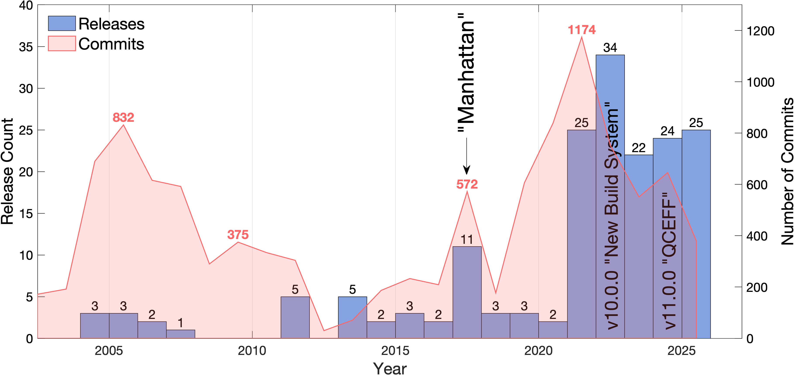
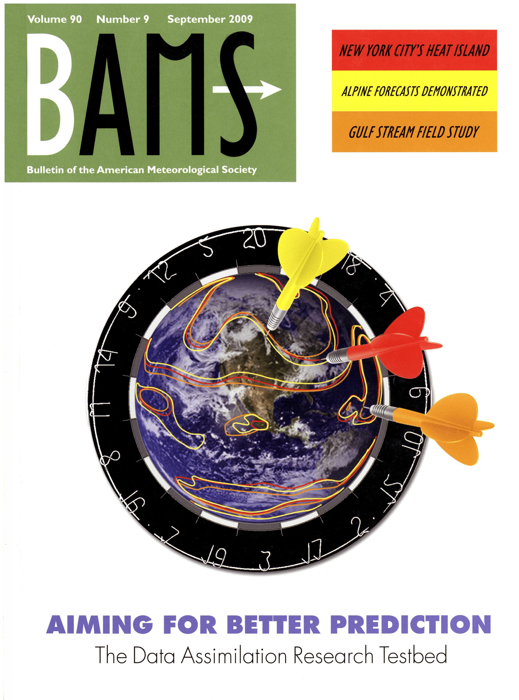

A brief history of DART
=======================

The DART project was initiated in August 2001, and in 2003, the Data
Assimilation Research Section (DAReS) was officially formed at NSF NCAR. In 2004,
the first officially supported version of DART was released. Consistent version
control history is available back to 2005, making DART an extremely long-lived
and well-supported software project. Since 2004, there have been more than 140
releases. The first release, *Easter*, began the trend of naming the major
releases after islands in alphabetical order from Easter to Manhattan.

From Manhattan onwards, DART releases follow the rules of semantic versioning.
The full list of releases including release notes can be found on GitHub at
`NCAR/DART/releases <https://github.com/NCAR/DART/releases>`__.

.. list-table:: DART Major Releases
    :widths: 15 15 45
    :header-rows: 1

    * - Release
      - Date
      - Brief description
    * - Easter
      - 08 Mar 2004
      - Initial release
    * - Fiji
      - 29 Apr 2004
      - Enhanced portability; support for CAM and WRF
    * - Guam
      - 12 Aug 2004
      - New observation modules
    * - Pre-Hawaii
      - 20 Dec 2004
      - New filtering algorithms
    * - Hawaii
      - 28 Feb 2005
      - New filtering algorithms
    * - DA Workshop 2005
      - 13 Jun 2005
      - Tutorial, observation preprocessing
    * - Pre-Iceland
      - 20 Oct 2005
      - Huge expansion of real observation capability
    * - Iceland
      - 23 Nov 2005
      - Huge expansion of real observation capability
    * - Post-Iceland
      - 20 Jun 2006
      - Observation-space adaptive inflation
    * - Pre-J
      - 02 Oct 2006
      - Updated scalable filter algorithm
    * - Jamaica
      - 12 Apr 2007
      - Vertical localization, extensive MPI testing
    * - Kodiak
      - 30 Jun 2011
      - New obs types, new diagnostics, new utilities
    * - Lanai
      - 13 Dec 2013
      - Support for many new models, chemistry/aerosol types, new diagnostics, new utilities
    * - Manhattan v9.0
      - 15 May 2017
      - Native netCDF support, better scaling/performance
    * - v10.0
      - 24 May 2023
      - New build tools
    * - v11.0
      - 11 Jan 2024
      - Quantile-Conserving Ensemble Filtering Framework (QCEFF)

In September 2009, DART was featured on the cover of the Bulletin of the
American Meteorological Society (BAMS):

|BAMS-cover|

To access the issue, see the 
`September 2009 issue here <https://journals.ametsoc.org/view/journals/bams/90/9/1520-0477-90_9_fmi.xml>`__. To read the DART article
directly see the `article here <https://journals.ametsoc.org/doi/full/10.1175/2009BAMS2618.1>`__.

On the `Publications <https://dart.ucar.edu/publications/>`__ page there are over 400
publications that use DART, although there are many additional publications
using DART not listed. The seminal BAMS paper has over 700 citations according
to `Google Scholar <https://scholar.google.com/scholar?cites=2520828493949875599&as_sdt=40000005&sciodt=0,22&hl=en>`__. The core algorithms used in
DART have also been cited many more times. For example, the core EAKF algorithm
(`Anderson
2001 <https://journals.ametsoc.org/doi/full/10.1175/1520-0493%282001%29129%3C2884%3AAEAKFF%3E2.0.CO%3B2>`__)
used in DART has over 2000 citations according to `Google Scholar <https://scholar.google.com/scholar?cites=16669101874434899646&as_sdt=40000005&sciodt=0,22&hl=en>`__.

Since the Manhattan release (v9.0), DART has averaged ~700 commits and ~16 releases per year. 
Most of the code updates are backwards-compatible, ensuring that user codes continue to run 
unchanged while still benefiting from new capabilities. The bar chart below shows the number of 
releases per 12-months interval, while the shaded area represents the commit activity over the 
same period. Major releases such as Manhattan, v10.0, v11.0 are also annotated. This image
highlights the relationship between code-release milestones and overall development activity.

