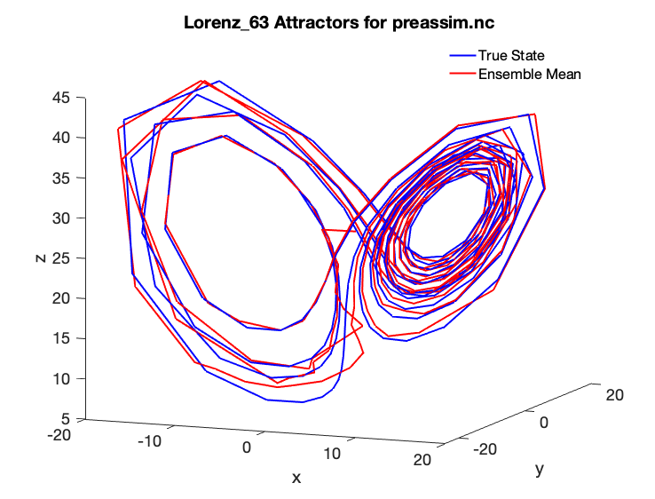
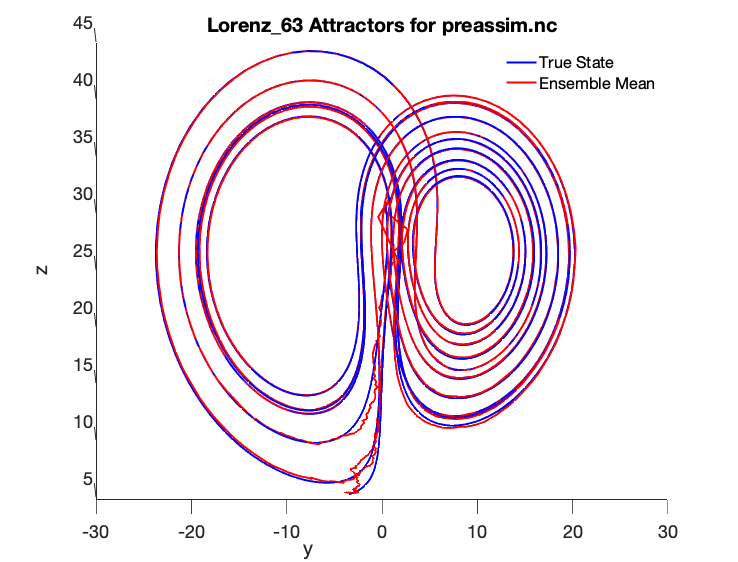

Data assimilation in DART using the Lorenz 63 model
===================================================

In this section we open the "black box" of the Lorenz model that was previously
used in :doc:`compiling-dart`. This section assumes you have successfully run
the Lorenz 63 model with the example observation files that were distributed
with the DART repository. In this section you will learn in more detail how
DART interacts with the Lorenz 63 model to perform data assimilation.

The input.nml namelist
----------------------

The ``DART/models/lorenz_63/work/input.nml`` file is the Lorenz model
*namelist*, which is a standard Fortran method for passing parameters from a
text file into a program without needing to recompile. There are many sections
within this file that drive the behavior of DART while using the Lorenz 63 model
for assimilation. Within ``input.nml``, there is a section called *model_nml*,
which contains the model-specific parameters:

::

   &model_nml
      sigma  = 10.0,
      r      = 28.0,
      b      = 2.6666666666667,
      deltat = 0.01,
      time_step_days = 0,
      time_step_seconds = 3600,
      solver = 'RK2'
      /

Here, you can see the values for the parameters ``sigma``, ``r``, and ``b`` that
were discussed in the previous section. These are the original values Lorenz
used in the 1963 paper to create the classic butterfly attractor.

The Lorenz 63 model code
------------------------

The Lorenz 63 model code, which is under
``DART/models/lorenz_63/model_mod.f90``, contains the lines:

::

   subroutine comp_dt(x, dt)

   real(r8), intent( in) ::  x(:)
   real(r8), intent(out) :: dt(:)

   ! compute the lorenz model dt from standard equations

   dt(1) = sigma * (x(2) - x(1))
   dt(2) = -x(1)*x(3) + r*x(1) - x(2)
   dt(3) = x(1)*x(2) - b*x(3)

   end subroutine comp_dt

which directly translates the above ODE into Fortran.

Note that the routine ``comp_dt`` does not explicitly depend on the time
variable, only on the state variables (i.e. the Lorenz 63 model is time
invariant).

.. note::
    
    By default, the ``model_mod.f90`` follows the Lorenz 63 paper to use the
    Runge-Kutta 2 scheme (otherwise known as RK2 or the midpoint scheme) to
    advance the model.

Since the Lorenz 63 model is time invariant, the RK2 code to advance the ODE in
time can be written as follows, again following the Lorenz 63 paper, for a
``fract`` fraction of a time-step (typically equal to 1):

::

   !------------------------------------------------------------------
   !> does single time step advance for lorenz convective 3 variable model
   !> using two step rk time step

   subroutine adv_single(x, fract)

   real(r8), intent(inout) :: x(:)
   real(r8), intent(in)    :: fract

   real(r8) :: x1(3), x2(3), dx(3)

   call comp_dt(x, dx)            !  compute the first intermediate step
   x1 = x + fract * deltat * dx

   call comp_dt(x1, dx)           !  compute the second intermediate step
   x2 = x1 + fract * deltat * dx

   !  new value for x is average of original value and second intermediate

   x = (x + x2) / 2.0_r8

   end subroutine adv_single

Together, these two code blocks describe how the Lorenz 63 model is advanced in
time. You will see how DART uses this functionality shortly.

The model time step and length of the data assimilation
-------------------------------------------------------

In the original Lorenz 63 paper, the model is run for 50 "days" using a
non-dimensional time-step of 0.01, which is reproduced in the namelist above.
This time-step was assumed equal to 3600 seconds, or one hour, in dimensional
time. This is also set in the namelist above. The Lorenz 63 model observation
file included with the DART repository uses observations of all three state
variables every six hours (so every six model steps) to conduct the
assimilation.

If you were previously able to run the Matlab diagnostic scripts, you may have
noticed that the butterfly attractor for the included example does not look as
smooth as might be desired:

|lorenz_63_attractor_lr|

This is because the model output was only saved once every six "hours" at the
observation times. As an exercise, let's make a nicer-looking plot using the
computational power available today, which even on the most humble of computers
is many times greater than what Lorenz had in 1963. Let's change Lorenz's
classic experiment to the following:

1. Make the non-dimensional timestep 0.001, a factor of 10 smaller, which will
   correspond to a dimensional timestep of 360 seconds (6 minutes). This smaller
   time-step will lead to a smoother model trajectory.
2. Keep the original ratio of time steps to observations included in the DART
   repository of assimilating observations every six time steps, meaning we now
   need observations every 36 minutes.

Therefore, in order to conduct our new experiment, we will need to regenerate
the DART observation sequence files.

To change the time-step, change the ``input.nml`` file in
``DART/models/lorenz_63/work`` to the following:

::

   &model_nml
      sigma  = 10.0,
      r      = 28.0,
      b      = 2.6666666666667,
      deltat = 0.001,
      time_step_days = 0,
      time_step_seconds = 360
      /

.. note::
    
    The changes are to ``deltat`` and ``time_step_seconds``. Additionally:
    you do not need to recompile the DART code as the purpose of namelist files
    is to pass run-time parameters to a Fortran program without recompilation.

Updating the observation sequence
---------------------------------

Let's now regenerate the DART observation files with the updated timestep and
observation ratio. In a typical large-scale application, the user will provide
observations to DART in a standardized format called the *Observation Sequence*
file. Since there are no real observations of the Lorenz 63 system, we must
create our own synthetic observations - which may be done using
*create_obs_sequence*, *create_fixed_network_seq*, and *perfect_model_obs*
programs; each of which we will explain below. These helpful interactive
programs are included with DART to generate these observation sequence files for
typical research or education-oriented experiments. In such setups, observations
(with noise added) will be generated at regular intervals from a model "truth".
This "truth" will only be available to the experiment through the noisy
observations but can later be used for comparison purposes. The number of steps
necessary for the ensemble members to reach the true model state's "attractor"
can be investigated and, for example, compared between different DA methods.
This is an example of an "OSSE" — see :doc:`high-level-da-workflows` for more
information.

The three programs used in this example to create an observation sequence again
are *create_obs_sequence*, *create_fixed_network_seq*, and *perfect_model_obs*.
*create_obs_sequence* creates a template for the observations,
*create_fixed_network_seq* repeats that template at multiple times, and finally
*perfect_model_obs* harvests the observation values. These programs have many
additional capabilities; if interested, see the corresponding program's
documentation.

Let's now run the DART program *create_obs_sequence* to create the observation
template that we will later replicate in time:

   # Make sure you are in the DART/models/lorenz_63/work directory
   ./create_obs_sequence

The program *create_obs_sequence* will ask for the number of observations. Since
we plan to have 3 observations at each time step (one for each of the state
variables), input **3**:

::

   set_nml_output Echo NML values to log file only

   --------------------------------------------------------
   -------------- ASSIMILATE_THESE_OBS_TYPES --------------
     RAW_STATE_VARIABLE
   --------------------------------------------------------
   -------------- EVALUATE_THESE_OBS_TYPES   --------------
     none
   --------------------------------------------------------
   ---------- USE_PRECOMPUTED_FO_OBS_TYPES   --------------
     none
   --------------------------------------------------------

   Input upper bound on number of observations in sequence
   3

For this experimental setup, we will not have any additional copies of the data,
nor will we have any quality control fields. So use **0** for both.

::

   Input number of copies of data (0 for just a definition)
   0
   Input number of quality control values per field (0 or greater)
   0

We now will setup each of the three observations. The program asks to enter -1
if there are no additional observations, so input anything else instead (**1**
below). Then enter **-1**, **-2**, and **-3** in sequence for the state variable
index (the observation here is just the values of the state variable). Use **0
0** for the time (we will setup a regularly repeating observation after we
finish this), and **8** for the error variance for each observation.

Finally, after inputting press enter to use the default output file
``set_def.out``.

Input your values as follows:

::

   input a -1 if there are no more obs
   1
       Input -1 * state variable index for identity observations
       OR input the name of the observation kind from table below:
       OR input the integer index, BUT see documentation...
                  1 RAW_STATE_VARIABLE
   -1
   input time in days and seconds (as integers)
   0 0
   Input the error variance for this observation definition
   8
   input a -1 if there are no more obs
   1
       Input -1 * state variable index for identity observations
       OR input the name of the observation kind from table below:
       OR input the integer index, BUT see documentation...
                  1 RAW_STATE_VARIABLE
   -2
   input time in days and seconds (as integers)
   0 0
   Input the error variance for this observation definition
   8
   input a -1 if there are no more obs
   1
       Input -1 * state variable index for identity observations
       OR input the name of the observation kind from table below:
       OR input the integer index, BUT see documentation...
                  1 RAW_STATE_VARIABLE
   -3
   input time in days and seconds (as integers)
   0 0
   Input the error variance for this observation definition
   8
   Input filename for sequence (<return> for set_def.out )

   write_obs_seq  opening formatted observation sequence file "set_def.out"
   write_obs_seq  closed observation sequence file "set_def.out"
   create_obs_sequence Finished successfully.

Creating a regular sequence of observations
-------------------------------------------

We will now utilize another DART program that takes this ``set_def.out`` file as
input. The interactive program ``create_fixed_network_seq`` is a helper tool
that can be used to generate a DART observation sequence file made of a set of
regularly repeating observations.

   # Make sure you are in the DART/models/lorenz_63/work directory
   ./create_fixed_network_seq

We want to use the default ``set_def.out`` file, so press return. We also want a
regularly repeating time sequence, so input **1**.

::

   set_nml_output Echo NML values to log file only

   --------------------------------------------------------
   -------------- ASSIMILATE_THESE_OBS_TYPES --------------
     RAW_STATE_VARIABLE
   --------------------------------------------------------
   -------------- EVALUATE_THESE_OBS_TYPES   --------------
     none
   --------------------------------------------------------
   ---------- USE_PRECOMPUTED_FO_OBS_TYPES   --------------
     none
   --------------------------------------------------------

   Input filename for network definition sequence (<return> for set_def.out  )

   To input a regularly repeating time sequence enter 1
   To enter an irregular list of times enter 2
   1

We now will input the number of observations in the file. The purpose of this
exercise is to refine the time step used by Lorenz in 1963 by a factor of 10.
Since we want to keep the ratio of six model steps per observation and run for
50 days, we will need 2000 model observations (360 seconds × 6 × 2000 = 50
days).

As we specified in ``set_def.out``, there are 3 observations per time step,
so a total of 6000 observations will be generated.

.. note::
    
   The Lorenz 63 model dimensional time-step is related to the observational
   time *only* through this mechanism. In other words, ``deltat`` in the
   namelist could relate to virtually any dimensional time step
   ``time_step_seconds`` if the observation times were not considered. However,
   DART will automatically advance the model state to the observation times in
   order to conduct the data assimilation at the appropriate time, then repeat
   this process until no additional observations are available, thus indirectly
   linking ``deltat`` to ``time_step_seconds``.

Enter **2000** for the number of observation times. The initial time will be **0
0**, and the input period will be **0** days and **2160** seconds (36 minutes).

::

   Input number of observation times in sequence
   2000
   Input initial time in sequence
   input time in days and seconds (as integers)
   0 0
   Input period of obs in sequence in days and seconds
   0 2160

The numbers 1 to 2000 will then be output by ``create_fixed_network_seq``. Press
return to accept the default output name of ``obs_seq.in``. The file suffix is
``.in`` as this will be the input to the next program, *perfect_model_obs*.

::

      1
      2
   ...
   1998
   1999
   2000
   What is output file name for sequence (<return> for obs_seq.in)

     write_obs_seq  opening formatted observation sequence file "obs_seq.in"
     write_obs_seq  closed observation sequence file "obs_seq.in"
     create_fixed_network_seq Finished successfully.

Running perfect_model_obs
-------------------------

We are now ready to run *perfect_model_obs*, which will read in ``obs_seq.in``
and generate the observations as well as create the "perfect" model trajectory.
"Perfect" here is a synonym for the known "true" state which is used to generate
the observations. Once noise is added (to represent observational uncertainty),
the output is written to ``obs_seq.out``.

   | # Make sure you are in the DART/models/lorenz_63/work directory
   | ./perfect_model_obs

The output should look like the following:

::

   set_nml_output Echo NML values to log file only
    initialize_mpi_utilities: Running single process

   --------------------------------------------------------
   -------------- ASSIMILATE_THESE_OBS_TYPES --------------
      RAW_STATE_VARIABLE
   --------------------------------------------------------
   -------------- EVALUATE_THESE_OBS_TYPES   --------------
      none
   --------------------------------------------------------
   ---------- USE_PRECOMPUTED_FO_OBS_TYPES   --------------
      none
   --------------------------------------------------------

    quality_control_mod: Will reject obs with Data QC larger than    3
    quality_control_mod: No observation outlier threshold rejection will be done
    perfect_main  Model size =                     3
    perfect_read_restart: reading input state from file
    perfect_main  total number of obs in sequence is         6000
    perfect_main  number of qc values is            1

    perfect_model_obs: Main evaluation loop, starting iteration    0
    move_ahead Next assimilation window starts    at:  day=       0 sec=     0
    move_ahead Next assimilation window ends      at:  day=       0 sec=   180
    perfect_model_obs: Model does not need to run; data already at required time
    perfect_model_obs: Ready to evaluate up to       3 observations

    perfect_model_obs: Main evaluation loop, starting iteration    1
    move_ahead Next assimilation window starts    at:  day=       0 sec=  1981
    move_ahead Next assimilation window ends      at:  day=       0 sec=  2340
    perfect_model_obs: Ready to run model to advance data ahead in time
    perfect_model_obs: Ready to evaluate up to       3 observations

   ...

   perfect_model_obs: Main evaluation loop, starting iteration 1999
   move_ahead Next assimilation window starts    at:  day=      49 sec= 84061
   move_ahead Next assimilation window ends      at:  day=      49 sec= 84420
   perfect_model_obs: Ready to run model to advance data ahead in time
   perfect_model_obs: Ready to evaluate up to       3 observations

   perfect_model_obs: Main evaluation loop, starting iteration 2000
   perfect_model_obs: No more obs to evaluate, exiting main loop
   perfect_model_obs: End of main evaluation loop, starting cleanup
   write_obs_seq  opening formatted observation sequence file "obs_seq.out"
   write_obs_seq  closed observation sequence file "obs_seq.out"

You can now see the files ``true_state.nc``, a netCDF file which has the perfect
model state at all 2000 observation times; ``obs_seq.out``, an ASCII file which
contains the 6000 observations (2000 times with 3 observations each) of the true
model state with noise added in; and ``perfect_output.nc``, a netCDF file with
the final true state that could be used to "restart" the experiment from the
final time (49.75 days in this case).

We can now see the relationship between ``obs_seq.in`` and ``obs_seq.out``:
``obs_seq.in`` contains a "template" of the desired observation locations and
types, while ``obs_seq.out`` is a list of the actual observation values, in this
case generated by the *perfect_model_obs* program.

.. important::

   ``create_obs_seq`` is used for this low-order model because there are no
   real observations for Lorenz 63. For systems that have real observations,
   DART provides a variety of *observation converters* available to convert
   from native observation formats to the DART format. See
   :doc:`available-observation-converters` for a list.

Running the filter
------------------

Now that ``obs_seq.out`` and ``true_state.nc`` have been prepared, DART can
perform the actual data assimilation. This will generate an ensemble of model
states, use the ensemble to estimate the prior distribution, compare to the
"expected" observation of each member, and update the model state according to
Bayes' rule.

   # Make sure you are in the DART/models/lorenz_63/work directory ./filter

::

   set_nml_output Echo NML values to log file only
   initialize_mpi_utilities: Running single process

   --------------------------------------------------------
   -------------- ASSIMILATE_THESE_OBS_TYPES --------------
     RAW_STATE_VARIABLE
   --------------------------------------------------------
   -------------- EVALUATE_THESE_OBS_TYPES   --------------
     none
   --------------------------------------------------------
   ---------- USE_PRECOMPUTED_FO_OBS_TYPES   --------------
     none
   --------------------------------------------------------

   quality_control_mod: Will reject obs with Data QC larger than    3
   quality_control_mod: No observation outlier threshold rejection will be done
   assim_tools_init: Selected filter type is Ensemble Adjustment Kalman Filter (EAKF)
   assim_tools_init: The cutoff namelist value is     1000000.000000
   assim_tools_init: ... cutoff is the localization half-width parameter,
   assim_tools_init: ... so the effective localization radius is     2000000.000000
   filter_main: running with an ensemble size of    20
   parse_stages_to_write:  filter will write stage : preassim
   parse_stages_to_write:  filter will write stage : analysis
   parse_stages_to_write:  filter will write stage : output
   set_member_file_metadata no file list given for stage "preassim" so using default names
   set_member_file_metadata no file list given for stage "analysis" so using default names
   Prior inflation: None
   Posterior inflation: None
   filter_main: Reading in initial condition/restart data for all ensemble members from file(s)

   filter: Main assimilation loop, starting iteration    0
   move_ahead Next assimilation window starts    at:  day=       0 sec=     0
   move_ahead Next assimilation window ends      at:  day=       0 sec=   180
   filter: Model does not need to run; data already at required time
   filter: Ready to assimilate up to       3 observations
   comp_cov_factor: Standard Gaspari Cohn localization selected
   filter_assim: Processed       3 total observations

   filter: Main assimilation loop, starting iteration    1
   move_ahead Next assimilation window starts    at:  day=       0 sec= 21421
   move_ahead Next assimilation window ends      at:  day=       0 sec= 21780
   filter: Ready to run model to advance data ahead in time
   filter: Ready to assimilate up to       3 observations
   filter_assim: Processed       3 total observations
   ...

   filter: Main assimilation loop, starting iteration  199
   move_ahead Next assimilation window starts    at:  day=      49 sec= 64621
   move_ahead Next assimilation window ends      at:  day=      49 sec= 64980
   filter: Ready to run model to advance data ahead in time
   filter: Ready to assimilate up to       3 observations
   filter_assim: Processed       3 total observations

   filter: Main assimilation loop, starting iteration  200
   filter: No more obs to assimilate, exiting main loop
   filter: End of main filter assimilation loop, starting cleanup
   write_obs_seq  opening formatted observation sequence file "obs_seq.final"
   write_obs_seq  closed observation sequence file "obs_seq.final"

Based on the default Lorenz 63 ``input.nml`` namelist for *filter* included in
the DART repository, the assimilation will have three stages:

1. The *preassim* stage, where the ensemble is updated by advancing the model.
   The file\ ``preassim.nc``, which contains the pre-assimilation model
   trajectories for all the ensemble members, will be written.
2. The *analysis* stage, where the data assimilation is conducted. The
   post-assimilation model trajectories for all the ensemble members will be
   written to ``analysis.nc``
3. The *output* stage, which writes the file ``obs_seq.final`` containing the
   actual observations as assimilated plus the ensemble forward-operator
   expected values and any quality-control values. This stage also writes the
   ``filter_output.nc`` file containing the ensemble state from the final cycle,
   which could be used to restart the experiment.

DART has now successfully assimilated our updated observations with a 6 minute
model time step and assimilation every 36 minutes. *:tada:*

Verifying the nicer-looking results
-----------------------------------

You can now run the verification scripts (as in the section
:doc:`verifying-installation`) in Matlab with the following commands:

   | >> addpath ../../../diagnostics/matlab
   | >> plot_ens_time_series

Some additional commands to view the attractor from the ZY plane were used:

   | >> set(findall(gca, ‘Type', ‘Line'),‘LineWidth',2);
   | >> set(gca,‘FontSize',18)
   | >> xlabel(‘x')
   | >> ylabel(‘y')
   | >> zlabel(‘z')
   | >> view([90 0])

We can now see the following smooth Lorenz 63 true state and ensemble mean
comparison with a 6 minute model time step and assimilation every 36 minutes:

|lorenz_63_attractor|

As you can see, the ensemble mean in red matches the true state almost exactly,
although it took a number of assimilation cycles before the blue ensemble mean
was able to reach the red true state "attractor."

You should now be able to tinker with the Lorenz 63 model and other models in
DART. For more detailed information on the theory of ensemble data
assimilation, see the :doc:`/theory/readme`. For more concrete information
regarding DART's algorithms and capabilities, see the next section
:doc:`benefits-of-using-dart`. To add your own model to DART, see
:doc:`assimilation-complex-model`. Finally, if you want to add your own
observations to DART, see :doc:`adding-your-observations-to-dart`.

