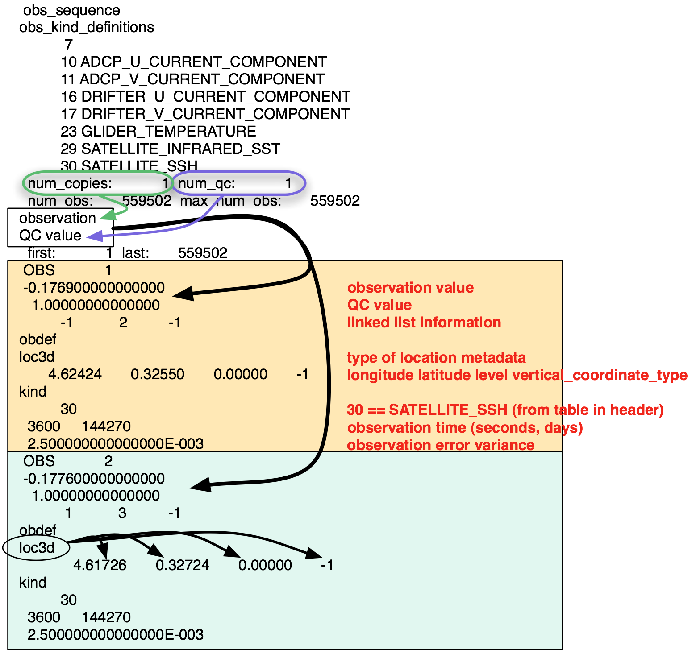

Detailed structure of an obs_seq file
=====================================

Since the configuration of model ensembles and the characteristics of
assimilated observations are highly variable, observation sequence files are
highly adjustable to accomodate these variations.

There are many extensible parts of an observation sequence file. The following
aspects of an observation sequence file can be adjusted:

- the number of observation kinds contained in the file
- whether the locations have one or more components
- how many quality control values are available for each observation
- where those quality control values come from
- how many copies of each observation there are

The following two diagrams demonstrate the structure of an ``obs_seq.out`` and
an ``obs_seq.final`` file, respectively. 

.. note::

   These example files are from entirely separate experiments. They were
   selected to demonstrate the flexibility of the observation sequence file
   format.

obs_seq.out structure
---------------------

|obs_seq_out|

obs_seq.final structure
-----------------------

|obs_seq_final|

.. |obs_seq_final| image:: ./images/science_nuggets/obs_seq_final_diagram.png
   :width: 100%
