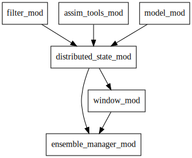

Distributed State
=================

The key part of DART is having a state that is physically distributed across 
processors. The location in memory of any part of the state vector (which processor 
and where in memory on that processor) is completely under the control of
filter, not model_mod.
This improvement was released in, and was the major reason for, Manhattan.

Implications of this:

-  The model_mod never gets a whole state vector to use. So no whole vector for a 
   forward operator, and no whole vector for the mean.
-  The model_mod can not make any assumptions about the order of elements in the state.
   Currently, filter is ordering variables in the order they are listed in add_domain 
   and with the dimension order of the netcdf file. 

So, how does the model_mod access the state without having the vector and not knowing 
the state order? - state accessor routines.

State accessor routines
^^^^^^^^^^^^^^^^^^^^^^^

Getting the dart index
''''''''''''''''''''''

::

  function get_dart_vector_index(i, j, k, dom_id, var_id)

*get_dart_vector_index* returns the dart index for a given i,j,k of a variable. 
Note if the variable is 1D j and k are ignored. If a variable is 2D k is ignored. 
Note only variables upto 3D are supported, but this could be extended to support 
up to 7 dimensional variables (or whatever fortran and netcdf will support).

Getting the state at a given dart index
'''''''''''''''''''''''''''''''''''''''

::

  function x = get_state(index, state_handle)

*get_state* returns the state x at the given *index*. state_handle is a derived type 
which contains the state information.  *state_handle* is passed to the model_mod 
from above. *get_state* returns an array of values (the whole ensemble at index)
during model_mod and a single value (the mean) during *get_close_obs* or *vert_convert*.

If you have an array of indices, for example a forward operator which is located in 
different levels on different ensemble members you can use *get_state_array*. 
An example of this is in CAM when an observation is in pressure, the level
an observation is in depends on the state and so can vary across the ensemble.

::

  subroutine get_state_array(x(:), index(:), state_handle)

The code inside *get_state_array* will do the minimum amount of communication 
to get you the indices you need. For example if

::

  index = [3 4 3 3 4 3]

*get_state_array* will only do 2 mpi communications and return

::

  x = [state(3), state(4), state(3), state(3), state(4), state(3)]

A limited module diagram is shown below. A -> B means A uses B:

|image1| *filter_mod* and *assim_tools_mod* take care of making data available 
for use with *get_state*. Note *get_state* will only return data during 
*model_interpolate*, *get_close_obs*, or *vert_convert*. If you 
use *get_state* outside these routines you will get and error.

**Compilation Notes**

The Remote Memory Access programming model DART employs uses mpi_windows.
There are 2 ways to compile window mods for mpi and non-mpi filter.
This is taken care of automatically when you run quickbuild.sh.
However, if you use mpi, there is a choice
of mpi_window mods:

-  cray_win_mod.f90
-  no_cray_win_mod.f90

| We have these two modules that you can swap in because the MPI 2 standard states:
| Implementors may restrict the use of RMA communication that is synchronized by lock calls to windows in memory
  allocated by MPI_ALLOC_MEM.
| MPI_ALLOC_MEM uses cray pointers, thus we have supplied a window module that uses cray pointers. However,
  no_cray_win_mod.f90 is the default since some versions of gfortran (4.9.0) do not support cray pointers. These
  different modules will go away when we swap to MPI 3.

To change to cray_win_mod.f90 edit DART/build-system/buildfunctions.sh

.. code-block::

   windowsrc=cray_win

