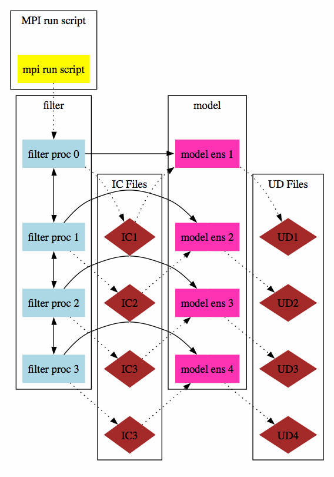

Filter async modes
==================

Options for parallelism both in DART and in the model advances
--------------------------------------------------------------

| 
| Simplest case, async=0:
| |image1|
| This is a single MPI executable, with each call to the model being simply a subroutine call from each MPI task.
| `To the DART mpi intro document <mpi_intro.html#async0>`__
| Parallel advance, async=2:
| |image2|
| The filter executable is one MPI program, and the model is a single, sequential executable. Each MPI task uses the
  unix "system()" call to invoke a shell script (advance_model.csh) which runs the models as independent programs.
| `To the DART mpi intro document <mpi_intro.html#async2>`__
| Other views of how the async=2 option is structured; these may be more or less helpful.
| Parallel advance, async=2:
| |image3|
| Parallel advance, async=2, second version:
| |image4|
| Parallel model advance, async=2, showing how data is communicated between filter and the model thru intermediate
  files. IC are 'initial condition' files, UD are 'updated' files.
| |image5|
| Parallel model advance, async=4:
| |image6|
| The filter executable is one MPI program, and the model is also an MPI program. The filter executable communicates
  with the runme_filter shell script, which sequentially invokes mpirun to advance each of the model runs, one per
  ensemble member, still using advance_model.csh.
| `To the DART mpi intro document <mpi_intro.html#async4>`__
| Parallel model advance, async=4, showing how data is communicated between filter and the model thru intermediate
  files. IC are 'initial condition' files, UD are 'updated' files.
| |image7|

.. |image1| image:: images/async0.gif
.. |image2| image:: images/async2a.gif
.. |image3| image:: images/async2_v1.gif
.. |image4| image:: images/async2_v2.gif

.. |image6| image:: images/async4.gif
.. |image7| image:: images/async4_wfiles.gif
