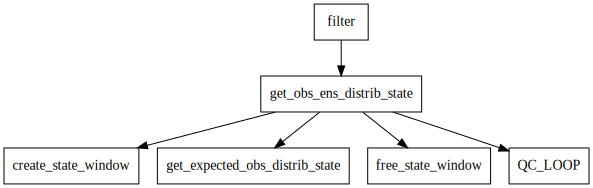

Forward Operators
=================

In data assimilation the process of computing an observation's expected value from a 
model state is called the ``forward operator``.

In DART the forward operator code is kept separate from any model-specific details.  
This is to enable the same forward operator to run with any model of the same type (atmosphere, ocean, etc).  
This is accomplished by restricting the forward operator code to only interpolating state fields through a 
call to the ``interpolate()`` function.  It can make no other assumptions
about the model-specific details, for example the grid size or spacing.

A simple forward operator computes the expected value by calling the 
``model_mod.f90`` ``interpolate()`` function
on a field contained in the model state and returning the value.  
The base DART code does this without requiring the user to add additional code.

Generally a model's interpolate function should be written so it only
does spatial interpolation on fields in the model state.  Derived values
and more complex computations should be placed in forward operator code.

A more complex forward operator either modifies the state value returned by ``interpolate`` or it calls
interpolate for multiple state fields and calculates an expected value from those.  The convention is
to make a separate Fortran module for each forward operator and place the code in a
``observations/forward_operator/obs_def_xxx_mod.f90`` file, where xxx is specific to the
type of forward operator.

Forward operator code will be called by other DART code and so the subroutine calling
sequences are fixed.  See documentation for 
:doc:`../observations/forward_operators/obs_def_mod`
for more details.

The routine that must return an ensemble-sized array of expected values is usually
called ``get_expected_xxx``. It is passed a handle to access the state values and 
the observation location.  It must return an array of expected values, one for each
ensemble member, for that observation type at that location.

Approaches for Common Situations
================================

Users who are familiar with data assimilation systems which are tightly integrated
with a particular model often assume that it is either impossible or too inefficient
to separate the model details from the forward operator code.  In our experience
with running DART across a wide range of models, this is not the case.

Here are approaches successfully used for some common situations.

Summing or Integrating a Column Value 
-------------------------------------

Some instruments return an observation of a vertically integrated
value, e.g. Total Precipitable Water.  If this field is not already
in the model state the forward operator needs to sample the model
in a vertical column and sum the moisture values to return the total
water in the column.  

There are 2 common approaches to implementing code of this type.

#. Use a synthetic set of pressure or height vertical values at the horizontal location.
   The forward operator code uses the horizontal components of
   the requested location and constructs a set of synthetic locations
   with fixed steps in pressure or height in the vertical, calls 
   interpolate for each vertical location, and sums the results.

#. Use a synthetic set of model levels in the vertical at the horizontal location.
   The forward operator code uses the horizontal components of
   the requested location and construct a set of synthetic locations
   with model level numbers in the vertical, calls interpolate for each
   vertical location, and sums the results.  This approach has the
   advantage of minimizing the interpolation needed for the model-specific
   code to compute the vertical value.

In both cases the code must expect errors when the
vertical coordinate moves outside of the model grid.
Often the code will verify the horizontal location is
within the grid, then loop over vertical levels to count
the expected number of successful locations.  It can then
allocate arrays of that size and call interpolate for
the actual state vector fields required for this observation type.

Optional Precomputed Fields
---------------------------

If a complex computation is already being performed by the model
for an observed type, those values can be added to the state vector
and the forward operator code can interpolate values from that field 
directly.  However if this forward operator is used when that field is
not present it should have code to do a computation using other fields 
present in the model state.

See the radar forward operator for an example in the 'expected fall velocity'
section.  If this has already been computed by the model and is
available in the model state, the code interpolates in this field
and returns.  If not, it interpolates values for other consitituent
fields and does a generic computation.

Parallelism Implementation Details
==================================

The forward operator code is called for each observation to be assimilated.
DART does this in parallel with each MPI task computing the values for
all ensemble members for a subset of the observations.  The state data for the ensembles is
distributed across all tasks, so MPI one-sided communication is used for tasks to retrieve
needed data values from other tasks.

See sections below for more details on other parallelism options and how this differs from
previous versions of DART.

The forward operator is performed in ``get_obs_ens_distrb_state``. 
A limited call tree for ``get_obs_ens_distrb_state`` is shown below.

|image1|

The QC_LOOP is in ``get_obs_ens_distrb_state`` because the qc across the ensemble is known. 
The window opening and closing in
``get_obs_ens_distrb_state`` is as follows:

#. State window created (tasks can access other tasks's memory)
#. Forward operator called
#. State window destroyed (tasks can no longer access other tasks's memory)
#. QC calculated for the ensemble

However, there may be occasions where having only the first ens_size tasks perform the forward operator
is desired. For example, if the forward operator is being read from a file, or the forward operator uses a large portion of the state.
Or when debugging it may be easier to have 1 task per ensemble member.

To transpose and do the forward operators without using MPI one-sided communication, 
you can use the filter_nml namelist option ``distribute_state = .false.`` 
The process is the same as above except the window creation and destruction are transposing the state.

#. State window created (state ensemble is transposed var complete)
#. Forward operator called
#. State window destroyed (state ensemble is tranaposed to copy complete)
#. QC calculated for the ensemble

Note, that if you have fewer tasks than ensemble members some tasks will still be doing vectorized forward operators
(because they own more than one ensemble member).

State access
------------

Model_mod routines no longer get an array containing the state. The state is accessed through the function
``get_state``.

``x = get_state(i, state_handle)``

where x is the state at index i. ``state_handle`` is passed from above. During model_interpolate ``get_state`` returns
an array. Durring ``get_state`` returns a single value (the mean state).

Other Parallelism Options
=========================

In releases of DART before Manhattan (Lanai and earlier), transposes of the ensemble of states
were used.  If all data values for a single ensemble were needed an all-to-some transpose was
used to collect the state vector data onto the first N tasks, where N is the ensemble size.
If all ensemble values for a single item were needed a some-to-all transpose was used to
spread a subset of the state vector data to all tasks, where tasks contained all 
ensemble member values for the items they had.  This is ``transpose mode`` where the
full state vector must fit into a single task's memory.  

The current Manhattan release runs in ``distributed mode`` where state data is read
into memory and distributed across all tasks.  Each task stores all ensemble member
values for a subset of the items in the state vector.  The entire filter run keeps
this data distribution and the data is only collected back into individual ensembles
at output time.  Collection and I/O can be done on a field-by-field basis so the entire 
state vector is never present at one time on a task.

In the Manhattan release it is still possible to run in transpose mode which avoids
using MPI one-sided communication.  It is generally only feasible for models with
smaller state vector sizes since the first N tasks will need to store an entire state
vector in memory.  However, in most cases run time is still faster for distributed
mode even for smaller models because computing forward operators for an entire ensemble 
at once often amortizes the overhead parts of the computation when computing N values.

Transpose mode collects the entire state vector for an ensemble onto the
first N tasks. The forward operator code has access to the entire state vector 
and can reference any item with a simple array access.
Each of the first N tasks computes the expected value for all observations for
that single ensemble member.  Tasks N+1 and higher are idle during this part of
the execution.

In distributed mode each task computes the expected values for
a subset of the observations.  The observations are equally distributed round-robin.
For K observations and T tasks each task gets K/T obs.  MPI one-sided communication
is used to retrieve needed state values from other tasks.

