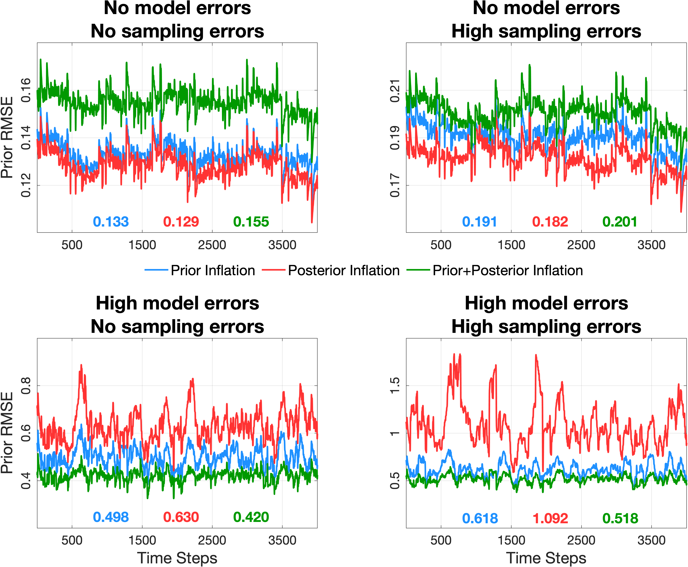

.. _inflation:

Inflation
=========
Sampling errors and model errors are significant challenges that degrade the quality of the sample
background covariance matrix in the ensemble Kalman filter (EnKF). Sampling errors typically arise
from the use of a limited-size ensemble due to computational constraints. Conversely, model errors
and biases stem from deficiencies in model dynamics and uncertainties in physical parameters.
These issues can result in an underestimation of the true (and unknown) variance of the system.

Inflation is a common technique used to restore variability in the ensemble without altering its mean.
This is achieved by linearly scaling the ensemble perturbations (also known as anomalies or
departures from the mean) as follows:

	:math:`\widetilde{\mathbf{x}}_i = \sqrt{\lambda} \left( \mathbf{x}_i -
 	\overline{\mathbf{x}} \right) + \overline{\mathbf{x}}, \quad
	i = 1, 2, ..., N`

where :math:`\mathbf{x}` is the (uninflated) state at any time, :math:`\overline{\mathbf{x}}`
is the ensemble mean and :math:`\lambda` is the inflation factor. The inflated ensemble
members are denoted by :math:`\widetilde{\mathbf{x}}_i` and :math:`N` is the ensemble size.
This operation is equivalent to scaling the original variance of the ensemble by a factor of
:math:`\lambda`. Typically, :math:`\lambda > 1` increasing the ensemble variance, yet studies
such as `El Gharamti (2018) <https://doi.org/10.1175/MWR-D-17-0187.1>`_ have shown that
:math:`\lambda` could also be less than 1, thereby deflating in the ensemble variance.

Prior or Posterior Inflation?
-----------------------------
The EnKF provides two key ensembles: the **prior ensemble** (after the model forecast step)
and the **posterior ensemble** (after the filter update). **Which ensemble do we inflate?**

Historically, inflation was introduced to address sampling errors.
Recent research, however, demonstrates that prior and posterior inflation can address
distinct challenges in the filtering problem including:

* **Prior inflation** tackles deficiencies in the forecast step, such as model biases
* **Posterior inflation** mitigates issues like sampling and regression errors during the analysis step

The following figure, adopted from
`El Gharamti et al. (2019) <https://doi.org/10.1175/MWR-D-18-0389.1>`_, illustrates
the functionality of prior and posterior inflation in the presence of
sampling and model errors using the :doc:`Lorenz 63 model <../models/lorenz_63/readme>`.

|inf_fig|

The figure evaluates four experimental scenarios:

1. **Top Left**: No Model errors and no sampling errors (achieved using 5000 members)
2. **Top Right**: No model errors and high sampling errors (using only 5 members)
3. **Bottom Left**: No sampling errors but high model errors (perturbed model parameters)
4. **Bottom Right**: High sampling errors and high model errors

In each plot, the prior RMSE is shown for 3 runs using: (i) prior inflation, (ii)
posterior inflation, and (iii) both prior and posterior inflation. We can see that
posterior inflation is quite effective at handling errors within the analysis step
including sampling and regression errors, non-Gaussianity, etc. As soon as model
biases are introduced, the benefits from posterior inflation diminish. Prior
inflation, on the other hand, is able to provide accurate estimates. In the
presence of model errors, combining both inflation algorithms yields the best
performance.

Each data assimilation experiment is unique, with varying model biases and
levels of sampling error. Based on these factors, we recommend the following:

+-----------------------------+---------------------+
| Experimental Setup          | Recommended Use     |
+=============================+=====================+
| No Bias (perfect model;     | Posterior Inflation |
| typical in OSSEs)           |                     |
+-----------------------------+---------------------+
| Bias + No Sampling Error    | Prior Inflation     |
+-----------------------------+---------------------+
| Bias + High Sampling Error  | Both prior and      |
|                             | posterior inflation |
+-----------------------------+---------------------+

Adaptive Inflation
------------------
DART includes advanced adaptive inflation algorithms that allow inflation
to vary dynamically in both space and time. These algorithms treat inflation
as a random variable characterized by a probability density function (PDF).
The mean (or mode) of the PDF is used as the inflation value, while the standard
deviation reflects the level of confidence in that value. In this way, the
inflation parameters (mean and standard deviation) are estimated alongside the
model state variables in the analysis step, following the so-called joint
state-parameters estimation approach.

* A **larger standard deviation** indicates less confidence in the inflation value, allowing it to evolve more rapidly over time
* A **smaller standard deviation** signifies greater confidence, leading to slower changes as the inflation value is presumed to be more accurate

.. Important::
	The adaptive inflation algorithm leverages available observations to update the
	inflation value. However, if observations suddenly become unavailable
	(e.g., due to seasonal variations), the inflation algorithm cannot adjust or reduce
	the inflation. To address this case, DART provides an **inflation damping option**.
	This option gradually pushes the inflation value back towards 1, even in the absence
	of observations. The recommended default value for the damping parameter is **0.9**.
	However, in cases where inflation needs to be adjusted more aggressively, a lower value,
	such as **0.6**, can be used.

	It is important to point out that regardless of whether inflation
	is updated through the default ``inf_flavor`` algorithm (when observations are present) or
	solely through inflation damping (when no observations are available), **inflation
	is applied to the ensemble at all times to all variables that are updated during the
	filter step**. As a result, the ensemble spread will
	continue to change as long as the inflation is not **1**. For circumstances where there are
	observation gaps (in space or time), the user should take special care to set an appropriate
	damping parameter to prevent inappropriate ensemble spread that could lead to
	undesirable/unstable behavior.

The following namelist items which control inflation are found in the ``input.nml`` file,
in the ``&filter_nml`` namelist. The detailed description is in the
`filter_mod <../assimilation_code/modules/assimilation/filter_mod.html#Namelist>`_ page. Here we
try to give some basic advice about commonly used values and suggestions for where to start.
Spatial variation is controlled by ``inf_flavor``, which also controls whether there's any inflation,
``inf_initial_from_restart``, and ``inf_initial``, as described below. Time variation is controlled
by ``inf_sd_initial_from_restart``, ``inf_sd_initial``, ``inf_sd_lower_bound``, ``inf_damping``,
``inf_lower_bound``, ``inf_upper_bound`` and ``inf_sd_max_change``.

In the namelist, each entry has two values, organized into two columns. The first is for **prior inflation**
and the second is for **posterior inflation**.

``&filter_nml :: inf_flavor``
   *valid values:* 0, 2, 3, 4, 5

   Specify the type of prior and posterior inflation that is applied to the state

   +------------+--------------------------+------------------+---------------------+------------------------------------------------+
   | **Flavor** | **Inflation Scheme**     | **Distribution** | **Type**            | **Reference**                                  |
   +============+==========================+==================+=====================+================================================+
   | 0          | No Inflation             |  --              | --                  | --                                             |
   +------------+--------------------------+------------------+---------------------+------------------------------------------------+
   | 2          | Spatially and temporally | Gaussian         | Prior and Posterior | `Anderson (2009)                               |
   |            | varying                  |                  |                     | <https://www.tandfonline.com/doi/abs/10.1111/  |
   |            |                          |                  |                     | j.1600-0870.2007.00361.x>`_                    |
   +------------+--------------------------+------------------+---------------------+------------------------------------------------+
   | 3          | Temporally varying but   | Gaussian         | Prior and Posterior | `Anderson (2007)                               |
   |            | spatially uniform        |                  |                     | <https://www.tandfonline.com/doi/abs/10.1111/  |
   |            |                          |                  |                     | j.1600-0870.2006.00216.x>`_                    |
   +------------+--------------------------+------------------+---------------------+------------------------------------------------+
   | 4          | Relaxation to prior      | --               | Posterior Only      | `Whitaker and Hamill (2012)                    |
   |            | spread                   |                  |                     | <https://doi.org/10.1175/MWR-D-11-00276.1>`_   |
   +------------+--------------------------+------------------+---------------------+------------------------------------------------+
   | 5          | Spatially and temporally | Inverse Gamma    | Prior and Posterior | `El Gharamti (2018)                            |
   |            | varying                  |                  |                     | <https://doi.org/10.1175/MWR-D-17-0187.1>`_    |
   +------------+--------------------------+------------------+---------------------+------------------------------------------------+

   Spatially-varying inflation stores an array of inflation values, one for each item in the state vector.
   If time-evolution is enabled, each value can evolve independently. Spatially-uniform inflation uses a
   single inflation value for all items in the state vector. If time-evolution is enabled, that single value can evolve.
   See ``inf_sd_*`` below for control of the time-evolution behavior. The enhanced spatially-varying inflation scheme
   (flavor **5**) uses an inverse-gamma distribution which allows the standard deviation of the inflation to increase
   or decrease through time and may produce better results.

   In practice, we recommend starting with no inflation (both values **0**). Then try
   the inverse gamma inflation type **5** for prior inflation and use no inflation (**0**)
   for the posterior. Inflation flavor **5** is recommended, over **2** or **3**,
   because it employs a PDF that is more suitable for describing the inflation unlike the
   other two flavors as shown in the table above.

   We used to support inflation in observation space (flavor **1**) but this has been deprecated.

   .. warning::
   	Even if ``inf_flavor`` is not **0**,
   	inflation will be turned off if ``inf_damping`` is set to **0**, which forces the inflation
        value to be **1**.

Using Relaxation to prior spread (RTPS; flavor **4**):
   RTPS is a *spatially-varying posterior inflation* algorithm. When using RTPS you cannot set the prior inflation
   flavor to **4**. The code will exit with an error message. Unlike all other flavors, RTPS does
   not use files to handle inflation in time. So, if the user supplies ``input_postinf_{mean,sd}.nc``,
   these will be **ignored**.

   The ONLY namelist option that RTPS uses (other than ``inf_flavor=4``)
   is the second entry of ``inf_initial``. This value is technically not the
   posterior inflation value but rather a *weighting* factor denoted by :math:`{\alpha}`; in
   `Whitaker and Hamill (2012) <https://doi.org/10.1175/MWR-D-11-00276.1>`_. This factor
   that is used to relax the posterior spread to the prior spread. For instance, if :math:`\alpha=0.3`
   then the inflated posterior spread is as follows: 70% of the analysis spread plus
   30% of the prior spread. If :math:`\alpha=1`, then the inflated posterior spread is simply set
   to the prior spread. Using :math:`\alpha`, RTPS calculates the effective posterior inflation *under the hood*
   and writes out the inflation values to the user. These can be looked at for diagnostic purposes.
   The algorithm disregards them for the next data assimilation cycle. In short, RTPS is
   adaptive in time but unlike flavors **2**, **3** and **5** it has no memory.

   The recommendation is to set the second entry of ``inf_initial`` to any number between 0.0 and 1.0.

``&filter_nml :: inf_initial_from_restart``
   *valid values:* ``.true.`` or ``.false.``

   If true, read the inflation values from an inflation restart file named ``input_{prior,post}inf_mean{_d##}.nc``,
   (d\#\# is the domain number, if needed).
   An initial run could be done to let spatially-varying inflation values evolve in a spinup phase,
   and then the saved values can be read back in and used as fixed values in further runs.
   Or if time-varying inflation is used, then the restart file
   from the previous job step must be supplied as an input file for the next step.

``&filter_nml :: inf_initial``
   *valid values:* real numbers, usually 1.0 or slightly larger

   If not reading in inflation values from a restart file, the initial value to set for the inflation. Generally, we
   recommend starting with just slightly above 1.0, maybe 1.02, for a slight amount of initial inflation.

``&filter_nml :: inf_lower_bound``
   *valid values:* real numbers, usually 1.0 or slightly larger

   If inflation is time-evolving (see ``inf_sd_*`` below), then this sets the lowest value the inflation can evolve to.
   Setting a number less than one allows for deflation but generally in a well-observed system the ensemble needs more
   spread and not less. For ``inf_flavor=5``, the recommended value is 0. For flavors **2** and **3**,
   the recommended value is 1.

``&filter_nml :: inf_upper_bound``
   *valid values:* real numbers, larger than 1.0

   If inflation is time-evolving (see ``inf_sd_*`` below), then this sets the largest value the inflation can evolve to.
   We recommend a setting of 50.0, although if the inflation values reach those levels there is probably a problem with
   the assimilation.

``&filter_nml :: inf_damping``
   *valid values:* 0.0 to 1.0

   Inflation damping applies to all types of inflation but is most commonly used with time-adaptive inflation
   methods. It is particularly useful especially in regions of state space that are not influenced by observations,
   either due to gaps in data availability or because they fall outside the localization range. To damp the inflation,
   the difference between the current inflation value and 1.0 is multiplied by this ``inf_damping`` value before
   the next assimilation cycle. So the inflation values are pushed towards 1.0, from above or below
   (if ``inf_lower_bound`` allows inflation values less than 1.0). A value of 0.0 turns all inflation off
   by forcing the inflation value to 1.0. A value of 1.0 turns damping off by leaving the original inflation
   value unchanged. We recommend setting the damping to a value of 0.9, which damps slowly.

	 .. note::
		 Order of (prior) inflation operations within DART:

		 1. Inflation is read from restart file or namelist
		 2. Inflation damping is applied: :math:`\sqrt{\lambda} \leftarrow 1 + \rho(\sqrt{\lambda} - 1),` where :math:`\rho` is the damping factor
		 3. Damped Inflation is applied to the prior ensemble
		 4. Inflation is updated with observations using the selected ``inf_flavor`` algorithm
		 5. Updated inflation values are written out

``&filter_nml :: inf_sd_initial_from_restart``
   *valid values:* ``.true.`` or ``.false.``

   If true, read the inflation standard deviation values from a restart file named ``input_{prior,post}inf_sd{_d##}.nc``.
   See the comments above about ``inflation_initial_from_restart``.

``&filter_nml :: inf_sd_initial``
   *valid values:* ≤ 0.0 to disable evolution of inflation, > 0.0 otherwise

   The initial value to set for the inflation standard deviation, if not reading in inflation standard deviation values
   from a file. This value (or these values) control whether the inflation values evolve with time or not. A negative
   value or 0.0 prevents the inflation values from being updated, so they are constant throughout the run. If positive,
   the inflation values evolve through time. We recommend setting this and ``inf_sd_lower_bound`` to 0.6.

``&filter_nml :: inf_sd_lower_bound``
   *valid values:* ≤ 0.0 to disable evolution of inflation, > 0.0 otherwise

   If the setting of ``inf_sd_initial`` is ≤ 0 (to disable time evolution of inflation) then set this to the same value.

   Otherwise, the standard deviation of the inflation cannot fall below this value. Smaller values will restrict the
   inflation to vary more slowly with time; larger values will allow the inflation to adapt more quickly. We have had
   good results setting this and ``inf_sd_initial`` to 0.6 for large geophysical models. Since the
   ``inf_sd_lower_bound`` is a scalar, it is not possible to set different lower bounds for different parts of the state.

   Time-varying inflation with flavor **2** generally results in the inflation standard deviation for all state variables
   shrinking to the lower bound and staying there. For flavor **5**, the inflation standard deviation value is allowed to
   increase and decrease.

``&filter_nml :: inf_sd_max_change``
   *valid values:* 1.0 to 2.0

   Used only with the Enhanced inflation (flavor **5**). The Enhanced inflation algorithm allows the standard deviation to
   increase as well as decrease. The ``inf_sd_max_change`` controls the maximum increase of the standard deviation in an
   assimilation cycle. A value of 1.0 means it will not increase, a value of 2.0 means it can double; a value in between
   sets the percentage it can increase, e.g. 1.05 is a limit of 5%. Suggested value is 1.05 (max increase of 5% per
   cycle).

   Because the standard deviation for original flavor **2** could never increase, setting the ``inf_sd_initial`` value equal
   to the ``inf_sd_lower_bound`` value effectively fixes the standard deviation at a constant value. To match the same
   behavior, if they are equal and flavor **5** is used it will also use that fixed value for the inflation
   standard deviation. Otherwise the standard deviation will adapt as needed during each assimilation cycle.

``&filter_nml :: inf_deterministic``
   *valid values:* ``.true.`` or ``.false.``

   Recommend always using ``.true.``.

Guidance Regarding Inflation
~~~~~~~~~~~~~~~~~~~~~~~~~~~~
First and foremost, if you are using one of the temporally-varying inflation options,
save the entire series of inflation files to explore how inflation evolves through time.
As part of the workflow, you have to take the output of one assimilation cycle and rename
it to be the input for the next assimilation cycle. That is the time to make a copy
that has a unique name - usually with some sort of date or timestamp. This also makes
it possible to restart an experiment. For many of the supported models, the scripting that
does the renaming and copying of the inflation files may already be provided.

.. Important::
		Inflation should only be applied to the variables that are **updated** by DART.	
		
		Some models have `NO_COPY_BACK`` variables which are often used to compute the forward
		operators, however they should not be inflated. Whether a variable is `NO_COPY_BACK`, or  `UPDATE`
		is set in the ``&model_nml``. 

		In order to make sure a variable with a ``NO_COPY_BACK`` tag is not inflated, the
		user needs to run ``fill_inflation_restart`` and assign an inflation value of 1
		to that variable. Additional details on how to run the ``fill_inflation_restart``
		program can be found in the "*Caution*" section below.

		If a variable is not updated by observations because either 1) observation gaps exist
		in space or time 2) the state is outside the spatial localization distance, or
		3) variable localization was applied through the ``obs_impact_tool``, then inflation
		will only be affected by damping. However, inflation will still be applied throughout
		the entire state space.

The suggested procedure for testing inflation:

1. Start without any inflation; i.e., ``inf_flavor = 0, 0`` and assess the performance. For a healthy ensemble
DA system, one expects the prior RMSE and the total spread to be of the same magnitude. We often use the ensemble
consistency measure: RMSE/TOTALSPREAD to tell us if there is enough spread in the ensemble. Very large values
indicate insufficient variability in the ensemble to match the prediction error. This generally means we
need inflation.

2. Enable the spatially and temporally varying prior adaptive inflation. This is the recommended set of namelist options
to start with:

.. code-block:: bash

    inf_flavor                   = 5,           0
    inf_initial_from_restart     = .false.,     .false.
    inf_sd_initial_from_restart  = .false.,     .false.
    inf_initial                  = 1.0,         1.0
    inf_lower_bound              = 0.0,         1.0
    inf_upper_bound              = 50.0,        50.0
    inf_sd_initial               = 0.6,         0.6
    inf_sd_lower_bound           = 0.6,         0.6
    inf_sd_max_change            = 1.05,        1.05
    inf_damping                  = 0.9,         0.9
    inf_deterministic            = .true.,      .true.

The inflation values and standard deviation are written out to files with ``_{prior,post}inf_{mean,sd}{_d##}.nc``,
in their names (d\#\# is the domain number, if needed). These NetCDF files can be viewed with common tools
(we often use `ncview <https://cirrus.ucsd.edu/ncview/>`_). Spatially, one should expect observation-heavy
areas to be assigned large inflation values. This is because the observations will cause the ensemble spread
to shrink and inflation will counteract that by restoring variability. In regions where observations are sparse,
it is typical to see little to no changes to inflation. In other words, expect to see a direct correlation
between inflation patterns and observation locations (in particular, the dense ones). Don't be surprised
to see deflation (< 1) values over unobserved areas (e.g., portions in the Southern Hemisphere and over ocean).

If the inflation increases and remains at the ``inf_upper_bound``, this usually indicates a problem with the
assimilation. In general, consistent large inflation values (e.g., >20) across the entire state is not
a good sign and should be closely inspected.

.. caution::
		If you are running several DA cycles, you'll need to set ``inf_initial_from_restart`` and
		``inf_sd_initial_from_restart`` to ``.true.`` after the first cycle. After renaming the inflation files
		from output to input, this makes sure the updated inflation values from the first DA cycle are
		used in the next one. Otherwise, no inflation will be used because ``inf_initial`` is set to 1.0
		and no file movement is being done.

		Alternatively, you can set ``inf_initial_from_restart`` and ``inf_sd_initial_from_restart`` to
		``.true.`` before the first cycle but you need to prepare template inflation mean and sd files.
		This can be done by running
		:doc:`fill_inflation_restart <../assimilation_code/programs/fill_inflation_restart/fill_inflation_restart>`. The
		namelist options for this program are available in the ``input.nml``.
		Below is the recommended configuration:

		.. code-block:: bash

				&fill_inflation_restart_nml
				write_prior_inf   = .true.
				prior_inf_mean    = 1.00
				prior_inf_sd      = 0.6

				write_post_inf    = .true.
				post_inf_mean     = 1.00
				post_inf_sd       = 0.6

				input_state_files = 'restart.nc'
				single_file       = .false.
				verbose           = .false.
				/

		Once the template files are created, you will not need to change the inflation reading namelist parameters.

3. If the results with adaptive prior inflation were not satisfactory, then turn on posterior inflation and
run both inflation schemes. In general, most of the benefits should come from prior inflation because it tackles
model biases, which are unavoidable in geophysical models. Model biases often dominate other sources of error
such as sampling error. Operating both inflation schemes could improve the results but it also means dealing
with more files which may be undesirable.

.. tip::
	DART also supports other inflation algorithms that are not mentioned in here such as
	the Relaxation to Prior Perturbations (RTPP, `Zhang et al. (2004) <http://dx.doi.org/10.1175/1520-0493(2004)132%3C1238:IOIEAO%3E2.0.CO;2>`_).
	Similar to RTPS, this is also a posterior inflation scheme but it requires storing
	the entire prior ensemble anomalies making it computationally less efficient. If
	you're interested in this algorithm or other inflation schemes, please reach out
	to the DART team.
