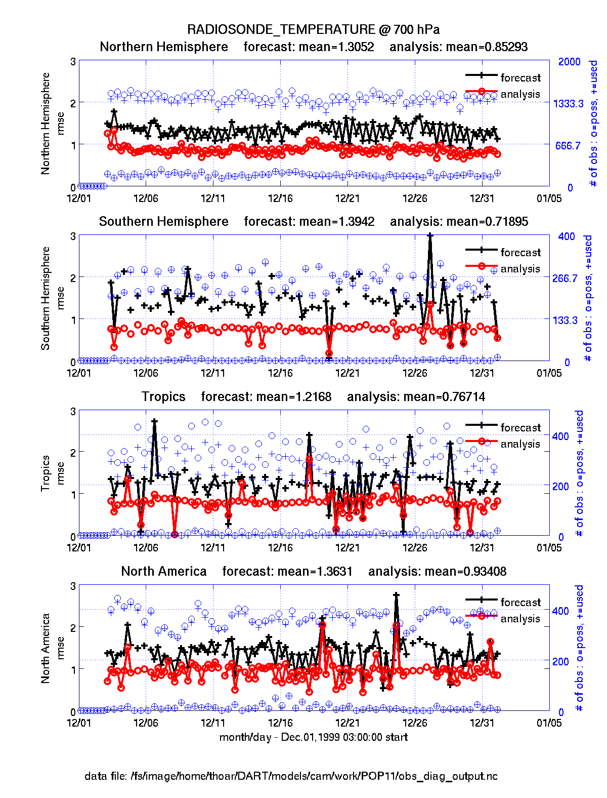
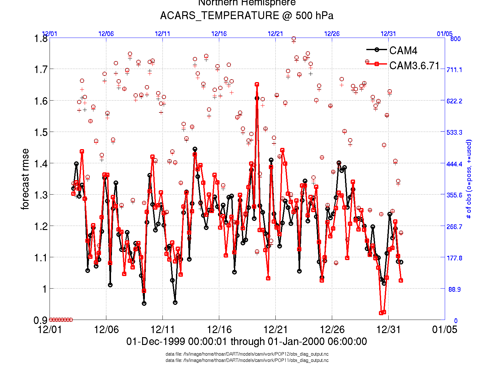
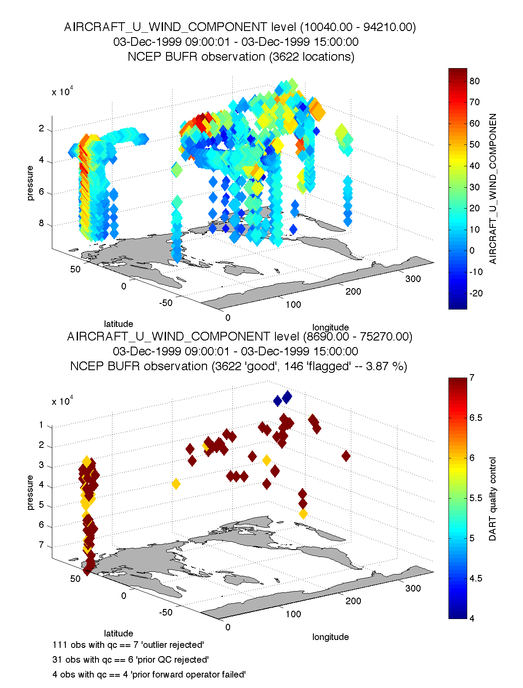
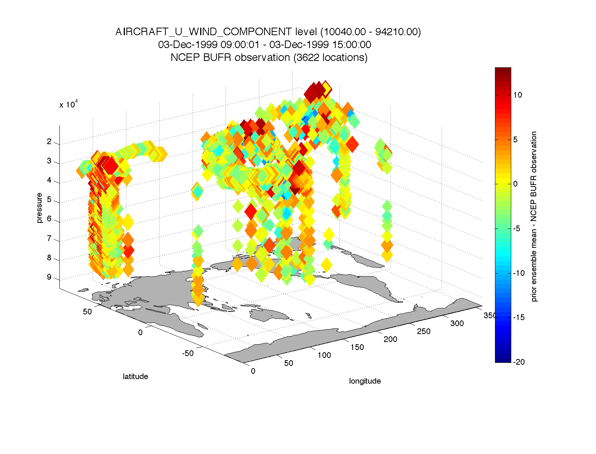
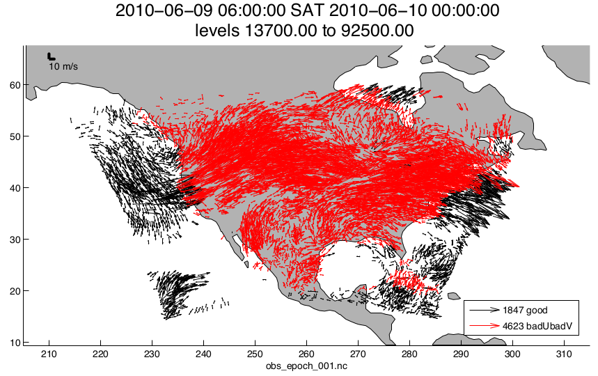
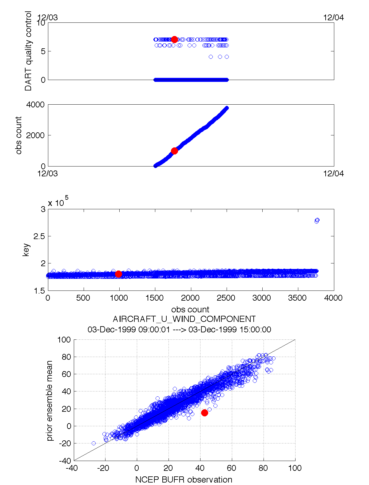
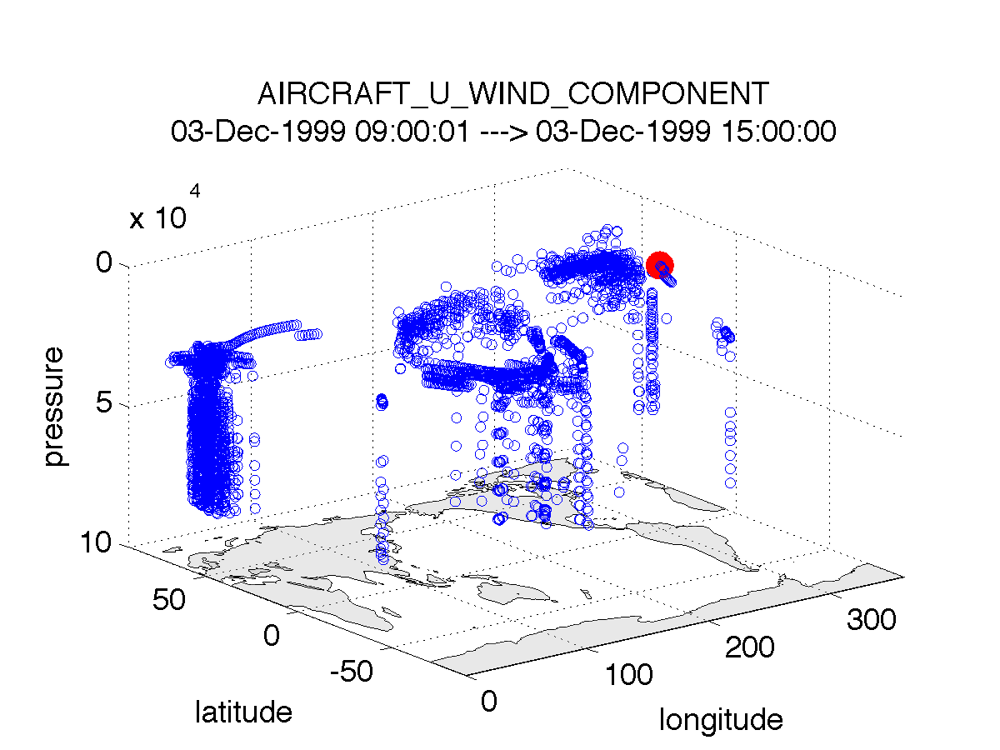
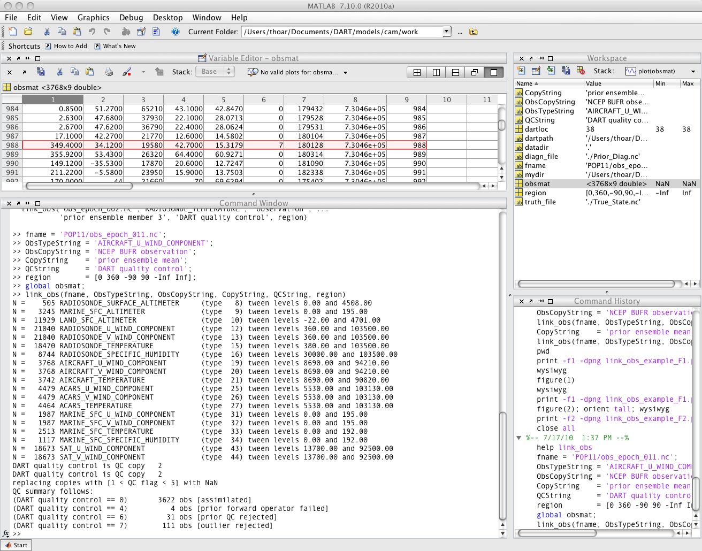

####################################
MATLAB observation space diagnostics
####################################

.. _configMatlab:

Configuring MATLAB
==================

DART uses MATLAB's own netCDF reading and writing capability and does not use
any MATLAB or third-party toolboxes. 

To allow your environment to seamlessly use the DART MATLAB functions, your
MATLAB path must be set to include two of the directories in the DART
repository. In the MATLAB command prompt enter the following, using the real
path to your DART installation:

.. code-block::

   addpath('DART/diagnostics/matlab','-BEGIN')
   addpath('DART/guide/DART_LAB/matlab','-BEGIN')

It is convenient to put these commands in your ``~/matlab/startup.m`` so they
get run every time MATLAB starts up. You can use the example ``startup.m`` file
located at ``DART/diagnostics/matlab/startup.m``. This example startup file
contains instructions for using it.

Summary of MATLAB functions
===========================

Once you have processed the ``obs_seq.final`` files into a single
``obs_diag_output.nc``, you can use that as input to your own plotting routines
or use the following DART MATLAB® routines:

`plot_evolution.m <https://raw.githubusercontent.com/NCAR/DART/master/diagnostics/matlab/plot_evolution.m>`__
plots the temporal evolution of any of the quantities above for each variable
for specified levels. The number of observations possible and used are plotted
on the same axis.

.. code-block::

   fname      = 'POP11/obs_diag_output.nc';        % netcdf file produced by 'obs_diag'
   copystring = 'rmse';                            % 'copy' string == quantity of interest
   plotdat    = plot_evolution(fname,copystring);  % -- OR --
   plotdat    = plot_evolution(fname,copystring,'obsname','RADIOSONDE_TEMPERATURE');

|plot evolution example|

----------------------------------------

`plot_profile.m <https://raw.githubusercontent.com/NCAR/DART/master/diagnostics/matlab/plot_profile.m>`__
plots the spatial and temporal average of any specified quantity as a function
of height. The number of observations possible and used are plotted on the same
axis.

.. code-block::

   fname      = 'POP11/obs_diag_output.nc';        % netcdf file produced by 'obs_diag'
   copystring = 'rmse';                            % 'copy' string == quantity of interest
   plotdat    = plot_profile(fname,copystring);

|plot profile example|

`plot_rmse_xxx_evolution.m <https://raw.githubusercontent.com/NCAR/DART/master/diagnostics/matlab/plot_rmse_xxx_evolution.m>`__
same as ``plot_evolution.m`` but will overlay **rmse** on the same axis.

`plot_rmse_xxx_profile.m <https://raw.githubusercontent.com/NCAR/DART/master/diagnostics/matlab/plot_rmse_xxx_profile.m>`__
same as ``plot_profile.m`` with an overlay of **rmse**.

`plot_bias_xxx_profile.m <https://raw.githubusercontent.com/NCAR/DART/master/diagnostics/matlab/plot_bias_xxx_profile.m>`__
same as ``plot_profile.m`` with an overlay of **bias**.

----------------------------------------

`two_experiments_evolution.m <https://raw.githubusercontent.com/NCAR/DART/master/diagnostics/matlab/two_experiments_evolution.m>`__
same as ``plot_evolution.m`` but will overlay multiple (more than two, actually)
experiments (i.e. multiple ``obs_diag_output.nc`` files) on the same axis. A
separate figure is created for each region in the ``obs_diag_output.nc`` file.

.. code-block::

   files    = {'POP12/obs_diag_output.nc','POP11/obs_diag_output.nc'};
   titles   = {'CAM4','CAM3.6.71'};
   varnames = {'ACARS_TEMPERATURE'};
   qtty     = 'rmse';
   prpo     = 'prior';
   levelind = 5;
   two_experiments_evolution(files, titles,{'ACARS_TEMPERATURE'}, qtty, prpo, levelind)

|two experiments evolution example|

----------------------------------------

`two_experiments_profile.m <https://raw.githubusercontent.com/NCAR/DART/master/diagnostics/matlab/two_experiments_profile.m>`__
same as ``plot_profile.m`` but will overlay multiple (more than two, actually)
experiments (i.e. multiple ``obs_diag_output.nc`` files) on the same axis. If
the ``obs_diag_output.nc`` file was created with multiple regions, there are
multiple axes on a single figure.

.. code-block::

   files    = {'POP12/obs_diag_output.nc','POP11/obs_diag_output.nc'};
   titles   = {'CAM4','CAM3.6.71'};
   varnames = {'ACARS_TEMPERATURE'};
   qtty     = 'rmse';
   prpo     = 'prior';
   two_experiments_profile(files, titles, varnames, qtty, prpo)

|two experiments profile example|

----------------------------------------

`plot_rank_histogram.m <https://raw.githubusercontent.com/NCAR/DART/master/diagnostics/matlab/plot_rank_histogram.m>`__ will
create rank histograms for any variable that has that information present in
``obs_diag_output.nc``.

.. code-block::

   fname     = 'obs_diag_output.nc'; % netcdf file produced by 'obs_diag'
   timeindex = 3;                    % plot the histogram for the third timestep
   plotdat   = plot_rank_histogram(fname, timeindex, 'RADIOSONDE_TEMPERATURE');

|rank hist matlab example|

----------------------------------------

You may also convert observation sequence files to netCDF by using
:doc:`../assimilation_code/programs/obs_seq_to_netcdf/obs_seq_to_netcdf`. All
of the following routines will work on observation sequences files AFTER an
assimilation (i.e. ``obs_seq.final`` files that have been converted to netCDF),
and some of them will work on ``obs_seq.out``-type files that have been converted.

`read_obs_netcdf.m <https://raw.githubusercontent.com/NCAR/DART/master/diagnostics/matlab/read_obs_netcdf.m>`__ reads a
particular variable and copy from a netCDF-format observation sequence file and
returns a single structure with useful bits for plotting/exploring. This routine
is the back-end for ``plot_obs_netcdf.m``.

.. code-block::

   fname         = 'obs_sequence_001.nc';
   ObsTypeString = 'RADIOSONDE_U_WIND_COMPONENT';   % or 'ALL' ...
   region        = [0 360 -90 90 -Inf Inf];
   CopyString    = 'NCEP BUFR observation';
   QCString      = 'DART quality control';
   verbose       = 1;   % anything > 0 == 'true'
   obs = read_obs_netcdf(fname, ObsTypeString, region, CopyString, QCString, verbose);

`plot_obs_netcdf.m <https://raw.githubusercontent.com/NCAR/DART/master/diagnostics/matlab/plot_obs_netcdf.m>`__
creates a 3D scatterplot of the observation locations, color-coded to the
observation values. A second axis will also plot the QC values if desired.

.. code-block::

   fname         = 'POP11/obs_epoch_011.nc';
   region        = [0 360 -90 90 -Inf Inf];
   ObsTypeString = 'AIRCRAFT_U_WIND_COMPONENT';
   CopyString    = 'NCEP BUFR observation';
   QCString      = 'DART quality control';
   maxgoodQC     = 2;
   verbose       = 1;   % > 0 means 'print summary to command window'
   twoup         = 1;   % > 0 means 'use same Figure for QC plot'
   bob = plot_obs_netcdf(fname, ObsTypeString, region, CopyString, ...
                     QCString, maxgoodQC, verbose, twoup);

|plot obs netcdf example|

----------------------------------------

`plot_obs_netcdf_diffs.m <https://raw.githubusercontent.com/NCAR/DART/master/diagnostics/matlab/plot_obs_netcdf_diffs.m>`__
creates a 3D scatterplot of the difference between two ‘copies’ of an
observation.

.. code-block::

   fname         = 'POP11/obs_epoch_011.nc';
   region        = [0 360 -90 90 -Inf Inf];
   ObsTypeString = 'AIRCRAFT_U_WIND_COMPONENT';
   CopyString1   = 'NCEP BUFR observation';
   CopyString2   = 'prior ensemble mean';
   QCString      = 'DART quality control';
   maxQC         = 2;
   verbose       = 1;   % > 0 means 'print summary to command window'
   twoup         = 0;   % > 0 means 'use same Figure for QC plot'
   bob = plot_obs_netcdf_diffs(fname, ObsTypeString, region, CopyString1, CopyString2, ...
                               QCString, maxQC, verbose, twoup);

|plot obs netcdf diffs example|

----------------------------------------

`plot_wind_vectors.m <https://raw.githubusercontent.com/NCAR/DART/master/diagnostics/matlab/private/plot_wind_vectors.m>`__
creates a 2D ‘quiver’ plot of a wind field. This function is in the
``matlab/private`` directory - but if you want to use it, you can move it out.
I find it has very little practical value.

.. code-block::

   fname       = 'obs_epoch_001.nc';
   platform    = 'SAT';    % usually 'RADIOSONDE', 'SAT', 'METAR', ...
   CopyString  = 'NCEP BUFR observation';
   QCString    = 'DART quality control';
   region      = [210 310 12 65 -Inf Inf];
   scalefactor = 5;     % reference arrow magnitude
   bob = plot_wind_vectors(fname, platform, CopyString, QCString, ...
                           'region', region, 'scalefactor', scalefactor);

|plot wind vectors example|

----------------------------------------

`link_obs.m <https://raw.githubusercontent.com/NCAR/DART/master/diagnostics/matlab/link_obs.m>`__ creates multiple figures
that have linked attributes. This is my favorite function. Click on the little
paintbrush icon in any of the figure frames and select some observations with
"DART quality control == 7" in one window, and those same observations are highlighted in all
the other windows (for example). The 3D scatterplot can be rotated around with
the mouse to really pinpoint exactly where the observations are getting
rejected, for example. If the data browser (the spreadsheet-like panel) is open, 
the selected observations get highlighted there too.

.. code-block::

  fname         = 'obs_epoch_001.nc';
  ObsTypeString = 'RADIOSONDE_TEMPERATURE';
  ObsCopyString = 'NCEP BUFR observation';
  CopyString    = 'prior ensemble mean';
  QCString      = 'DART quality control';
  region        = [220 300 20 60 -Inf Inf];
  global obsmat;
  link_obs(fname, ObsTypeString, ObsCopyString, CopyString, QCString, region)

|link obs example frame 2|
|link obs example frame 1|
|link obs example frame 0|

----------------------------------------

.. |plot profile example| image:: images/science_nuggets/plot_profile_example.png
   :width: 100%

.. |two experiments profile example| image:: images/science_nuggets/two_experiments_profile_example.png
   :width: 100%

.. |rank hist matlab example| image:: images/science_nuggets/rank_hist_matlab_example.png
   :width: 100%

