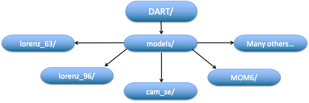

DART Has Interfaces to Many Models
===================================

This includes all models that were used in the DART_LAB tutorial and many other low-order models that are useful
for data assimilation education and research.

It also includes many large models of the Earth system including atmosphere, ocean, land surface, sea ice, 
hydrologic, and space weather models.

