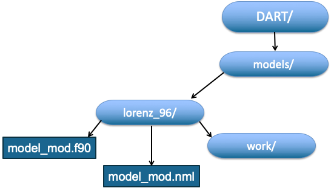

Contents of DART Model Directories
===================================

Each particular model directory contains a file named 'model_mod.f90' that holds Fortran code that interfaces 
between DART and the model, a file named 'model_mod.nml' that holds a Fortran namelist with parameters for 
run-time control, and a work directory. Many other things may also be here depending on the particular model. 

