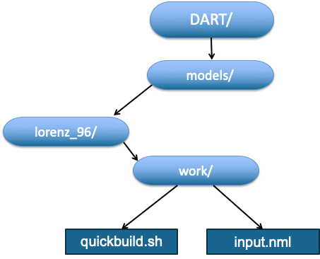

Contents of a Model work Directory
-----------------------------------

A work directory contains a 'quickbuild.sh' that is used to build a number of DART programs for the 
particular model, and a file 'input.nml' that contains a concatenated set of Fortran namelists and is 
used to control the behavior of DART programs at run-time.

