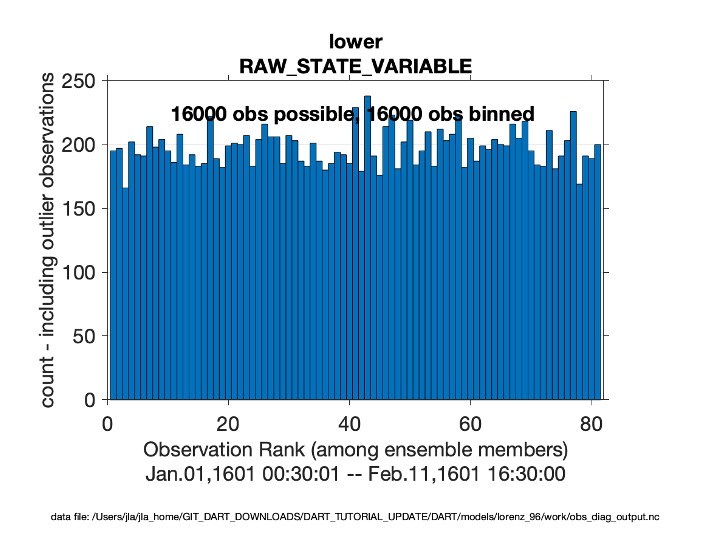
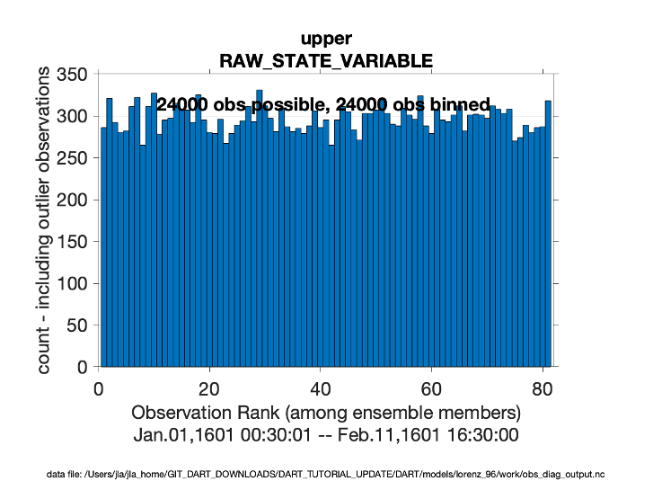
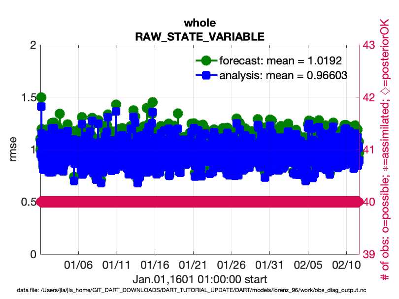
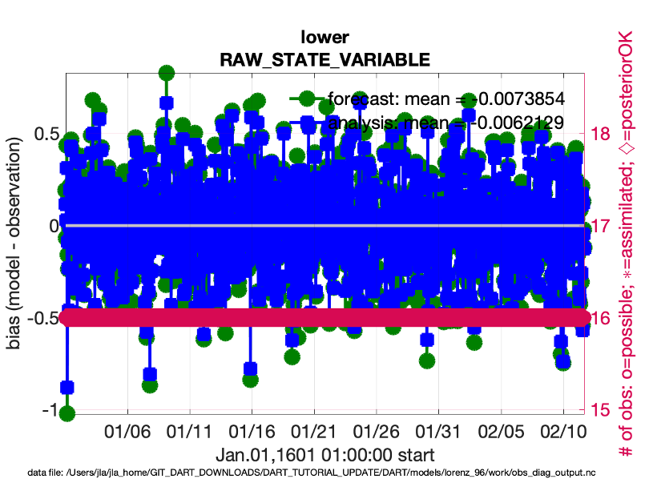
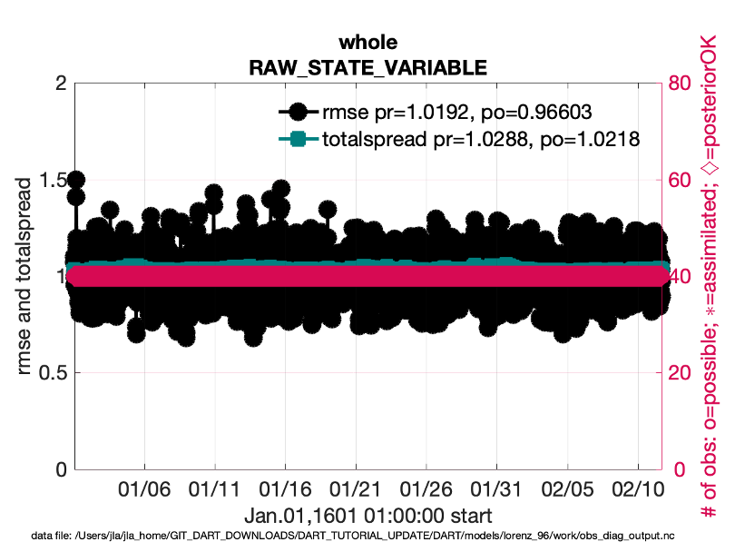

Observation Space Diagnostics in Lorenz-96
==========================================

obs_diag can create separate diagnostics for a subset of observations. This is controlled by 
the obs_diag_nml.

The default behavior for Lorenz-96 is to do diagnostics for the whole domain, and for the lower 
half and upper half of the domain. 

The three most useful matlab programs for low-order models are:

- plot_rank_histogram.m
- plot_evolution.m
- plot_rmse_xxx_evolution.m

The user interfaces are documented using matlab help.

Try: 

.. code-block:: 
   
   plot_rank_histogram('obs_diag_output.nc', -1)

Produces observation space rank histograms: The ones for the lower and upper half of the 
domain are shown here. 

Try: 

.. code-block:: matlab
   
   plot_evolution('obs_diag_output.nc', 'rmse', 'obsname', 'RAW_STATE_VARIABLE')

This produces time series of observation space rmse. 

Try: plot_evolution('obs_diag_output.nc', 'bias', 'obsname', 'RAW_STATE_VARIABLE')

.. code-block:: matlab

   plot_evolution('obs_diag_output.nc', 'bias', 'obsname', 'RAW_STATE_VARIABLE')

This produces time series of observation space bias. 

Try: 

.. code-block:: matlab

	fname  = 'obs_diag_output.nc';
	copy = 'totalspread';
	plotdat = plot_rmse_xxx_evolution(fname, copy);

This produces a time series of rmse and totalspread

