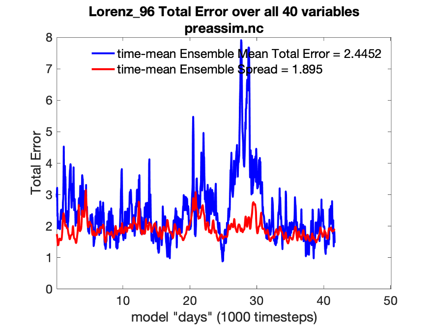
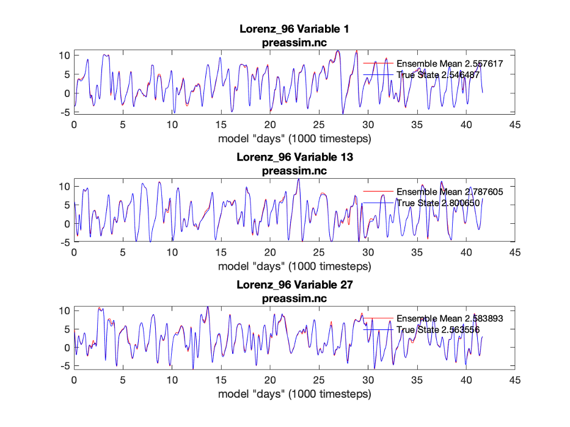
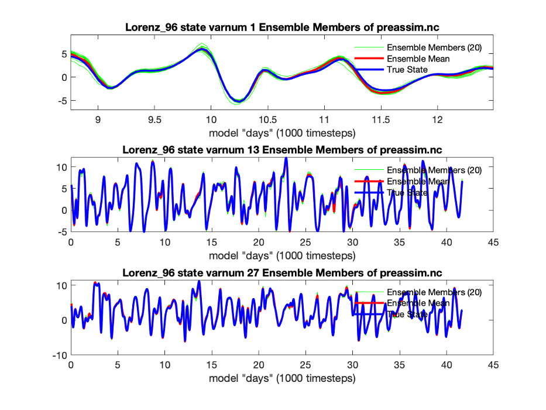
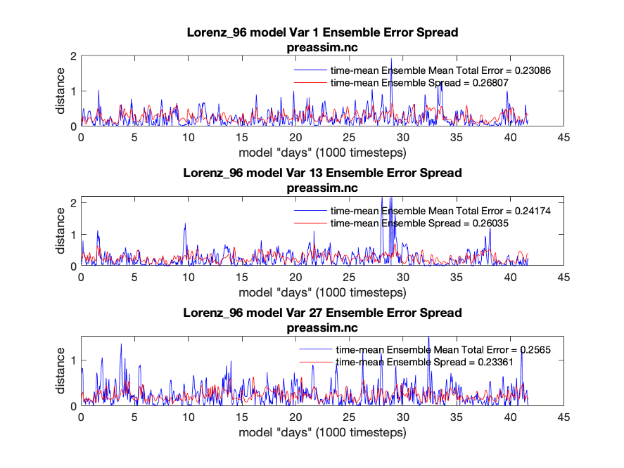
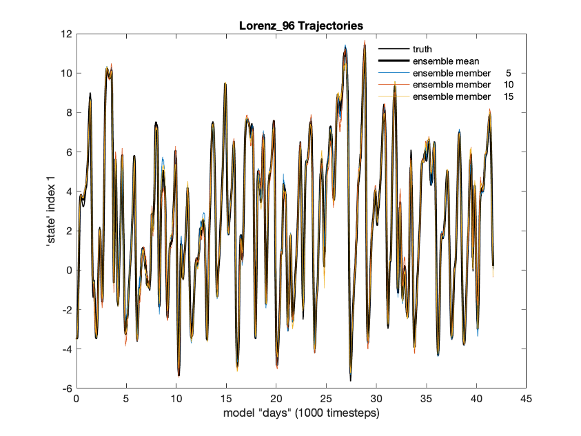
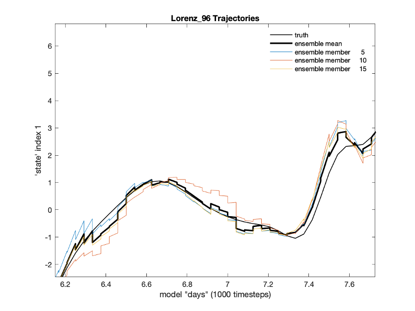
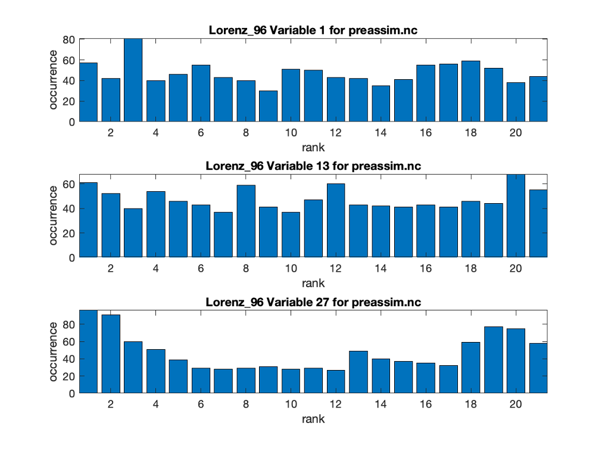
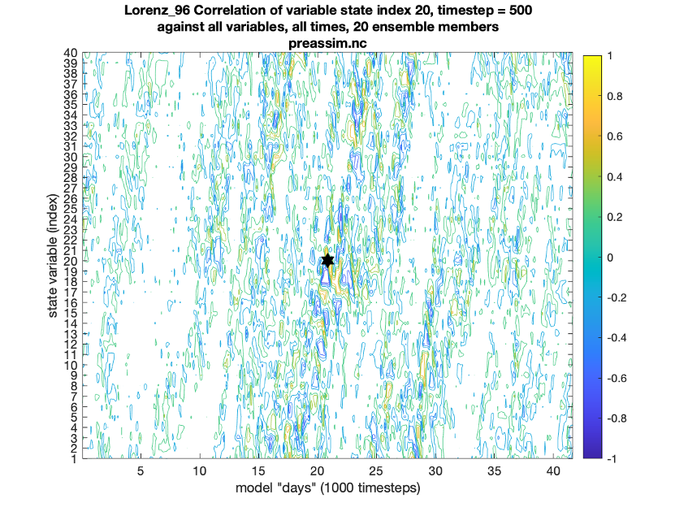
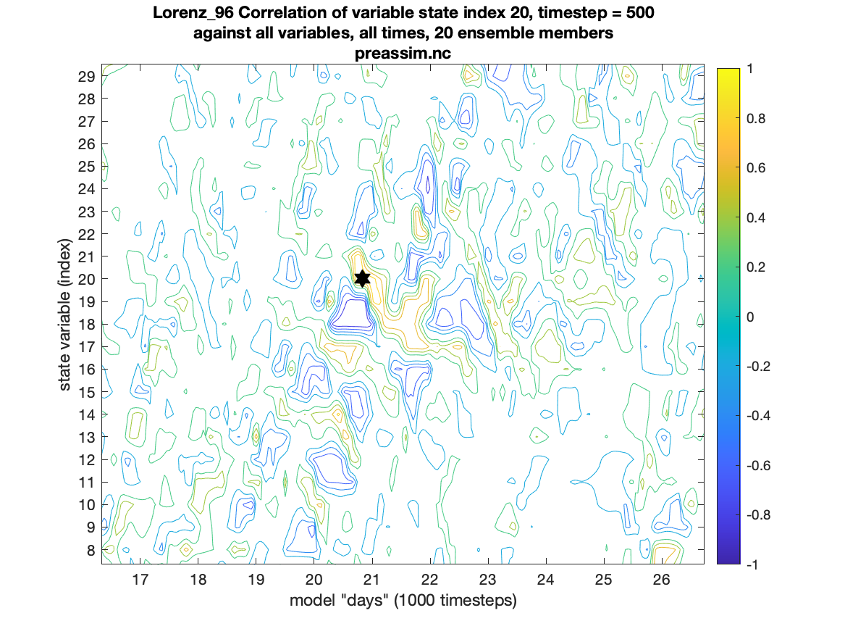

Lorenz_96 OSSE Diagnostics
===========================

DART uses matlab as the default tool to produce diagnostic output.

Open matlab in the lorenz_96/work directory.

The following basic diagnostic programs are available:

.. code-block:: text

	plot_total_err
	plot_ens_mean_time_series
	plot_time_series
	plot_ens_err_spread
	plot_saw_tooth
	plot_bins
	plot_correl

Try each of these and see results in the following slides. Your results may be quantitatively different 
depending on the compiler, operating system, and hardware you are using.

plot_total_err: Produces a time series of the ensemble mean root mean square error and spread along with 
error and spread for the entire diagnostic period.

The default is to produce diagnostics for the prior (forecast) ensemble, which is found in the file ‘preassim.nc’.

This file is selected by entering a carriage return when a choice is available.

Diagnostics for the posterior (analysis) can be produced by entering ‘analysis.nc’ when given a choice.

The same default behavior is found for the diagnostic tools in the following slides.

plot_ens_mean_time_series: Produces a time series of the ensemble mean and the truth for a selected set of model state variables.

plot_ens_time_series: Produces a time series of the ensemble mean, individual ensemble members, and the truth for a selected 
set of model state variables.
	

Here, matlab tools have been used to zoom in on a short segment of the results for variable 1 so that the ensemble members are visible

plot_ens_err_spread: Produces a time series of the ensemble root mean square error and spread for individual ensemble 
members for a selected set of model state variables, along with average values of error and spread for the duration of the experiment.
	

plot_sawtooth: Produces a time series of the prior, posterior and true values for a subset of ensemble members and a specified 
state variable for the duration of the experiment.

Zooming in:

plot_bins: Produces rank histograms for a subset of state variables for the duration of the experiment.

plot_correl: Produces a plot of the ensemble correlation of a specified variable at a specified time with 
all model variables at all times.

This example is for state variable 20 at time 500. The lower panel zooms in on the upper panel. 
The phase and group velocities of the lorenz_96 model can be seen.

