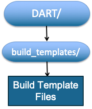

DART quickbuild Tool
=====================

DART uses a custom tool to build the DART system for a given application. This ‘quickbuild’ tool needs
to know information about the compiler to be used and settings for that compiler system

quickbuild is a powerful build and exploration tool. For more information see, the DART website.

This compiler specific information is provided in a file called ‘mkmf.template’ in the 
build_templates/ directory. A variety of possible templates are available in this directory

Copy a template file that is appropriate for your compiler to the file ‘mkmf.template’ in the build_templates/ directory.
