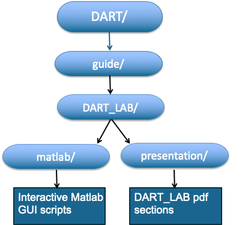

.. _DARTtutorial:

================
DART Tutorial
================

This section describes some basic features of the Data Assimilation Research Testbed Community Software Facility.

It assumes a familiarity with the ensemble DA concepts that are introduced in the first 5 sections. In particular, 
this section begins by describing how to reproduce all the capabilities of the Lorenz-96 model matlab GUIs using the DART facility.  

It also describes a few additional capabilities of DART. Examples are provided using the Lorenz-96 model. 

Additional tutorial material is also available for the use of DART with some specific large geophysical models like 
WRF, CAM, and MPAS. (Helen, include links?)

Download DART
================

DART is developed by the Data Assimilation Research Section (DAReS) at the National Science Foundation National Center 
for Atmospheric Research (NSF-NCAR).

DART uses GitHub for code distribution and development.

See the DART web page for instructions on how to download the latest version of DART.

DART Directory Structure
=========================

.. image:: images/directory_structure.png

This is the top level directory structure of DART.

DART
================
The DART_LAB materials are found in the guide/ directory. A basic understanding of the first 5 sections 
of DART_LAB material is a prerequisite for this section.

DART quickbuild Tool
=====================

DART uses a custom tool to build the DART system for a given application. This ‘quickbuild’ tool needs
to know information about the compiler to be used and settings for that compiler system

quickbuild is a powerful build and exploration tool. For more information see, the DART website.

.. image:: images/build_templates_dir.png

This compiler specific information is provided in a file called ‘mkmf.template’ in the 
build_templates/ directory. A variety of possible templates are available in this directory

Copy a template file that is appropriate for your compiler to the file ‘mkmf.template’ in the build_templates/ directory.

DART Has Interfaces to Many Models
===================================

This includes all models that were used in the DART_LAB tutorial and many other low-order models that are useful
for data assimilation education and research.

It also includes many large models of the Earth system including atmosphere, ocean, land surface, sea ice, 
hydrologic, and space weather models.

.. image:: images/model_interfaces.png

Contents of DART Model Directories
===================================

Each particular model directory contains a file named ‘model_mod.f90’ that holds Fortran code that interfaces 
between DART and the model, a file named ‘model_mod.nml’ that holds a Fortran namelist with parameters for 
run-time control, and a work directory. Many other things may also be here depending on the particular model. 

.. image:: images/model_directories.png

Contents of a Model work Directory
-----------------------------------

A work directory contains a ‘quickbuild.sh’ that is used to build a number of DART programs for the 
particular model, and a file ‘input.nml’ that contains a concatenated set of Fortran namelists and is 
used to control the behavior of DART programs at run-time.

.. image:: images/model_work_dir.png

Building DART Lorenz_96 Programs
=================================

To build the DART programs for Lorenz_96, execute the following command in the directory DART/models/Lorenz_96/work:

.. code-block:: bash

	sh quickbuild.sh nompi

This builds a set of 11 programs including:

	perfect_model_obs and filter

An OSSE with Lorenz_96
=======================================

An Observing System Simulation Experiment (OSSE) generates synthetic observations of a model time integration. 

In earlier DART_LAB sections, the run_lorenz_96 gui generated an OSSE by running Lorenz_96. Synthetic observations 
were generated by adding a random draw from a specificed observation error distribution to selected model state variables 
at each assimilation time.These observations were then assimilated using ensemble filters.

The DART program perfect_model_obs is used to generate the synthetic observations from a model integration.

The DART program filter performs an ensemble assimilation that ingests observations generated by perfect_model_obs.

To do an example OSSE with DART, run the program perfect_model_obs followed by filter.

Lorenz_96 OSSE Diagnostics
===========================

DART uses matlab as the default tool to produce diagnostic output.

Open matlab in the lorenz_96/work directory.

The following basic diagnostic programs are available:

.. code-block:: text

	plot_total_err
	plot_ens_mean_time_series
	plot_time_series
	plot_ens_err_spread
	plot_saw_tooth
	plot_bins
	plot_correl

Try each of these and see results in the following slides. Your results may be quantitatively different 
depending on the compiler, operating system, and hardware you are using.

plot_total_err: Produces a time series of the ensemble mean root mean square error and spread along with 
error and spread for the entire diagnostic period.

.. image:: images/plot_total_err.png

The default is to produce diagnostics for the prior (forecast) ensemble, which is found in the file ‘preassim.nc’.

This file is selected by entering a carriage return when a choice is available.

Diagnostics for the posterior (analysis) can be produced by entering ‘analysis.nc’ when given a choice.

The same default behavior is found for the diagnostic tools in the following slides.

plot_ens_mean_time_series: Produces a time series of the ensemble mean and the truth for a selected set of model state variables.

.. image:: images/ens_mean_time_series.png

plot_ens_time_series: Produces a time series of the ensemble mean, individual ensemble members, and the truth for a selected 
set of model state variables.
	

.. image:: images/ens_time_series_zoom.png

Here, matlab tools have been used to zoom in on a short segment of the results for variable 1 so that the ensemble members are visible

plot_ens_err_spread: Produces a time series of the ensemble root mean square error and spread for individual ensemble 
members for a selected set of model state variables, along with average values of error and spread for the duration of the experiment.
	

.. image:: images/ens_err_spread.png

plot_sawtooth: Produces a time series of the prior, posterior and true values for a subset of ensemble members and a specified 
state variable for the duration of the experiment.

.. image:: images/sawtooth.png

Right panel zooms in on a portion of the left panel.

.. image:: images/sawtooth_zoom.png

plot_bins: Produces rank histograms for a subset of state variables for the duration of the experiment.

plot_correl: Produces a plot of the ensemble correlation of a specified variable at a specified time with 
all model variables at all times.

This example is for state variable 20 at time 500. The right panel zooms in on the left panel. 
The phase and group velocities of the lorenz_96 model can be seen.

.. image:: images/correl.png

.. image:: images/correl_zoom.png

Runtime control via input.nml in the work directory
===================================================

The file input.nml in the work directory allows the value of many DART parameters to be set at runtime. 

The input.nml contains a section for each DART module and can include controls for multiple main programs 
like perfect_model_obs and filter. 

For example, input.nml contains the namelist variables for the DART module assim_tools_nml:

.. code-block:: fortran

	&assim_tools_nml
	cutoff                          = 0.2,
	sort_obs_inc                    = .false.,
	spread_restoration              = .false.,
	sampling_error_correction       = .false.,
	adaptive_localization_threshold = -1,
	output_localization_diagnostics = .false.,
	localization_diagnostics_file   = 'localization_diagnostics',
	print_every_nth_obs             = 0,
	rectangular_quadrature          = .true.,
	gaussian_likelihood_tails       = .false.,
	/

The following input.nml variables allow exploration of DART filter features that were discussed in the 
earlier DART_LAB tutorial sections.

1. In the assim_tools_nml, cutoff: Sets the halfwidth of a Gaspari-Cohn localization for observation impact.

2. In the filter_nml, ens_size: Sets the ensemble size for the assimilation.

See how changing the ensemble size and cutoff impact the assimilation results.

- Change localization by setting cutoff to 0.4. Run filter and use matlab tools to see impact.
- Change ens_size to 80 (keep 0.4 cutoff). Check the impacts.

Inflation is controlled by a block of entries in the filter_nml section of input.nml:

.. code-block:: fortran

	inf_flavor                  	= 0,  	0,
	inf_initial_from_restart    	= .false., .false.,
	inf_sd_initial_from_restart  	= .false., 	.false.,
	inf_deterministic 	            = .true., 	.true.,
	inf_initial 	                = 1.0, 	1.0,
	inf_lower_bound 	            = 0.0,  	1.0,
	inf_upper_bound 	            = 1000000.0,  	1000000.0,
	inf_damping  	                = 0.9,  	1.0,
	inf_sd_initial		            = 0.6,  	0.0,
	inf_sd_lower_bound 	            = 0.6, 	0.0,
	inf_sd_max_change           	= 1.05, 	1.05,

The entries in the first column of numbers control prior inflation, that is applied after the model 
advance and before the assimilation. This is what was available in DART_LAB.

DART also supports posterior inflation, controlled by the second column of numbers, which applies 
inflation after the assimilation but before the next model advance. Prior and posterior inflation 
is also supported.

The first row in the inflation namelist controls is inf_flavor.

This value controls the algorithmic variant of inflation applied.

The following values are currently supported:

.. code-block:: text

	0: No inflation, 
	1: Time varying adaptive inflation with a single value for all variables at a given time,
	2: Spatially- and temporally-varying using a Gaussain prior for the inflation value,
	5: Spatially- and temporally-varying with inverse gamma prior for the inflation value.

Try changing the prior inf_flavor (first column) from 0 to 5 (keep all other namelist settings).

Then try changing the ens_size back to 20. 

The combination of inflation, localization, and ensemble size controls the assimilation quality.

Other inflation controls that were discussed in DART_LAB include:

.. code-block:: text

	inf_lower_bound:	Inflation is not allowed to be smaller than this value. 
	inf_upper_bound:	Inflation is not allowed to exceed this value.
	inf_damping:		The inflation is damped towards 1 by this factor at each assimilation time.
	inf_sd_initial: 		The inflation standard deviation initial value.
	inf_sd_lower_bound:      Inflation lower bound cannot be smaller than this. 
	inf_sd_max_change: 	Fractional change in inflation standard deviation cannot exceed this at a given assimilation time. 

The values for the prior inflation (column 1) set in the default input.nml in the Lorenz_96 work directory 
are a good choice for many applications.  

Controlling the observation space filter algorithm
==================================================

Some DART namelist entries are the names of files that contain more detailed run-time control information. 

The most widely used example is found in the algorithm_info module namelist:

.. code-block:: fortran

	&algorithm_info_nml
	   qceff_table_filename = 'eakf_qceff_table.csv'
	/

The default namelist entry in Lorenz_96/work is the eakf_qceff_table.csv

In this case, DART uses an Ensemble Adjustment Kalman Filter in observation space and does no 
transforms before regressing increments. This is equivalent to using a normal distribution.

Controlling probit probability integral transform
==================================================

The QCEFF file controls:
#. What PPI transforms are used when updating state variables,
#. What PPI transforms are used when updating extended state variables (observations), 
#. What PPI transforms are used before applying inflation,
#. What distribution is used for observational error distributions,
#. What distribution is used to fit the prior in observation space. 

However, for most applications of DART, the same transforms and distributions are appropriate 
for all five of these choices. 

See the DART website for more information. (Helen, link to the QCEFF table stuff?)

Default QCEFF files in lorenz_96/work
======================================

Three default QCEFF files are included in lorenz_96/work:

#. eakf_qceff_table.csv: This is the same as the default behavior but provides an example 
   of a completed QCEFF file. All variables are assumed to be normally distributed and unbounded.
#. bnrhf_qceff_table.csv: This file uses the bounded normal rank histogram distribution for all 
   assimilation distributions; the bounds in this case are at plus and minus infinity. 
#. enkf_qceff_table.csv: This file applies the traditional ensemble Kalman filter (reference), 
   a stochastic algorithm whose observation space behavior cannot be represented in the QCEFF 
   context. It does normal distributions for all transforms. 

For example, the following modification to the algorithm_info namelist entry results in applying 
the bounded normal rank histogram algorithms, give it a try:

.. code-block:: fortran

	&algorithm_info_nml
	   qceff_table_filename = 'bnrhf_qceff_table.csv'
    /

Try changing back to 80 ensemble members with the BNRHF

Quick Note on Using the Perturbed Observation EnKF
==================================================

DART supports sorting of observation increments before computing state increments.

This option should not be used with any filter except the perturbed observation EnKF.
It should always be used with the EnKF to improve filter results.

The perturbed observation ensemble Kalman filter can be selected by using the enkf_qceff_table.csv.

Use the enkf table in the namelist and set sort_obs_inc = .true. in the assim_tools_nml section.
Run filter and looks at the results. 

Then change back to the bnrhf_qceff_table.csv and set sort_obs_inc = .false.

DART Observation Sequence Files: Defining Observing Systems
===========================================================

DART uses 'observation sequence' files to define observing systems

The default observation sequence for lorenz_96 has:

	- Observations every 'hour' for 1000 hours,
	- Forty observation stations, randomly located in the periodic 	spatial domain,
	- Observations from each station are taken at each time,
	- The forward operator linearly interpolates from model gridpoints 	to the station location,
	- A random draw from Normal(0, 1) is added to each forward 	operator to simulate observation errors.
	
DART Observation Sequence Files: Defining Observing Systems
===========================================================

Five input identity observation sequences that duplicate networks available in DART_LAB guis 
are available in lorenz_96/work:

- obs_seq.in: The default, 40 randomly located observing stations,
- obs_seq_identity.in: Each of the 40 state variables is observed,
- obs_seq_identity_1_40_2.in: Every other state variable is observed,
- obs_seq_identity_1_40_4.in: Every 4th state variable is observed,
- obs_seq_identity_1_20.in: The first 20 state variables are observed.

In all cases, observations are taken every hour for 1000 hours and the observational error 
is randomly selected from Normal(0, 1). 

OSSEs with Different Observations
=================================

The observation sequence used to generate observations for an OSSE is set by:

.. code-block:: text

	&perfect_model_obs_nml
	 	...
		obs_seq_in_file_name	= “obs_seq.in”

To do an OSSE with a different observing network:

- Change this file name to one of the others on the previous slide,
- Run perfect_model_obs to generate synthetic obs, then run filter.
- Try this with obs_seq_identity_1_20.in.
- Use plot_ens_time_series to look at results at different points.

Change back to the default observation sequence file, obs_seq.in, before moving ahead:

.. code-block:: text

	&perfect_model_obs_nml
	    ...
		obs_seq_in_file_name	= “obs_seq.in”

Run perfect_model_obs to recreate the original set of synthetic observations.

Imperfect Model OSSEs
=====================

Parameters of the forecast model are set in the model_nml

.. code-block:: fortran

	&model_nml
	model_size = 40,
	forcing = 8.00,
	delta_t  = 0.05,
	time_step_days = 0,
	time_step_seconds = 3600,
	/

The forcing, F, of the Lorenz_96 model is set to 8 by default.
Changing this value when running perfect_model_obs or filter leads to different forcing.
Running perfect_model_obs with one value (like 8) and the filter with another explores 
assimilation with an imperfect model as in the matlab gui.

Set the model forcing to 10

.. code-block:: fortran

	&model_nml
		model_size        = 40,
		forcing           = 10.00,
		delta_t           = 0.05,
		time_step_days    = 0,
		time_step_seconds = 3600,
	/

Run filter and see how the results have been degraded.

Change the forcing back to 8 and run filter again before moving ahead.

Observation Space Diagnostics
=============================

In real applications, we don't know the truth.

We only have observations available to validate our assimilations.

DART provides a variety of plotting tools to diagnose performance using observations. 

While we know the truth in the Lorenz-96 model, it is useful to study the use of observation 
space diagnostics.

All information about observations is recorded by filter in a file using the DART observation 
sequence file format.

These files can be extended to allow complex and powerful metadata.

Before doing observation space diagnostics, the observation sequence file must be converted 
to a netcdf format with the program obs_diag.

Run obs_diag to generate a NetCDF file from the most recent assimilation.

Observation Space Diagnostics in Lorenz-96
==========================================

obs_diag can create separate diagnostics for a subset of observations. This is controlled by 
the obs_diag_nml.

The default behavior for Lorenz-96 is to do diagnostics for the whole domain, and for the lower 
half and upper half of the domain. 

The three most useful matlab programs for low-order models are:

- plot_rank_histogram.m
- plot_evolution.m
- plot_rmse_xxx_evolution.m

The user interfaces are documented using matlab help.

Try: plot_rank_histogram('obs_diag_output.nc', -1)

Produces observation space rank histograms: The ones for the lower and upper half of the 
domain are shown here. 

.. image:: images/hist_lower.png

.. image:: images/hist_upper.png

Try: plot_evolution('obs_diag_output.nc', 'rmse', 'obsname', 'RAW_STATE_VARIABLE’)

This produces time series of observation space rmse. 

.. image:: images/evolution_rmse.png

Try: plot_evolution('obs_diag_output.nc', ‘bias', 'obsname', 'RAW_STATE_VARIABLE’)

This produces time series of observation space bias. 

.. image:: images/evolution_bias.png

try: 

..code-block:: bash

	fname  = 'obs_diag_output.nc';
	copy = 'totalspread';
	plotdat = plot_rmse_xxx_evolution(fname, copy);
	This Produces a time series of rmse and totalspread

.. image:: images/rmse_xxx_evo.png

Discarding outlier observations
===============================

In real assimilation applications, it is often useful to discard observations that are too 
far from the model's first guess. 

The quality_control_nml includes outlier_threshold.
Define D as the distance between the prior ensemble mean estimate of an observation and the observation.

If the outlier_threshold is set to x, the observation is not used if D is greater than 
x times the expected separation (see section 5 slide 2).

The default value of outlier_threshold for Lorenz_96 is -1. A negative value means the 
threshold is not applied.

Set the outlier_threshold to 3.
Then rerun filter followed by obs_diag.

Then try rerunning the time series observation space matlab scripts. 

Diagnostics for rejected observations
======================================

The number of observations available, and the number actually used are also plotted 
for each assimilation time in the observation space time series. 

.. image:: images/rejected.png

Lorenz_63 Model
================

DART supports many other low-order models including the famous Lorenz-63 three variable model.

Tutorial information on this model and details about methods for creating observation sequences 
for OSSEs can be found at:

https://docs.dart.ucar.edu/en/latest/guide/da-in-dart-with-lorenz-63.html

Additional Low-order Models
===========================

DART provides a number of other low-order models that can be found under the models/ directory. 

The Lorenz_96 tracer model illustrates a number of additional features of DART. 
Follow the link below for more information:

https://docs.dart.ucar.edu/en/latest/guide/qceff-examples.html
