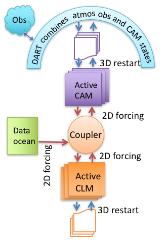
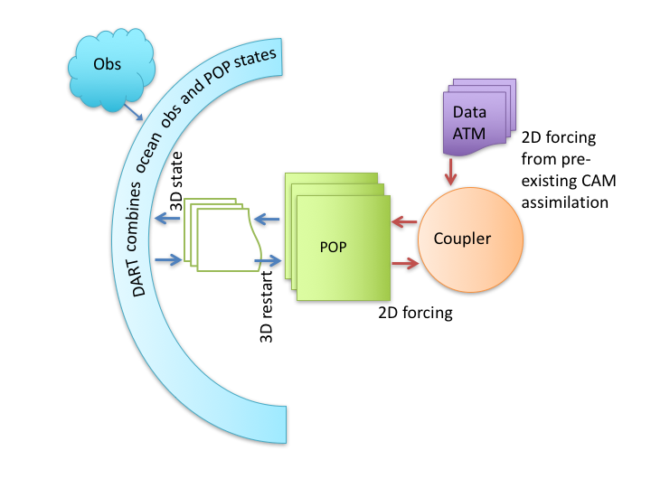
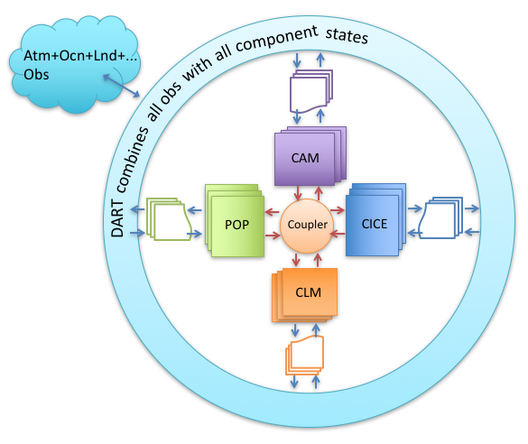

Community Earth System Model 
============================

Preliminaries
-------------

If you found your way to this file without reading the DART ''getting started'' files
or tutorial, please read those first. 
$DART/README.rst is a good place to find pointers to them. 
This document gives specific help in setting up a CESM+DART assimilation for the first time. 
Also see the ../{your_model(s)}/readme.html documentation 
about the code-level interfaces and namelist values.

CESM 
----

CESM is a software framework for setting up and running a combination of models,
each designed to represent a part of the Earth system.
Each component model (CAM, CLM, POP, CICE, ...) contributes in one of 3 modes:

- *active*; the model state evolves in time based on its own calculations
- *data*; the model simply reads data from external sources and sends representations of it to the other components.
- *stub*; the model does not interact with the other components.

The components influence each other only by passing fluxes and interface field values through the coupler. 
The combination chosen for a given application is called a ``compset``.
A compset is assembled using CESM's ``create_newcase`` and ``case.setup`` scripts,
which create a new "CASE" in the "CASEROOT" directory.

CESM uses the term 'fully coupled' to refer to a compset 
which has an active atmosphere and ocean, regardless of other components.  
We use that phrase in reference to CESM compsets only, not assimilations.  
In CESM an active atmosphere almost always implies 
an active land, but that is not necessary for it 
to be called 'fully coupled', and, by itself, is not 'fully coupled'.

Most nonCESM models are either called by DART (low order models), 
or are run by DART via a shell script command (e.g.  WRF). 
In contrast, CESM runs its hindcast, and then tells DART to do the assimilation. 
The result is that assimilation setup scripts for CESM components focus on 
modifying the build of CESM to accommodate DART's needs, 
such as ensemble (``multi-instance``) hindcasts, 
stopping at the assimilation times to run filter, 
and restarting with the updated model state.

CESM+DART Overview
------------------

There are several modes of assimilating observations using CESM as the hindcast model.
They share both the CESM and DART environments,
but differ somewhat for practical and historical reasons.

Single-component assimilation
~~~~~~~~~~~~~~~~~~~~~~~~~~~~~

The first, and simplest, consists of assimilating relevant observations into one active component. 
The other components may be active, data, or stub. 
Each of these assimilations is handled by one of the $DART/models interfaces
(cam-fv, POP, clm, ..., see, for example the `cam-fv readme <../cam-fv/readme.html>`_

.. :ref:`cam_fv_doc`)

If you want to use a new combination of active and data components, 
you may need to (work with us to) modify the setup scripts or develop a new model interface.
An example of single-component is when observations of the oceans 
are assimilated into the POP model state, 
while the atmospheric component is in data mode
(it provides forcing of the ocean from CAM reanalysis files), 
the sea ice model may be active (but not be affected directly by observations)
and the land model (CLM) may be a stub.
A variation of this is used by CAM assimilations. 
A CAM hindcast usually uses an active land component (CLM) 
as well as an active atmospheric component. 
Atmospheric observations are assimilated only into the CAM state, 
while the land state is modified only through its interactions with CAM through the coupler. 
The sea surface temperature forcing of the atmosphere is provided by a data ocean component.

==================== ====================
|CAM+DART flowchart| |POP+DART flowchart|
==================== ====================

Multi-component assimilation (often called ''weakly coupled'')
~~~~~~~~~~~~~~~~~~~~~~~~~~~~~~~~~~~~~~~~~~~~~~~~~~~~~~~~~~~~~~

+-----------------------------------------------+-----------------------------------+
| |Multi-component flowchart|                   | It's also possible to assimilate  |
|                                               | observations into multiple active |
|                                               | components, but restricting the   |
|                                               | impact of observations to only    |
|                                               | ''their own'' component. So in a  |
|                                               | ''coupled'' CESM with active CAM  |
|                                               | and POP, atmospheric observations |
|                                               | change only the CAM model state   |
|                                               | while oceanic observations change |
|                                               | only the POP model state. This    |
|                                               | mode uses multiple *DART* model   |
|                                               | interfaces (cam-fv and POP in     |
|                                               | this example) to make a filter    |
|                                               | for each model.  This mode uses   |
|                                               | scripts found in the              |
|                                               | CESM/shell_scripts directory.     |
|                                               | This does not require a           |
|                                               | models/CESM/model_mod.f90,        |
|                                               | since it uses a separate filter   |
|                                               | for each component                |
|                                               | (cam-fv, POP, ...).               |
+-----------------------------------------------+-----------------------------------+

Cross-component assimilation (often called ''strongly coupled'')
~~~~~~~~~~~~~~~~~~~~~~~~~~~~~~~~~~~~~~~~~~~~~~~~~~~~~~~~~~~~~~~~

+-----------------------------------------------+-----------------------------------+
| |Cross-component flowchart|                   | Work is underway to enable the    |
|                                               | assimilation of all observations  |
|                                               | into multiple active CESM         |
|                                               | components. So observations of    |
|                                               | the atmosphere would directly     |
|                                               | change the POP state variables    |
|                                               | and observations of the ocean     |
|                                               | would change the CAM state        |
|                                               | variables without interaction     |
|                                               | through the coupler.  Some        |
|                                               | unresolved issues include         |
|                                               | defining the ''distance'' between |
|                                               | an observation in the atmosphere  |
|                                               | and a grid point in the ocean     |
|                                               | (for localization), and how       |
|                                               | frequently to assimilate          |
|                                               | in CAM versus POP. This mode      |
|                                               | will use code in this             |
|                                               | models/CESM directory.            |
+-----------------------------------------------+-----------------------------------+

.. note::

   See :doc:`setup guidelines <./doc/setup_guidelines>` for details about setting up assimilations using
   observations of multiple Earth system components.

SourceMods
----------

Since the ability to use DART has not been completely integrated into CESM testing, 
it is necessary to use some CESM fortran subroutines which have been modified for use with DART. 
These must be provided to CESM through the SourceMods mechanism. 
SourceMods for selected versions of CESM are available as described in the readme.html
pages of the component model interfaces ($DART/models/{cam-fv,clm,...}.
This release of DART focuses on selected CESM versions from CESM2 (June, 2017) and later. 
Using this DART with other CESM versions will quite possibly fail,
in which case existing SourceMods can often be used as a template 
for making SourceMods for a different CESM version. 
If you have nonDART CESM modifications, they must be merged with the DART modifications
before building the case.

CESM2
~~~~~

CESM2 has several helpful features (compared to CESM1), from DART's perspective.

-  ''Multi-driver'' capability enables the efficient ensemble hindcasts which DART needs.
-  Cycling capability, which enables multiple assimilation cycles in a single job.  
   This reduces the frequency of waiting in the queue.
-  Removal of the short term archiver from the run script so that the MPI run doesn't need to idle 
   while the single task archiver runs. 
-  CESM's translation of the short term archiver to python, and control of it to an xml file
   ($CASEROOT/env_archive.xml), so that DART modifications to the short term archiver are more straight-forward.
-  The creation of a new component class, ''External System Processing'' (''esp''), of which DART is the first
   instance, integrates DART more fully into the CESM development, testing, and running environment. 
   This is similar to the atm class, which has CAM-FV as an instance. 
   This will help make DART available in the most recent tagged CESM
   versions which have the most recent CESM component versions.
-  Reduced number of subroutines in DART's SourceMods.

These have been exploited most fully in the CAM interfaces to DART, 
since some other components' interfaces use older CESMs. 
The cam-fv/shell_scripts can be used as a template for updating other models' scripting. 
The multi-cycling capability, with the short term archiver running as a separate job at the end, 
results in assimilation jobs which rapidly fill the scratch space. 
Cam-fv's and POP's assimilate.csh scripts have code to remove older and unneeded
CESM restart file sets during the run. 
All of DART's output, and user selected, restart file sets are preserved.

DART
----

| DART's manhattan release includes the change to filter setting input and output filenames,
  instead of the user setting them in namelists. 
  See `stages <../../assimilation_code/programs/filter/filter.html#detailed-program-execution-flow>`__.
  The assimilate.csh  of the model interface can rename these files into the CESM file format:
| $case.$component{_$instance}.$filetype.$date.nc.
| DART's file names are used as new filetypes, just like CESM's existing filetypes; ''r'', ''h0'', ... 
  For example, file ``preassim_mean.nc`` from a CAM assimilation case ``Test0`` may be renamed
| Test0.cam.preassim_mean.2013-03-14-21600.nc

$DART/models/{cesm components} organization
-------------------------------------------

.. container:: keepspace

   ================================= =======================================================================================
   PATHNAMES                         NOTES
   ================================= =======================================================================================
   \                        
   $DART/models/**cam-fv**/          An interface for the CAM-FV dynamical core (CAM-SE is available in $DART/models/cam-se)
   ...model_mod.\*                   The fortran interface between CAM-FV and DART
   ...work/                          Build DART executables (filter, ...) here before running setup\_\*
   ...shell_scripts/                 Setup and support scripts
   ......cesm\ **2_0**/              Directory of scripts to setup and run in  CESM2_0
   ......cesm\ **2_1**/              Directory of scripts to setup and run in  CESM2_1
         ...                      
   \                        
   $DART/models/**POP**/             An interface for the POP ocean model (MOM may be interfaced next)
   ...model_mod.\*                   The fortran interface between POP and DART
   ...work/                          Build DART executables (filter, ...) here before running setup\_\*
   ...shell_scripts/                 Setup and support scripts
   ......cesm\ **1_x**/              Directory of scripts for setting up and running POP in several versions of CESM1
   ......cesm\ **2_0**/              Same for CESM2_0
         ...                      
   \                        
   $DART/models/**clm**/             An interface for the Community Land Model (CTSM may be interfaced next)
   ...model_mod.\*                   The fortran interface between CLM and DART
   ...work/                          Build DART executables (filter, ...) here before running setup\_\*
   ...shell_scripts/                 Setup and support scripts
   ......CESM1_2_1_setup_hybrid      Script to set up an ensemble assimilation case using CESM1_2_1
   ......CESM1_2_1_setup_pmo         Script to set up a perfect model observation case using CESM1_2_1 (single member).
   ......CESM_DART_config            Script to activate the assimilation within the CESM case.
   ......*.csh                       Helper scripts for setup and running.
   ......user_datm.streams           CESM files which tell CLM which data atmosphere forcing to use.
         ...                      
   \                        
   $DART/models/**CESM**/            An interface for multi-component assimilation (cross-component is being developed)
   (...model_mod.\*)                 No fortran model interface.  It uses the components' executables and namelists.
   (...work/)                        No executables; they are built in the component interfaces' work directories.
   ...shell_scripts/                 Setup and support scripts
   ......CESM1_1_1_setup_hybrid      Set up a multi-component assimilation using initial conditions 
                                     from a single CESM B compset case in CESM1_1_1.
   ......CESM1_1_1_setup_initial     Same, but initial conditions from a different sources for each active component.
   ......CESM1_1_1_setup_pmo         Set up a perfect model observation case (single member).
   ......CESM_DART_config            Script to activate the assimilation within the CESM case.
   ......assimilate.csh              Small script to successively call the {comp}_assimilate.csh scripts
   ......{comp}_assimilate.csh       assimilate.csh scripts for each active component (cam, pop, clm, ...)
   ......run_perfect_model_obs.csh   Script to run a perfect model observation job.
         ...
   \
   ================================= =======================================================================================

.. warning::
   Experience on a variety of machines has shown that it is a very good idea
   to make sure your run-time environment has the following:

.. code-block:: bash

      limit stacksize unlimited
       limit datasize unlimited

.. tip::
   Also, large ensemble assimilations may run more efficiently 
   by setting environment variables in $CASEROOT/env_mach_specific.xml
   to something larger than their defaults.
   The variable names in an Intel MPI environment (17.x.x in 2020) are:

.. code-block:: xml
   
      <environment_variables>
         <env name="MPI_GROUP_MAX">1024</env>
         <env name="MPI_COMM_MAX">16383</env>

   and preventing unnecessary rebuilds of the component namelists
   by submitting the job using
   
   $ case.submit --skip-preview-namelist

.. Useful terms found in this web page.

.. width does nothing in the Multi and Cross images because their widths are defined 
   by the tables in which they are embedded.
.. |Multi-component flowchart| image:: ../../guide/images/science_nuggets/multi-component.png
   :height: 400px

