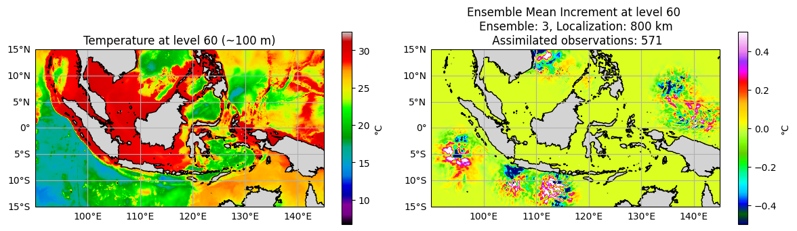

============
ROMS-Rutgers
============

.. contents:: 
   :depth: 3
   :local:

Regional Ocean Modeling System 
==============================
The Regional Ocean Modeling System (ROMS) is a widely used, open-source, free-surface, 
terrain-following, primitive equations ocean model designed for studying coastal and 
regional ocean dynamics. It has been developed by an international community of 
scientists and modelers since the late 1990s. Please visit `MyRoms <https://www.myroms.org/>`_
and `ROMSwiki <https://www.myroms.org/wiki/Documentation_Portal>`_ for more information on the model.

ROMS Key Features
-----------------
- **Terrain-following vertical (sigma) coordinates:**  
  ROMS uses a curvilinear vertical coordinate system that adapts to the ocean
  bottom topography, allowing for accurate representation of coastal and shelf
  processes.

- **Free surface and baroclinic dynamics:**  
  The model resolves both the surface elevation and stratified (density-driven)
  flows, capturing tides, currents, and thermohaline circulation.

- **Modular and flexible framework:**  
  ROMS supports a variety of physical processes including advection, mixing,
  sediment transport, and biogeochemical cycles, and can be coupled with
  atmospheric and wave models.

Typical Applications
--------------------
- Coastal circulation and upwelling studies  
- Estuarine and shelf sea dynamics  
- Harmful algal bloom modeling  
- Sediment transport and morphodynamics  
- Coupled physical-biogeochemical simulations  
- Operational forecasting and climate research
  
Below we describe the ROMS interface to DART. Please note that this interface 
supports the Rutgers version of ROMS **only**. Other versions of the model 
are also supported. Please refere to :doc:`ROMS_ucla <../ROMS_ucla/readme>` 
for the UCLA interface. If you have any questions regarding this interface 
or other ROMS-DART related questions, please reach out to the DART team 
at dart@ucar.edu

Interface Overview
==================
The ``ROMS_rutgers/mod_mod.f90`` is a module that serves as the interface between ROMS and DART. 
It defines the set of routines that DART uses to interact with ROMS state variables, 
perform interpolation, perturbations, metadata access, and read/write state data. It
supports: 

- Model initialization and state management,
- Observation-space interpolation of model state variables,
- Vertical coordinate transformation and interpolation,
- Mapping between DART's state vector and ROMS fields.

Observation Handling and Interpolation
--------------------------------------
Unlike the UCLA ROMS-DART interface, this version **does not rely on precomputed 
observation-space values** output by ROMS (e.g., from `MODname` in `s4dvar.in`). 
Instead, it **computes observation-space equivalents directly** 
via interpolation routines implemented using the `quad_utils` module. Interpolation 
to the observed location is done both horizontally and vertically. Observations outside the
model domain or falling on masked grid cells are excluded from the assimilation process 
(see failure codes below). The interpolation further assumes the model depth to be ordered 
from deepest to shallowest. It also handles extrapolation gracefully for values above 
or below the model domain.

   .. code-block:: fortran

      ! Failure codes: model_interpolate 
      integer, parameter :: QUAD_LOCATE_FAILED   = 13 
      integer, parameter :: QUAD_EVALUATE_FAILED = 21 
      integer, parameter :: SSH_QUAD_EVAL_FAILED = 34 
      integer, parameter :: QUAD_MAYBE_ON_LAND   = 55 
      integer, parameter :: OBS_TOO_DEEP         = 89

The image below shows an example assimilating Temperature observations from different
sources including: XBT, CTD, BOTTLE, MOORING, and FLOAT. The experiment, designed for
illustration purposes, uses only 3 members within the Indonesian archipelago. The
effective localization radius is set to 800 km. Temperature ensemble mean at a depth
of ~100 m is shown in the left panel. Ensemble mean increment (i.e., posterior -
prior) at the same depth is shown on the right.

.. warning::
   This interface only supports **single time-level** variables in ROMS history files.
   Variables with multiple time levels (e.g., leapfrog schemes in restart files) 
   are **not supported** and may lead to incorrect assimilation behavior.

Namelist Configuration: `model_nml`
-----------------------------------
The ROMS–DART interface is configured through the `model_nml` namelist. 
This namelist is read from the file `input.nml`. Namelists start with an
ampersand '&' and terminate with a slash '/'. Character strings that
contain a '/' must be enclosed in quotes to prevent them from
prematurely terminating the namelist. 

The table below describes the configurable variables in this namelist:

.. list-table:: `&model_nml` Namelist Variables
   :widths: 20 15 15 50
   :header-rows: 1

   * - Variable
     - Type
     - Default
     - Description
   * - ``roms_filename``
     - `character(len=256)`
     - `'roms_input.nc'`
     - Path to a ROMS NetCDF template file used to extract static grid and mask information.
   * - ``assimilation_period_days``
     - `integer`
     - `1`
     - Number of days in each assimilation window.
   * - ``assimilation_period_seconds``
     - `integer`
     - `0`
     - Number of seconds (in addition to days) in each assimilation window.
   * - ``perturbation_amplitude``
     - `real(r8)`
     - `0.02`
     - Amplitude used to perturb ensemble members for ensemble generation.
   * - ``use_mean_SSH_from_template``
     - `logical`
     - `.false.`
     - Indicates whether to use mean SSH from the template (ensemble mean).
   * - ``debug``
     - `integer`
     - `0`
     - Debugging verbosity level. Set >0 for more detailed log output.
   * - ``variables``
     - `character(len=vtablenamelength), dimension(MAX_STATE_VARIABLES * table_columns)`
     - `' '` 
     - Specifies the list of ROMS variables to be assimilated. The variable table is parsed as flat strings with metadata.

Variables Table Format
----------------------
The `variables` field in the `&model_nml` namelist is used to declare each state variable to be included in the DART state vector. 
Each variable entry consists of **five elements** (columns), listed in a single Fortran character array:

.. list-table:: Format of Each `variables` Entry
   :widths: 15 20 20 20 25
   :header-rows: 1

   * - Field
     - Description
     - Example
     - Notes
     - Requirement
   * - 1. Variable Name
     - Name of the ROMS variable in the NetCDF file.
     - `'temp'`
     - Must match the ROMS file variable name exactly.
     - Required
   * - 2. DART Quantity
     - DART internal quantity label.
     - `'QTY_TEMPERATURE'`
     - Must be a valid DART `quantity` name.
     - Required
   * - 3. Minimum Value
     - Lower bound as a string, or `'NA'` for none.
     - `'0.0'`
     - Used for clamping or bounds checking in DART.
     - Optional
   * - 4. Maximum Value
     - Upper bound as a string, or `'NA'` for none.
     - `'NA'`
     - Same usage as above.
     - Optional
   * - 5. Update Rule
     - Whether DART should write back this variable to the ROMS restart file.
     - `'UPDATE'`
     - `'UPDATE'` = write back; `'NO_COPY_BACK'` = internal use only.
     - Required

**Example** namelist snippet:

.. code-block:: fortran

   variables = 'temp', 'QTY_TEMPERATURE'        , 'NA' , 'NA', 'UPDATE',
               'salt', 'QTY_SALINITY'           , '0.0', 'NA', 'UPDATE',
               'u'   , 'QTY_U_CURRENT_COMPONENT', 'NA' , 'NA', 'UPDATE',
               'v'   , 'QTY_V_CURRENT_COMPONENT', 'NA' , 'NA', 'UPDATE',
               'zeta', 'QTY_SEA_SURFACE_HEIGHT' , 'NA' , 'NA', 'UPDATE'

Each variable must appear as a consecutive 5-element group in the flat `variables` array. The interface supports up to `MAX_STATE_VARIABLES`, each with 5 fields.

.. note::
    - Variables marked as `'NO_COPY_BACK'` are updated within the DART filter but are **not** written back to the ROMS restart file.
      1990s
    - Only variables in **restart files** can be updated in ROMS. Ensure `roms_filename` points to a restart file 
      (e.g., `roms_input.nc`) when using `'UPDATE'`.
    - Observation times are assimilated if they fall within `±0.5 × assimilation_period_days` from the model forecast time.
    - It's recommended to set ``use_mean_SSH_from_template`` to `.true.` and provide the ensemble mean as the template file 
      ``roms_filename``. This ensures the right SSH values are used in the localization routine.  
      

Generating an Initial Ensemble
------------------------------
The ROMS interface provides the ability to create an ensemble of initial ROMS
history files from an initial file by using the ``perturb_single_instance`` routine.
You can specify an ensemble of any size in the ``perturb_single_instance``
namelist in ``input.nml`` and this program will randomly perturb the 
temperature and salinity fields of an initial ROMS history file to generate 
the ensemble. The size of the perturbation is set using the namelist parameter
``perturbation_amplitude`` and the resulting initial distribution is Gaussian. 

References
==========
- Shchepetkin, A.F. and McWilliams, J.C., 2005. The regional oceanic modeling
  system (ROMS): a split-explicit, free-surface, topography-following-coordinate
  oceanic model. *Ocean Modelling*, 9(4), pp.347-404.
