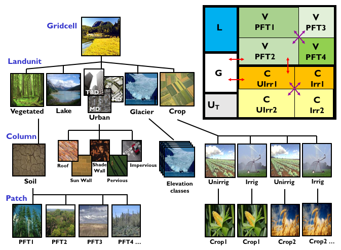

CLM
===

|CLM gridcell breakdown|                              
Figure from the CLM5.0 Tech Note. The image is a link to the document.

Overview
--------

This is the DART interface to the 
`CESM2 Community Land Model. <https://www.cesm.ucar.edu/models/cesm2/land/>`__
Specifically, CESM **release-cesm2.2.0** using CTSM **release-cesm2.2.03**

This document is most useful if the user has a prior understanding of running CESM
and also running CLM-DART.  For this reason **we strongly recommend the following
two steps be completed before reviewing this document**:

**First**, we  recommend that you become familiar with running a single or multi-instance 
experiment in CESM (i.e. a CLM 'free' run) before you try to run CLM-DART. The CLM-DART
software uses language and concepts that should be familiar to CESM users. The CLM-DART capability 
is entirely dependent on the multi-instance capability of CESM, first supported in 
its entirety in CESM1.1.1.  Consequently, this version or newer is required to run 
CLM/DART. The 
`CTSM Documentation <https://escomp.github.io/ctsm-docs/versions/master/html/index.html>`__
has reference material for CLM.

**Second**, we recommend the user complete the :doc:`CLM5-DART Tutorial. <tutorial/README>` 
This tutorial provides the user with 13 steps of hands-on experience for downloading, compiling, editing,
executing,and diagnosing a simple CLM5-DART assimilation run. It will provide users with
skills to modify the CLM-DART scripts for their own research applications.

  
DART uses the multi-instance capability of CESM, which means that DART is not 
responsible for advancing the model.  This GREATLY simplifies the traditional DART 
workflow, but it means *CESM has to stop and write out a restart file every time an 
assimilation is required*. The multi-instance capability is relatively new to CESM 
and we are in close collaboration with the CESM developers to make using DART with 
CESM as easy as possible. See the `SourceMods` section for a desciption of the 
changes to the CLM source code that are useful in a data assimilation context. 

CLM is a rapidly-moving target and DART is developed and maintained by a small
group of people. Consequently, we have focused on supporting *released* versions
of CLM. This documentation and scripting were tested using the CESM 
tag **release-cesm2.2.0** and CTSM tag **release-cesm2.2.03** following the download
instructions from https://github.com/ESCOMP/CESM .

CLM-DART has been used to assimilate snow data, soil moisture, leaf area index, 
biomass, solar-induced fluorescence and more. See the `References`_ section below
for some examples. The list is by no means complete. Each experiment has extended
the capabilities of the CLM-DART system. The observations supported by
DART are contained in the *obs_def_land_mod.f90*, *obs_def_tower_mod.f90*, 
and *obs_def_COSMOS_mod.f90* modules - each of which may be easily extended. 
New observation types are usually easily supported. There are **many** examples 
of routines to convert from native data formats (netCDF, HDF, csv, etc.) 
to a DART observation sequence file.

Important Features
------------------

Land DA is extremely diverse. The support for Land DA as pertains to CLM-DART
has some features that need to be described in some detail.

SourceMods
~~~~~~~~~~

While we strive to keep DART requirements out of the model code, there are a few 
SourceMods needed to run DART for CLM from within CESM. 
DART SourceMods for different versions of CESM are available as
part of the DART package at ${dartroot}/models/clm/DART_SourceMods/ 
where dartroot is the location of your DART installation.
It is up to you to either use them 'as is' or put them under version control 
in your CESM source code installation. The DART scripting allows you to specify
a directory containing the SourceMods - and then copies those SourceMods to
the appropriate CASEROOT directory.

The ``DART_params.csh`` file has a large comment block in the section
pertaining to SourceMods.

+----------------------------------------+-----------------------------------------------------------+
| SourceMod File                         | Description                                               |
+========================================+===========================================================+
| ``biogeochem/CNBalanceCheckMod.F90``   | Suppress balance checks for first restart step.           |
|                                        | This is **highly recommended**. Many people find it       |
|                                        | to suppress balance checks for ALL timesteps.             |
+----------------------------------------+-----------------------------------------------------------+
| ``cpl/mct/lnd_import_export.F90``      | (deprecated) DS199.1 originally had some slightly         |
|                                        | negative downward radiations that needed to be corrected. |
+----------------------------------------+-----------------------------------------------------------+
| ``biogeophys/SurfaceRadiationMod.F90`` | Allows the use of 'PARVEG' in a history file.             |
|                                        | Normally, only 'PARVEGLN' is output.                      |
+----------------------------------------+-----------------------------------------------------------+
| ``biogeophys/CanopyFluxesMod.F90``     | Used to calculate SIF                                     |
+----------------------------------------+-----------------------------------------------------------+
| ``biogeophys/PhotosynthesisMod.F90``   | Used to calculate SIF                                     |
+----------------------------------------+-----------------------------------------------------------+

CLM indeterminate values
~~~~~~~~~~~~~~~~~~~~~~~~

CLM variables are encoded as rectangular arrays in the netCDF files.
However, this means that some variables have space for layers that are unused.
Anything with snow layers, for example. CLM has the *SNLSNO* variable to indicate
which snow layers are active. The *unused* layers may not have the *_FillValue*
value, but can have 'indeterminate' values. The :doc:`clm_to_dart` 
must be run to convert these indeterminate values to *_FillValue* to be 
interpreted correctly by DART.  After the assimilation is complete, the 
:doc:`dart_to_clm` must be called to replace the *_FillValue* with whatever
is originally in that slot. This approach preserves the 'indeterminate' value
for *unused* snow layers and prevents DART from adjusting the value during
the *filter* step. If the surface snow layer has a *trace* of snow this is 
considered an active snow layer, and we allow DART to adjust this value.
See the *Discussion of Indeterminate Values* 
section of :doc:`clm_to_dart` for more details.

Model Interpolate - The Forward Operator
~~~~~~~~~~~~~~~~~~~~~~~~~~~~~~~~~~~~~~~~

Since the subgridscale components of CLM have no explicit location associated 
with them, the location of every component in the gridcell is the same as the 
gridcell itself. The DART forward operators fundamentally rely on 
interpolating the model state to some arbitrary location. At present, the best we
can do is to create an area-weighted average of all components in the gridcell.
This is sub-optimal because it introduces representation mismatch between the
grid cell and observation spatial resolution. A nice project would be to use a lookup
table for the observation location to determine the dominant PFT (or relevant metadata) at
that location and only average the PFTs specifically associated with
the observation within the gridcell. This will allow the forward operator to be
more accurate and might have a discernable impact on the regression relationship
(i.e. ensemble covariance) between the variables in the DART state vector.

The *model_interpolate* function in DART achieves efficiency by interpolating
all the ensemble members at the same time. This gives rise to some challenging
problems when interpolating values for variables with with changing numbers of active layers.
For example, some ensemble members may only have 2 active snow layers, some may have 3.
This is an untenable situation when asked for the snow temperature or water 
content in layer 3, for example. Consequently - *model_interpolate* will fail
and return an error code - the forward operator will fail - and the observation
is rejected and the DART QC is marked as such. Be aware.

Localization
~~~~~~~~~~~~

Localization is the term used to restrict the portion of the state to the portion
believed to be related to the observation. Most often, this is a spatial argument
but it does not need to be restricted to that. In some way, even the selection
of the CLM variables to include in the DART state is a de-facto localization.
Since CLM has such a rich description of land unit types: urban columns, glaciers, 
lakes, etc. it is also possible (and probably desirable) to explicitly declare
some columns and/or PFTs to be unaffected by the assimilation - i.e., we 
declare that soil moisture observations should not impact urban columns
or deep lakes or ... The **get_close_state()** function employs a routine to
explicitly declare what subgridscale components are allowed to be modified by
the assimilation. This routine can easily be customized to suit your purpose.  
The code segment below should make this clear.

.. code-block:: fortran

  ! Determine if state_index is a variable from a column (or whatever is of interest).
  ! Determine what dimension is of interest, need to know to index into
  ! cols1d_ityplun(ncolumn) array (for example).
  
  RELATEDLOOP: do jdim = 1, get_num_dims(dom_id, var_id)
  
     dimension_name = get_dim_name(dom_id, var_id, jdim)
     select case ( trim(dimension_name) )
            case ("gridcell","lon","lat")
               related = .true.
            case ("lndgrid")
               related = .true.
            case ("landunit")
               if ( land1d_ityplun(indices(jdim)) == ilun_vegetated_or_bare_soil ) related = .true.
               if ( land1d_ityplun(indices(jdim)) == ilun_crop                   ) related = .true.
            case ("column")
               if ( cols1d_ityplun(indices(jdim)) == icol_vegetated_or_bare_soil ) related = .true.
               if ( cols1d_ityplun(indices(jdim)) == icol_crop                   ) related = .true.
            case ("pft")
               related = .true.
            case default
     end select
  
     ! Since variables can use only one of these dimensions,
     ! there is no need to check the other dimensions. 
     if (related) exit RELATEDLOOP
  
  enddo RELATEDLOOP

Snow Data Assimilation
~~~~~~~~~~~~~~~~~~~~~~

The *prognostic* variables for snow (i.e. the ones that impact the forecast) 
are the ones that have layers. The snow observations are typically without 
explicit depths and are essentially column-integrated quantities like snow 
water equivalent (SWE - CLM variable *H2OSNO*) or snow depth 
(CLM variable *SNOW_DEPTH*).  These CLM *diagnostic* variables  
simplify the forward operator and have been part of the DART state. 
However, updating the prognostic variables 
(*T_SOISNO, H2OSOI_LIQ, H2OSOI_ICE, DZSNO, ZSNO, ZISNO*)
through their ensemble covariance with the update to *H2OSNO*, for example
will generally not result in a posterior SWE (calculated from the prognostic 
variables) that matches the posterior SWE in *H2OSNO*.

**In order to address this challenge,** a snow repartitition function has been
created in ``dart_to_clm`` that redistributes the posterior SWE into
the appropriate prognostic variables. This **guarantees** that the posterior
SWE of the prognostic snow variables matches the posterior SWE in H2OSNO.
**When snow related variables are being updated within an assimilation it is
recommended to invoke this repartitioning function by setting the namelist 
option ``repartition_swe = 1 or 2`` within ``&dart_to_clm_nml``**. See the 
:doc:`dart_to_clm` for more details describing the repartitioning function including
guidance on how to set up a case that repartitions snow. Note that we have not
attempted to include any of the snow property variables most important to controlling
albedo (eg. grain radius, carbon, dust) within the DART state.  To what extent adjusting
mass and dimensional properties of snow layers indirectly influences the
albedo properties is an active scientific question. See the :doc:`dart_to_clm`
for more details on how to implement ``repartition_swe`` if conserving albedo
is important for your application.  

The snow formulation in CLM is complex. Reducing the amount of snow through
assimilation is well-defined. Creating snow when there is none is 
**a limited capability** in CLM-DART. If snow exists for a subset of ensemble
members at a given location, then it is possible to adjust ensemble members
with a value of zero to a non-zero value.  On the other hand, 
**if all ensemble members do not have snow, or at least one member has a FillValue**,
the statistical assumptions for ensemble data assimilation are
not valid and the snow variables remain at zero. The best method would be to alter the
amount of snow *from the forcing file* and let CLM manage the snow. This is
beyond the scope of CLM-DART. We have thought that if one member does not have
snow - maybe we should just use the values from some other member - but when
does that stop being acceptable? 10 ensemble members? 20? The distributions
become multimodal, and the logical end result is that you could wind up using
1 ensemble member to declare the snow for all the remaining members. That seems
like a bad idea.  

Similar logic applies to the variables related to plant growth. If the LAI
observations indicates there should be something growing and nothing has
sprouted yet, DART does nothing to the variables.

Configuring an Experiment
-------------------------

Our notes on how to set up, configure, build, and run CESM for an assimilation 
experiment evolved into scripts. These scripts are not intended to be a 'black box'; 
you will have to read and understand them and modify them to your own purpose. 
They are heavily commented -- in keeping with their origins as a set of notes. 
If you would like to offer suggestions on how to improve those notes - please 
send them to dart@ucar.edu - we'd love to hear them.

+------------------------------+--------------------------------------------------------------------------------+
| shell_scripts/cesm2_2        | Description                                                                    |
+==============================+================================================================================+
| ``simple.csh``               | The script to run first. This configures and builds                            |
|                              | a very simple single-instance CLM experiment. This is                          |
|                              | intended to check if CLM runs on your machine. It has                          |
|                              | nothing to do with DART. There are **no** DART                                 |
|                              | requirements in it.                                                            |
+------------------------------+--------------------------------------------------------------------------------+
| ``DART_params.csh``          | Resource file for use when running CLM and DART. This                          |
|                              | file has all the configuration items needed and will be                        |
|                              | copied into the CASEROOT directory to be used during                           |
|                              | an experiment. Other setup scripts within this table require                   |
|                              | the parameter values defined in this file.                                     |                                                                
+------------------------------+--------------------------------------------------------------------------------+
| ``CLM5_startup_freerun``     | This script takes the single (spun-up) CLM state supplied                      |
|                              | with the compset and forecasts an ensemble of these. Each                      |
|                              | ensemble member uses a unique data atmosphere stream                           |
|                              | file. After some time, the ensemble of CLM states have                         |
|                              | enough diversity to be a useful initial ensemble for an                        |
|                              | assimilation experiment.                                                       |
|                              | In this configuration, no observations are                                     |
|                              | required, and no DART exectuables are involved.                                |
+------------------------------+--------------------------------------------------------------------------------+
| ``CLM5_hybrid_freerun``      | Given an ensemble of CLM states, advance the ensemble                          |
|                              | using unique DATM stream files for each ensemble member.                       |
|                              | This starts from a CESM 'hybrid' run-type, so the initial                      |
|                              | staging of the ensemble is required (and performed by                          |
|                              | this script). In this configuration, no observations are                       |
|                              | required, and no DART exectuables are involved.                                |
+------------------------------+--------------------------------------------------------------------------------+
| ``CLM5_setup_pmo``           | Takes a single instance from a spun-up ensemble and                            |
|                              | advances CLM in 24-hour segments. If that works, the                           |
|                              | setup can be extended to run ``perfect_model_obs`` to                          |
|                              | harvest synthetic observations from the single instance,                       |
|                              | which is now the true state of the system. This requires                       |
|                              | the creation of a series of `obs_seq.in` files which can                       |
|                              | be created with                                                                |
|                              | :doc:`../../assimilation_code/programs/create_obs_sequence/create_obs_sequence`|
|                              | ``CLM5_setup_pmo`` creates a file called                                       |
|                              | *CESM_instructions.txt* in the CASEROOT directory with                         |
|                              | instructions on how to extend the setup to run DART.                           |
+------------------------------+--------------------------------------------------------------------------------+
| ``CLM5_setup_assimilation``  | Runs a multi-instance CLM experiment and can be used to                        |
|                              | perform an assimilation.                                                       |
|                              | CLM advances in 24-hour segments. If that works, the                           |
|                              | setup can be extended to run ``filter``.                                       |
|                              | Keep in mind that if all                                                       |
|                              | observations are denoted as 'evaluate_these_obs', this is                      |
|                              | equivalent to a free run with the added advantage that you                     |
|                              | can compare the observation-space diagnotics to a                              |
|                              | subsequent experiment that assimilates the observations.                       |
|                              | Each CLM instance uses a unique DATM forcing,                                  |
|                              | ``CLM5_setup_assimilation`` creates a file called                              |
|                              | *CESM_instructions.txt* in the CASEROOT directory with                         |
|                              | instructions on how to extend the setup to run DART.                           |
|                              | The *user_nl_clm* namelists have been configured to                            |
|                              | output several history files - some in the common 'XY'                         |
|                              | (gridcell) format, some in the same format as the restart                      |
|                              | file (vector). This is to demonstrate methods for                              |
|                              | creating variables useful for forward operators.                               |
+------------------------------+--------------------------------------------------------------------------------+
| ``CESM_DART_config``         | Augments a CESM case with the bits and pieces required to                      |
|                              | run DART. When either ``CLM5_setup_pmo`` or                                    |
|                              | ``CLM5_setup_assimilation`` gets executed,                                     |
|                              | ``CESM_DART_config`` gets copied to the CESM CASEROOT                          |
|                              | directory and should be run there. It is designed such                         |
|                              | that you can execute it at any time during a CESM                              |
|                              | experiment. When you do execute it, it will build the                          |
|                              | DART executables if needed and copy them into the CESM                         |
|                              | EXEROOT directory, stage the run-time configurable                             |
|                              | ``input.nml`` in the CASEROOT directory, etc.                                  |
|                              | ``CESM_DART_config`` creates a file called                                     |
|                              | *DART_instructions.txt* in the CASEROOT directory with                         |
|                              | instructions on how to modify the experiment to run DART.                      |
|                              | ``CESM_DART_config`` also creates a file called                                |
|                              | *stage_dart_files* in the CASEROOT directory to assist in                      |
|                              | copying updated executables to the correct directory for                       |
|                              | the experiment.                                                                |
+------------------------------+--------------------------------------------------------------------------------+
| ``perfect_model.csh``        | This script is invoked by CESM when specified by the                           |
|                              | DATA_ASSIMILATION_SCRIPT resource. This resource is                            |
|                              | specified by ``CESM_DART_config``. ``perfect_model.csh``                       |
|                              | locates the appropriate observation sequence file and                          |
|                              | links it to the expected name, removes the indeterminate                       |
|                              | values from the input files so the DART requirements are                       |
|                              | met, and then harvests the synthetic observations and                          |
|                              | moves them to the *pmo_output_baseobsdir* directory (as                        |
|                              | specified in *DART_params.csh*)                                                |
+------------------------------+--------------------------------------------------------------------------------+
| ``assimilate.csh``           | This script is invoked by CESM when specified by the                           |
|                              | DATA_ASSIMILATION_SCRIPT resource. This resource is                            |
|                              | specified by ``CESM_DART_config``. ``assimilate.csh``                          |
|                              | links the appropriate observation sequence file and                            |
|                              | and **copies** the CLM restart files and removes the                           |
|                              | indeterminate values.  If inflation is specified,                              |
|                              | ``assimilate.csh`` reads the latest inflation values from                      |
|                              | the inflation pointer file. The assimilation is performed.                     |
|                              | If inflation was specified the inflation pointer files are                     |
|                              | updated in preparation for the next assimilation cycle.                        |
|                              | All output is tagged with the date-time-stamp of the                           |
|                              | model state for that cycle.                                                    |
+------------------------------+--------------------------------------------------------------------------------+

Declaring the Variables in the DART State
-----------------------------------------

The DART state vector is constructed in a very flexible manner. 
A namelist is used to relate the netCDF variable name, the netCDF file 
type [restart, (XY) history, or vector history] with a DART QUANTITY. 
Including variables from an 'XY' CLM history file allows the
inclusion of diagnostic variables that can speed up the forward 
observation operators if gridcell averages are appropriate.

It is also possible to read some variables from the restart file,
and some from a 'vector-based' history file that has the same
structure (gridcell/landunit/column/pft) as the restart file - but may be 
temporal averages instead of instantaneous quantities.
Care must be taken to assign the proper DART QUANTITY to the variables.
Any variable in the DART state is updated, but the forward operator
looks for specific QUANTITIES. If you want to use the vector-based history
file for the forward operator - make sure you declare it to be of the
QUANTITY used by the forward operator code.

.. "Simple" observations like snowcover fraction come directly from 
   the DART state. It is possible to configure the CLM history files 
   to contain the CLM estimates of some quantities (mostly flux tower 
   observations e.g, net ecosystem production, sensible heat flux, 
   latent heat flux) that are very complicated combinations of portions 
   of the CLM state.  The forward observation operators for these flux tower 
   observations read these quantities from the CLM ``.h1.`` history file. 
   The smaller the CLM gridcell, the more likely it seems that these 
   values will agree with point observations. Be advised that the
   **obs_def_tower_mod.f90** is **not supported in this version**.

The namelist specification of what goes into the DART state vector 
includes the ability to specify if the quantity should have a lower 
bound, upper bound, or both, what file the variable should be read 
from, and if the variable should be modified by the assimilation or not.
Make sure you read the `Inflation`_ section to fully understand what
happens when you designate a varible 'NO_COPY_BACK'.

.. attention::

   It is important to know that the variables in the DART diagnostic files 
   ``preassim``, ``postassim``, ``analysis``, and ``output`` will contain 
   the unbounded versions of ALL the variables specified in ``clm_variables``.
   Only the files specified in the ``filter_nml:output_state_file_list``
   will have the 'clamped' values.

The example ``input.nml`` ``model_nml`` demonstrates how to construct the 
DART state vector. The following table explains in detail each entry 
for ``clm_variables``:

.. container::

   ======== ============================================================== 
    Column  Description
   ======== ============================================================== 
    **1**   The CLM variable name as it appears in the CLM netCDF file.
    **2**   The corresponding DART QUANTITY.
    **3**   | Minimum value of the posterior.
            | If set to 'NA' there is no minimum value.
            | The DART diagnostic files will not reflect this value, but
            | the file used to restart CLM will.
    **4**   | Maximum value of the posterior.
            | If set to 'NA' there is no maximum value.
            | The DART diagnostic files will not reflect this value, but
            | the file used to restart CLM will.
    **5**   | Specifies which file should be used to obtain the variable.
            | ``'restart'`` => clm_restart_filename
            | ``'history'`` => clm_history_filename
            | ``'vector'``  => clm_vector_history_filename
    **6**   | Should ``filter`` update the variable in the specified file.
            | ``'UPDATE'`` => the variable is updated.
            | ``'NO_COPY_BACK'`` => the variable remains unchanged.
   ======== ============================================================== 

The following are only meant to be examples - they are not scientifically validated. 
Some of these that are UPDATED are probably diagnostic quantities, Some of these that 
should be updated may be marked NO_COPY_BACK.  This list is by no means complete.

::

   clm_variables  = 'leafc',       'QTY_LEAF_CARBON',            '0.0', 'NA', 'restart' , 'UPDATE',
                    'frac_sno',    'QTY_SNOWCOVER_FRAC',         '0.0', '1.', 'restart' , 'UPDATE',
                    'SNOW_DEPTH',  'QTY_SNOW_THICKNESS',         '0.0', 'NA', 'restart' , 'NO_COPY_BACK',
                    'H2OSOI_LIQ',  'QTY_SOIL_LIQUID_WATER',      '0.0', 'NA', 'restart' , 'UPDATE',
                    'H2OSOI_ICE',  'QTY_SOIL_ICE',               '0.0', 'NA', 'restart' , 'UPDATE',
                    'T_SOISNO',    'QTY_TEMPERATURE',            '0.0', 'NA', 'restart' , 'UPDATE',
                    'livestemc',   'QTY_LIVE_STEM_CARBON',       '0.0', 'NA', 'restart' , 'UPDATE',
                    'deadstemc',   'QTY_DEAD_STEM_CARBON',       '0.0', 'NA', 'restart' , 'UPDATE',
                    'NEP',         'QTY_NET_CARBON_PRODUCTION',  'NA' , 'NA', 'history' , 'NO_COPY_BACK',
                    'H2OSOI',      'QTY_SOIL_MOISTURE',          '0.0', 'NA', 'history' , 'NO_COPY_BACK',
                    'SMINN_vr',    'QTY_SOIL_MINERAL_NITROGEN',  '0.0', 'NA', 'history' , 'NO_COPY_BACK',
                    'LITR1N_vr',   'QTY_NITROGEN',               '0.0', 'NA', 'history' , 'NO_COPY_BACK',
                    'TSOI',        'QTY_SOIL_TEMPERATURE',       'NA' , 'NA', 'history' , 'NO_COPY_BACK',
                    'FSDSVDLN',    'QTY_PAR_DIRECT',             '0.0', 'NA', 'history' , 'NO_COPY_BACK',
                    'FSDSVILN',    'QTY_PAR_DIFFUSE',            '0.0', 'NA', 'history' , 'NO_COPY_BACK',
                    'PARVEGLN',    'QTY_ABSORBED_PAR',           '0.0', 'NA', 'history' , 'NO_COPY_BACK',
                    'NEE',         'QTY_NET_CARBON_FLUX',        'NA' , 'NA', 'vector'  , 'NO_COPY_BACK',
                    'H2OSNO',      'QTY_SNOW_WATER',             '0.0', 'NA', 'vector'  , 'NO_COPY_BACK',
                    'TLAI',        'QTY_LEAF_AREA_INDEX',        '0.0', 'NA', 'vector'  , 'NO_COPY_BACK',
                    'TWS',         'QTY_TOTAL_WATER_STORAGE',    'NA' , 'NA', 'vector'  , 'NO_COPY_BACK',
                    'SOILC_vr',    'QTY_SOIL_CARBON',            '0.0', 'NA', 'vector'  , 'NO_COPY_BACK',
                    'SOIL1N_vr',   'QTY_SOIL_NITROGEN',          '0.0', 'NA', 'vector'  , 'NO_COPY_BACK',
                    'SMP',         'QTY_SOIL_MATRIC_POTENTIAL',  '0.0', 'NA', 'vector'  , 'NO_COPY_BACK'
      /
 

**Only the first variable for a DART QUANTITY in the clm_variables list will 
be used for the forward observation operator.**
The following is perfectly legal:

::

   clm_variables = 'LAIP_VALUE', 'QTY_LEAF_AREA_INDEX', 'NA', 'NA', 'restart' , 'UPDATE',
                   'tlai',       'QTY_LEAF_AREA_INDEX', 'NA', 'NA', 'restart' , 'UPDATE',
                   'elai',       'QTY_LEAF_AREA_INDEX', 'NA', 'NA', 'restart' , 'UPDATE',
                   'ELAI',       'QTY_LEAF_AREA_INDEX', 'NA', 'NA', 'history' , 'NO_COPY_BACK',
                   'LAISHA',     'QTY_LEAF_AREA_INDEX', 'NA', 'NA', 'history' , 'NO_COPY_BACK',
                   'LAISUN',     'QTY_LEAF_AREA_INDEX', 'NA', 'NA', 'history' , 'NO_COPY_BACK',
                   'TLAI',       'QTY_LEAF_AREA_INDEX', 'NA', 'NA', 'history' , 'NO_COPY_BACK',
                   'TLAI',       'QTY_LEAF_AREA_INDEX', 'NA', 'NA', 'vector'  , 'NO_COPY_BACK'
      /

however, only **LAIP_VALUE** will be used to calculate the LAI when an 
observation of LAI is encountered. **All** (the other LAI) variables in 
the DART state will be modified by the assimilation based on the 
relationship of LAIP_VALUE and the observation. It is possible that 
several clm variables could serve as the input for the forward operator,
however, in practice, the user should choose the variable that best
matches the observation (temporal/spatial resolution, units etc), to help
limit the complexity of the forward operator.

Inflation
---------

Inflation has been shown to be quite useful in our experience of
DA with CLM and DART. The model is strongly influenced by the
atmospheric forcing and will cause the CLM ensemble to
relax to a state consistent with the forcing when the assimilation
stops. Depending on the forecast length between assimilations, and 
sometimes just to restore the variance lost during an assimilation, 
inflation should be used.

The 'NO_COPY_BACK' designation has some side effects when it 
comes to state-space inflation (inf_flavor 2,4 or 5 - 
'VARYING_SS_INFLATION','RELAXATION_TO_PRIOR_SPREAD', 
or 'ENHANCED_SS_INFLATION' - respectively).  State-space inflation
requires an inflation value for everything in the DART state. 
If the variable has been designated as 'NO_COPY_BACK'
the DART write routine (when called from ``filter``) simply 
skips the variable and nothing is written.
This is a problem for inflation files that need to adapt.

The solution is to run 
:doc:`../../assimilation_code/programs/fill_inflation_restart/fill_inflation_restart`
to create an initial inflation file with inflation values of 1.0 (i.e.
no inflation). ``fill_inflation_restart`` has been specially designed
to output inflation values for every variable in the DART state. 
The idea is to copy the *input* inflation file to the *output* inflation
file name *before each assimilation cycle*. No new values will be written
for the variables designated 'NO_COPY_BACK', the original values will persist. 

It remains a scientific question as to whether or not this is the **right** thing
to do! The 'NO_COPY_BACK' mechanism was initially intended to simply avoid 
writing variables that did not impact the next model forecast. Since inflation
is a powerful mechanism to overcome observation-model bias, it might be 
perfectly warranted to 'UPDATE' these diagnostic variables. Be warned, if
you do 'UPDATE' the diagnostic variables, you may want to create copies
of the prior so you explore exactly what happens during an assimilation.

If the filter namelist specifies the use of inflation, the ``assimilate.csh`` 
script is configured to run ``fill_inflation_restart`` on the first assimilation cycle.
The inflation filenames are put in a pointer file which is continually updated
as the experiment progresses.

.. attention::

   It is recommended to apply no inflation during the first assimilation step. In other
   words within ``input.nml`` and namelist ``&fill_inflation_restart_nml`` 
   set ``prior_inf_mean = 1.00`` and ``post_inf_mean = 1.00``.  Otherwise, a spatially
   uniform inflation will be applied to the entire spatial domain of the assimilation
   which can make CLM unstable. In general, inflation is intended to account for biases
   between the observation and model-estimated observation, as well as to restore ensemble 
   spread after an observation has been assimilated.  

Namelist
--------

Namelists start with an ampersand '&' and terminate with a slash '/'. 
Character strings that contain a '/' must be enclosed in quotes to prevent 
them from prematurely terminating the namelist. These are the defaults:

::

   &model_nml 
     clm_restart_filename         = 'clm_restart.nc',
     clm_history_filename         = 'clm_history.nc',
     clm_vector_history_filename  = 'clm_vector_history.nc',
     output_state_vector          = .false.,
     assimilation_period_days     = 2,
     assimilation_period_seconds  = 0,
     model_perturbation_amplitude = 0.2,
     calendar                     = 'Gregorian',
     debug                        = 0
     clm_variables  = 'frac_sno',    'QTY_SNOWCOVER_FRAC',         'NA' , 'NA', 'restart' , 'NO_COPY_BACK',
                      'H2OSNO',      'QTY_SNOW_WATER',             '0.0', 'NA', 'restart' , 'UPDATE',
                      'H2OSOI_LIQ',  'QTY_SOIL_MOISTURE',          '0.0', 'NA', 'restart' , 'UPDATE',
                      'H2OSOI_ICE',  'QTY_ICE',                    '0.0', 'NA', 'restart' , 'UPDATE',
                      'T_SOISNO',    'QTY_SOIL_TEMPERATURE',       'NA' , 'NA', 'restart' , 'UPDATE',
                      'SNOWDP',      'QTY_SNOW_THICKNESS',         'NA' , 'NA', 'restart' , 'UPDATE',
                      'LAIP_VALUE',  'QTY_LEAF_AREA_INDEX',        'NA' , 'NA', 'restart' , 'NO_COPY_BACK',
                      'cpool',       'QTY_CARBON',                 '0.0', 'NA', 'restart' , 'UPDATE',
                      'frootc',      'QTY_ROOT_CARBON',            '0.0', 'NA', 'restart' , 'UPDATE',
                      'leafc',       'QTY_LEAF_CARBON',            '0.0', 'NA', 'restart' , 'UPDATE',
                      'leafn',       'QTY_LEAF_NITROGEN',          '0.0', 'NA', 'restart' , 'UPDATE',
                      'NEP',         'QTY_NET_CARBON_PRODUCTION',  'NA' , 'NA', 'history' , 'NO_COPY_BACK',
                      'TV',          'QTY_VEGETATION_TEMPERATURE', 'NA' , 'NA', 'vector'  , 'NO_COPY_BACK',
                      'RH2M_R',      'QTY_SPECIFIC_HUMIDITY',      'NA' , 'NA', 'vector'  , 'NO_COPY_BACK',
                      'PBOT',        'QTY_SURFACE_PRESSURE',       'NA' , 'NA', 'vector'  , 'NO_COPY_BACK',
                      'TBOT',        'QTY_TEMPERATURE',            'NA' , 'NA', 'vector'  , 'NO_COPY_BACK'
      /

.. container::

   +-------------------------------+----------------------+----------------------------------------------+
   | Item                          | Type                 | Description                                  |
   +===============================+======================+==============================================+
   | clm_restart_filename          | character(len=256)   |  this is the filename of the CLM             |
   |                               |                      |  restart file. The DART scripts              |
   |                               |                      |  resolve linking the specific CLM            |
   |                               |                      |  restart file to this generic name.          |
   |                               |                      |  This file provides the elements used        |
   |                               |                      |  to make up the DART state vector. The       |
   |                               |                      |  variables are in their original             |
   |                               |                      |  landunit, column, and PFT-based             |
   |                               |                      |  representations.                            |
   +-------------------------------+----------------------+----------------------------------------------+
   | clm_history_filename          | character(len=256)   |  this is the filename of the CLM             |
   |                               |                      |  ``.h0.`` history file. The DART             |
   |                               |                      |  scripts resolve linking the specific        |
   |                               |                      |  CLM history file to this generic            |
   |                               |                      |  name. Some of the metadata needed for       |
   |                               |                      |  the DART/CLM interfaces is contained        |
   |                               |                      |  only in this history file, so it is         |
   |                               |                      |  needed for all DART routines.               |
   +-------------------------------+----------------------+----------------------------------------------+
   | clm_vector_history_filename   | character(len=256)   |  this is the filename of a second CLM        |
   |                               |                      |  history file. The DART scripts              |
   |                               |                      |  resolve linking the specific CLM            |
   |                               |                      |  history file to this generic name.          |
   |                               |                      |  The default setup scripts actually          |
   |                               |                      |  create 3 separate CLM history files,        |
   |                               |                      |  the ``.h2.`` ones are linked to this        |
   |                               |                      |  filename. It is possible to create          |
   |                               |                      |  this history file at the same               |
   |                               |                      |  resolution as the restart file, which       |
   |                               |                      |  should make for better forward              |
   |                               |                      |  operators. It is only needed if some        |
   |                               |                      |  of the variables specified in               |
   |                               |                      |  ``clm_variables`` come from this            |
   |                               |                      |  file.                                       |
   +-------------------------------+----------------------+----------------------------------------------+
   | output_state_vector           | logical              |  If .true. write state vector as a 1D        |
   |                               |                      |  array to the DART diagnostic output         |
   |                               |                      |  files. If .false. break state vector        |
   |                               |                      |  up into variables before writing to         |
   |                               |                      |  the output files.                           |
   +-------------------------------+----------------------+----------------------------------------------+
   | | assimilation_period_days,   | integer              |  Combined, these specify the width of        |
   | | assimilation_period_seconds |                      |  the assimilation window. The current        |
   |                               |                      |  model time is used as the center time       |
   |                               |                      |  of the assimilation window. All             |
   |                               |                      |  observations in the assimilation            |
   |                               |                      |  window are assimilated. BEWARE: if          |
   |                               |                      |  you put observations that occur             |
   |                               |                      |  before the beginning of the                 |
   |                               |                      |  assimilation_period, DART will error        |
   |                               |                      |  out because it cannot move the model        |
   |                               |                      |  'back in time' to process these             |
   |                               |                      |  observations.                               |
   +-------------------------------+----------------------+----------------------------------------------+
   | model_perturbation_amplitude  | real(r8)             |  Required by the DART interfaces, but        |
   |                               |                      |  not used by CLM.                            |
   +-------------------------------+----------------------+----------------------------------------------+
   | calendar                      | character(len=32)    |  string specifying the calendar to use       |
   |                               |                      |  with DART. The CLM dates will be            |
   |                               |                      |  interpreted with this same calendar.        |
   |                               |                      |  For assimilations with real                 |
   |                               |                      |  observations, this should be                |
   |                               |                      |  'Gregorian'.                                |
   +-------------------------------+----------------------+----------------------------------------------+
   | debug                         | integer              |  Set to 0 (zero) for minimal output.         |
   |                               |                      |  Successively higher values generate         |
   |                               |                      |  successively more output. Not all           |
   |                               |                      |  values are important, however. It           |
   |                               |                      |  seems I've only used values                 |
   |                               |                      |  [3,6,7,8]. Go figure.                       |
   +-------------------------------+----------------------+----------------------------------------------+
   | clm_variables                 | character(:,6)       |  Strings that identify the CLM               |
   |                               |                      |  variables, their DART QUANTITY, the min &   |
   |                               |                      |  max values, what file to read from,         |
   |                               |                      |  and whether or not the file should be       |
   |                               |                      |  updated after the assimilation.             |
   |                               |                      |  The DART QUANTITY must be one found in      |
   |                               |                      |  ``obs_kind_mod.f90``                        |
   |                               |                      |  AFTER it gets built by                      |
   |                               |                      |  ``preprocess``. Most of the land            |
   |                               |                      |  observation kinds are specified by          |
   |                               |                      |  ``obs_def_land_mod.f90`` and                |
   |                               |                      |  ``obs_def_tower_mod.f90``                   |
   |                               |                      |  so they should be specified in the          |
   |                               |                      |  preprocess_nml:input_files variable.        |
   +-------------------------------+----------------------+----------------------------------------------+

Modules used 
-----------------------------

::

   default_model_mod
   distributed_state_mod
   ensemble_manager_mod
   mpi_utilities_mod
   netcdf_utilities_mod
   obs_def_utilities_mod
   obs_kind_mod
   options_mod
   state_structure_mod
   threed_sphere/location_mod
   time_manager_mod
   types_mod
   utilities_mod

Files
-----

====================== ===========================================================================
filename               purpose
====================== ===========================================================================
input.nml              to read the model_mod namelist
clm_restart.nc         both read and modified by the CLM model_mod
clm_history.nc         read by the CLM model_mod for metadata and possible diagnostic variables.
clm_vector_history.nc  read by the CLM model_mod for possible diagnostic variables.
dart_log.out           the run-time diagnostic output
dart_log.nml           the record of all the namelists actually USED - contains the default values
====================== ===========================================================================

Error codes and conditions
--------------------------

+---------------------+---------------------------------------------+---------------------------------------------------+
|       Routine       |                   Message                   |                      Comment                      |
+=====================+=============================================+===================================================+
| nc_write_model_atts | Various netCDF-f90 interface error messages | From one of the netCDF calls in the named routine |
+---------------------+---------------------------------------------+---------------------------------------------------+

Future plans:
-------------

1. Implement a lookup table that relates the observation location to a dominant PFT or COLUMN
   so the *model_interpolate* code can average quantities from similar PFTs or COLUMNs instead
   of everything in the entire grid cell.
2. Implement a fast way to get the quantities needed for the calculation of 
   radiative transfer models - needs a whole column of CLM variables, redundant if 
   multiple frequencies are used.
3. Figure out what to do when one or more of the ensemble members does not have 
   snow/leaves/etc. when the observation indicates there should be. Ditto for removing 
   snow/leaves/etc. when the observation indicates otherwise.
4. Right now, the soil moisture observation operator is used by the COSMOS code to 
   calculate the expected neutron intensity counts. This is the right idea, however, 
   the COSMOS forward operator uses m3/m3 and the CLM units are kg/m2. I have not 
   checked to see if they are, in fact, identical. This brings up a bigger issue in 
   that the soil moisture observation operator would also be used to calculate whatever 
   a TDT probe or ??? would measure. What units are they in? Can one operator support both?

References
----------

The 
`CTSM Documentation <https://escomp.github.io/ctsm-docs/versions/master/html/index.html>`__
is THE reference for CLM. Below are a list of CLM-DART scientific publications:

       Zhang, Y.-F., T. J. Hoar, Z.-L. Yang, J. L. Anderson, A. M. Toure and M. Rodell, 2014:
       Assimilation of MODIS snow cover through the Data Assimilation Research Testbed 
       and the Community Land Model version 4.
       *Journal of Geophysical Research: Atmospheres*, **142** 1489-1508, 
       `doi:10.1002/2013JD021329 <https://agupubs.onlinelibrary.wiley.com/doi/full/10.1002/2013JD021329>`__

       Lin, P., J. Wei, Z. -L. Yang, Y. Zhang, K. Zhang, 2016:
       Snow data assimilation‐constrained land initialization improves seasonal 
       temperature prediction.
       *Geophysical Research Letters* **43** (21), 11,423-11,432
       `doi:10.1002/2016GL070966 <https://doi.org/10.1002/2016GL070966>`__

       Zhao, L., Z. -L. Yang and T. J. Hoar, 2016:
       Global soil moisture estimation by assimilating AMSR-E brightness temperatures 
       in a coupled CLM4-RTM-DART system.
       *Journal of Hydrometeorology*, **17**, 2431-2454, 
       `doi:10.1175/JHM-D-15-0218.1 <https://doi.org/10.1175/JHM-D-15-0218.1>`__

       Kwon, Y., Z. -L. Yang, T. J. Hoar and A. M. Toure, 2017:
       Improving the radiance assimilation performance in estimating snow water storage across 
       snow and land-cover types in North America.
       *Journal of Hydrometeorology*, **18**, 651-668, 
       `doi:10.1175/JHM-D-16-0102.1 <https://doi.org/10.1175/JHM-D-16-0102.1>`__

       Fox, A. M., Hoar, T. J., Anderson, J. L., Arellano, A. F., Smith, W. K., Litvak, M. E., et al., 2018:
       Evaluation of a data assimilation system for land surface models using CLM4.5.
       *Journal of Advances in Modeling Earth Systems*, **10**, 2471–2494, 
       `doi.org/10.1029/2018MS001362 <https://doi.org/10.1029/2018MS001362>`__

       Ling, X. L., Fu, C. B., Yang, Z. L., & Guo, W. D., 2019:
       Comparison of different sequential assimilation algorithms for satellite-derived leaf area 
       index using the Data Assimilation Research Testbed (version Lanai).
       *Geoscientific Model Development*, 12(7), 3119-3133. 
       `doi.org/10.5194/gmd-12-3119-2019 <https://doi.org/10.5194/gmd-12-3119-2019>`__

       Bian, Q., Xu, Z., Zhao, L., Zhang, Y. F., Zheng, H., Shi, C., … & Yang, Z. L., 2019:
       Evaluation and intercomparison of multiple snow water equivalent products over the Tibetan Plateau.
       *Journal of Hydrometeorology*, 20(10), 2043-2055. 
       `doi.org/10.1175/JHM-D-19-0011.1 <https://doi.org/10.1175/JHM-D-19-0011.1>`__

       Raczka, B., Hoar T.J., Duarte H.F., Fox A.M., Anderson J.L., Bowling D.R., & Lin J.C., 2021
       Improving CLM5.0 Biomass and Carbon Exchange across the Western US Using a Data Assimilation System.
       *Journal of Advances in Modeling Earth Systems*, `doi.org/10.1029/2020MS002421 <https://doi.org/10.1029/2020MS002421>`__

.. attention::

   The remainder of the document describes the deprecated scripts in the *shell_scripts/cesm1_x*
   directory - for reference only. These scripts **will not work** with CESM2.

+------------------------------------------+-----------------------------------------------------------+
| Script                                   | Description                                               |
+==========================================+===========================================================+
| ``shell_scripts/CESM1_1_1_setup_pmo``    | runs a single instance of CLM to harvest synthetic        |
|                                          | observations for an OSSE or "perfect model" experiment.   |
|                                          | It requires a single CLM state from a previous experiment |
|                                          | and uses a specified DATM stream for forcing. This        |
|                                          | parallels an assimilation experiment in that in the       |
|                                          | multi-instance setting each CLM instance may use (should  |
|                                          | use?) a unique DATM forcing. This script has almost       |
|                                          | nothing to do with DART. There is one (trivial) section   |
|                                          | that records some configuration information in the DART   |
|                                          | setup script, but that's about it. This script should     |
|                                          | initially be run without DART to ensure a working CESM    |
|                                          | environment.                                              |
|                                          | As of (V7195) 3 October 2014, this script demonstrates    |
|                                          | how to create 'vector'-based CLM history files (which     |
|                                          | requires a bugfix) and has an option to use a bugfixed    |
|                                          | snow grain-size code.                                     |
|                                          | http://bugs.cgd.ucar.edu/show_bug.cgi?id=1730             |
|                                          | http://bugs.cgd.ucar.edu/show_bug.cgi?id=1934             |
+------------------------------------------+-----------------------------------------------------------+
| ``shell_scripts/CESM1_2_1_setup_pmo``    | Is functionally identical to ``CESM1_1_1_setup_pmo`` but  |
|                                          | is appropriate for the the CESM 1_2_1 release, which      |
|                                          | supports both CLM 4 and CLM 4.5.                          |
+------------------------------------------+-----------------------------------------------------------+
| ``shell_scripts/CESM1_1_1_setup_hybrid`` | runs a multi-instance CLM experiment and can be used to   |
|                                          | perform a free run or 'open loop' experiment. By default, |
|                                          | each CLM instance uses a unique DATM forcing. This script |
|                                          | also has almost nothing to do with DART. There is one     |
|                                          | (trivial) section that records some configuration         |
|                                          | information in the DART setup script, but that's about    |
|                                          | it. This script should initially be run without DART to   |
|                                          | ensure a working CESM.                                    |
|                                          | As of (V7195) 3 October 2014, this script demonstrates    |
|                                          | how to create 'vector'-based CLM history files (which     |
|                                          | requires a bugfix) and has an option to use a bugfixed    |
|                                          | snow grain-size code.                                     |
|                                          | http://bugs.cgd.ucar.edu/show_bug.cgi?id=1730             |
|                                          | http://bugs.cgd.ucar.edu/show_bug.cgi?id=1934             |
+------------------------------------------+-----------------------------------------------------------+
| ``shell_scripts/CESM1_2_1_setup_hybrid`` | Is functionally identical to ``CESM1_1_1_setup_hybrid``   |
|                                          | but is appropriate for the the CESM 1_2_1 release, which  |
|                                          | supports both CLM 4 and CLM 4.5.                          |
+------------------------------------------+-----------------------------------------------------------+
| ``shell_scripts/CESM_DART_config``       | augments a CESM case with the bits and pieces required to |
|                                          | run DART. When either ``CESM1_?_1_setup_pmo`` or          |
|                                          | ``CESM1_?_1_setup_hybrid`` gets executed,                 |
|                                          | ``CESM_DART_config`` gets copied to the CESM "CASEROOT"   |
|                                          | directory. It is designed such that you can execute it at |
|                                          | any time during a CESM experiment. When you do execute    |
|                                          | it, it will build the DART executables and copy them into |
|                                          | the CESM "bld" directory, stage the run-time configurable |
|                                          | ``input.nml`` in the "CASEROOT" directory, etc. and also  |
|                                          | *modifies* the CESM ``case.run`` script to call the DART  |
|                                          | scripts for assimilation or to harvest synthetic          |
|                                          | observations.                                             |
+------------------------------------------+-----------------------------------------------------------+

In addition to the script above, there are a couple scripts that will either perform an assimilation
(``assimilate.csh``) or harvest observations for a perfect model experiment
(``perfect_model.csh``). These scripts are designed to work on several compute
platforms although they require configuration, mainly to indicate the location of the DART observation sequence files on
your system.
