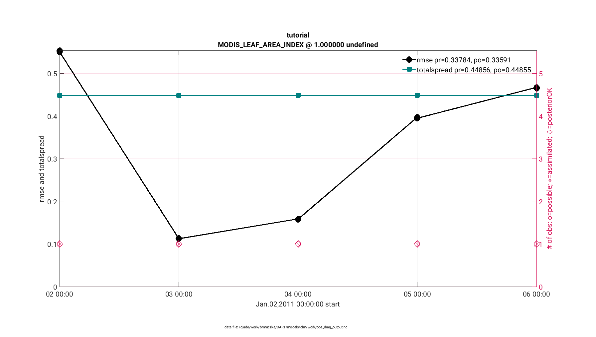
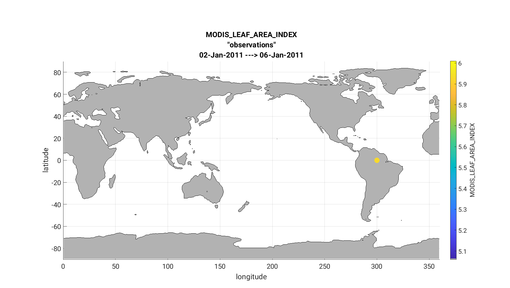
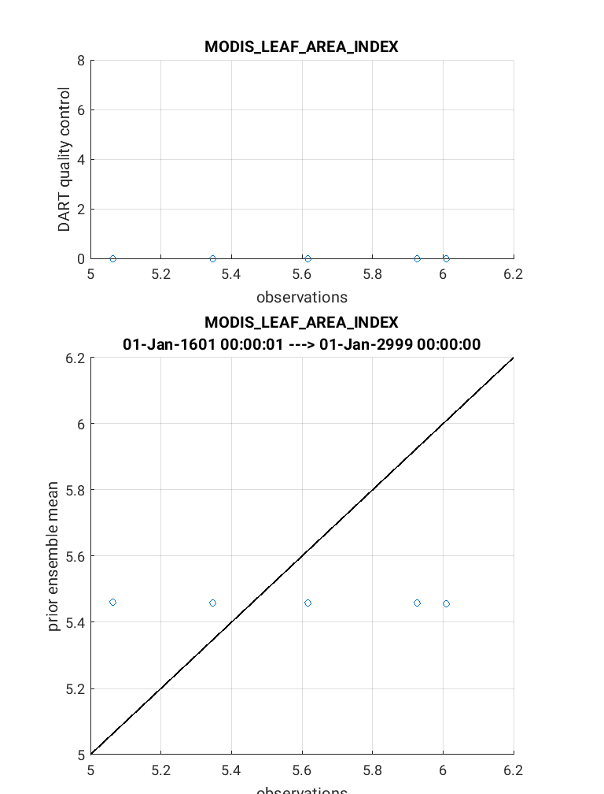

CLM5-DART Tutorial 
==================

Introduction
------------

This tutorial describes how to set up a simple assimilation using CLM5-DART. The
expectation is that the user is very familiar with running CLM off-line
and thus the tutorial focuses upon the specific aspects of integrating CLM
with DART. Once completed, the goal is that the user should be familar enough
with the concepts of CLM5-DART in order to design an assimilation for their own
research interests.

This tutorial was assembled to be compatible with CLM5.0.34 as part
of CESM (release-cesm2.2.01) or CTSM (release-cesm2.2.03) and the latest release on the ``main`` branch of the
the `DART repository. <https://github.com/NCAR/DART.git>`__
Other combinations of CLM and DART (prior to DART version 9.13.0) may not be compatible
with this tutorial. Currently, only the CTSM (release-cesm2.2.03) is fully compatible with Derecho.
If you are using other tags you may need to modify the external scripting to be compatible
with Derecho.

It is not recommended to use this tutorial without prior experience
with running and understanding CLM. If new to CLM we recommend you
attend a `CLM tutorial <https://www.cesm.ucar.edu/events/tutorials/>`__
or review the CLM documentation including the 
`Technical Description, <https://escomp.github.io/ctsm-docs/versions/master/html/tech_note/index.html>`__
`User Guide, <https://escomp.github.io/ctsm-docs/versions/master/html/users_guide/index.html>`__ 
and use the `CESM User Forum <https://bb.cgd.ucar.edu/cesm/>`__
for CLM-specific assistance.

If you are new to DART, we recommend that you become familiar
by first working through the :doc:`../../../theory/readme` and then
understanding the :ref:`DART getting started <Welcome page>` documentation.

This CLM5-DART tutorial is based on a simple example in which we 
describe how to:

1. set up the software
2. review concepts of assimilation 
3. provide a specific example of how CLM and DART interact in an assimilation framework 

If you wish to move beyond this tutorial and address a unique/new
research question be prepared to invest a significant amount of time to
modify the CLM-DART setup.  In general, a CLM-DART simulation that is running
without errors, does not mean it has been optimized for performance.
Optimal performance requires the evaluation of assimilation diagnostics
(e.g. observation acceptance rate, RMSE and bias between modeled and observed
properties) and making additional modifications to the setup scripts. 
Examples of setup modifications include changes to localization, inflation,
observations that are assimilated, updated model state variables, assimilation time window,
assimilation frequency, and the model and observation grid resolution.

We encourage users to complete the tutorial and then modify CLM-DART to pursue their own
research questions.  We have comprehensive and searchable :ref:`documentation
<Welcome page>`, with trained and experienced
staff that can help troubleshoot issues (dart@ucar.edu).

Tutorial Overview
-----------------

The tutorial is a simplified global simulation that 
assimilates daily observations for up to a maximum of 10 days.
A total of 5 observations are distributed across the globe that 
includes observations of leaf area, biomass, snow cover, and
soil temperature. The observations are 'synthetic' meaning
they have been generated from the output of a separate CLM
simulation with random error added. Synthetic observations are
generally easier to assimilate than real-world 
observations because they remove systemic differences between
the model and observations.  This assimilation uses a 5-member
ensemble (i.e. 5 CLM simulations run simultaneously). An ensemble
is required within Ensemble Kalman Filter (EnKF) data assimilation to calculate
the modeled covariance amongst the state variables in CLM.
The covariance amongst the CLM state variables dictates how
the CLM model state is updated during the assimilation step given
a set of observations.  The beginning of the assimilation starts
from near present day (January-2011) and is initalized in 'hybrid' mode from 
a set of CLM restart files generated from a previous CLM 5-member
ensemble simulation. The atmospheric forcing used for the assimilation 
comes from the Community Atmospheric Model (CAM) reanalysis 
(`ds199.1 <https://rda.ucar.edu/datasets/ds199.1/>`__ and `ds345.0 <https://rda.ucar.edu/datasets/ds345.0/>`__).
This reanalysis atmospheric data includes 80 total ensemble members in
which the across-member variation represents atmospheric uncertainty.
We use 5 different ensemble members from the CAM6 reanalysis to generate
spread within this CLM5-DART tutorial simulation.

.. NOTE::

  This CLM5-DART tutorial has been simplified to reduce run-time and
  computational expense. For research applications an assimilation is
  typically run for many model months/years.  In addition a 5-member ensemble is
  generally too small to properly sample model uncertainty and we recommend
  80, but no less than 40 ensemble members for research applications.     
    

The goal of this tutorial is to demonstrate how CLM5 and DART
interact to perform data assimilation to provide an
observation-constrained simulation of CLM. This requires
setting numerous namelist/input values that control the 
configuration of CLM and DART setup. 

After running this tutorial, you should be able to understand the major steps
involved in setting up your own data assimilation experiments.
However, you will need to do additional work to customize the CLM5-DART
system for your particular research needs. For example, this tutorial 
provides both the initial conditions and observation sequence files to simplify
the process and are specific to the tutorial, whereas you will need to generate
custom initial conditions and observation sequence files for your own work.

.. Important ::

  We have provided tutorial instructions for the NSF NCAR
  supercomputer Derecho, however, if using your own machine you will need to 
  customize the setup scripts in order to properly compile DART (see Step 4:
  Compiling DART). These system-specific setup steps may take a good deal of 
  effort, especially if you are unfamiliar with details such as compilers, MPI,
  NetCDF libraries, batch submission systems etc. To perform this tutorial we 
  assume the user is comfortable with LINUX operating systems as well as using 
  text editors (e.g. vi, nedit, emacs) to edit the CLM5-DART setup scripts 
  and namelist files etc.

  Other required files to run the tutorial include the meteorology (Step 5), 
  reference case (Step 6), and observation files (Step 7).  These are all readily available
  if you are using Derecho.  If you are using your own machine you need 
  use the following links to download these files directly:
                      
  1. `CAM6 Reanalysis Meteorology <https://rda.ucar.edu/datasets/ds345.0/>`__,
     Year 2011, ensemble members 1-5 for three separate file types: 
     ``f.e21.FHIST_BGC.f09_025.CAM6assim.011.cpl_000{1-5}.ha2x3h.2011.nc``
     ``f.e21.FHIST_BGC.f09_025.CAM6assim.011.cpl_000{1-5}.ha2x1hi.2011.nc``
     ``f.e21.FHIST_BGC.f09_025.CAM6assim.011.cpl_000{1-5}.ha2x1h.2011.nc`` 
  
  2. `Reference Case and Observations <https://www.image.ucar.edu/pub/DART/CESM/clmdart_tutorial/>`__,
         
     ``clm5_dart_tutorial_2022_03_01.tar.gz``

Step 1: Download CLM5
---------------------

CLM is continually being updated by the model developer and user community
consisting of both NSF NCAR and university scientists and researchers.
In contrast, DART is maintained by a relatively small group that supports
numerous earth system models (20+) including CLM. Therefore the DART team
focuses on only supporting official released versions of CLM.  This documentation
and scripting was tested using the CESM tag ``release-cesm2.2.0`` and
``release-cesm2.2.03`` following
the download instructions `here <https://github.com/ESCOMP/CESM>`__.

Although the DART code may work with more recent versions of CESM (CLM) we recommend
checking out ``release-cesm2.2.03`` which is compatible with both DART and Derecho

  ::

    git clone https://github.com/ESCOMP/CTSM.git cesm_dart
    cd cesm_dart
    git checkout release-cesm2.2.03
    ./manage_externals/checkout_externals

Adding CLM5 SourceMods
----------------------

Some minor modifications have to be made to the CLM5 source code in order
to be run with DART. Most importantly, these include skipping several
balance checks in CLM5 for the time step immediately after the assimilation
update step.  These sourcecode modifications are brought in 
through the SourceMod mechanism in CLM where modifications overwrite
the template sourcecode during the compilation step. The SourceMods
are included within the DART package which is downloaded in Step 2.

For more information on the 
SourceMods see the main :doc:`CLM-DART documentation. <../readme>`

Compiling CLM5
--------------

Compiling CLM5 on the NSF NCAR machine Derecho is straightforward because the 
run and build environment settings are already defined within the ``config_machines.xml``
file located within the CESM installation: ``<cesmroot>/cime/config/cesm/machines``. If
you are using your own machine please follow the porting instructions located 
`here <https://esmci.github.io/cime/versions/master/html/users_guide/porting-cime.html>`__.
When performing a CLM5-DART assimilation run, the compiling step for CLM5 occurs within
the ``CLM5_setup_assimilation`` script described later within this tutorial.

Step 2: Download DART
--------------------- 

The tutorial material is available within the most recent release of the
DART repository on the `main branch <https://github.com/NCAR/DART>`__.

::
 
  cd /glade/work/$USER/
  git clone https://github.com/NCAR/DART.git
  cd DART

Step 3: Navigating DART Scripts
-------------------------------

Below is a table of the key CLM5-DART setup scripts that include the 
settings required to perform an  assimilation run. All scripts are 
located at path ``DART/models/clm/shell_scripts/cesm2_2/`` with the 
exception of ``input.nml`` which is located at ``DART/models/clm/work/``.

You will be asked to locate, edit, and execute these scripts during the tutorial
and they are critical to customizing the assimilation run.  Given their importance, we
introduce them right away.

For additional description of the CLM5-DART scripts and concepts please
visit the main :doc:`CLM-DART documentation <../readme>`
In general, feel free to supplement this tutorial with the main CLM5-DART documentation. 
In some cases it will provide more detailed information than in this tutorial.
If a concept is unclear we recommend using the search bar at the top of this page.

+-------------------------+--------------------------------------------------------------+
|  Key CLM5-DART scripts  |    Description                                               |
+=========================+==============================================================+
| CLM5_setup_assimilation | Main setup script that creates a CLM5-DART assimilation      |
|                         | case. This script sets up ``case``, ``run`` and              |
|                         | ``archive`` directories and stages the necessary files       |
|                         | to the ``run`` directory to create a ``hybrid`` run.         |
|                         | It uses traditional commands ``create_newcase``,             |
|                         | ``case.setup``, ``preview_namelists`` and ``case.build``     |
|                         | included as part of the CESM package.                        |
+-------------------------+--------------------------------------------------------------+
| DART_params.csh         | The companion script to ``CLM5_setup_assimilation``          |
|                         | that defines important case settings for CLM and DART.       |
|                         | The majority of case setting edits occur within this script. |
+-------------------------+--------------------------------------------------------------+
| CESM_DART_config        | Once the case is created, this script turns 'on'             |
|                         | assimilation by providing links between the CLM and DART     |
|                         | code. Converts a 'free' run into an assimilation run.        |
+-------------------------+--------------------------------------------------------------+
| assimilate.csh          | This script is executed during the assimilation case         |
|                         | run-time. It orchestrates communication between CLM and DART.|
|                         | After the CLM forecast step is complete, it calls upon the   |
|                         | DART executables to relay the CLM files (restart, history)   |
|                         | to DART and executes the ``filter`` step to update the CLM   |
|                         | state variable. These updated files are then reinserted      |
|                         | into the restart file for the next CLM forecast step.        |
+-------------------------+--------------------------------------------------------------+
| input.nml               | Contains DART specific namelist settings such as             |
|                         | DA type, inflation, localization, outlier threshold etc.     |
+-------------------------+--------------------------------------------------------------+

Step 4: Compiling DART
----------------------

Similar to CLM, it is necessary to compile the DART code before an assimilation
can be performed.  The DART code includes a variety of build template scripts that provide
the appropriate compiler and library settings depending upon your system environment.
This is an example of the system environment for Derecho (e.g. ``module list``), 
which was used to perform this tutorial:

::

 Currently Loaded Modules:
   1) ncarenv/23.06 (S)   2) intel/19.0.5   3) ncarcompilers/1.0.0   4) hdf5/1.12.2   5) netcdf/4.9.2 

Please note in this example we used the ``intel`` fortran compiler with ``netcdf`` libraries
to support the netcdf file format and the ``mpt`` libraries to support the ``mpi`` tasks.  
      
Below are instructions on how to modify the DART template script ``mkmf_template``
to properly compile DART on Derecho:

::

 cd DART/build_templates
 cp mkmf.template.intel.linux mkmf.template
 
Confirm the ``mkmf_template`` has the following settings:

::
 
 MPIFC = mpif90
 MPILD = mpif90
 FC = ifort
 LD = ifort
 ...
 ...
 INCS = -I$(NETCDF)/include
 LIBS = -L$(NETCDF)/lib -lnetcdff -lnetcdf
 FFLAGS  = -O -assume buffered_io $(INCS)
 LDFLAGS = $(FFLAGS) $(LIBS)

Next we will test to make sure the DART scripts can be run correctly,
by compiling and executing the ``preprocess`` script.  The ``preprocess``
script must be run **before** the core DART code is compiled because
it writes the source code that supports the observations.
This provides the necessary support for the specific
observations that we wish to assimilate into CLM.  For more information
see the :doc:`preprocess documentation. <../../../guide/preprocess-program>`

First make sure the list of ``obs_def`` and ``obs_quantity`` module source codes 
are contained in the ``&preprocess_nml`` namelist within the ``input.nml``.

::

  cd DART/models/clm/work
  vi input.nml

.. Note::

 We use the **vi editor** within the tutorial instructions, but we recommend that
 you use the text editor you are most comfortable with. To close the vi 
 editor follow these instructions from 
 `stackoverflow. <https://stackoverflow.com/questions/11828270/how-do-i-exit-the-vim-editor>`__

This example uses namelist setting that specifically loads ``obs_def`` and 
``obs_quantity`` commonly used for land DA, including models like CLM.
Confirm the ``&preprocess_nml`` settings are as follows:

::

 &preprocess_nml
    input_obs_qty_mod_file  = '../../../assimilation_code/modules/observations/DEFAULT_obs_kind_mod.F90'
    output_obs_qty_mod_file = '../../../assimilation_code/modules/observations/obs_kind_mod.f90'
    input_obs_def_mod_file  = '../../../observations/forward_operators/DEFAULT_obs_def_mod.F90'
    output_obs_def_mod_file = '../../../observations/forward_operators/obs_def_mod.f90'
    obs_type_files          = '../../../observations/forward_operators/obs_def_land_mod.f90',
                              '../../../observations/forward_operators/obs_def_tower_mod.f90',
                              '../../../observations/forward_operators/obs_def_COSMOS_mod.f90'
    quantity_files          = '../../../assimilation_code/modules/observations/land_quantities_mod.f90',
                              '../../../assimilation_code/modules/observations/space_quantities_mod.f90'
                              '../../../assimilation_code/modules/observations/atmosphere_quantities_mod.f90'
    /

Next run quickbuild.sh to build and run preprocess and build the dart exectuables:

::

 ./quickbuild.sh
 
Confirm the new source code has been generated for 
``DART/observations/forward_operators/obs_def_mod.f90`` 
and ``DART/assimilation_code/modules/observations/obs_kind_mod.f90`` 

Step 5: Setting up the atmospheric forcing
------------------------------------------

A requirement for Ensemble Kalman Filter (EnKF) type DA approaches is to generate 
multiple model simulations (i.e. a model ensemble) that quantifies 1) state variable uncertainty
and 2) correlation between state variables.  Given the sensitivity of CLM to 
atmospheric conditions an established method to generate multi-instance CLM
simulations is through weather reanalysis data generated from a CAM-DART assimilation. These
CAM-DART reanalyses are available from 1997-2010 `ds199.1 <https://rda.ucar.edu/datasets/ds199.1/>`__,
and 2011-2020 `ds345.0 <https://rda.ucar.edu/datasets/ds345.0/>`__. 

For this tutorial we will use the January 2011 CAM6 reanalysis (ds345.0) only.  
To make sure the scripts can locate the weather data first make sure
the ``DART_params.csh``  variable ``dartroot`` is set to the path of your
DART installation. For example, if you have a Derecho account and you
followed the DART cloning instructions in Step 2 above your ``dartroot``
variable will be: ``/<your Derecho work directory>/DART``. Make sure you update
the default ``dartroot`` as shown below. 

 ::

  setenv dartroot          /glade/work/${USER}/DART

Next confirm within the ``CLM5_setup_assimilation`` script that the path (``${SOURCEDIR}/${STREAMFILE_*}``) 
to all four of your atmospheric stream file templates (e.g. ``datm.streams.txt.CPLHISTForcing.Solar*``)
is correct. In particular make sure the ``SOURCEDIR`` variable is set correctly below:  

 ::

   set STREAMFILE_SOLAR        = datm.streams.txt.CPLHISTForcing.Solar_single_year
   set STREAMFILE_STATE1HR     = datm.streams.txt.CPLHISTForcing.State1hr_single_year
   set STREAMFILE_STATE3HR     = datm.streams.txt.CPLHISTForcing.State3hr_single_year
   set STREAMFILE_NONSOLARFLUX = datm.streams.txt.CPLHISTForcing.nonSolarFlux_single_year
   ...
   ...
   # Create stream files for each ensemble member
   set SOURCEDIR = ${dartroot}/models/clm/shell_scripts/cesm2_2
   ${COPY} ${SOURCEDIR}/${STREAMFILE_SOLAR}         user_${FILE1} || exit 5
   ${COPY} ${SOURCEDIR}/${STREAMFILE_STATE1HR}      user_${FILE2} || exit 5
   ${COPY} ${SOURCEDIR}/${STREAMFILE_STATE3HR}      user_${FILE3} || exit 5
   ${COPY} ${SOURCEDIR}/${STREAMFILE_NONSOLARFLUX}  user_${FILE4} || exit 5

Next, edit each of your atmospheric stream file templates to make sure the
``filePath`` within ``domainInfo`` and ``fieldInfo`` below is set correctly to
reference the CAM6 reanalysis file.  The example below is for 
``datm.streams.txt.CPLHISTForcing.nonSolarFlux_single_year``.  Repeat this for
all four of the template stream files including for ``Solar``, ``State1hr``
and ``State3hr``.

 ::
   
    <domainInfo>
         <variableNames>
            time          time
            doma_lon      lon
            doma_lat      lat
            doma_area     area
            doma_mask     mask
         </variableNames>
         <filePath>
            /glade/campaign/collections/rda/data/ds345.0/cpl_unzipped/NINST
         </filePath>
         <fileNames>
            f.e21.FHIST_BGC.f09_025.CAM6assim.011.cpl_NINST.ha2x3h.RUNYEAR.nc
         </fileNames>
      </domainInfo>
      ...
      ...
      ...
      <fieldInfo>
         <variableNames>
            a2x3h_Faxa_rainc     rainc
            a2x3h_Faxa_rainl     rainl
            a2x3h_Faxa_snowc     snowc
            a2x3h_Faxa_snowl     snowl
            a2x3h_Faxa_lwdn      lwdn
         </variableNames>
         <filePath>
              /glade/campaign/collections/rda/data/ds345.0/cpl_unzipped/NINST
         </filePath>
         <offset>
            1800
         </offset>
         <fileNames>
            f.e21.FHIST_BGC.f09_025.CAM6assim.011.cpl_NINST.ha2x3h.RUNYEAR.nc
         </fileNames>
      </fieldInfo>

 +--------------------------+--------------------------------------------------------------+
 | Selected variables within|  Description                                                 |
 | atmospheric stream file  |                                                              |
 +==========================+==============================================================+
 | filePath                 | Directory of CAM6 reanalysis file.  For tutorial, this only  |
 |                          | includes year 2011, with ensemble members 1-5. During        |
 |                          | execution of ``CLM5_setup_assimilation`` the text ``NINST``  |
 |                          | is replaced with ensemble member number ``0001-0005``.       |
 |                          | The ensemble member number is set through the                |
 |                          | ``num_instances`` variable located in ``DART_params.csh``.   |
 +--------------------------+--------------------------------------------------------------+
 | fileNames                | The CAM6 reanalysis file name. For the tutorial, this only   |
 |                          | includes year 2011, with ensemble members 1-5. The ``NINST`` |
 |                          | variable is replaced in the same way as described above for  |
 |                          | ``filepath``.  For this tutorial the ``RUNYEAR``             |
 |                          | variable will be replaced by ``2011``.  The ``RUNYEAR``      |
 |                          | variable is set through ``stream_year_first`` located within |
 |                          | ``DART_params.csh``.                                         |
 +--------------------------+--------------------------------------------------------------+
 | variableNames            | Meteorology variables within CAM6 reanalysis. First column   |
 |                          | is variable name within netCDF reanalysis file, whereas      |
 |                          | the second column is the meteorology variable name recognized|
 |                          | by CLM.                                                      |
 +--------------------------+--------------------------------------------------------------+

Finally, edit the ``DART_params.csh`` file such that the ``RUNYEAR`` and ``NINST`` variables
within the atmospheric stream templates are replaced with the appropriate year and 
ensemble member.  To do this confirm the settings within ``DART_params.csh`` are as follows:

::
 
 setenv num_instances  5

  ..
  ..

 setenv stream_year_align 2011
 setenv stream_year_first 2011
 setenv stream_year_last  2011
  
  

Step 6: Setting up the initial conditions for land earth system properties 
--------------------------------------------------------------------------

The initial conditions for the assimilation run are prescribed (all state variables
from the top of vegetation canopy to subsurface bedrock) by a previous 5-member ensemble
run (Case: ``clm5.0.06_f09_80``) that used the same CAM6 reanalysis to generate initial spread
between ensemble members. This is sometimes referred to as an ensemble 'spinup'.  This 
ensemble spinup was run for 10 years to generate sufficient spread amongst ensemble members
for this tutorial.

.. Note::

   The proper ensemble spinup time depends upon the specific research application. In 
   general, the goal is to allow the differences in meterological forcing to induce
   changes within the CLM variables that you plan to adjust during the DART update step. 
   CLM variables that have relatively quick response to atmospheric forcing (e.g. leaf area,
   shallow-depth soil variables) require less spinup time.  However, other CLM variables
   take longer to equilibrate to atmospheric forcing (e.g. biomass, soil carbon).     

This initial ensemble spinup was run with resolution ``f09_09_mg17`` (0.9x1.25 grid resolution)
with compset ``2000_DATM%GSWP3v1_CLM50%BGC-CROP_SICE_SOCN_MOSART_SGLC_SWAV`` (CESM run with 
only land and river components active).  The starting point of the assimilation is run in
CLM 'hybrid' mode which allows the starting date of the assimilaton to be different than
the reference case, and loosens the requirements of the system state.  The tradeoff is that
restarting in hybrid mode does not provide bit-by-bit reproducible simulations.

For the tutorial, set the ``DART_parms.csh`` variables such that the end of the
ensemble spinup (at time 1-1-2011) are used as the initial conditions for the assimilation:

::

 setenv refcase      clm5.0.06_f09_80
 setenv refyear      2011
 setenv refmon       01
 setenv refday       01
 setenv reftod       00000
 ...
 ...
 setenv stagedir /glade/campaign/cisl/dares/glade-p-dares-Oct2023/RDA_strawman/CESM_ensembles/CLM/CLM5BGC-Crop/ctsm_${reftimestamp}
 ...
 ...
 setenv start_year    2011
 setenv start_month   01
 setenv start_day     01
 setenv start_tod     00000

+---------------------------+-------------------------------------------------------------+
| Important variables       |  Description                                                |
| to set initial conditions |                                                             |
+===========================+=============================================================+
| refcase                   | The reference casename from the spinup ensemble that serves |
|                           | as the starting conditions for the assimilation.            |
+---------------------------+-------------------------------------------------------------+
| refyear, refmon, refday   | The year, month, day and time of day of the reference case  |
| reftod                    | that the assimilation will start from.                      |
+---------------------------+-------------------------------------------------------------+
| stagedir                  | The directory location of the reference case files.         |
+---------------------------+-------------------------------------------------------------+

Step 7: Setting up the observations to be assimilated 
-----------------------------------------------------

In 'Step 4: Compiling DART' we have already completed an important
step by executing ``preprocess`` which generates source code 
(``obs_def_mod.f90``, ``obs_kind_mod.f90``) that supports the assimilation of observations
used for this tutorial.  In this step, we compile these observation definitions in to the DART
executables. The observations are read into the
assimilation through an observation sequence file whose format is described 
:doc:`here. <../../../guide/detailed-structure-obs-seq>`

First confirm that the ``baseobsdir`` variable within ``DART_params.csh``
is pointed to the directory where the observation sequence files are 
located. In Derecho they are located in the directory as:

::
 
 setenv baseobsdir             /glade/campaign/cisl/dares/glade-p-dares-Oct2023/Observations/land

In this tutorial we have several observation types that are to be
assimilated, including ``SOIL_TEMPERATURE``, ``MODIS_SNOWCOVER_FRAC``,
``MODIS_LEAF_AREA_INDEX`` and ``BIOMASS``. To enable the assimilation
of these observations types they must be included within 
the ``&obs_kind_nml`` within the ``input.nml`` file as:

::

 &obs_kind_nml
   assimilate_these_obs_types = 'SOIL_TEMPERATURE',
                                'MODIS_SNOWCOVER_FRAC',
                                'MODIS_LEAF_AREA_INDEX',
                                'BIOMASS',
   evaluate_these_obs_types   = 'null'
   /

Below is an example of a single observation (leaf area index)
within an observation sequence file used within this tutorial (``obs_seq.2011-01-02-00000``):

::

   OBS            3
   6.00864688253571
   5.44649167346675
   0.000000000000000E+000
    
   obdef
   loc3d
      5.235987755982989         0.000000000000000        -888888.0000000000     -2
   kind
           23
      0     149750
   0.200000000000000

Below is the same portion of the file as above, but with the variable names:

::

   <Observation sequence number>
   <Observation Value>
   <True Observation Value>
   <Observation Quality Control>
      
   obdef
   loc3d
      <longitude>    <latitude>     <vertical level>     <vertical code>
   kind
     <observation quantity number>
        <seconds>    <days>
   <Observation error variance>

+-----------------------------+-------------------------------------------------------------+
| Observation Sequence File   | Description                                                 |
| Variable                    |                                                             |
+=============================+=============================================================+
| observation sequence        | The chronological order of the observation within the       |
| number                      | observation sequence file.  This determines the order in    |
|                             | which the observation is assimilated by DART for a given    |
|                             | time step.                                                  |
+-----------------------------+-------------------------------------------------------------+
| observation value           | The actual observation value that the DART ``filter`` step  |
|                             | uses to update the CLM model.  This is derived from the     |
|                             | true observation value generated from CLM model output with |
|                             | uncertainty added.                                          |
+-----------------------------+-------------------------------------------------------------+
| true observation value      | The observation generated from CLM output.  In this case    |
|                             | the observation was generated as part of a perfect model    |
|                             | experiment (OSSE; Observing System Simulation Experiment),  |
|                             | thus the 'true' value is known.                             |
+-----------------------------+-------------------------------------------------------------+
| observation quality         | The quality control value provided from the data            |
| control                     | provider.  This can be used as a filter in which to exclude |
|                             | low quality observations from the assimilation.             |
|                             |                                                             |
+-----------------------------+-------------------------------------------------------------+
| longitude, latitude         | Horizontal spatial location of the observation  in radians  |
+-----------------------------+-------------------------------------------------------------+
| level, vertical level type  | Vertical observation location in units defined by           |
| code                        | vertical level type                                         |
+-----------------------------+-------------------------------------------------------------+
| observation type number     | The DART observation type assigned to the obervation type   | 
|                             | (e.g. ``MODIS_LEAF_AREA_INDEX (23)`` -->                    |
|                             | ``QTY_LEAF_AREA_INDEX)``                                    |
+-----------------------------+-------------------------------------------------------------+
| second, days                | Time of the observations in reference to Jan 1, 1601        |
+-----------------------------+-------------------------------------------------------------+
| observation error variance  | Uncertainty of the observation Value                        |
+-----------------------------+-------------------------------------------------------------+

Now that we have set both the path to the observation sequence files, and the types of observations
to be assimilated, confirm the quality control settings  within the ``&quality_control_nml`` of
the ``input.nml`` file are as follows:

::

 &quality_control_nml
    input_qc_threshold = 1.0
    outlier_threshold  = 3.0
    /

+-----------------------------+-------------------------------------------------------------+
| Quality Control Namelist    | Description                                                 |
|                             |                                                             |
+=============================+=============================================================+
| input_qc_threshold          | The quality control value that is provided from the         |
|                             | observation product. Any value above this threshold will    |
|                             | cause the observation to be rejected and ignored during the |
|                             | assimilation step.                                          |   
+-----------------------------+-------------------------------------------------------------+
| outlier threshold           | The observation is rejected if:                             |
|                             | (prior mean - observation) >  (expected                     |
|                             | difference x outlier threshold).  The prior mean is         |
|                             | is calculated from the CLM model ensemble mean, and the     |
|                             | expected difference is the square root of the sum of        |
|                             | the square uncertainty of the prior mean and observation    | 
|                             | uncertainty.                                                |
+-----------------------------+-------------------------------------------------------------+

These quality control settings do not play a role in this tutorial because we 
are using synthetic observations which are, by design, very close to the model output.
Thus, in this tutorial example, systematic biases between the model and observations are
removed.  However, in the case of real observations, it is common for large systemic differences 
to occur between the model and observations either because 1) structural/parametric error
exists within the model or 2) model or observation uncertainty is underestimated. In these
cases it is beneficial to reject observations to promote a stable simulation and prevent
the model from entering into unrealistic state space.    

.. Note::

   This tutorial already provides properly formatted synthetic observations for the user, 
   however, when using 'real' observations for research applications DART provides 
   :doc:`observation converters. <../../../guide/available-observation-converters>`
   Observation converters are scripts that convert the various data product formats into the 
   observation sequence file format required by the DART code.  Observations converters most relevant for 
   land DA and the CLM model include those for :doc:`leaf area, <../../../observations/obs_converters/MODIS/MOD15A2_to_obs>`
   :doc:`flux data, <../../../observations/obs_converters/Ameriflux/level4_to_obs>`
   :doc:`snow, <../../../observations/obs_converters/snow/snow_to_obs>` and 
   :doc:`soil moisture here <../../../observations/obs_converters/NASA_Earthdata/README>` and
   :doc:`here. <../../../observations/obs_converters/NSIDC/SMAP_L2_to_obs>`
   Even if an observation converter is not available for a particular data product, it is generally straightforward
   to modify them for your specific application.
 

Step 8: Setting up the DART and CLM states 
------------------------------------------

Defining the DART state space is a critical part of the assimilation setup process.  This serves
two purposes, first, it defines which model variables are used in the forward operator.  The forward operator
is defined as any operation that converts from model space to observation space to create the
'expected observation'. The mismatch between the true and expected observation forms the foundation
of the model update in the DART ``filter`` step.  

In this tutorial, observations of ``SOIL_TEMPERATURE``, ``MODIS_SNOWCOVER_FRAC``, 
``MODIS_LEAF_AREA_INDEX``, and ``BIOMASS`` are supported by specific clm variables. See the table
below which defines the dependency of each DART **observation type** upon specific DART **quantities** 
required for the forward operator. We also include the CLM variables that serve as the DART
quantities for this tutorial:

+--------------------------+-----------------------------+-----------------+
| DART Observation Type    | DART Observation Quantities | CLM variables   |
+==========================+=============================+=================+
| ``SOIL_TEMPERATURE``     | ``QTY_SOIL_TEMPERATURE``    | ``TSOI``        |
|                          | ``QTY_TEMPERATURE``         | ``T_SOISNO``    |
+--------------------------+-----------------------------+-----------------+
| ``MODIS_SNOWCOVER_FRAC`` | ``QTY_SNOWCOVER_FRAC``      | ``frac_sno``    |
+--------------------------+-----------------------------+-----------------+
| ``MODIS_LEAF_AREA_INDEX``| ``QTY_LEAF_AREA_INDEX``     | ``TLAI``        |
+--------------------------+-----------------------------+-----------------+
| ``BIOMASS``              | ``QTY_LEAF_CARBON``         | ``leafc``       |                   
|                          | ``QTY_LIVE_STEM_CARBON``    | ``livestemc``   |
|                          | ``QTY_DEAD_STEM_CARBON``    | ``deadstemc``   |
+--------------------------+-----------------------------+-----------------+

.. Note::

  For this tutorial example most of the **observation types** rely on a single **quantity**
  (and CLM variable) to calculate the expected observation.  For these the CLM
  variable is spatially interpolated to best match the location of the observation.
  The ``BIOMASS`` observation type is an exception in which 3 **quantities** are required
  to calculate the expected observation.  In that case the sum of the CLM
  variables of leaf, live stem and structural (dead) carbon represents the biomass observation. 
 

Second, the DART state space also defines which portion of the CLM model state is updated by DART. 
In DA terminology, limiting the influence of the observations to a subset of the CLM model
state is known as 'localization' which is discussed more fully in Step 9.
In theory the complete CLM model state may be updated based on the relationship with the observations.
In practice, a smaller subset of model state variables, that have a close physical relationship with
the observations, are included in the DART state space.  In this tutorial, for example, we limit
the update to CLM variables most closely related to biomass, leaf area, soil temperature and
snow. Modify the ``&model_nml`` within ``input.nml`` as below:  

::

 &model_nml
   ...
   ...
   clm_variables  = 'leafc',       'QTY_LEAF_CARBON',            '0.0', 'NA', 'restart' , 'UPDATE',
                    'frac_sno',    'QTY_SNOWCOVER_FRAC',         '0.0', '1.', 'restart' , 'NO_COPY_BACK',
                    'SNOW_DEPTH',  'QTY_SNOW_THICKNESS',         '0.0', 'NA', 'restart' , 'NO_COPY_BACK',
                    'H2OSOI_LIQ',  'QTY_SOIL_LIQUID_WATER',      '0.0', 'NA', 'restart' , 'UPDATE',
                    'H2OSOI_ICE',  'QTY_SOIL_ICE',               '0.0', 'NA', 'restart' , 'UPDATE',
                    'T_SOISNO',    'QTY_TEMPERATURE',            '0.0', 'NA', 'restart' , 'UPDATE',
                    'livestemc',   'QTY_LIVE_STEM_CARBON',       '0.0', 'NA', 'restart' , 'UPDATE',
                    'deadstemc',   'QTY_DEAD_STEM_CARBON',       '0.0', 'NA', 'restart' , 'UPDATE',
                    'TLAI',        'QTY_LEAF_AREA_INDEX',        '0.0', 'NA', 'vector'  , 'NO_COPY_BACK',
                    'TSOI',        'QTY_SOIL_TEMPERATURE',       'NA' , 'NA', 'history' , 'NO_COPY_BACK'
   /

The table below provides a description for each of the columns for ``clm_variables`` within
``&model_nml``.

.. container::

   ======== ============================================================== 
    Column  Description
   ======== ============================================================== 
    **1**   The CLM variable name as it appears in the CLM netCDF file.
    **2**   The corresponding DART QUANTITY.
    **3**   | Minimum value of the posterior.
            | If set to 'NA' there is no minimum value.
            | The DART diagnostic files will not reflect this value, but
            | the file used to restart CLM will.
    **4**   | Maximum value of the posterior.
            | If set to 'NA' there is no maximum value.
            | The DART diagnostic files will not reflect this value, but
            | the file used to restart CLM will.
    **5**   | Specifies which file should be used to obtain the variable.
            | ``'restart'`` => clm_restart_filename
            | ``'history'`` => clm_history_filename
            | ``'vector'``  => clm_vector_history_filename
    **6**   | Should ``filter`` update the variable in the specified file.
            | ``'UPDATE'`` => the variable is updated.
            | ``'NO_COPY_BACK'`` => the variable remains unchanged.
   ======== ============================================================== 

There are **important** distinctions about the ``clm_variables`` as described above. 
**First**, any clm variable whether it is a ``restart``, ``history`` or ``vector`` file can be used
as a forward operator to calculate the expected observation.  Also if the 6th column
is defined as ``UPDATE``, then that variable is updated during the ``filter`` step 
regardless of the CLM variable type. **However**, in order for the update step to have a
permanent effect upon the evolution of the CLM model state, the update must be applied to a
prognostic variable in CLM -- which is always the ``restart`` file.  Updates to ``restart``
file variables alters the file thus changing the initial conditions for the next time
step.  The CLM ``history`` and ``vector`` files, on the other hand, are diagnostic variables
with no impact on the evolution of the model state.

A **second** important distinction amongst ``clm_variables`` is that the ``restart`` file
state variables are automatically generated after each CLM simulation time step, thus are readily
available to include within the DART state. In contrast, the ``history`` or ``vector`` file variables
must be manually generated through the ``user_nl_clm`` file within CLM.  This is generated
within the portion of the ``CLM5_setup_assimilation`` script as shown below.  Modify this
portion of the ``CLM5_setup_assimilation`` script so that it appears as follows:

::

   ...
   ...
   echo "hist_empty_htapes = .true."                                      >> ${fname}
   echo "hist_fincl1 = 'NEP','H2OSOI','TSOI','EFLX_LH_TOT','TLAI'"        >> ${fname}
   echo "hist_fincl2 = 'NEP','FSH','EFLX_LH_TOT_R','GPP'"                 >> ${fname}
   echo "hist_fincl3 = 'NEE','H2OSNO','TLAI','TWS','SOILC_vr','LEAFN'"    >> ${fname}
   echo "hist_nhtfrq = -$stop_n,1,-$stop_n"                               >> ${fname}
   echo "hist_mfilt  = 1,$h1nsteps,1"                                     >> ${fname}
   echo "hist_avgflag_pertape = 'A','A','I'"                              >> ${fname}
   echo "hist_dov2xy = .true.,.true.,.false."                             >> ${fname}
   echo "hist_type1d_pertape = ' ',' ',' '"                               >> ${fname}

The ``hist_fincl`` setting generates history files (``fincl1->h0``; ``fincl2->h1``; 
``fincl3->h2``) for each of the clm variables as defined above. The 
``hist_dov2xy`` setting determines whether the history file is output
in structured gridded format (``.true.``) or in unstructured, vector history format (``.false.``).
Most of the history files variables in this example are provided just for illustration, however,
the tutorial requires that the ``TLAI`` variable is output in vector history format.

The ``restart``, ``history`` and ``vector`` files define domains 1, 2 and 3 respectively
within DART. The ``restart`` domain (domain 1) must always be defined, however domains 2 and 3 are optional.
In this tutorial example all 3 domains are required, where domain 2 corresponds to the
``h0`` history file, and domain 3 corresponds with the ``h2`` history files. 

  

Step 9: Set the spatial localization 
------------------------------------

Localization is the term used to restrict the portion of the state to regions 
related to the observation.  Step 8 is a type of localization in that it restricts
the state update to a subset of CLM variables.  Here, we further restrict the influence
of the observation to the state space most nearly physically collocated with the observation.
The spatial localization is set through the the ``assim_tools_nml``, ``cov_cutoff_nml``
and ``location_nml`` settings witin ``input.nml`` as: 

::

 # cutoff of 0.03 (radians) is about 200km
 &assim_tools_nml
    filter_kind                     = 1
    cutoff                          = 0.05

::

 &cov_cutoff_nml
   select_localization = 1
   /

::
 
 &location_nml
    horiz_dist_only             = .true.

+-----------------------------+--------------------------------------------------------------+
| Localization namelist       | Description                                                  |
| variable                    |                                                              |
+=============================+==============================================================+
| ``cutoff``                  | Value (radians) of the half-width of the localization radius.|
|                             | At 2* ``cutoff`` distance between observation and model      |
|                             | state, the observation has no impact on state.               |
+-----------------------------+--------------------------------------------------------------+
| ``select_localization``     | Defines a function that determines the decreasing impact     |
|                             | an observation has on the model state.  Value of 1 is        |
|                             | the Gaspari-Cohn function.                                   |
+-----------------------------+--------------------------------------------------------------+
| ``horiz_dist_only``         | If ``.true.`` localization applied only horizontally.  If    |
|                             | ``.false.`` localization also applied in vertical.           |
+-----------------------------+--------------------------------------------------------------+

In some research applications (not this tutorial) it may also be important to
localize in the vertical direction.  For land modeling this could be important
for soil carbon or soil moisture variables which typically only have observations
near the land surface, whereas the model state is distributed in layers well
below the surface.  For vertical localization the ``horiz_dist_only`` must be set
to ``.false.`` For more information on localization see
:doc:`assim_tools_mod. <../../../assimilation_code/modules/assimilation/assim_tools_mod>` 

Step 10: Set the Inflation 
--------------------------

Generating and maintaining ensemble spread during the assimilation
allows for the covariance to be calculated between model state variables (that we want
to adjust) and the expected observation. The strength of the covariance determines
the model update. For CLM-DART assimilations the ensemble spread is generated through
a boundary condition: the atmospheric forcing as described in Step 5. However, because
the number of ensemble members is limited and boundary condition uncertainty is only
one source of model uncertainty, the true ensemble spread is undersampled. To help
compensate for this we employ **inflation** during the assimilation which changes
the spread of the ensemble without changing the ensemble mean. The **inflation** 
algorithm computes the ensemble mean and standard deviation for each variable in
the state vector in turn, and then moves the member’s values away from the mean 
in such a way that the mean remains unchanged.  

Although **inflation** was originally designed to account for ensemble sampling errors,
it has also been demonstrated to help address systemic errors between models and
observations as well. More information on inflation can be found 
:doc:`here. <../../../guide/inflation>`

In this tutorial we implement a time and space varying inflation (inflation flavor
5: enhanced spatial-varying; inverse gamma) such that the inflation becomes an 
added state property which is updated during each assimilation
step similar to CLM state variables.  The inflation state properties include 
both a mean and standard deviation. The mean value determines how much spread
is added across the ensemble (spread is generated when mean > 1).  The standard deviation
defines the certainty of the mean inflation value, thus a small value 
indicates high certainty and slow evolution of the mean with time. Conversely a high
standard deviation indicates low certainty and faster evolution of the inflation mean with time.   

Modify the inflation settings within ``input.nml`` for the ``&filter_nml`` and
the ``&fill_inflation_restart_nml`` as follows:

.. Note::
   The ``&filter_nml`` has two columns, where column 1 is for prior inflation
   and column 2 is for posterior inflation. We only use prior inflation for
   this tutorial, thus inf_flavor=0 (no inflation) for column 2. 

::

 &filter_nml

   ...
   ...
   ...
   inf_flavor                  = 5,                       0
   inf_initial_from_restart    = .true.,                 .false.
   inf_sd_initial_from_restart = .true.,                 .false.
   inf_deterministic           = .true.,                  .true.
   inf_initial                 = 1.0,                     1.0
   inf_lower_bound             = 0.0,                     1.0
   inf_upper_bound             = 20.0,                   20.0
   inf_damping                 = 0.9,                     0.9
   inf_sd_initial              = 0.6,                     0.6
   inf_sd_lower_bound          = 0.6,                     0.6
   inf_sd_max_change           = 1.05,                    1.05

::

 &fill_inflation_restart_nml
    write_prior_inf   = .true.
    prior_inf_mean    = 1.00
    prior_inf_sd      = 0.6
    ...
    ...
 
+--------------------------------+---------------------------------------------------------------+
| Inflation namelist             | Description                                                   |
| variable                       |                                                               |
+================================+===============================================================+
| ``inf_flavor``                 | The inflation algorithm type as described below:              |
|                                |                                                               |
|                                | - 0: No inflation (Prior and/or Posterior) and all other      |
|                                |   inflation variables are ignored                             |
|                                | - 2: Spatially-varying state space inflation (gaussian)       |
|                                | - 3: Spatially-uniform state space inflation (gaussian)       |
|                                | - 4: Relaxation To Prior Spread (Posterior inflation only)    |     
|                                | - 5: Enhanced Spatially-varying state space inflation         | 
|                                |   (inverse gamma)                                             |             
+--------------------------------+---------------------------------------------------------------+
| ``inf_initial_from_restart``   | If ``.true.`` will read inflation settings from file named    |
|                                | ``input_{prior,post}inf_mean.nc``. If ``.false.`` will take   |
|                                | inflation settings from ``&filter_nml``.                      |
+--------------------------------+---------------------------------------------------------------+
| ``inf_sd_initial_from_restart``| If ``.true.`` will read inflation settings from file named    |
|                                | ``input_{prior,post}inf_sd.nc``. If ``.false.`` will take     |
|                                | inflation settings from ``&filter_nml``.                      | 
+--------------------------------+---------------------------------------------------------------+
| ``inf_deterministic``          | If ``.true.`` inflation is determinstic, if ``.false.``       |
|                                | inflation is stochastic                                       |
+--------------------------------+---------------------------------------------------------------+                           
| ``inf_initial``                | Initial value of inflation if not read from restart file      |
+--------------------------------+---------------------------------------------------------------+
| ``inf_lower_bound``            | Lower bound of inflation mean value                           |
+--------------------------------+---------------------------------------------------------------+
| ``inf_upper_bound``            | Upper bound of inflation mean value                           |
+--------------------------------+---------------------------------------------------------------+
| ``inf_damping``                | Damping factor for inflation mean values. The difference      |  
|                                | between the current inflation value and 1.0 is multiplied by  |
|                                | this factor and added to 1.0 to provide the next inflation    |
|                                | mean. An ``inf_damping = 0`` turns inflation off, and         |
|                                | ``inf_damping =1`` turns damping off.                         |
+--------------------------------+---------------------------------------------------------------+
| ``inf_sd_initial``             | Initial value of inflation standard deviation if not read     |
|                                | from restart file. If ≤ 0, do not update the inflation        |
|                                | values, so they are time-constant. If positive, the           |
|                                | inflation values will adapt through time.                     |
+--------------------------------+---------------------------------------------------------------+
| ``inf_sd_lower_bound``         | Lower bound for inflation standard deviation. If using a      |  
|                                | negative value for inf_sd_initial this should also be         |
|                                | negative to preserve the setting.                             |
+--------------------------------+---------------------------------------------------------------+
| ``inf_sd_max_change``          | For ``inf_flavor 5`` (enhanced inflation), controls the       |
|                                | maximum change of the inflation standard deviation when       | 
|                                | adapting for the next assimilation cycle. The value should    | 
|                                | be between 1.0 and 2.0. 1.0 prevents any changes, while 2.0   |
|                                | allows 100% change. For the enhanced inflation option, if     | 
|                                | the standard deviation initial value is equal to the          |
|                                | standard deviation lower bound, the standard deviation will   |
|                                | not adapt in time.                                            |
|                                |                                                               |
+--------------------------------+---------------------------------------------------------------+
| ``write_prior_inf``            | Setting this to ``.TRUE.`` enables ``fill_inflation_restart`` |
|                                | and writes a spatially uniform  prior inflation mean and      | 
|                                | standard deviation files:``input_priorinf_mean.nc``           |
|                                | ``input_priorinf_sd.nc`` for the first time-step only.        |
+--------------------------------+---------------------------------------------------------------+
| ``prior_inf_mean``             | Initial value of prior inflation mean when                    |
|                                | ``write_prior_inf = .TRUE.``                                  |
+--------------------------------+---------------------------------------------------------------+
| ``prior_inf_sd``               | Initial value of prior inflation standard deviation when      |
|                                | ``write_prior_inf = .TRUE.``                                  |
+--------------------------------+---------------------------------------------------------------+               

It is also important to confirm that the domains defined in Step 8 (``restart``, ``history``, ``vector``)
are the same as what is defined in the ``&fill_inflation_restart_nml`` and ``&filter_nml`` namelist settings.
Confirm the input and output file list account for all 3 domains as:

::

 &filter_nml
    input_state_file_list    = 'restart_files.txt',
                               'history_files.txt',
                               'vector_files.txt'
    output_state_file_list   = 'restart_files.txt',
                               'history_files.txt',
                               'vector_files.txt'

::

 &fill_inflation_restart_nml
   input_state_files = 'clm_restart.nc','clm_history.nc','clm_vector_history.nc'
   single_file       = .false.

.. Important::

  The ``input_state_file_list``, ``output_state_file_list`` and ``input_state_files`` must match the domains
  that were defined in Step 8.   

The ``assimilate.csh`` script assigns the CLM file that defines each domain. In this tutorial
the ``restart``, ``history`` and ``vector`` domains are defined by the ``.r.``,
``.h0.`` and ``.h2.`` files respectively. ***We show the portions of the assimilate.csh script
below for illustration purposes only.  Do not modify these lines for the tutorial.***  

The domains are set within the ``Block 4: DART INFLATION`` portion of the
script as:

::

 set     LND_RESTART_FILENAME = ${CASE}.clm2_0001.r.${LND_DATE_EXT}.nc
 set     LND_HISTORY_FILENAME = ${CASE}.clm2_0001.h0.${LND_DATE_EXT}.nc
 set LND_VEC_HISTORY_FILENAME = ${CASE}.clm2_0001.h2.${LND_DATE_EXT}.nc

and set again during the ``Block 5: REQUIRED DART namelist settings`` in prepration for
the ``filter`` step as:

::
  
 ls -1         clm2_*.r.${LND_DATE_EXT}.nc  >! restart_files.txt
 ls -1 ${CASE}.clm2_*.h0.${LND_DATE_EXT}.nc >! history_files.txt
 ls -1 ${CASE}.clm2_*.h2.${LND_DATE_EXT}.nc >! vector_files.txt

Step 11: Complete the Assimilation Setup
---------------------------------------- 

A few setup steps remain before the assimilation case can be executed.  First, the complete
list of DART executables must be generated.  At this point you should have already customized
your ``mkmf.template`` and tested your local build environment in Step 4.  In this step,
you must compile the rest of the required DART scripts to perform the assimilation as follows:

::

 cd DART/models/clm/work/
 ./quickbuild.sh

After completion the following DART executables should be available within your ``work``
folder.

::

  preprocess
  advance_time
  clm_to_dart
  create_fixed_network_seq
  create_obs_sequence
  dart_to_clm
  fill_inflation_restart
  obs_diag
  obs_seq_to_netcdf
  obs_sequence_tool
  filter
  perfect_model_obs
  model_mod_check

Next modify the ``DART_params.csh`` settings such that the directories match
your personal environment.  

Modify the ``cesmtag`` and ``CASE`` variable:

::
 
 setenv cesmtag        <your cesm installation folder>
 setenv resolution     f09_f09_mg17
 setenv compset        2000_DATM%GSWP3v1_CLM50%BGC-CROP_SICE_SOCN_MOSART_SGLC_SWAV

  ..
  ..

 if (${num_instances} == 1) then
   setenv CASE clm5_f09_pmo_SIF
 else
   setenv CASE <your tutorial case name>
 endif

Modify the ``SourceModDir`` to match the directory that you set
in Step 1:

::

 setenv use_SourceMods TRUE
 setenv SourceModDir   <your SourceMods directory>

Confirm the following variables are set to match your personal
environment, especially ``cesmroot``, ``caseroot``, ``cime_output_root``,
``dartroot`` and ``project``. 

::

 setenv cesmdata         /glade/campaign/cesmdata/cseg/inputdata
 setenv cesmroot         /glade/work/${USER}/CESM/${cesmtag}
 setenv caseroot         /glade/work/${USER}/cases/${cesmtag}/${CASE}
 setenv cime_output_root /glade/derecho/scratch/${USER}/${cesmtag}/${CASE}
 setenv rundir           ${cime_output_root}/run
 setenv exeroot          ${cime_output_root}/bld
 setenv archdir          ${cime_output_root}/archive
 ..
 ..
 setenv dartroot         /glade/work/${USER}/DART
 setenv baseobsdir       /glade/campaign/cisl/dares/glade-p-dares-Oct2023/Observations/land
 ..
 ..
 setenv project      <insert project number>
 setenv machine      derecho

Step 12: Execute the Assimilation Run
-------------------------------------

Set up the assimilation case by executing ``CLM5_setup_assimilation``

::

 cd DART/models/clm/shell_scripts/cesm2_2/
 ./CLM5_setup_assimilation

It takes approximately 7-10 minutes for the script to create the assimilation case
which includes compiling the CESM executable.  The script is submitted to 
a login node where it performs low-intensive tasks including the execution of
``case_setup``, and ``preview_namelist`` and stages the appropriate files in the ``rundir``.

.. Caution::

 Once the setup is complete the script will output steps
 (1-8) displaying 'Check the case'. These steps are good for general reference,
 however, **for the tutorial ignore these steps and continue to follow the instructions
 below.**  

After the case is created, by default, it is set up as a 'free' or 'open-loop'
run.  This means if the case is submitted as is, it will perform a normal CLM 
simulation without using any DART assimilation.  In order to enable DART
do the following:

::

 cd <caseroot>
 ./CESM_DART_config

.. Caution::

 After the script is executed and DART is enabled 'Check the DART configuration:'
 will be displayed followed by suggested steps (1-5). As before these steps are good for
 general reference, however, **for the tutorial ignore these steps and continue to follow
 the instructions below.** 

Now that DART is enabled, confirm, and if necessary, modify the run-time
settings to perform daily assimilations for 5 total days. Use the
scripts ``xmlquery`` to view the current settings (e.g. ``./xmlquery STOP_OPTION``), or
you can view all the environment run settings within ``env_run.xml``.
Use the ``xmlchange`` command to change the current setting (e.g. ``./xmlchange STOP_OPTION=nhours``).
Make sure the run-time settings are as follows:

::
 
 DATA_ASSIMILATION_LND=TRUE
 DATA_ASSIMILATION_SCRIPT= <dartroot>/models/clm/shell_scripts/cesm2_2/assimilate.csh
 STOP_OPTION=nhours
 STOP_N=24
 DATA_ASSIMILATION_CYCLES=5
 RESUBMIT=0
 CONTINUE_RUN=FALSE

+-----------------------------+-------------------------------------------------------------+
| Run Time Assimilation Case  | Description                                                 |
| Settings                    |                                                             |
+=============================+=============================================================+
| ``DATA_ASSIMILATION_LND``   | If ``.TRUE.`` data assimilation is enabled.  If ``.FALSE.`` |
|                             | no data assimilation is performed, and simulation is        |
|                             | performed as a normal CLM run.                              |
+-----------------------------+-------------------------------------------------------------+
| ``DATA_ASSIMILATION_SCRIPT``| Location of script ``assimilate.csh`` that performs the     |
|                             | assimilation.  Controls execution of DART scripts and passes|
|                             | files between DART and CLM code.                            |
+-----------------------------+-------------------------------------------------------------+
| ``STOP_OPTION``             | Unit of time that controls duration of each assimilation    |
|                             | cycle (see ``STOP_N``)                                      |
+-----------------------------+-------------------------------------------------------------+
| ``STOP_N``                  | Duration of each assimilation cycle in units of time        |
|                             | defined by ``STOP_OPTION``                                  |
+-----------------------------+-------------------------------------------------------------+
| ``DATA_ASSIMILATION_CYCLES``| The number of assimilation cycles performed for a single    |
|                             | job submission                                              |
+-----------------------------+-------------------------------------------------------------+
| ``RESUBMIT``                | The number of times each job submission is repeated as      |
|                             | defined by ``STOP_OPTION``, ``STOP_N``, and                 |
|                             | ``DATA_ASSIMILATION_CYCLES``                                |
+-----------------------------+-------------------------------------------------------------+
| ``CONTINUE_RUN``            | If ``.FALSE.`` this is the startup of the assimilation run  |
|                             | beginning from the ``refcase``.  If ``.TRUE.`` this is a    |
|                             | continuation of a previous assimilation run.                |
+-----------------------------+-------------------------------------------------------------+ 

 
Before submission review your ``input.nml`` within your case folder to confirm
the settings reflect those from previous steps of the tutorial.  Next submit
the assimilation run:

::

 > cd <caseroot>
 > ./case.submit

Check the status of the job on Derecho using PBS commands to determine if job
is queued (Q), running (R) or completed.

::

 qstat -u <your username>

The job requires approximately 5-10 minutes of runtime to complete the requested 
5 assimilation cycles.

.. Tip::
 The DART code provides the script ``stage_cesm_files`` within ``<caseroot>`` to restart an assimilation
 case.  This script re-starts the assimilation at a prior point in time by re-staging the proper restart
 files to the ``<rundir>`` and edits the ``rpointer`` files to reference the re-staged files. 
 This script comes in handy if an assimilation run fails or if the user modifies the ``input.nml``
 settings and does not want to  re-create the assimilation case from scratch using 
 ``CLM5_setup_assimilation``.

 Also the ``stage_dart_files`` script is available if the user makes changes to the DART source code
 after an assimilation case has been created.  Changes to the DART source code requires the
 executables to be re-compiled within ``<dartroot>/models/clm/work``.  Executing ``stage_dart_files``
 transfers the DART executables to ``<exeroot>`` making them available when the case is submitted.

Step 13: Diagnose the Assimilation Run
--------------------------------------

Once the job has completed it is important to confirm it ran as expected
without any errors.  To confirm this view the ``CaseStatus`` files:

::

 cd <caseroot>
 cat CaseStatus

A successful assimilation run will look like the following at the end
of the file with ``case.run success`` at the end:

::

 2022-01-14 14:21:11: case.submit starting 
 ---------------------------------------------------
 2022-01-14 14:21:18: case.submit success case.run:2684631.desched1
 ---------------------------------------------------
 2022-01-14 14:21:28: case.run starting 
 ---------------------------------------------------
 2022-01-14 14:21:33: model execution starting 
 ---------------------------------------------------
 2022-01-14 14:23:58: model execution success 
 ---------------------------------------------------
 2022-01-14 14:23:58: case.run success 
 ---------------------------------------------------

A failed run will provide an error message and a log file either from
CESM or DART that hopefully provides more details of the error. This
will look like this:

::

 ---------------------------------------------------
 2022-01-14 14:24:57: case.run starting 
 ---------------------------------------------------
 2022-01-14 14:24:58: model execution starting 
 ---------------------------------------------------
 2022-01-14 14:25:08: model execution error 
 ERROR: Command: 'mpiexec -p "%g:" 
 /glade/derecho/scratch/bmraczka/ctsm_cesm2.2.03/clm5_assim_e5/bld/cesm.exe 
 >> cesm.log.$LID 2>&1 ' failed with error '' from dir 
 '/glade/derecho/scratch/bmraczka/ctsm_cesm2.2.03/clm5_assim_e5/run'
 ---------------------------------------------------
 2022-01-14 14:25:08: case.run error 
 ERROR: RUN FAIL: Command 'mpiexec -p "%g:" 
 /glade/derecho/scratch/bmraczka/ctsm_cesm2.2.03/clm5_assim_e5/bld/cesm.exe   >> 
 cesm.log.$LID 2>&1 ' failed See log file for details: 
 /glade/derecho/scratch/bmraczka/ctsm_cesm2.2.03/clm5_assim_e5/run/cesm.log.2684631.desched1.231222-142931

If the case ran successfully proceed to the next step in the tutorial, **but if 
the case did not run successfully** locate the log file details which describe
the error and resolve the issue.  Contact dart@ucar.edu if necessary.

Just because an assimilation ran successfully (without errors) does not mean
it ran with good performance. A simple, first check after any assimilation is to 
make sure:

1) Observations have been  accepted
2) The CLM posterior member values are updated from their prior values

A quick way to confirm observation acceptance and the posteriors have been updated
is through the ``obs_seq.final`` file located in your case run folder. Below we provide
an example of a successful update (``clm_obs_seq.2011-01-02-00000.final``)  which is
derived from the same leaf area observation in ``obs_seq.2011-01-02-00000`` as described
in Step 7.  

::

 OBS            3
   6.00864688253571
   5.44649167346675
   5.45489142211957
   5.45808308572015
   3.479253215076174E-002
   3.469211455745640E-002
   5.41512442472872
   5.41843086313655
   5.44649167346675
   5.44970758027390
   5.50877061923831
   5.51180677764943
   5.46367193547511
   5.46683825691274
   5.44039845768897
   5.44363195062815
   0.000000000000000E+000
   0.000000000000000E+000
           2           4          -1
 obdef
 loc3d
     5.235987755982989         0.000000000000000        -888888.0000000000     -2
 kind
          23
     0     149750
  0.200000000000000

Below we provide the variable names for the ``clm_obs_seq.2011-01-02-00000.final``
example from above.

::

   <observation sequence number>
   <observation value>
   <true observation value>
   <prior ensemble mean>
   <posterior ensemble mean>
   <prior ensemble spread>
   <posterior ensemble spread>
   <prior member 1>
   <posterior member 1>
   <prior member 2>
   <posterior member 2>
   <prior member 3>
   <posterior member 3>
   <prior member 4>
   <posterior member 4>
   <prior member 5>
   <posterior member 5>
   <data product QC>
   <DART quality control>
 
 obdef
 loc3d
     <longitude>    <latitude>   <vertical level>   <vertical code>
 kind
    <observation quantity number>
    <seconds>     <days>
    <observation error variance>

In the example above, the observation has been **accepted**
denoted by a ``DART quality control value = 0``. If the 
``DART quality control value =7`` this indicates the observation has
fallen outside the ``outlier_threshold`` value and is rejected. 
For more details on the DART quality control variables read the  
:doc:`documentation. <../../../assimilation_code/modules/assimilation/quality_control_mod>`

Now, compare your ``clm_obs_seq.final`` file to the example provided above:

::

  cd <rundir>
  less clm_obs_seq.2011-01-02-00000.final

First, confirm that the observation (and other observations) was accepted.

Second, confirm that the ``posterior member`` values have been updated
from their respective ``prior member`` values.  Your simulation has run
successfully if the ``posterior member`` and ``posterior ensemble mean``
values have moved closer to the `observation value` as compared to
the prior values.

Do not expect your own ``clm_obs_seq.final`` file to be bit-by-bit identical 
(i.e. identical to the 14th decimal place) to the example given above.
Slight changes in compiler and run time environment are known to cause
small changes when running CLM-DART.  Furthermore, CLM is set up
to run in ``hybrid`` mode, which unlike ``branch`` mode does not provide
bit-by-bit reproducibility. 

This tutorial has been purposely designed such that all observations
are accepted and the posteriors have been updated.  In research applications,
however, the vast majority of observations may be rejected if there is
large systemic biases between the model ensemble and the observations.
In that case, it may take many assimilation time steps before the inflation
creates a sufficient enough ensemble spread such that the observation falls
within the outlier threshold and is accepted.  In other cases, 
an observation may be accepted, but the posterior update is negligible. 
If you experience these issues, a helpful troubleshooting guide is 
located :doc:`here. <../../../guide/dart-quality-control>`

Matlab Diagnostics
------------------

Once you have confirmed that the assimilation has been completed
reasonably well as outlined by the steps above, the DART package includes
a wide variety of Matlab diagnostic scripts that provide a more formal evaluation
of assimilation performance.  These diagnostics can provide clues
to further maximize performance through adjustments of the DART settings 
(localization, inflation, etc.). The full suite of diagnostic scripts can be found
at this path in your DART installation (``DART/diagnostics/matlab``) with supporting 
documentation found :doc:`here. <../../../guide/matlab-observation-space>`

.. Note::
   
 Additional scripts that are designed for CLM output visualization
 can be found here (``DART/models/clm/matlab``).  The ``clm_get_var.m`` and ``clm_plot_var.m``
 scripts are designed to re-constitute a vector-based file (e.g. restart.nc) into 
 gridded averages to allow viewing of spatial maps.  These scripts are helpful to
 view the model update by DART (innovations). An example of how to implement these
 scripts can be found here (``DART/models/clm/matlab/README.txt``).

          
Here we provide instructions to execute two highly recommended matlab scripts.
First, the ``plot_rmse_xxx_evolution.m`` script provides a time series of 
assimilation statistics of 1) observation acceptance, 2) RMSE between
the observations and the expected observation (derived from the CLM state),
and 3) a third statistic of your choosing (we recommended 'total spread').

The observation acceptance statistic compares the number of observations assimilated
versus the number of observations available for your domain.  In general, it
is desirable to assimilate the majority of observations that are available.
The RMSE statistic quantifies the mismatch between the observations and the
CLM state.  A successful assimilation reduces the RMSE, thus reducing the mismatch
between the observations and the CLM state. Finally the total spread provides
contributions from the ensemble spread and observation error variance. This value
should be comparable to the RMSE.

To execute ``plot_rmse_xxx_evolution.m`` do the following:

::
 
 cd DART/models/clm/work

Confirm the DART executables used for the matlab diagnostics exist.
These should have been compiled during Step 11 of this tutorial.
The important DART executables for the diagnostics are
``obs_diag`` and ``obs_seq_to_netcdf``.  If they do not exist,
perform the ``./quickbuild.sh`` command to create them.

Next generate a text file that includes all the ``clm_obs_seq*.final``
files that were created from the tutorial simulation

::
 
 ls <rundir>/*final > obs_seq_files_tutorial.txt 

Next edit the ``&obs_diag_nml`` namelist within the ``input.nml``.
to assign the `obs_seqence_list` 
to the text file containing the names of the ``clm_obs_seq*.final``
files associated with the tutorial.  Next, specify how the
observations are displayed by defining the ``bin`` settings, which
for this tutorial are set such that every day of observations
are displayed individually. Because the tutorial is a global run
we define the ``lonlim`` and ``latlim`` setting to include the
entire globe.  For more information about the  ``obs_diag`` namelist
settings go :doc:`here.  <../../../assimilation_code/programs/obs_diag/threed_sphere/obs_diag>`

::

 &obs_diag_nml
   obs_sequence_name = ''
   obs_sequence_list = 'obs_seq_files_tutorial.txt'
   first_bin_center =  2011, 1,  2, 0, 0, 0
   last_bin_center  =  2011, 1,  6, 0, 0, 0
   bin_separation   =     0, 0,  1, 0, 0, 0
   bin_width        =     0, 0,  1, 0, 0, 0
   time_to_skip     =     0, 0,  0, 0, 0, 0
   max_num_bins     = 1000
   trusted_obs      = 'null'
   Nregions   = 1
   lonlim1    =     0.0,     
   lonlim2    =   360.0,   
   latlim1    =   -90.0,     
   latlim2    =    90.0,   
   reg_names  = 'tutorial', 
   hlevel_edges =  0.0, 1.0, 2.0, 5.0, 10.0, 40.0
   print_mismatched_locs = .false.
   create_rank_histogram = .true.
   outliers_in_histogram = .true.
   use_zero_error_obs    = .false.
   verbose               = .true.
   /

Next convert the information in the ``clm_obs_seq*.final`` files into
a netcdf format (``obs_diag_output.nc``) by executing the 
``obs_diag`` executable.

::
 
   ./obs_diag

Next, use Matlab to create the ``plot_rmse_xxx_evolution.m`` figures.
Note that this function automatically plots the RMSE, where the ``copy``
and the ``obsname`` variable are customizable.

::

 cd DART/diagnostics/matlab
 module load matlab
 matlab -nodesktop
 >> fname   = '<dartroot>/models/clm/work/obs_diag_output.nc';
 >> copy    = 'totalspread';
 >> obsname = 'MODIS_LEAF_AREA_INDEX';
 >> plotdat = plot_rmse_xxx_evolution(fname, copy, 'obsname', obsname);

.. Tip::
 When remotely logged into Derecho there is a time delay when the Matlab figures are rendering,
 and also when interacting with the figures.  For the purposes of this tutorial this
 delay is minimal. However, to improve responsiveness for your own research you may find it
 convenient to port your diagnostic files (e.g. obs_diag_output.nc) and run the Matlab diagnostics
 on your local machine.  This requires a compiled version of  DART and a Matlab license for your
 local machine. 

The finished figure should look like the following below. Click on it
to enlarge.  Notice that the figure has two axes; the left providing the RMSE and 
total spread statistics, whereas the right provides the observations
available and observations assimilated for each time step.

+-------------------------------------------------------------+
| |plot_rmse|                                                 |
+-------------------------------------------------------------+

Second, the ``link_obs.m`` provides several features, including a spatial
map of the observation locations with color coded DART QC values.  This allows
the user to identify observation acceptance as a function of sub-regions.

Next edit both the ``&obs_seq_to_netcdf_nml`` and ``&schedule_nml`` namelist sections
within ``input.nml``.

For this tutorial we plot a list of the  ``clm_obs_seq*.final`` files as shown below,
which includes the global domain.  We include all observations within a single
``bin``.  For more information about these settings go 
:doc:`here. <../../../assimilation_code/programs/obs_seq_to_netcdf/obs_seq_to_netcdf>` 

::

 &obs_seq_to_netcdf_nml
   obs_sequence_name = ''
   obs_sequence_list = 'obs_seq_files_tutorial.txt'
   append_to_netcdf  = .false.
   lonlim1    =    0.0
   lonlim2    =  360.0
   latlim1    =  -90.0
   latlim2    =   90.0
   verbose    = .false.
   /

 &schedule_nml
   calendar        = 'Gregorian'
   first_bin_start =  1601,  1,  1,  0,  0,  0
   first_bin_end   =  2999,  1,  1,  0,  0,  0
   last_bin_end    =  2999,  1,  1,  0,  0,  0
   bin_interval_days    = 1000000
   bin_interval_seconds = 0
   max_num_bins         = 1000
   print_table          = .true.
   /

Next execute the ``obs_seq_to_netcdf`` to convert the observation
information into a netcdf readable file (``obs_epoch_001.nc``) for 
``link_obs.m``

::

 ./obs_seq_to_netcdf

Next, use Matlab to create the ``link_obs.m`` figures.

::

 cd DART/diagnostics/matlab
 module load matlab
 matlab -nodesktop
 >> fname         = '<dartroot>/models/clm/work/obs_epoch_001.nc';
 >> ObsTypeString = 'MODIS_LEAF_AREA_INDEX';
 >> ObsCopyString = 'observations';
 >> CopyString    = 'prior ensemble mean';
 >> QCString      = 'DART quality control';
 >> region        = [0 360 -90 90 -Inf Inf];
 >> global obsmat;
 >> link_obs(fname, ObsTypeString, ObsCopyString, CopyString, QCString, region) 

The ``link_obs.m`` script creates 3 separate figures including a 1) 3D geographic
scatterplot, 2) observation diagnostic plot as a function of time, and 3) 2D
scatterplot that typically compares the 'prior/posterior expected obsevations'
against the 'actual observation'. Read the commented section within the ``link_obs.m``
script for more information.  

The completed ``link_obs.m`` figures are shown below for the 3D geographic
scatterplot (left) and the 2d scatterplot (right). Click to enlarge. Note that the 2D
scatterplot compares the prior expected observations vs. the actual observations.
The 1:1 fit for this plot is poor, but should be slightly improved if you
compare the posterior observations vs. the actual observations.

.. Note::

 The matlab geographic scatterplot is rendered in 3D and can be converted into 2D
 (as it appears below) by using the 'Rotate 3D' option at the
 top of the figure or through the menu bar as Tools > Rotate 3D. Use the cursor to
 rotate the map such that the vertical dimension is removed.  For 3D observations with
 no vertical coordinate, such as MODIS LEAF AREA, DART sets ``VERTISUNDEF`` for the
 vertical coordinate and ``-888888`` as the vertical value.  During assimilation,
 DART ignores the missing vertical dimension for observations with ``VERTISUNDEF``.
 For more information about specifying vertical coordinates for observations see
 :doc:`../../../guide/creating-obs-seq-real`.

+-----------------------------------+-------------------------+
| |link_obs1|                       | |link_obs3|             |
+-----------------------------------+-------------------------+

If you have completed all these steps (1-13) **Congratulations!** -- you are well on
your way to designing CLM5-DART assimilations for your own research.

