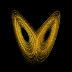

Lorenz 63
=========

Overview
--------

This 3-variable model was described in Lorenz (1963). [1]_ In Lorenz 63, DART
advances the model, gets the model state and metadata describing this state,
finds state variables that are close to a given location, and does spatial
interpolation for model state variables. The distinctive part of the model
interface is the `namelist`_.

Lorenz 63 was developed as a simplified model to study convection rolls in the
atmosphere. It is a deceptively simple model -- its formulation is simpler than
Lorenz's earlier atmospheric models -- yet it demonstrates chaotic behavior. It
has thus become a widely studied model.

Plotting the location of the *x*, *y*, *z* values as they progress through time
traces out the classic 'butterfly' attractor plot which has become an iconic
image of chaotic systems:

|Plot of Lorenz 63 attractor|

The system of equations for Lorenz 63 is:

.. math::

   \frac{dx}{dt} = \sigma(y-x)
   
   \frac{dy}{dt} = x(r-z)-y
   
   \frac{dz}{dt} = xy-bz

and, within DART, the constants have default values of:

.. math::

   \sigma=10, r=28, b=8/3

that can be altered by editing the ``&model_nml`` `namelist`_ in the
``input.nml`` file.

This model is an interesting data assimilation test in that different ensemble
members may bifurcate over to the other lobe of the attractor on different
cycles. Also, as they diverge from each other they do not spread out uniformly
in 3D space, but spread along the linear attractor lines.

The Lorenz 63 model has a ``work/workshop_setup.csh`` script that compiles and 
runs an example.  This example is referenced at various points in the 
:doc:`DART tutorial <../../theory/readme>` 
and is intended to provide insight into model/assimilation behavior. 
The example **may or may not** result in good (*or even decent!*) results!

``run_lorenz_63.m`` is an excellent Matlab tool to explore the behavior of the
Lorenz 63 model. It is part of the 
:doc:`DART_LAB Tutorial. <../../guide/DART_LAB/DART_LAB>`

Namelist
--------

The ``&model_nml`` namelist is read from the ``input.nml`` file. Namelists
start with an ampersand ``&`` and terminate with a slash ``/``. Character
strings that contain a ``/`` must be enclosed in quotes to prevent them from
prematurely terminating the namelist.

.. code-block:: fortran

  &model_nml
     sigma  = 10.0,
     r      = 28.0,
     b      = 2.6666666666667,
     deltat = 0.01,
     time_step_days = 0,
     time_step_seconds = 3600
     solver = 'RK2'
  /

Description of each namelist entry
~~~~~~~~~~~~~~~~~~~~~~~~~~~~~~~~~~

+-------------------+--------------+---------------------------------+
| Item              | Type         | Description                     |
+===================+==============+=================================+
| sigma             | real(r8)     | Model parameter.                |
+-------------------+--------------+---------------------------------+
| r                 | real(r8)     | Model parameter.                |
+-------------------+--------------+---------------------------------+
| b                 | real(r8)     | Model parameter.                |
+-------------------+--------------+---------------------------------+
| deltat            | real(r8)     | Non-dimensional timestep. This  |
|                   |              | is mapped to the dimensional    |
|                   |              | timestep specified by           |
|                   |              | time_step_days and              |
|                   |              | time_step_seconds.              |
+-------------------+--------------+---------------------------------+
| time_step_days    | integer      | Number of days for dimensional  |
|                   |              | timestep, mapped to deltat.     |
+-------------------+--------------+---------------------------------+
| time_step_seconds | integer      | Number of seconds for           |
|                   |              | dimensional timestep, mapped to |
|                   |              | deltat.                         |
+-------------------+--------------+---------------------------------+
| solver            | character(8) | The name of the solver to use.  |
|                   |              | 'RK2', the default, is a        |
|                   |              | two-step Runge-Kutta used in    |
|                   |              | the original Lorenz 63 paper.   |
|                   |              | 'RK4' is the only other option  |
|                   |              | which uses the four-step        |
|                   |              | classic Runge-Kutta method.     |
+-------------------+--------------+---------------------------------+

References
----------

.. [1] Lorenz, Edward N., 1963: Deterministic Nonperiodic Flow. *Journal of the
       Atmospheric Sciences*, **20**, 130-141,
       `doi:0.1175/1520-0469(1963)020\<0130:DNF\>2.0.CO;2
       <https://doi.org/10.1175/1520-0469(1963)020\<0130:DNF\>2.0.CO;2>`__

