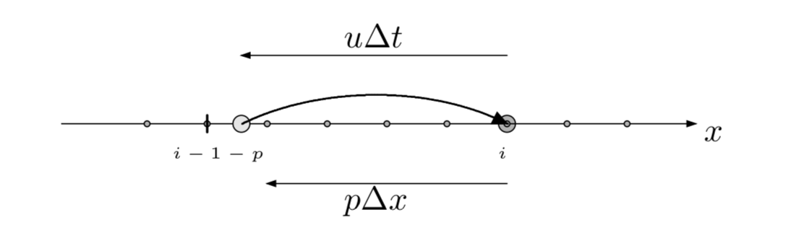
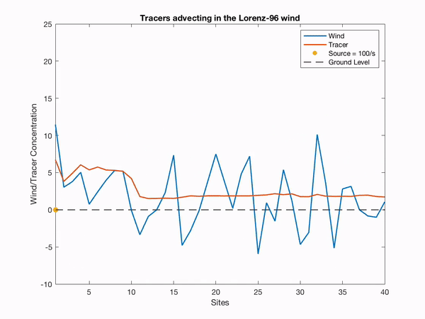

Lorenz 96 Tracer Advection
==========================

Overview
--------

The Lorenz 96 Tracer Advection model combines the Lorenz 96 model with an 
upstream semi-Lagrangian method. This simulates the advection of tracer 
particles from any source(s) by the Lorenz 96 variables (here serving as wind).

The Lorenz 96 model was first described by Edward Lorenz during a seminar at
the European Centre for Medium-Range Weather Forecasts in the Autumn of 1995,
the proceedings of which were published as Lorenz (1996) [1]_ the following
year, hence the model is commonly referred to as Lorenz 96.

Lorenz and Emmanuel (1998) [2]_ describe the model as:

  ... consisting of 40 ordinary differential equations, with the dependent
  variables representing values of some atmospheric quantity at 40 sites spaced
  equally about a latitude circle. The equations contain quadratic, linear, and
  constant terms representing advection, dissipation, and external forcing.
  Numerical integration indicates that small errors (differences between
  solutions) tend to double in about 2 days. Localized errors tend to spread
  eastward as they grow, encircling the globe after about 14 days.

  We have chosen a model with :math:`J` variables, denoted by:

  .. math::

     X_1, ... , X_j;

  in most of our experiments we have let :math:`J = 40`. The governing
  equations are:

  .. math::

     dX_j/dt=(X_{j+1}-X_{j-2})X_{j-1}-X_j+F (1)

  for:

  .. math::

     j=1,...,J.

  To make Eq. (1) meaningful for all values of *j* we define:

  .. math::

     X_{-1}=X_{J-1}, X_0=X_J, \& X_{J+1}=X_1,

  so that the variables form a cyclic chain, and may be looked at as values of
  some unspecified scalar meteorological quantity, perhaps vorticity or
  temperature, at *J* equally spaced sites extending around a latitude circle.
  Nothing will simulate the atmosphere's latitudinal or vertical extent.

In this model we are using the Semi-Lagrangian Scheme to model how tracer particles 
get distributed upstream across the grids by the Lorenz 96 winds

|Plot of 1D Semi-Lagrangian Method|

The figure above describes the implementation of the Semi-Lagrangian scheme in a 
one dimensional array. The tracer particle in the figure lands on a predefined grid 
point at t\ :sup:`n+1`. The trajectory of this tracer particle is then integrated 
backwards by one time step to time t\ :sup:`n`, often landing between grid points. 
Then, due to advection without diffusion, the concentration of tracer at time
t\ :sup:`n+1` is simply the concentration of tracer at time t\ :sup:`n`, which 
can be determined by interpolating concentrations of the surrounding grids [3]_.

Once the coupled Lorenz 96 and semi-Lagrangian is run with a source of strength
100 units/s and location at grid point one (with exponential sinks present in
all grid points), the time evolution is as depicted below:

|Plot of Lorenz 96 Tracer Advection|

For Lorenz 96 Tracer Advection, DART advances the model, gets the model state and 
metadata describing this state, finds state variables that are close to a given 
location, and does spatial interpolation for model state variables.

Namelist
--------

The ``&model_nml`` namelist is read from the ``input.nml`` file. Namelists
start with an ampersand ``&`` and terminate with a slash ``/``. Character
strings that contain a ``/`` must be enclosed in quotes to prevent them from
prematurely terminating the namelist.

.. code-block:: fortran

  &model_nml
     model_size        = 120,
     forcing           = 8.00,
     delta_t           = 0.05,
     time_step_days    = 0,
     time_step_seconds = 3600
  /

Description of each namelist entry
~~~~~~~~~~~~~~~~~~~~~~~~~~~~~~~~~~

+-------------------+----------+-------------------------------------+
| Item              | Type     | Description                         |
+===================+==========+=====================================+
| model_size        | integer  | Total number of items in the state  |
|                   |          | vector.                             |
|                   |          | The first third of the state vector |
|                   |          | describes winds, the second third   |
|                   |          | describes tracer concentration, and |
|                   |          | the final third of the state vector |
|                   |          | describes the location strength of  |
|                   |          | sources.                            |
+-------------------+----------+-------------------------------------+
| forcing           | real(r8) | Forcing, F, for model.              |
+-------------------+----------+-------------------------------------+
| delta_t           | real(r8) | Non-dimensional timestep. This is   |
|                   |          | mapped to the dimensional timestep  |
|                   |          | specified by time_step_days and     |
|                   |          | time_step_seconds.                  |
+-------------------+----------+-------------------------------------+
| time_step_days    | integer  | Number of days for dimensional      |
|                   |          | timestep, mapped to delta_t.        |
+-------------------+----------+-------------------------------------+
| time_step_seconds | integer  | Number of seconds for dimensional   |
|                   |          | timestep, mapped to delta_t.        |
+-------------------+----------+-------------------------------------+

References
----------

.. [1] Lorenz, Edward N., 1996: Predictability: A Problem Partly Solved.
       *Seminar on Predictability.* **1**, ECMWF, Reading, Berkshire, UK, 1-18.

.. [2] Lorenz, Edward N., and Kerry A. Emanuel, 1998: Optimal Sites for
       Supplementary Weather Observations: Simulations with a Small Model.
       *Journal of the Atmospheric Sciences*, **55**, 399-414,
       `doi:10.1175/1520-0469(1998)055\<0399:OSFSWO\>2.0.CO;2
       <https://doi.org/10.1175/1520-0469(1998)055\<0399:OSFSWO\>2.0.CO;2>`__

.. [3] Cushman-Roisin, Benoit, and Jean-Marie Beckers. 2011. 
       Introduction to Geophysical Fluid Dynamics: Volume 101: Physical
       and Numerical Aspects. 2nd ed. San Diego, CA: Academic Press.

