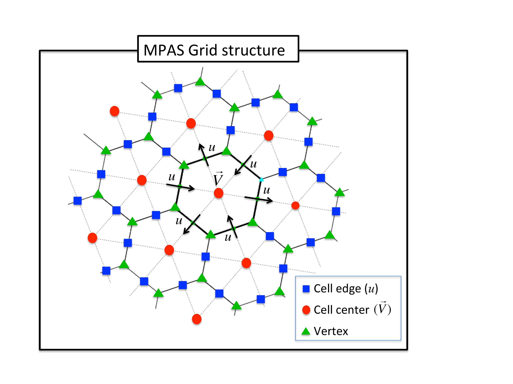

MPAS_ATM
========

Overview
--------

This document describes the DART interface module for the atmospheric component 
of the Model for Prediction Across Scales
`MPAS <https://ncar.ucar.edu/what-we-offer/models/model-prediction-across-scales-mpas>`__ 
(or briefly, MPAS-ATM) global model.

The DART interface has constants set to match MPAS v5.0 onwards as defined in 
`MPAS-Model/src/framework/mpas_constants.F <https://github.com/MPAS-Dev/MPAS-Model/blob/master/src/framework/mpas_constants.F>`__.
If you need to reproduce work with DART and MPAS v4 you will need to change the model_mod.f90 
parameters ``cp``, ``cv`` and ``rvord`` to match MPAS v4. 

The mpas-atm model uses an unstructured Voronoi grid mesh,
formally Spherical Centriodal Voronoi Tesselations (SCVTs). This allows for both
quasi-uniform discretization of the sphere and local refinement. The MPAS/DART
interface was built on the SCVT-dual mesh and does not regrid to regular lat/lon
grids. In the C-grid discretization, the normal component of velocity on cell
edges is prognosed; zonal and meridional wind components are diagnosed on the
cell centers. We provide several options to choose from in the assimilation of
wind observations as shown below.

The grid terminology used in MPAS is as shown in the figure below:

|MPAS_grid_structure|

The wind options during a DART assimilation are controlled by combinations of 4
different namelist values. The values determine which fields the forward
operator uses to compute expected observation values; how the horizontal
interpolation is computed in that forward operator; and how the assimilation
increments are applied to update the wind quantities in the state vector.
Preliminary results based on real data assimilation experiments indicate that
performance is better when the zonal and meridional winds are used as input to
the forward operator that uses Barycentric interpolation, and when the
prognostic *u* wind is updated by the incremental method described in the figure
below. However there remain scientific questions about how best to handle the
wind fields under different situations. Thus we have kept all implemented
options available for use in experimental comparisons. See the figure below for
a flow-chart representation of how the 4 namelist items interact:

|WindDA_options|

Cycling of MPAS/DART is run in a *restart* mode. As for all DART experiments,
the overall design for an experiment is this: the DART program ``filter`` will
read the initial condition file, the observation sequence file, and the DART
namelist to decide whether or not to advance the MPAS-ATM model. All of the
control of the execution of the MPAS model is done by DART directly. If the
model needs to be advanced, ``filter`` makes a call to the shell to execute the
script ``advance_model.csh``, which is ENTIRELY responsible for getting all the
input files, data files, namelists, etc. into a temporary directory, running the
model, and copying the results back to the parent directory (which we call
CENTRALDIR). The whole process hinges on setting the MPAS-ATM model namelist
values such that it is doing a restart for every model advance. Unlike MPAS-ATM
free forecast runs, the forecast step in MPAS/DART requires to set up one more
namelist parameter called ``config_do_DAcycling = .true.`` in ``&restart``
section of ``namelist.input`` to recouple the state vectors (updated by filter)
with the mass field for the restart mode. For more information, check the
``advance_model.csh`` script in ``./shell_scripts/`` directory.

Since DART is an ensemble algorithm, there are multiple analysis files for a
single analysis time: one for each ensemble member. Because MPAS/DART is run in
a restart mode, each member should keep its own MPAS restart file from the
previous cycle (rather than having a single template file in CENTRALDIR).
Creating the initial ensemble of states is an area of active research.

Namelist
--------

This namelist is read from the file *input.nml*. Namelists start with an
ampersand '&' and terminate with a slash '/'. Character strings that contain a
'/' must be enclosed in quotes to prevent them from prematurely terminating the
namelist.

.. code-block:: fortran

   &model_nml
      init_template_filename       = 'mpas_init.nc',
      vert_localization_coord      = 3,
      assimilation_period_days     = 0,
      assimilation_period_seconds  = 21600,
      model_perturbation_amplitude = 0.0001,
      log_p_vert_interp            = .true.,
      calendar                     = 'Gregorian',
      use_u_for_wind               = .false.,
      use_rbf_option               = 2,
      update_u_from_reconstruct    = .true.,
      use_increments_for_u_update  = .true.,
      highest_obs_pressure_mb      = 100.0,
      sfc_elev_max_diff            = -1.0,
      outside_grid_level_tolerance = -1.0,
      extrapolate                  = .false.,
      debug                        = 0,
   /

+---------------------------------------+---------------------------------------+-----------------------------------------+
| Item                                  | Type                                  | Description                             |
+=======================================+=======================================+=========================================+
| init_template_filename                | character(len=256)                    | The name of the MPAS analysis file to   |
|                                       | *[default: 'mpas_init.nc']*           | be read and/or written by the DART      |
|                                       |                                       | programs for the state data.            |
+---------------------------------------+---------------------------------------+-----------------------------------------+
| highest_obs_pressure_mb               | real(r8)                              | Observations higher than this           |
|                                       | *[default: 100.0]*                    | pressure are ignored. Set to -1.0 to    |
|                                       |                                       | ignore this test. For models with a     |
|                                       |                                       | prescribed top boundary layer, trying   |
|                                       |                                       | to assimilate very high observations    |
|                                       |                                       | results in problems because the model   |
|                                       |                                       | damps out any changes the               |
|                                       |                                       | assimilation tries to make. With        |
|                                       |                                       | adaptive algorithms this results in     |
|                                       |                                       | larger and larger coefficients as the   |
|                                       |                                       | assimilation tries to effect state      |
|                                       |                                       | vector change.                          |
+---------------------------------------+---------------------------------------+-----------------------------------------+
| assimilation_period_days              | integer *[default: 0]*                | The number of days to advance the       |
|                                       |                                       | model for each assimilation. Even if    |
|                                       |                                       | the model is being advanced outside     |
|                                       |                                       | of the DART filter program, the         |
|                                       |                                       | assimilation period should be set       |
|                                       |                                       | correctly. Only observations with a     |
|                                       |                                       | time within +/- 1/2 this window size    |
|                                       |                                       | will be assimilated.                    |
+---------------------------------------+---------------------------------------+-----------------------------------------+
| assimilation_period_seconds           | integer *[default: 21600]*            | In addition to                          |
|                                       |                                       | ``assimilation_period_days``, the       |
|                                       |                                       | number of seconds to advance the        |
|                                       |                                       | model for each assimilation.            |
+---------------------------------------+---------------------------------------+-----------------------------------------+
| vert_localization_coord               | integer *[default: 3]*                | Vertical coordinate for vertical        |
|                                       |                                       | localization.                           |
|                                       |                                       |                                         |
|                                       |                                       | -  1 = model level                      |
|                                       |                                       | -  2 = pressure (in pascals)            |
|                                       |                                       | -  3 = height (in meters)               |
|                                       |                                       | -  4 = scale height (unitless)          |
+---------------------------------------+---------------------------------------+-----------------------------------------+
| sfc_elev_max_diff                     | real(r8)\ *[default: -1.0]*           | If > 0, the maximum difference, in      |
|                                       |                                       | meters, between an observation marked   |
|                                       |                                       | as a 'surface obs' as the vertical      |
|                                       |                                       | type (with the surface elevation, in    |
|                                       |                                       | meters, as the numerical vertical       |
|                                       |                                       | location), and the surface elevation    |
|                                       |                                       | as defined by the model. Observations   |
|                                       |                                       | further away from the surface than      |
|                                       |                                       | this threshold are rejected and not     |
|                                       |                                       | assimilated. If the value is            |
|                                       |                                       | negative, this test is skipped.         |
+---------------------------------------+---------------------------------------+-----------------------------------------+
| log_p_vert_interp                     | logical *[default: .true.]*           | If ``.true.``, vertical interpolation   |
|                                       |                                       | is done in log-pressure. Otherwise,     |
|                                       |                                       | linear.                                 |
+---------------------------------------+---------------------------------------+-----------------------------------------+
| use_u_for_wind                        | logical *[default: .false.]*          | If ``.false.``, zonal and meridional    |
|                                       |                                       | winds at cell centers are used for      |
|                                       |                                       | the wind observation operator           |
|                                       |                                       | [default]. In that case, triangular     |
|                                       |                                       | meshes are used for the barycentric     |
|                                       |                                       | (e.g., area-weighted) interpolation.    |
|                                       |                                       | If ``.true.``, wind vectors at an       |
|                                       |                                       | arbitrary (e.g., observation) point     |
|                                       |                                       | are reconstructed from the normal       |
|                                       |                                       | component of velocity on cell edges     |
|                                       |                                       | *(u)* using radial basis functions      |
|                                       |                                       | (RBFs) provided by the MPAS model.      |
+---------------------------------------+---------------------------------------+-----------------------------------------+
| use_rbf_option                        | integer *[default: 2]*                | If ``use_u_for_wind = .true.``, this    |
|                                       |                                       | option controls how many points will    |
|                                       |                                       | be used in the RBF interpolation.       |
|                                       |                                       | Options are available as 0, 1, 2, and   |
|                                       |                                       | 3. All the edges available in N (=      |
|                                       |                                       | 0,1,2, or 3) neighboring cells go       |
|                                       |                                       | into the RBF reconstruction.            |
+---------------------------------------+---------------------------------------+-----------------------------------------+
| update_u_from_reconstruct             | logical *[default: .true.]*           | When zonal and meridional winds at      |
|                                       |                                       | cell centers are used for the wind      |
|                                       |                                       | observation operator                    |
|                                       |                                       | (``use_u_for_wind = .false.``), this    |
|                                       |                                       | option decides if the normal            |
|                                       |                                       | component of velocity on cell edges     |
|                                       |                                       | (which is the only wind prognostic      |
|                                       |                                       | variable in MPAS-ATM) should be         |
|                                       |                                       | updated from the winds at cell          |
|                                       |                                       | centers. If ``.true.``,                 |
|                                       |                                       | ``use_increments_for_u_update``         |
|                                       |                                       | should be also decided.                 |
|                                       |                                       | If ``use_u_for_wind = .true.``          |
|                                       |                                       | and the normal component of             |
|                                       |                                       | velocity on cell edges is defined as    |
|                                       |                                       | a state vector, this option should be   |
|                                       |                                       | ``.false.`` so the edge winds can be    |
|                                       |                                       | directly updated by filter.             |
+---------------------------------------+---------------------------------------+-----------------------------------------+
| use_increments_for_u_update           | logical *[default: .true.]*           | Only if ``update_u_from_reconstruct     |
|                                       |                                       | = .true.``, this option is used to      |
|                                       |                                       | decide if the edge winds are replaced   |
|                                       |                                       | by averaging from the analysis winds    |
|                                       |                                       | at cell centers (``.false.``), or       |
|                                       |                                       | just updated by the analysis            |
|                                       |                                       | increments at cell centers              |
|                                       |                                       | (``.true.``). If ``.true.``, all        |
|                                       |                                       | the wind components (e.g., both at      |
|                                       |                                       | cell centers and edges) are read from   |
|                                       |                                       | prior and used to compute the           |
|                                       |                                       | increments [Recommended].               |
+---------------------------------------+---------------------------------------+-----------------------------------------+
| model_perturbation_amplitude          | real(r8) *[default: 0.0001]*          | The amplitude of random noise to add    |
|                                       |                                       | when trying to perturb a single state   |
|                                       |                                       | vector to create an ensemble. Only      |
|                                       |                                       | used when ``start_from_restart =        |
|                                       |                                       | .false.`` in the ``&filter_nml``        |
|                                       |                                       | namelist within ``input.nml``           |
|                                       |                                       | Multiplied by the state vector, it      |
|                                       |                                       | produces standard deviation of a        |
|                                       |                                       | gaussian distribution with the mean     |
|                                       |                                       | at the value of the state vector        |
|                                       |                                       | element.                                |
+---------------------------------------+---------------------------------------+-----------------------------------------+
| calendar                              | character(len=32)                     | Character string specifying the         |
|                                       | *[default: 'Gregorian']*              | calendar being used by MPAS.            |
+---------------------------------------+---------------------------------------+-----------------------------------------+
| outside_grid_level_tolerance          | real(r8) *[default: -1.0]*            | If greater than 0.0, amount of          |
|                                       |                                       | distance in fractional model levels     |
|                                       |                                       | that a vertical location can be above   |
|                                       |                                       | or below the top or bottom of the       |
|                                       |                                       | grid and still be evaluated without     |
|                                       |                                       | error. Since *extrapolate* is not       |
|                                       |                                       | implemented yet, the value of           |
|                                       |                                       | ``.false.`` will be assumed. In this    |
|                                       |                                       | case, vertical locations equivalent     |
|                                       |                                       | to level 1 or level N will be used.     |
|                                       |                                       | Eventually, if *extrapolate* is         |
|                                       |                                       | ``.true.``, extrapolate from the        |
|                                       |                                       | first or last model level. If           |
|                                       |                                       | *extrapolate* is ``.false.``, simply    |
|                                       |                                       | use the value at level 1 for low        |
|                                       |                                       | vertical locations, or at level N for   |
|                                       |                                       | high vertical locations.                |
+---------------------------------------+---------------------------------------+-----------------------------------------+
| extrapolate                           | logical *[default: .false.]*          | *NOT IMPLEMENTED YET*. Vertical         |
|                                       |                                       | locations equivalant to level 1 or      |
|                                       |                                       | level N will be used. When this is      |
|                                       |                                       | implemented, it will do:                |
|                                       |                                       | If *outside_grid_level_tolerance* is    |
|                                       |                                       | greater than 0.0, then control how      |
|                                       |                                       | values are assigned to locations        |
|                                       |                                       | where the vertical is exterior to the   |
|                                       |                                       | grid. If this is ``.true.``, then       |
|                                       |                                       | extrapolate low locations from levels   |
|                                       |                                       | 1 and 2, and high locations from        |
|                                       |                                       | levels N-1 and N. If this is            |
|                                       |                                       | ``.false.``, then simply use the        |
|                                       |                                       | corresponding values at level 1 or N.   |
|                                       |                                       | This item is ignored if                 |
|                                       |                                       | ``outside_grid_level_tolerance`` is     |
|                                       |                                       | less than or equal to 0.0.              |
+---------------------------------------+---------------------------------------+-----------------------------------------+
| debug                                 | integer *[default: 0]*                | The switch to specify the run-time      |
|                                       |                                       | verbosity.                              |
|                                       |                                       |                                         |
|                                       |                                       | - ``0`` is as quiet as it gets          |
|                                       |                                       | - ``>1`` prints more run-time messages  |
|                                       |                                       | - ``>5`` prints ALL run-time messages   |
|                                       |                                       |                                         |
+---------------------------------------+---------------------------------------+-----------------------------------------+

The ``&mpas_vars_nml`` namelist within ``input.nml`` contains the list of MPAS
variables that make up the DART state vector. The order the items are specified
controls the order of the data in the state vector, so it should not be changed
without regenerating all DART initial condition or restart files. These
variables are directly updated by the filter assimilation.

Any variables whose values cannot exceed a given minimum or maximum can be
listed in ``mpas_state_bounds``. When the data is written back into the MPAS
NetCDF files values outside the allowed range will be detected and changed. Data
inside the DART state vector and data written to the DART diagnostic files will
not go through this test and values may exceed the allowed limits. Note that
changing values at the edges of the distribution means it is no longer
completely gaussian. In practice this technique has worked effectively, but if
the assimilation is continually trying to move the values outside the permitted
range the results may be of poor quality. Examine the diagnostics for these
fields carefully when using bounds to restrict their values.

.. code-block:: fortran

   &mpas_vars_nml
      mpas_state_variables = 'theta',                 'QTY_POTENTIAL_TEMPERATURE',
                             'uReconstructZonal',     'QTY_U_WIND_COMPONENT',
                             'uReconstructMeridional','QTY_V_WIND_COMPONENT',
                             'qv',                    'QTY_VAPOR_MIXING_RATIO',
                             'qc',                    'QTY_CLOUDWATER_MIXING_RATIO',
                             'surface_pressure',      'QTY_SURFACE_PRESSURE'
      mpas_state_bounds    = 'qv','0.0','NULL','CLAMP',
                             'qc','0.0','NULL','CLAMP',
   /

+--------------------+---------------------------------------+---------------------------------------------+
| Item               | Type                                  | Description                                 |
+====================+=======================================+=============================================+
| mpas_vars_nml      | character(len=NF90_MAX_NAME)::        | The table that both specifies which         |
|                    | dimension(160)                        | MPAS-ATM variables will be placed in the    |
|                    |                                       | state vector, and also relates those        |
|                    |                                       | variables to the corresponding DART kinds.  |
|                    |                                       | The first column in each pair must be the   |
|                    |                                       | exact NetCDF name of a field in the MPAS    |
|                    |                                       | file. The second column in each pair must   |
|                    |                                       | be a KIND known to the DART system. See     |
|                    |                                       | the ``obs_kind_mod.f90`` file within        |
|                    |                                       | ``assimilation_code/modules/observations/`` |
|                    |                                       | for known names. This file is autogenerated |
|                    |                                       | when DART builds filter for a particular    |
|                    |                                       | model, so run ``quickbuild.sh`` in the      |
|                    |                                       | work directory first before examining this  |
|                    |                                       | file. Use the generic kind list in the      |
|                    |                                       | ``obs_kind_mod`` tables, not the specific   |
|                    |                                       | type list.                                  |
+--------------------+---------------------------------------+---------------------------------------------+
| mpas_state_bounds  | character(len=NF90_MAX_NAME)::        | List only MPAS-ATM variables that must      |
|                    | dimension(160)                        | restrict their values to remain between     |
|                    |                                       | given lower and/or upper bounds.            |
|                    |                                       | Columns are: NetCDF variable name, min      |
|                    |                                       | value, max value, and action to take for    |
|                    |                                       | out-of-range values. Either min or max can  |
|                    |                                       | have the string 'NULL' to indicate no       |
|                    |                                       | limiting will be done. If the action is     |
|                    |                                       | 'CLAMP' out of range values will be changed |
|                    |                                       | to the corresponding bound and execution    |
|                    |                                       | continues; 'FAIL' stops the executable if   |
|                    |                                       | out of range values are detected.           |
+--------------------+---------------------------------------+---------------------------------------------+

Grid Information
----------------

As the forward operators use the unstructured grid meshes in MPAS-ATM, the
DART/MPAS interface needs to read static variables related to the grid structure
from the MPAS ATM 'history' file (specified in ``model_analysis_filename``).
These variables are used to find the closest cell to an observation point in the
cartesian coordinate (to avoid the polar issues).

+-----------------------------------+-----------------------------------------+
| integer :: nCells                 | the number of cell centers              |
+-----------------------------------+-----------------------------------------+
| integer :: nEdges                 | the number of cell edges                |
+-----------------------------------+-----------------------------------------+
| integer :: nVertices              | the number of cell vertices             |
+-----------------------------------+-----------------------------------------+
| integer :: nVertLevels            | the number of vertical levels for mass  |
|                                   | fields                                  |
+-----------------------------------+-----------------------------------------+
| integer :: nVertLevelsP1          | the number of vertical levels for       |
|                                   | vertical velocity                       |
+-----------------------------------+-----------------------------------------+
| integer :: nSoilLevels            | the number of soil levels               |
+-----------------------------------+-----------------------------------------+
| real(r8) :: latCell(:)            | the latitudes of the cell centers       |
|                                   | [-90,90]                                |
+-----------------------------------+-----------------------------------------+
| real(r8) :: lonCell(:)            | the longitudes of the cell centers [0,  |
|                                   | 360]                                    |
+-----------------------------------+-----------------------------------------+
| real(r8) :: latEdge(:)            | the latitudes of the edges [-90,90], if |
|                                   | edge winds are used.                    |
+-----------------------------------+-----------------------------------------+
| real(r8) :: lonEdge(:)            | the longitudes of the edges [0, 360],   |
|                                   | if edge winds are used.                 |
+-----------------------------------+-----------------------------------------+
| real(r8) :: xVertex(:)            | The cartesian location in x-axis of the |
|                                   | vertex                                  |
+-----------------------------------+-----------------------------------------+
| real(r8) :: yVertex(:)            | The cartesian location in y-axis of the |
|                                   | vertex                                  |
+-----------------------------------+-----------------------------------------+
| real(r8) :: zVertex(:)            | The cartesian location in z-axis of the |
|                                   | vertex                                  |
+-----------------------------------+-----------------------------------------+
| real(r8) :: xEdge(:)              | The cartesian location in x-axis of the |
|                                   | edge, if edge winds are used.           |
+-----------------------------------+-----------------------------------------+
| real(r8) :: yEdge(:)              | The cartesian location in y-axis of the |
|                                   | edge, if edge winds are used.           |
+-----------------------------------+-----------------------------------------+
| real(r8) :: zEdge(:)              | The cartesian location in z-axis of the |
|                                   | edge, if edge winds are used.           |
+-----------------------------------+-----------------------------------------+
| real(r8) :: zgrid(:,:)            | geometric height at cell centers        |
|                                   | (nCells, nVertLevelsP1)                 |
+-----------------------------------+-----------------------------------------+
| integer :: CellsOnVertex(:,:)     | list of cell centers defining a         |
|                                   | triangle                                |
+-----------------------------------+-----------------------------------------+
| integer :: edgesOnCell(:,:)       | list of edges on each cell              |
+-----------------------------------+-----------------------------------------+
| integer :: verticesOnCell(:,:)    | list of vertices on each cell           |
+-----------------------------------+-----------------------------------------+
| integer :: edgeNormalVectors(:,:) | unit direction vectors on the edges     |
|                                   | (only used if *use_u_for_wind* =        |
|                                   | .true.)                                 |
+-----------------------------------+-----------------------------------------+

model_mod variable storage
--------------------------

The ``&mpas_vars_nml`` within ``input.nml`` defines the list of MPAS variables
used to build the DART state vector. Combined with an MPAS analysis file, the
information is used to determine the size of the DART state vector and derive
the metadata. To keep track of what variables are contained in the DART state
vector, an array of a user-defined type called "progvar" is available with the
following components:

.. code-block:: fortran

   type progvartype
      private
      character(len=NF90_MAX_NAME) :: varname
      character(len=NF90_MAX_NAME) :: long_name
      character(len=NF90_MAX_NAME) :: units
      character(len=NF90_MAX_NAME), dimension(NF90_MAX_VAR_DIMS) :: dimname
      integer, dimension(NF90_MAX_VAR_DIMS) :: dimlens
      integer :: xtype         ! netCDF variable type (NF90_double, etc.) 
      integer :: numdims       ! number of dimensions - excluding TIME
      integer :: numvertical   ! number of vertical levels in variable
      integer :: numcells      ! number of cell locations (typically cell centers)
      integer :: numedges      ! number of edge locations (edges for normal velocity)
      logical :: ZonHalf       ! vertical coordinate for mass fields (nVertLevels)
      integer :: varsize       ! variable size (dimlens(1:numdims))
      integer :: index1        ! location in dart state vector of first occurrence
      integer :: indexN        ! location in dart state vector of last  occurrence
      integer :: dart_kind
      character(len=paramname_length) :: kind_string
      logical  :: clamping     ! does variable need to be range-restricted before 
      real(r8) :: range(2)     ! lower and upper bounds for the data range.
      logical  :: out_of_range_fail  ! is out of range fatal if range-checking?
   end type progvartype

   type(progvartype), dimension(max_state_variables) :: progvar

The variables are simply read from the MPAS analysis file and stored in the
DART state vector such that all quantities for one variable are stored
contiguously. Within each variable; they are stored vertically-contiguous for
each horizontal location. From a storage standpoint, this would be equivalent
to a Fortran variable dimensioned x(nVertical,nHorizontal,nVariables). The
fastest-varying dimension is vertical, then horizontal, then variable ...
naturally, the DART state vector is 1D. Each variable is also stored this way
in the MPAS analysis file.

Compilation
-----------

The DART interface for MPAS-ATM can be compiled with various fortran compilers
such as (but not limited to) gfortran, pgf90, and intel. It has been tested on a
Mac and NSF NCAR IBM supercomputer (yellowstone).

.. note::

   While MPAS requires the PIO (Parallel IO) and pNetCDF (Parallel NetCDF)
   libraries, DART uses only the plain NetCDF libraries. If an altered NetCDF
   library is required by the parallel versions, there may be incompatibilities
   between the run-time requirements of DART and MPAS. Static linking of one or
   the other executable, or swapping of modules between executions may be
   necessary.

Conversions
-----------

A Welcome Development
~~~~~~~~~~~~~~~~~~~~~

MPAS files no longer need to be converted to DART formatted files, they can be
read in directly from a input file list!

Analysis File NetCDF header
~~~~~~~~~~~~~~~~~~~~~~~~~~~

The header of an MPAS analysis file is presented below - simply for context.
Keep in mind that **many** variables have been removed for clarity. Also keep
in mind that the multi-dimensional arrays listed below have the dimensions
reversed from the Fortran convention. **Note:** the variables marked
'available in dart' are available as metadata variables in DART. Just to be
perfectly clear, they are not 'state'.

.. code-block:: bash

   $ ncdump -h mpas_init.nc
   netcdf mpas_analysis {
   dimensions:
            StrLen = 64 ;
            Time = UNLIMITED ; // (1 currently)
            nCells = 10242 ;                                  available in DART
            nEdges = 30720 ;                                  available in DART
            maxEdges = 10 ;
            maxEdges2 = 20 ;
            nVertices = 20480 ;                               available in DART
            TWO = 2 ;
            THREE = 3 ;
            vertexDegree = 3 ;
            FIFTEEN = 15 ;
            TWENTYONE = 21 ;
            R3 = 3 ;
            nVertLevels = 41 ;                                available in DART
            nVertLevelsP1 = 42 ;                              available in DART
            nMonths = 12 ;
            nVertLevelsP2 = 43 ;
            nSoilLevels = 4 ;                                 available in DART
   variables:
            char xtime(Time, StrLen) ;                        available in DART
            double latCell(nCells) ;                          available in DART
            double lonCell(nCells) ;                          available in DART
            double latEdge(nEdges) ;                          available in DART
            double lonEdge(nEdges) ;                          available in DART
            int indexToEdgeID(nEdges) ;
            double latVertex(nVertices) ;
            double lonVertex(nVertices) ;
         double xVertex(nVertices) ;                       available in DART
         double yVertex(nVertices) ;                       available in DART
         double zVertex(nVertices) ;                       available in DART
         double xEdge(nVertices) ;                         available in DART
         double yEdge(nVertices) ;                         available in DART
         double zEdge(nVertices) ;                         available in DART
            int indexToVertexID(nVertices) ;
            int cellsOnEdge(nEdges, TWO) ;
            int nEdgesOnCell(nCells) ;
            int nEdgesOnEdge(nEdges) ;
            int edgesOnCell(nCells, maxEdges) ;               available in DART
            int edgesOnEdge(nEdges, maxEdges2) ;
            double weightsOnEdge(nEdges, maxEdges2) ;
            double dvEdge(nEdges) ;
            double dcEdge(nEdges) ;
            double angleEdge(nEdges) ;
            double edgeNormalVectors(nEdges, R3) ;            available in DART
            double cellTangentPlane(nEdges, TWO, R3) ;
            int cellsOnCell(nCells, maxEdges) ;
            int verticesOnCell(nCells, maxEdges) ;            available in DART
            int verticesOnEdge(nEdges, TWO) ;
            int edgesOnVertex(nVertices, vertexDegree) ;
            int cellsOnVertex(nVertices, vertexDegree) ;      available in DART
            double kiteAreasOnVertex(nVertices, vertexDegree) ;
            double rainc(Time, nCells) ;
            double cuprec(Time, nCells) ;
            double cutop(Time, nCells) ;
            double cubot(Time, nCells) ;
            double relhum(Time, nCells, nVertLevels) ;
            double qsat(Time, nCells, nVertLevels) ;
            double graupelnc(Time, nCells) ;
            double snownc(Time, nCells) ;
            double rainnc(Time, nCells) ;
            double graupelncv(Time, nCells) ;
            double snowncv(Time, nCells) ;
            double rainncv(Time, nCells) ;
            double sr(Time, nCells) ;
            double surface_temperature(Time, nCells) ;
            double surface_pressure(Time, nCells) ;
            double coeffs_reconstruct(nCells, maxEdges, R3) ;
            double theta_base(Time, nCells, nVertLevels) ;
            double rho_base(Time, nCells, nVertLevels) ;
            double pressure_base(Time, nCells, nVertLevels) ;
            double exner_base(Time, nCells, nVertLevels) ;
            double exner(Time, nCells, nVertLevels) ;
            double h_divergence(Time, nCells, nVertLevels) ;
            double uReconstructMeridional(Time, nCells, nVertLevels) ;
            double uReconstructZonal(Time, nCells, nVertLevels) ;
            double uReconstructZ(Time, nCells, nVertLevels) ;
            double uReconstructY(Time, nCells, nVertLevels) ;
            double uReconstructX(Time, nCells, nVertLevels) ;
            double pv_cell(Time, nCells, nVertLevels) ;
            double pv_vertex(Time, nVertices, nVertLevels) ;
            double ke(Time, nCells, nVertLevels) ;
            double rho_edge(Time, nEdges, nVertLevels) ;
            double pv_edge(Time, nEdges, nVertLevels) ;
            double vorticity(Time, nVertices, nVertLevels) ;
            double divergence(Time, nCells, nVertLevels) ;
            double v(Time, nEdges, nVertLevels) ;
            double rh(Time, nCells, nVertLevels) ;
            double theta(Time, nCells, nVertLevels) ;
            double rho(Time, nCells, nVertLevels) ;
            double qv_init(nVertLevels) ;
            double t_init(nCells, nVertLevels) ;
            double u_init(nVertLevels) ;
            double pressure_p(Time, nCells, nVertLevels) ;
            double tend_theta(Time, nCells, nVertLevels) ;
            double tend_rho(Time, nCells, nVertLevels) ;
            double tend_w(Time, nCells, nVertLevelsP1) ;
            double tend_u(Time, nEdges, nVertLevels) ;
            double qv(Time, nCells, nVertLevels) ;
            double qc(Time, nCells, nVertLevels) ;
            double qr(Time, nCells, nVertLevels) ;
            double qi(Time, nCells, nVertLevels) ;
            double qs(Time, nCells, nVertLevels) ;
            double qg(Time, nCells, nVertLevels) ;
            double tend_qg(Time, nCells, nVertLevels) ;
            double tend_qs(Time, nCells, nVertLevels) ;
            double tend_qi(Time, nCells, nVertLevels) ;
            double tend_qr(Time, nCells, nVertLevels) ;
            double tend_qc(Time, nCells, nVertLevels) ;
            double tend_qv(Time, nCells, nVertLevels) ;
            double qnr(Time, nCells, nVertLevels) ;
            double qni(Time, nCells, nVertLevels) ;
            double tend_qnr(Time, nCells, nVertLevels) ;
            double tend_qni(Time, nCells, nVertLevels) ;

Files
-----

+-----------------------------+-----------------------------------------------+
| filename                    | purpose                                       |
+=============================+===============================================+
| input.nml                   | to read the namelist - model_mod_nml and      |
|                             | mpas_vars_nml                                 |
+-----------------------------+-----------------------------------------------+
| mpas_init.nc                | provides model state, and 'valid_time' of the |
|                             | model state                                   |
+-----------------------------+-----------------------------------------------+
| static.nc                   | provides grid dimensions                      |
+-----------------------------+-----------------------------------------------+
| true_state.nc               | the time-history of the "true" model state    |
|                             | from an OSSE                                  |
+-----------------------------+-----------------------------------------------+
| preassim.nc                 | the time-history of the model state before    |
|                             | assimilation                                  |
+-----------------------------+-----------------------------------------------+
| analysis.nc                 | the time-history of the model state after     |
|                             | assimilation                                  |
+-----------------------------+-----------------------------------------------+
| dart_log.out [default name] | the run-time diagnostic output                |
+-----------------------------+-----------------------------------------------+
| dart_log.nml [default name] | the record of all the namelists actually USED |
|                             | - contains the default values                 |
+-----------------------------+-----------------------------------------------+

References
----------

The Data Assimilation section in the MPAS documentation found at
http://mpas-dev.github.io.

.. |WindDA_options| image:: ../../guide/images/MPAS_WindDA_options.png
