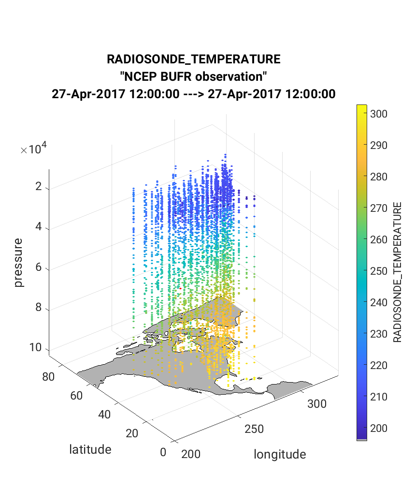
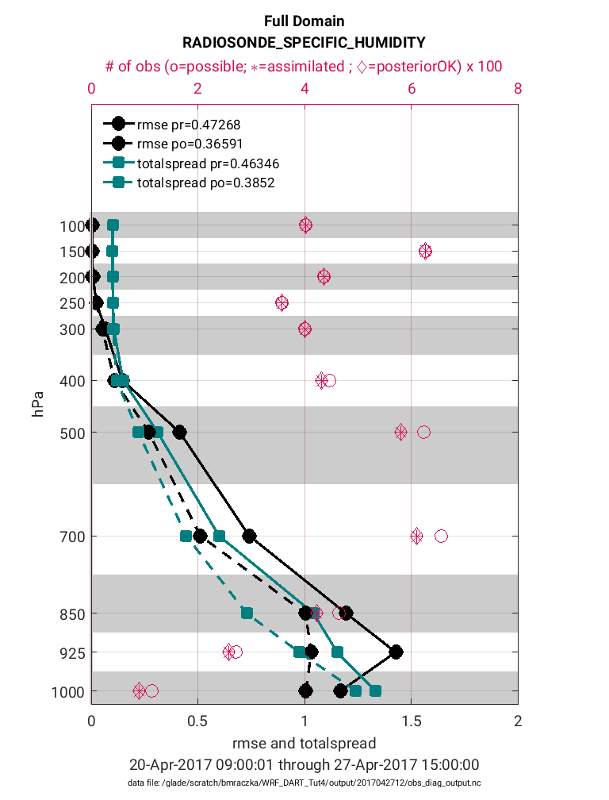

WRF/DART Tutorial Materials for the Manhattan Release.
======================================================

Introduction
------------

This document will describe how to get started with your own Weather
Research and Forecasting (WRF) data assimilation experiments using DART
and only covers only the WRF-specific aspects of integrating with DART.
It is not wise to try to run WRF/DART if you have no experience with WRF
and/or no experience with DART.

This tutorial was assembled to be compatible with ~WRF V3.9.1 and the
DART Manhattan release. Other releases of WRF may or may not be
backwards or forwards compatible with this tutorial.

You must already be comfortable running the
`WRF <http://www2.mmm.ucar.edu/wrf/users/download/get_source.html>`__
system (WPS, real_em build of WRF). If not, work through the `WRF model
tutorial <https://www.mmm.ucar.edu/wrf-tutorial-0>`__
first before trying to link WRF and DART together. Check the WRF user
guide or the
`WRFHELP <https://www.mmm.ucar.edu/wrf-user-support-contributor-information>`__
forum for WRF-specific assistance.

If you are new to DART, we recommend that you become familiar with DART
by working through the :doc:`../../../theory/readme` and then
understanding the :ref:`DART getting started <Welcome page>` documentation.

before attempting the WRF/DART tutorial as you will find many helpful
resources for learning the base DART configuration.

*We do not claim that this is a “turnkey” or “black box” system.* Be
mentally prepared to invest a reasonable amount of time on the learning
curve. There are many outstanding research issues which have no easy
answers. This is not a one week/grad student/naive user system. Even
after you get the code up and running, you have to be able to interpret
the results, which requires developing specific skills. There are a lot
of ways to alter how the system works – localization, inflation, which
variables and observations are assimilated, the assimilation window
time, the model resolution, etc, etc. This is both good and bad - you
have many ways of improving your results, but you have to take care on
how you leave all the settings of these inputs. Getting a set of scripts
that runs doesn’t mean the system is running well, or producing useful
results. So - if you’re still reading: Let the adventure begin!

This tutorial introduces a “canned” WRF/DART experiment involving an
ensemble of 50 members that will be initialized from GFS initial
conditions at 2017/04/27 00:00 UTC using a domain of the continental
United States. The data included in the tutorial lasts until 2017/04/30
18:00 UTC. During this period, there was a strong rain and wind event
that affected a large portion of the United States, causing record
rains, localized flooding, and numerous tornadoes. For more information
on the physical account of this case, see
`weather.gov <https://www.weather.gov/lot/2017Apr2930_rainfall>`__.

By default, the tutorial case will only cover 12 hours of this event
starting at 2017/04/27 00:00 UTC. The WRF model will be “spun-up” for
six hours to generate a prior distribution. An assimilation of PREPBUFR
observations will then be performed at 06:00 UTC, at which time analysis
files will be generated to begin a new ensemble forecast. The WRF model
will be advanced for 6 hours and a final assimilation cycle will be
performed at 12:00 UTC. This process could then continue in order to
investigate the strong rain and wind event. For what it's worth, on
NSF NCAR's *Cheyenne* under the default test configuration for this case, it
can take an hour to complete a forecast/assimilation cycle. Since the
tutorial runs for two cycles, it can take twice as long.

The goals of this tutorial are to demonstrate how WRF/DART works. After
running this tutorial, you will be able to understand the major steps
involved in setting up your own data assimilation (DA) experiments.
However, you will need to do additional work before you can expect to
have a fully functional WRF/DART system, as some of the steps involved
in this tutorial (in particular, the perturbation bank and the
observation sequence files) are provided for you in order to simplify
the process. Furthermore, if you are not running on the NSF NCAR
Cheyenne supercomputing system, you will likely need to customize the
assimilation scripts to match the details of your particular system.

.. important ::

  We have provided instructions for the NSF NCAR supercomputer
  Cheyenne, so you may need to tailor these instructions to your system if
  you are not using Cheyenne. These system-specific setup steps may take a
  good deal of effort, especially if you are unfamiliar with details such
  as MPI, NetCDF, etc. Furthermore, even after you get the code up and
  running, you will need to properly interpret your results.

Step 1: Setup
-------------

There are several dependencies for the executables and scripting
components. On Cheyennne, users have reported success building WRF, WPS,
WRFDA, and DART with the default module environment including Intel
compilers, MPT, and netCDF4. In addition, you'll need to load the
`nco <http://nco.sourceforge.net/>`__ and
`ncl <https://www.ncl.ucar.edu/>`__ modules to run the set of scripts
that accompany the tutorial.

There are multiple phases for the setup: building the DART executables,
getting the initial WRF boundary conditions etc., building (or using
existing) WRF executables, and configuring and staging the scripting
needed to perform an experiment.

Build the DART executables.
~~~~~~~~~~~~~~~~~~~~~~~~~~~

If you have not already, see :ref:`Getting Started <Welcome page>` to
download the DART software package. Set an environment variable
*DART_DIR* to point to your base DART directory. How to do this will
depend on which shell you are using.

===== ====================================================
shell command
===== ====================================================
tcsh  ``setenv DART_DIR <path_to_your_dart_installation>``
bash  ``export DART_DIR=<path_to_your_dart_installation>``
===== ====================================================

In either case, you will replace <path_to_your_dart_installation> with
the actual path to your DART installation. If you are using another
shell, refer to your shell-specific documentation on how to set an
environment variable.

Building the DART executables for the tutorial follows the same process
as building any of the DART executables. Configure the ``mkmf.template``
file for your system, configure the ``input.nml`` for the model you want
to compile, and run ``quickbuild.sh`` (which is not necessarily quick,
but it is quicker than doing it by hand) to compile all the programs you
might need for an experiment with that model.

1. It is assumed you have successfully configured the
   ``$DART_DIR/build_templates/mkmf.template`` file for your system. If
   not, you will need to do so now. See :ref:`Getting Started <Welcome page>`
   for more detail, if necessary.

2. [OPTIONAL] Modify the DART code to use 32bit reals. Most WRF/DART
   users run both the WRF model and the DART assimilation code using
   32bit reals. This is not the default for the DART code. Make this
   single code change before building the DART executables to compile
   all reals as 32bit reals.

   Edit ``$DART_DIR/assimilation_code/modules/utilities/types_mod.f90``
   with your favorite editor. Change

   ::

     ! real precision:
     ! TO RUN WITH REDUCED PRECISION REALS (and use correspondingly less memory)
     ! comment OUT the r8 definition below and use the second one:
     integer, parameter :: r4 = SELECTED_REAL_KIND(6,30)
     integer, parameter :: r8 = SELECTED_REAL_KIND(12)   ! 8 byte reals
     !integer, parameter :: r8 = r4                      ! alias r8 to r4
  
   to

   ::

       ! real precision:
       ! TO RUN WITH REDUCED PRECISION REALS (and use correspondingly less memory)
       ! comment OUT the r8 definition below and use the second one:
       integer, parameter :: r4 = SELECTED_REAL_KIND(6,30)
       ! integer, parameter :: r8 = SELECTED_REAL_KIND(12)   ! 8 byte reals
       integer, parameter :: r8 = r4                      ! alias r8 to r4

3. Copy the tutorial DART namelist from
   ``$DART_DIR/models/wrf/tutorial/template/input.nml.template`` to
   ``$DART_DIR/models/wrf/work/input.nml``.

   ::

      cd $DART_DIR/models/wrf
      cp tutorial/template/input.nml.template work/input.nml

4. Build the WRF/DART executables:

   ::

      cd $DART_DIR/models/wrf/work
      ./quickbuild.sh

   Many executables are built, the following executables are needed for the
   tutorial and will be copied to the right place by the *setup.csh* script
   in a subsequent step:
 
   ::

      advance_time
      fill_inflation_restart
      filter
      obs_diag
      obs_seq_to_netcdf
      obs_sequence_tool
      pert_wrf_bc
      wrf_dart_obs_preprocess

Preparing the experiment directory.
~~~~~~~~~~~~~~~~~~~~~~~~~~~~~~~~~~~

Approximately 100Gb of space is needed to run the tutorial. Create a
"work" directory someplace with a lot of free space. The rest of the
instructions assume you have an environment variable called *BASE_DIR*
that points to this directory.

===== ====================================================
shell command
===== ====================================================
tcsh  ``setenv BASE_DIR <path_to_your_working_directory>``
bash  ``export BASE_DIR=<path_to_your_working_directory>``
===== ====================================================

1. The WRF boundary conditions and perturbations required to make a
   viable ensemble are available in a 15 GB tar file. Put this file in
   your ``$BASE_DIR``. Since this is a large file, we suggest using
   'wget' to download the file directly to your local system:

   ::

       cd $BASE_DIR
       wget http://www.image.ucar.edu/wrfdart/tutorial/wrf_dart_tutorial_23May2018_v3.tar.gz
       tar -xzvf wrf_dart_tutorial_23May2018_v3.tar.gz

   After untarring the file you should see the following directories:
   *icbc, output, perts,* and *template.* The directory names (case
   sensitive) are important, as the scripts rely on these local paths
   and file names.

2. You will need template WRF namelists from the
   ``$DART_DIR/models/wrf/tutorial/template`` directory:

   ::

       cp $DART_DIR/models/wrf/tutorial/template/namelist.input.meso   $BASE_DIR/template/.
       cp $DART_DIR/models/wrf/tutorial/template/namelist.wps.template $BASE_DIR/template/.

3. You will also need scripting to run a WRF/DART experiment. Copy the contents of 
   ``$DART_DIR/models/wrf/shell_scripts`` to the ``$BASE_DIR/scripts`` directory.

   ::

       mkdir $BASE_DIR/scripts
       cp -R $DART_DIR/models/wrf/shell_scripts/* $BASE_DIR/scripts

Build or locate WRF executables.
~~~~~~~~~~~~~~~~~~~~~~~~~~~~~~~~

The
`WRFDA <http://www2.mmm.ucar.edu/wrf/users/wrfda/download/get_source.html>`__
package is needed to generate a set of perturbed initial ensemble member
files and also to generate perturbed boundary condition files. Since the
tutorial provides a perturbation bank for a specific case, it is not
required to actually *run da_wrfvar.exe* but it needs to be in the
``WRF_RUN`` directory for the tutorial.

Build (or locate an appropriate build of) WRF, WPS and WRFDA.
^^^^^^^^^^^^^^^^^^^^^^^^^^^^^^^^^^^^^^^^^^^^^^^^^^^^^^^^^^^^^

WRF and WRFDA should be built with the "dmpar" option, while WPS can be
built "serial"ly. See the WRF/WRFDA documentation for more information
about building these packages. 

.. note::
	
 For consistency and to avoid errors, you should build WRF, WPS, WRFDA, and DART with the
 same compiler you use for NetCDF. Likewise MPI should use the same compiler.
 You will need the location of the WRF and WRFDA builds to customize the
 *params.csh* script in the next step.

Configure ``$BASE_DIR/scripts/param.csh`` with proper paths, info, etc.
^^^^^^^^^^^^^^^^^^^^^^^^^^^^^^^^^^^^^^^^^^^^^^^^^^^^^^^^^^^^^^^^^^^^^^^

This is a script that sets variables which will be read by other
WRF/DART scripts. There are some specific parameters for either the
Cheyenne supercomputing system using the
`PBS <https://www.pbsworks.com/>`__ queueing system or the
(decommissioned) Yellowstone system which used the *LSF* queueing
system. If you are not using Cheyenne, you may still want to use this
script to set your queueing-system specific parameters.

.. important::

   All variables that are marked
   ``'set this appropriately #%%%#'`` need to be set. This list is intended
   to provide some guidance on what needs to be set, but it is not an
   exhaustive list.

 +-------------------------+-----------------------------------------------------------------------------------------------------------------------------------------------------+
 |     Script variable     |                                                                     Description                                                                     |
 +=========================+=====================================================================================================================================================+
 | module load mpt         | The Environment Modules MPI compiler to use (here the HPE MPI) compiler). Note that on Cheyenne the default compiler is Intel.                      |
 +-------------------------+-----------------------------------------------------------------------------------------------------------------------------------------------------+
 | module load nco         | The nco package.                                                                                                                                    |
 +-------------------------+-----------------------------------------------------------------------------------------------------------------------------------------------------+
 | module load ncl/6.6.2   | The ncl package.                                                                                                                                    |
 +-------------------------+-----------------------------------------------------------------------------------------------------------------------------------------------------+
 | BASE_DIR                | The directory containing icbc, output, perts, etc.                                                                                                  |
 +-------------------------+-----------------------------------------------------------------------------------------------------------------------------------------------------+
 | DART_DIR                | The DART directory.                                                                                                                                 |
 +-------------------------+-----------------------------------------------------------------------------------------------------------------------------------------------------+
 | WRF_DM_SRC_DIR          | The directory of the WRF dmpar installation.                                                                                                        |
 +-------------------------+-----------------------------------------------------------------------------------------------------------------------------------------------------+
 | WPS_SRC_DIR             | The directory of the WPS installation.                                                                                                              |
 +-------------------------+-----------------------------------------------------------------------------------------------------------------------------------------------------+
 | VAR_SRC_DIR             | The directory of the WRFDA installation.                                                                                                            |
 +-------------------------+-----------------------------------------------------------------------------------------------------------------------------------------------------+
 | GEO_FILES_DIR           | The root directory of the WPS_GEOG files. NOTE: on Cheyenne these are available in the /glade/u/home/wrfhelp/WPS_GEOG directory                     |
 +-------------------------+-----------------------------------------------------------------------------------------------------------------------------------------------------+
 | GRIB_DATA_DIR           | The root directory of the GRIB data input into ungrib.exe. For this tutorial the grib files are included, so use ${ICBC_DIR}/grib_data              |
 +-------------------------+-----------------------------------------------------------------------------------------------------------------------------------------------------+
 | GRIB_SRC                | The type of GRIB data (e.g. <Vtable.TYPE>) to use with ungrib.exe to copy the appropriate Vtable file. For the tutorial, the value should be 'GFS'. |
 +-------------------------+-----------------------------------------------------------------------------------------------------------------------------------------------------+
 | COMPUTER_CHARGE_ACCOUNT | The project account for supercomputing charges. See your supercomputing project administrator for more information.                                 |
 +-------------------------+-----------------------------------------------------------------------------------------------------------------------------------------------------+
 | EMAIL                   | The e-mail address used by the queueing system to send job summary information.                                                                     |
 +-------------------------+-----------------------------------------------------------------------------------------------------------------------------------------------------+

Run the *setup.csh* script to create the proper directory structure and
move executables to proper locations.

::

   cd $BASE_DIR/scripts
   ./setup.csh param.csh

So far, your ``$BASE_DIR`` should contain the following directories:

::

   icbc
   obs_diag
   obsproc
   output
   perts
   post
   rundir
   scripts
   template

Your ``$BASE_DIR/rundir`` directory should contain the following:

**executables:**

 
- `advance_time <../../../assimilation_code/programs/advance_time/advance_time.html>`__,
- `fill_inflation_restart <../../../assimilation_code/programs/fill_inflation_restart/fill_inflation_restart.html>`__,
- `filter <../../../assimilation_code/programs/filter/filter.html>`__,
- `obs_diag <../../../assimilation_code/programs/obs_diag/threed_sphere/obs_diag.html>`__,
- `obs_seq_to_netcdf <../../../assimilation_code/programs/obs_seq_to_netcdf/obs_seq_to_netcdf.html>`__,
- `obs_sequence_tool <../../../assimilation_code/programs/obs_sequence_tool/obs_sequence_tool.html>`__,
- ``pert_wrf_bc`` (no helper page),
- `wrf_dart_obs_preprocess <../../../models/wrf/WRF_DART_utilities/wrf_dart_obs_preprocess.html>`__

**directories:** 

- ``WRFIN`` (empty)
- ``WRFOUT`` (empty)
- ``WRF_RUN`` (wrf executables and support files)

**scripts:** 

- *add_bank_perts.ncl*
- *new_advance_model.csh*

**support data:** 

- *sampling_error_correction_table.nc*

Check to make sure your ``$BASE_DIR/rundir/WRF_RUN`` directory contains:

::

   da_wrfvar.exe
   wrf.exe
   real.exe
   be.dat
   contents of your WRF build run/ directory (support data files for WRF)

.. note::

	
   Be aware that the *setup.csh* script is designed to remove
   ``$BASE_DIR/rundir/WRF_RUN/namelist.input``. Subsequent scripting will
   modify ``$BASE_DIR/template/namlist.input.meso`` to create the
   ``namelist.input`` for the experiment.

For this tutorial, we are providing you with a specified WRF domain. To
make your own, you would need to define your own wps namelist and use
WPS to make your own geogrid files. See the WRF site for help with
building and running those tools as needed. You would also need to get
the appropriate grib files to generate initial and boundary condition
files for the full period you plan to cycle. In this tutorial we have
provided you with geogrid files, a small set of grib files, and a
namelist to generate series of analyses for several days covering a
North American region.

Let's now look inside the ``$BASE_DIR/scripts`` directory. You should
find the following scripts:

+-----------------------+-------------------------------------------------------------------------------------------+
|      Script name      |                                        Description                                        |
+=======================+===========================================================================================+
| add_bank_perts.ncl    | Adds perturbations to each member.                                                        |
+-----------------------+-------------------------------------------------------------------------------------------+
| assim_advance.csh     | Advances 1 WRF ensemble member to the next analysis time.                                 |
+-----------------------+-------------------------------------------------------------------------------------------+
| assimilate.csh        | Runs filter ... i.e. the assimilation.                                                    |
+-----------------------+-------------------------------------------------------------------------------------------+
| diagnostics_obs.csh   | Computes observation-space diagnostics and the model-space mean analysis increment.       |
+-----------------------+-------------------------------------------------------------------------------------------+
| driver.csh            | Primary script for running the cycled analysis system.                                    |
+-----------------------+-------------------------------------------------------------------------------------------+
| first_advance.csh     | Advances 1 WRF ensemble member (on the first time).                                       |
+-----------------------+-------------------------------------------------------------------------------------------+
| gen_pert_bank.csh     | Saves the perturbations generated by WRFDA CV3.                                           |
+-----------------------+-------------------------------------------------------------------------------------------+
| gen_retro_icbc.csh    | Generates the wrfinput and wrfbdy files.                                                  |
+-----------------------+-------------------------------------------------------------------------------------------+
| init_ensemble_var.csh | Creates the perturbed initial conditions from the WRF-VAR system.                         |
+-----------------------+-------------------------------------------------------------------------------------------+
| mean_increment.ncl    | Computes the mean state-space increment, which can be used for plotting.                  |
+-----------------------+-------------------------------------------------------------------------------------------+
| new_advance_model.csh | advances the WRF model after running DART in a cycling context.                           |
+-----------------------+-------------------------------------------------------------------------------------------+
| param.csh             | Contains most of the key settings to run the WRF/DART system.                             |
+-----------------------+-------------------------------------------------------------------------------------------+
| prep_ic.csh           | Prepares the initial conditions for a single ensemble member.                             |
+-----------------------+-------------------------------------------------------------------------------------------+
| real.csh              | Runs the WRF real.exe program.                                                            |
+-----------------------+-------------------------------------------------------------------------------------------+
| setup.csh             | Creates the proper directory structure and place executables/scripts in proper locations. |
+-----------------------+-------------------------------------------------------------------------------------------+

You will need to edit the following scripts to provide the paths to
where you are running the experiment, to connect up files, and to set
desired dates. Search for the string ``'set this appropriately #%%%#'``
for locations that you need to edit.

::

   cd $BASE_DIR/scripts
   grep -r 'set this appropriately #%%%#' .

Other than *param.csh*, which was covered above, make the following
changes:

+--------------------+--------------------------------------+---------------------------------------------------------------------------------------------------------------------------------------------------------------------------------------------------------------------------------------------------------+
|      File name     |           Variable / value           |                                                                                                                    Change description                                                                                                                   |
+====================+======================================+=========================================================================================================================================================================================================================================================+
| driver.csh         | datefnl = 2017042712                 | Change to the final target date; here the final date is already set correctly for this tutorial.                                                                                                                                                        |
+--------------------+--------------------------------------+---------------------------------------------------------------------------------------------------------------------------------------------------------------------------------------------------------------------------------------------------------+
| gen_retro_icbc.csh | datefnl = 2017042712                 | Set to the final target date of the tutorial.  However, it is possible (not necessary) to create WRF initial/boundary conditions to 2017043000. This is the latest date that files are included in the tutorial.                                        |
+--------------------+--------------------------------------+---------------------------------------------------------------------------------------------------------------------------------------------------------------------------------------------------------------------------------------------------------+
| gen_retro_icbc.csh | paramfile = <full path to param.csh> | The full path to param.csh. Change this on the line after the comment. While these two files are in the same directory here, in general it is helpful to have one param.csh for each experiment.                                                        |
+--------------------+--------------------------------------+---------------------------------------------------------------------------------------------------------------------------------------------------------------------------------------------------------------------------------------------------------+
| gen_pert_bank.csh  | All changes                          | As the tutorial includes a perturbation bank, you will not need to run this script for the tutorial, so you will not need to change these values. However, you should set appropriate values when you are ready to generate your own perturbation bank. |
+--------------------+--------------------------------------+---------------------------------------------------------------------------------------------------------------------------------------------------------------------------------------------------------------------------------------------------------+

Next, move to the ``$BASE_DIR/perts`` directory. Here you will find 100
perturbation files, called a "perturbation bank." For your own case, you
would need to create a perturbation bank of your own. A brief
description for running the script is available inside the comments of
that file. However, again, for this tutorial, this step has already been
run for you. The ``$BASE_DIR/icbc`` directory contains a *geo_em_d01.nc*
file (geo information for our test domain), and grib files that will be
used to generate the initial and boundary condition files. The
``$BASE_DIR/template`` directory should contain namelists for WRF, WPS,
and filter, along with a wrfinput file that matches what will be the
analysis domain. Finally, the ``$BASE_DIR/output`` directory contains
observations within each directory name. Template files will be placed
here once created (done below), and as we get into the cycling the
output will go in these directories.

Step 2: Initial conditions
--------------------------

To get an initial set of ensemble files, depending on the size of your
ensemble and data available to you, you might have options to initialize
the ensemble from, say, a global ensemble set of states. Here, we
develop a set of flow dependent errors by starting with random
perturbations and conducting a short forecast. We will use the WRFDA
random CV option 3 to provide an initial set of random errors, and since
this is already available in the perturbation bank developed in the
setup, we can simply add these to a deterministic GFS state. Further,
lateral boundary uncertainty will come from adding a random perturbation
to the forecast (target) lateral boundary state, such that after the
integration the lateral boundaries have random errors.

First, we need to generate a set of GFS states and boundary conditions
that will be used in the cycling. Use
``$BASE_DIR/scripts/gen_retro_icbc.csh`` to create this set of files,
which will be added to a subdirectory corresponding to the date of the
run in the ``$BASE_DIR/output`` directory. Make sure
*gen_retro_icbc.csh* has the appropriate path to your *param.csh*
script. If the *param.csh* script also has the correct edits for paths
and you have the executables placed in the rundir, etc., then running
*gen_retro_icbc.csh* should execute a series of operations to extract
the grib data, run metgrid, and then twice execute *real.exe* to
generate a pair of WRF files and a boundary file for each analysis time.

::

   cd $BASE_DIR/scripts
   ./gen_retro_icbc.csh

.. note::

  Ignore any ``rm: No match`` errors, as the script attempts to
  delete output files if they already exist, and they will not for the
  first run.

Once the script completes, inside your ``$BASE_DIR/output/2017042700``
directory you should see these files:

::

   wrfbdy_d01_152057_21600_mean
   wrfinput_d01_152057_0_mean
   wrfinput_d01_152057_21600_mean

These filenames include the Gregorian dates for these files, which is
used by the dart software for time schedules. Similar files (with
different dates) should appear in all of the date directories between
the *datea* and *datef* dates set in the *gen_retro_icbc.csh* script.
All directories with later dates will also have an observation sequence
file *obs_seq.out* that contains observations to be assimilated at that
time.

Next, we will execute the script to generate an initial ensemble of
states for the first analysis. For this we run the script
*init_ensemble_var.csh*, which takes two arguments: a date string and
the location of the *param.csh* script.

::

   cd $BASE_DIR/scripts
   ./init_ensemble_var.csh 2017042700 param.csh

This script generates 50 small scripts and submits them to the batch
system. It assumes a PBS batch system and the 'qsub' command for
submitting jobs. If you have a different batch system, edit this script
and look near the end. You will need to modify the lines staring with
#PBS and change 'qsub' to the right command for your system. You might
also want to modify this script to test running a single member first —
just in case you have some debugging to do.

However, be warned that to successfully complete the tutorial, including
running the *driver.csh* script in Step 5, using a smaller ensemble 
(e.g. < 20 members) can lead to spurious updates during the analysis step,
causing the WRF simulation to fail. 

When complete for the full ensemble, you should find 50 new files in the
directory ``output/2017042700/PRIORS`` with names like *prior_d01.0001*,
*prior_d01.0002*, etc... You may receive an e-mail to helpfully inform
you when each ensemble member has finished.

Step 3: Prepare observations [OPTIONAL]
---------------------------------------

For the tutorial exercise, observation sequence files are provided to
enable you to quickly get started running a test WRF/DART system. If you
want to run with the example observations, you can skip to Step
4.

However, observation processing is critical to the success of running
DART and was covered in :ref:`Getting Started <Welcome page>`. In
brief, to add your own observations to WRF/DART you will need to
understand the relationship between observation definitions and
observation sequences, observation types and observation quantities, and
understand how observation converters extract observations from their
native formats into the DART specific format.

The observation sequence files that are provided in this tutorial come
from NCEP BUFR observations from the GDAS system. These observations
contain a wide array of observation types from many platforms within a
single file.

If you wanted to generate your own observation sequence files from
PREPBUFR for an experiment with WRF/DART, you should follow the guidance
on the
`prepbufr <../../../observations/obs_converters/NCEP/prep_bufr/prep_bufr.html>`__
page to build the bufr conversion programs, get observation files for
the dates you plan to build an analysis for, and run the codes to
generate an observation sequence file.

For completeness, we list here how you could generate these observation
sequence files yourself. 

.. important::

   the following steps are **not
   necessary** for the tutorial as the processed PREPBUFR observation
   sequence files have already been provided for you. However, these steps
   are provided in order to help users get started with these observations
   quickly for their own experiments.

To (again, *optionally*) reproduce the observation sequence files in the
*output* directories, you would do the following:

-  Go into your DART prep_bufr observation converter directory and
   install the PREPBUFR utilities as follows:

   ::

      cd $DART_DIR/observations/obs_converters/NCEP/prep_bufr
      ./install.sh

   You may need to edit the *install.sh* script to match your compiler
   and system settings.

-  Go to the
   ``$DART_DIR/observations/obs_converters/NCEP/prep_bufr/work/``
   directory and run *quickbuild.sh* to build the DART
   PREPBUFR-to-intermediate-file observation processor:

   ::

      cd $DART_DIR/observations/obs_converters/NCEP/prep_bufr/work
      ./quickbuild.sh

-  Download the PREPBUFR observations for your desired time. Go to the
   `NSF NCAR Research Data
   Archive <https://rda.ucar.edu/datasets/ds090.0/>`__ page for the
   NCEP/NSF NCAR Global Reanalysis Products. Register on the site, click on
   the "Data Access" tab, and follow either the instructions for
   external users or NSF NCAR internal users.

-  The downloaded *.tar* file will often be COS-blocked. If so, the file
   will appear corrupted if you attempt to untar it without converting
   the data. See the `NSF NCAR COS-block <https://rda.ucar.edu/#!cosb>`__
   page for more information on how to strip the COS-blocking off of
   your downloaded file.

-  Untar the data in your desired directory.

-  In the ``$DART_DIR/observations/obs_converters/NCEP/prep_bufr/work``
   directory, edit the *input.nml* file. This file will control what
   observations will be used for your experiment, so the namelist
   options are worth investigating a bit here. For example, you could
   use the following:

   ::

      &prep_bufr_nml
         obs_window    = 1.0
         obs_window_cw = 1.5
         otype_use     = 120.0, 130.0, 131.0, 132.0, 133.0, 180.0
                         181.0, 182.0, 220.0, 221.0, 230.0, 231.0
                         232.0, 233.0, 242.0, 243.0, 245.0, 246.0
                         252.0, 253.0, 255.0, 280.0, 281.0, 282.0
         qctype_use    = 0,1,2,3,15
         /

   This defines an observation time window of +/- 1.0 hours, while cloud
   motion vectors will be used over a window of +/- 1.5 hours. This will
   use observation types sounding temps (120), aircraft temps (130,131),
   dropsonde temps (132), mdcars aircraft temps, marine temp (180), land
   humidity (181), ship humidity (182), rawinsonde U,V (220), pibal U,V
   (221), Aircraft U,V (230,231,232), cloudsat winds (242,243,245), GOES
   water vapor (246), sat winds (252,253,255), and ship obs (280, 281,
   282). Additionally, it will include observations with specified qc
   types only. See the
   `prepbufr <../../../observations/obs_converters/NCEP/prep_bufr/prep_bufr.html>`__
   page for more available namelist controls.

-  Within the
   ``$DART_DIR/observations/obs_converters/NCEP/prep_bufr/work``
   directory, edit the *prepbufr.csh* file and change *BUFR_dir*,
   *BUFR_idir*, *BUFR_odir*, and *BUFR_in* to match the locations and
   format of the data you downloaded. A little trial and error might be
   necessary to get these set correctly.

-  Copy over the executables from ``../exe``, and run the *prepbufr.csh*
   script for a single day at a time:

   ::

      cd $DART_DIR/observations/obs_converters/NCEP/prep_bufr/work
      cp ../exe/\*.x .
      ./prepbufr.csh \<year\> \<month\> \<day\>

-  Your PREPBUFR files have now been converted to an intermediate ASCII
   format. There is another observation converter to take the
   observations from this format and write them into the native DART
   format. Edit the *input.nml* namelist file in the
   *DART_DIR/observations/obs_converters/NCEP/ascii_to_obs/work*
   directory. Here is a basic example:

   ::

      &ncepobs_nml
         year       = 2017,
         month      = 4,
         day        = 27,
         tot_days   = 3,
         max_num    = 800000,
         select_obs = 0,
         ObsBase = '<path to observations>/temp_obs.',
         daily_file = .false.,
         lat1       = 15.0,
         lat2       = 60.0,
         lon1       = 270.0,
         lon2       = 330.0
         /

   Choosing "select_obs = 0" will select all the observations in the
   ASCII file. Set "ObsBase" to the directory you output the files from
   during the last step. If you wish to choose specific observations
   from the ASCII intermediate file or control other program behavior,
   there are many namelist options documented on the
   `create_real_obs <../../../observations/obs_converters/NCEP/ascii_to_obs/create_real_obs.html>`__
   page.

-  It is now time to build *ascii_to_obs* programs. Run the following:

   ::

      cd $DART_DIR/observations/obs_converters/NCEP/ascii_to_obs/work
      ./quickbuild.sh

-  Run the *create_real_obs* program to create the DART observation
   sequence files:

   ::

      cd $DART_DIR/observations/obs_converters/NCEP/ascii_to_obs/work
      ./create_real_obs

-  The program *create_real_obs* will create observation sequence files
   with one file for each six hour window. For a cycled experiment, the
   typical approach is to put a single set of observations, associated
   with a single analysis step, into a separate directory. For example,
   within the ``output`` directory, we would create directories like
   ``2017042700``, ``2017042706``, ``2017042712``, etc. for 6-hourly
   cycling. Place the observation files in the appropriate directory to
   match the contents in the files (e.g. *obs_seq2017042706*) and rename
   as simply *obs_seq.out* (e.g. ``output/2017042706/obs_seq.out``).

-  It is helpful to also run the
   `wrf_dart_obs_preprocess <../../../models/wrf/WRF_DART_utilities/wrf_dart_obs_preprocess.html>`__
   program, which can strip away observations not in the model domain,
   perform superobservations of dense observations, increase observation
   errors near the lateral boundaries, check for surface observations
   far from the model terrain height, and other helpful pre-processing
   steps. These collectively improve system performance and simplify
   interpreting the observation space diagnostics. There are a number of
   namelist options to consider, and you must provide a *wrfinput* file
   for the program to access the analysis domain information.

Step 4: Creating the first set of adaptive inflation files
----------------------------------------------------------

In this section we describe how to create initial adaptive inflation
files. These will be used by DART to control how the ensemble is
inflated during the first assimilation cycle.

It is convenient to create initial inflation files before you start an
experiment. The initial inflation files may be created with
*fill_inflation_restart*, which was built by the *quickbuild.sh* step.
A pair of inflation files is needed for each WRF domain.

Within the ``$BASE_DIR/rundir`` directory, the *input.nml* file has some
settings that control the behavior of *fill_inflation_restart*. Within
this file there is the section:

::

   &fill_inflation_restart_nml
      write_prior_inf = .true.
      prior_inf_mean  = 1.00
      prior_inf_sd    = 0.6

      write_post_inf  = .false.
      post_inf_mean   = 1.00
      post_inf_sd     = 0.6

      input_state_files = 'wrfinput_d01'
      single_file       = .false.
      verbose           = .false.
      /

These settings write a prior inflation file with a inflation mean of 1.0
and a prior inflation standard deviation of 0.6. These are reasonable
defaults to use. The *input_state_files* variable controls which file to
use as a template. You can either modify this namelist value to point to
one of the *wrfinput_d01_XXX* files under ``$BASE_DIR/output/<DATE>``,
for any given date, or you can copy one of the files to this directory.
The actual contents of the file referenced by *input_state_files* do not
matter, as this is only used as a template for the
*fill_inflation_restart* program to write the default inflation values.
Note that the number of files specified by *input_state_files* must
match the number of domains specified in *model_nml:num_domains*, i.e.
the program needs one template for each domain. This is a
comma-separated list of strings in single 'quotes'.

After running the program, the inflation files must then be moved to the
directory expected by the *driver.csh* script.

Run the following commands with the dates for this particular tutorial:

::

   cd $BASE_DIR/rundir
   cp ../output/2017042700/wrfinput_d01_152057_0_mean ./wrfinput_d01
   ./fill_inflation_restart
   mkdir ../output/2017042700/Inflation_input
   mv input_priorinf_*.nc ../output/2017042700/Inflation_input/

Once these files are in the right place, the scripting should take care
of renaming the output from the previous cycle as the input for the next
cycle.

Step 5: Cycled analysis system
------------------------------

While the DART system provides executables to perform individual tasks
necessary for ensemble data assimilation, for large models such as WRF
that are run on a supercomputer queueing system, an additional layer of
scripts is necessary to glue all of the pieces together. A set of
scripts is provided with the tutorial tarball to provide you a starting
point for your own WRF/DART system. You will need to edit these scripts,
perhaps extensively, to run them within your particular computing
environment. If you will run on NSF NCAR's Cheyenne environment, fewer edits
may be needed, but you should familiarize yourself with `running jobs on
Cheyenne <https://www2.cisl.ucar.edu/resources/computational-systems/cheyenne/quick-start-cheyenne>`__
if necessary. A single forecast/assimilation cycle of this tutorial can
take an hour on Cheyenne - longer if debug options are enabled or the
shared nodes are busy - shorter if more cores or a higher optimization
level is acceptable.

In this tutorial, we have previously edited the *param.csh* and other
scripts. Throughout the WRF/DART scripts, there are many options to
adjust cycling frequency, domains, ensemble size, etc., which are
available when adapting this set of scripts for your own research. To
become more famililar with this set of scripts and to eventually make
these scripts your own, we advise commenting out all the places the
script submits jobs while debugging, placing an 'exit' in the script at
each job submission step. This way you will be able to understand how
all of the pieces work together.

However, for this tutorial, we will only show you how the major
components work. The next step in our process is the main *driver.csh*
script, which expects a starting date (YYYYMMDDHH) and the full path of
the resource file as command line arguments. In this example (which uses
csh/tcsh syntax), we are also capturing the run-time output into a file
named *run.out* and the entire command will be running in the
background:

::

   cd $BASE_DIR/scripts
   ./driver.csh 2017042706 param.csh >& run.out &

*driver.csh* will - check that the input files are present (wrfinput
files, wrfbdy, observation sequence, and DART restart files), - create a
job script to run *filter* in ``$BASE_DIR/rundir``, - monitor that
expected output from *filter* is created, - submit jobs to advance the
ensemble to the next analysis time, - (simultaneously with the ensemble
advance) compute assimilation diagnostics - archive and clean up - and
continue to cycle until the final analysis time has been reached.

Step 6: Diagnosing the assimilation results
-------------------------------------------

Once you have successfully completed steps 1-5, it is important to
check the quality of the assimilation. In order to do this, DART provides
analysis system diagnostics in both state and observation space.

As a preliminary check, confirm that the analysis system actually updated 
the WRF state. Locate the file in the ``$BASE_DIR/output/*`` directory called
``analysis_increment.nc`` which is the difference of the ensemble mean state
between the background (prior) and the analysis (posterior) after running 
``filter``. Use a tool, such as **ncview**, to look at this file as follows:

::

   cd $BASE_DIR/output/datefnl
   module load ncview
   ncview analysis_increment.nc

The ``analysis_increment.nc`` file includes the following atmospheric variables: 
``MU, PH, PSFC, QRAIN, QCLOUD, QGRAUP, QICE, QNICE, QSNOW, QVAPOR, T`` and ``T2``.
The example figure below shows the increments for temperature (T) only. You can 
use **ncview** to advance through all 11 atmospheric pressure levels. You should
see spatial patterns that look something like the meteorology of the day.

+--------------------------+--------------------------------+
| |ncview1|                | |ncview2|                      |
+--------------------------+--------------------------------+

For more information on how the increments were calculated,  we recommend
(but do not require to complete the tutorial) that you review the 
:doc:`Diagnostics Section <../../../guide/checking-your-assimilation>`
of the DART Documentation. There are seven sections within the diagnostics
section including 1) Checking your initial assimilation, 2) Computing
filter increments and so on. Be sure to advance through all the sections.

The existence of increments proves the model state was adjusted, however,
this says nothing about the quality of the assimilation.  For example,
how many of the observations were assimilated? Does the posterior state
better represent the observed conditions of the atmosphere?  These questions
can be addressed with the tools described in the remainder of this section. 
All of the diagnostic files (**obs_epoch*.nc** and **obs_diag_output.nc**) 
have already been generated from the tutorial. 
(**driver.csh* executes  **diagnostics_obs.csh**). Therefore you are ready
to start the next sections.

Visualizing the observation locations and acceptance rate 
---------------------------------------------------------

An important assimilation diagnostic is whether observations were accepted
or rejected.  Observations can be rejected for many reasons, but the two most common
rejection modes in DART are:   1)  **violation of the outlier threshold**,  meaning the
observations were too far away from the prior model estimate of the observation or
2) **forward operator failure**, meaning the calculation to generate the expected 
observation failed. A full list of rejection criteria are provided 
:doc:`here. <../../../guide/dart-quality-control>` Regardless of the reason for
the failure, a successful simulation assimilates the vast majority of observations.
The tools below provide methods to visualize the spatial patterns, statistics and 
failure mode for all observations.

The observation diagnostics use the **obs_epoch*.nc** file as input.  This file is
automatically generated by the **obs_diagnostic.csh** script within Step 5 of this
tutorial.

The **obs_epoch*.nc** file is located in the output directory of each time step.
In some cases there could be multiple obs_epoch*.nc files, but in general, the user 
should use the obs_epoch file appended with the largest numeric value as it
contains the most complete set of observations.  The diagnostic scripts used here 
are included within the DART package, and require a license of Matlab to run.  The 
commands shown below to run the diagnostics use NSF NCAR's Cheyenne, but a user could
also run on their local machine.

First explore the obs_epoch*.nc file and identify the variety of observations included
in the assimilation including aircraft, surface, satelllite and radiosonde types.
 

::

 ncdump -h $BASEDIR/output/datefnl/obs_epoch_029.nc
 
     ..
     ..
     RADIOSONDE_U_WIND_COMPONENT 
     RADIOSONDE_V_WIND_COMPONENT
     RADIOSONDE_TEMPERATURE 
     RADIOSONDE_SPECIFIC_HUMIDITY 
     ACARS_U_WIND_COMPONENT 
     ACARS_V_WIND_COMPONENT 
     ACARS_TEMPERATURE 
     MARINE_SFC_U_WIND_COMPONENT 
     MARINE_SFC_V_WIND_COMPONENT 
     MARINE_SFC_TEMPERATURE 
     MARINE_SFC_SPECIFIC_HUMIDITY 
     LAND_SFC_U_WIND_COMPONENT 
     LAND_SFC_V_WIND_COMPONENT 
     LAND_SFC_TEMPERATURE 
     LAND_SFC_SPECIFIC_HUMIDITY 
     SAT_U_WIND_COMPONENT 
     SAT_V_WIND_COMPONENT 
     RADIOSONDE_SURFACE_ALTIMETER 
     MARINE_SFC_ALTIMETER 
     LAND_SFC_ALTIMETER 
     METAR_ALTIMETER 
     METAR_U_10_METER_WIND 
     METAR_V_10_METER_WIND 
     METAR_TEMPERATURE_2_METER 
     METAR_SPECIFIC_HUMIDITY_2_METER 
     METAR_DEWPOINT_2_METER 
     RADIOSONDE_DEWPOINT 
     LAND_SFC_DEWPOINT 
     RADIOSONDE_RELATIVE_HUMIDITY 
     LAND_SFC_RELATIVE_HUMIDITY 
     ..
     ..

The example below uses the **plot_obs_netcdf.m** script to visulaize 
the observation type: ``RADIOSONDE_TEMPERATURE`` which includes both horizontal
and vertical coverage across North America. We recommend to view the script's 
contents with a text editor, paying special attention to the beginning of the file
which is notated with a variety of examples. Then to run the example do the 
following:

::

 cd $DARTROOT/diagnostics/matlab
 module load matlab
 matlab -nodesktop

Within Matlab declare the following variables, then run the script 
**plot_obs_netcdf.m** as follows below being sure to modify the
``fname`` variable for your specific case.

::

 >> fname = '$BASEDIR/output/2017042712/obs_epoch_029.nc';
 >> ObsTypeString = 'RADIOSONDE_TEMPERATURE';  
 >> region        = [200 330 0 90 -Inf Inf];
 >> CopyString    = 'NCEP BUFR observation';
 >> QCString      = 'DART quality control';
 >> maxgoodQC     = 2;
 >> verbose       = 1;   % anything > 0 == 'true'
 >> twoup         = 1;   % anything > 0 == 'true'
 >> plotdat = plot_obs_netcdf(fname, ObsTypeString, region, CopyString, QCString, maxgoodQC, verbose, twoup);

Below is an example of the figure produced by **plot_obs_netcdf.m**.  
Note that the top panel includes both the 3-D location of all possible
``RADIOSONDE_TEMPERATURE`` observations, which are color-coded based upon
the temperature value.  The bottom panel, on the other hand, provides only
the location of the observations that were rejected by the assimilation.
The color code indicates the reason for the rejection based on the
:doc:`DART quality control (QC). <../../../guide/dart-quality-control>`
In this example observations were rejected based on violation of the 
outlier threshold (QC = 7), and forward operator failure (QC = 4).  
Text is included within the figures that give more details regarding the
rejected observations  (bottom left of figure), and percentage of observations
that were rejected (flagged, located within title of figure).

+-------------------------------------------------------------+
| |radiosonde_obs|                                            |
+-------------------------------------------------------------+

.. Tip::
 The user can manually adjust the appearance of the data by accessing the 
 'Rotate 3D' option either by clicking on the top of the figure or through
 the menu bar as Tools > Rotate 3D. Use your cursor to rotate the map to the
 desired orientation.

For the next figure (below) the same steps are taken as described
above, however, the observation type (``ObsTypeString``) is set to
``METAR_TEMPERATURE_2_METER``. Notice in this case the observations
are limited to near the land surface.  This is because the vertical location
of this observation type was defined to be at the land surface 
(VERTISSURFACE), as opposed to the ``RADIOSONDE_TEMPERATURE`` observation
in which the vertical location was defined as pressure (VERTISPRESSURE). The
vertical coordinate system is defined in the ``obs_seq.out`` file and
`documented here. <https://docs.dart.ucar.edu/en/latest/guide/creating-obs-seq-real.html#observation-locations>`__ 

+-------------------------------------------------------------+
| |surface_obs|                                               |
+-------------------------------------------------------------+

Next we will demonstrate the use of the **link_obs.m** script which
provides visual tools to explore how the observations impacted the 
assimilation. The script generates 3 different figures which includes
a unique linking feature that allows the user to identify the features
of a specific observation including physical location, QC value, and 
prior/posterior estimated values. In the example below the 'linked'
observation appears 'red' in all figures.  To execute **link_obs.m** do the 
following within Matlab being sure to modify ``fname`` for your case:

::

 >> clear all
 >> close all
 >> fname = '$BASEDIR/output/2017042712/obs_epoch_029.nc';
 >> ObsTypeString = 'RADIOSONDE_TEMPERATURE';  
 >> region        = [200 330 0 90 -Inf Inf];
 >> ObsCopyString = 'NCEP BUFR observation';  
 >> CopyString    =  'prior ensemble mean';
 >> QCString      = 'DART quality control';
 >> global obsmat;
 >> link_obs(fname, ObsTypeString, ObsCopyString, CopyString, QCString, region)

+-----------------------------------+------------------------------+
| |linkobs1|                        | |linkobs2|                   |
+-----------------------------------+------------------------------+

.. Tip::
 To access the linking feature, click near the top of the figure such
 that a list of icons appear. Next click on the 'brush data' icon then
 click on a data point you wish to link. It will appear red.  Alternatively
 you can access the brush tool through the menu bar (Tools > Brush).
  

Another useful application of the **link_obs.m** script is to visually identify
the improvement of the model estimate of the observation through the 1:1 plot.
One way to do this is to compare the prior and posterior model estimate of the
either the ensemble mean or a single ensemble member. In the example figures below,
a 1:1 plot was generated for the prior and posterior values for ensemble member 3.
(Left Figure: ``CopyString =  'prior ensemble member 3'`` and Right Figure:
``CopyString = posterior ensemble member 3'``).  Note how the prior member 
estimate (left figure) compares less favorably to the observations as compared
to the posterior member estimate (right figure). The improved alignment 
(blue circles closer to 1:1 line) between the posterior estimate and the observations
indicates that the DART filter update provided an improved representation of the
observed atmospheric state.  

+-------------------------+-------------------------+
| |oneline1|              | |oneline2|              |
+-------------------------+-------------------------+

So far the example figures have provided primarily  qualitative estimates 
of the assimilation performance. The next step demonstrates how to apply more
quantitative measures to assess assimilation skill.

Quantification of model-observation mismatch and ensemble spread 
----------------------------------------------------------------

The **plot_rmse_xxx_profile.nc** script is one of the best tools to evaluate 
assimilation performance across a 3-D domain such as the atmosphere.
It uses the **obs_diag_output.nc** file as an input to generate RMSE, 
observation acceptance and other statistics.  Here we choose the ensemble
‘total spread’ statistic to plot alongside RMSE, however, you can choose
other statistics including 'bias', 'ens_mean' and 'spread'.  For a full
list of statistics perform the command ``ncdump -v CopyMetaData obs_diag_output.nc``.

::

 >> fname ='$BASEDIR/output/2017042712/obs_diag_output.nc';
 >> copy = 'totalspread';
 >> obsname = 'RADIOSONDE_TEMPERATURE';
 >> plotdat = plot_rmse_xxx_profile(fname,copy,'obsname',obsname)

+-------------------------------------------------------------+
| |profile1|                                                  |
+-------------------------------------------------------------+

Note in the figure above that the prior RMSE and total spread values
(solid black and teal lines) are significantly greater than the posterior
values (dashed black and teal lines). This is exactly the behavior we would 
expect (desire) because the decreased RMSE indicates the posterior model 
state has an improved representation of the atmosphere.  It is common for 
the introduction of observations to also reduce the ‘total spread’ because
the prior ensemble spread will compress to better match the observations. 
In general, it is preferable for the magnitude of the total spread to be 
similar to the RMSE.  If there are strong departures between the total spread
and RMSE this suggests the adaptive inflation settings may need to be adjusted
to avoid filter divergence.  Note that these statistics are given for each 
pressure level (1-11) within the WRF model.  Accompanying each level is also
the total possible (pink circle) and total assimilated (pink asterisk) observations.
Note that for each level the percentage of assimilated observations is 
quite high (>90%). This high acceptance percentage is typical of a high-quality 
assimilation and consistent with the strong reduction in RMSE.

The same plot as above is given below except for the observation type: 
``RADIOSONE_SPECIFIC_HUMIDITY``.

+-------------------------------------------------------------+
| |profile2|                                                  |
+-------------------------------------------------------------+

Although the plot_rmse_xxx_profile.m script is valuable for visualizing 
vertical profiles of assimilation statistics, it doesn’t capture the temporal
evolution. Temporal evolving statistics are valuable because the skill of an 
assimilation often begins poorly because of biases between the model and observations,
which should improve with time.  Also the quality of the assimilation may change
because of changes in the quality of the observations.  In these cases the 
**plot_rmse_xxx_evolution.m** script is used to illustrate temporal changes in 
assimilation skill. To generate the figures below the following matlab commands were used:

::

 >> fname   = '$BASEDIR/output/2017042712/obs_diag_output.nc';
 >> copy    = 'totalspread';
 >> obsname = 'RADIOSONDE_TEMPERATURE';
 >> plotdat =  plot_rmse_xxx_evolution(fname,copy,'obsname',obsname,'level',3);

.. NOTE::
 The figures below only evaluate two different assimilation
 cycles (hour 6 and hour 12 on 4/27/17), thus it is difficult to evaluate the
 temporal progression of the assimilation statistics.  This is given purely as an 
 example. Real world assimilations generally span for months and years thus 
 evaluating temporal evolution of statistics is more straightforward. The x-axis was
 also manually adjusted in the figure below.  To do this 
 **plot_rmse_xxx_evolution.m** was edited such that the ``bincenters`` were replaced
 with ``datenum`` values when defining ``axlims`` as:
 
      axlims = [datenum(2017,4,27,2,0,0) datenum(2017,4,27,14,0,0)  plotdat.Yrange];

+-------------------------------------------------------------+
| |evolution1|                                                |
+-------------------------------------------------------------+

The above figure is evaluated at model level 850hPa ('level',3), whereas
the figure below is generated in the same way except is evaluated at
300 hPa ('level',7) using: 
plotdat =  plot_rmse_xxx_evolution(fname,copy,'obsname',obsname,'level',7)

+-------------------------------------------------------------+
| |evolution2|                                                |
+-------------------------------------------------------------+

.. Important::
 The example diagnostics provided here are only a subset of the diagnostics
 available in the DART package.  Please see the web-based diagnostic 
 :doc:`documentation. <../../../guide/matlab-observation-space>` or 
 `DART LAB and DART Tutorial <https://dart.ucar.edu/tutorials/>`__
 for more details.

Generating the obs_diag_output.nc and obs_epoch*.nc files manually **[OPTIONAL]**
---------------------------------------------------------------------------------

This step is optional because the WRF-DART Tutorial automatically generates 
the diagnostic files (obs_diag_output.nc and obs_epoch_*.nc). However, these
files were generated with pre-set options (e.g. spatial domain, temporal bin size etc.)
that you may wish to modify.  Also, it is uncommon to generate these diagnostics
files automatically for a new assimilation application.  Therefore this section
describes the steps to generate the diagnostic files directly from the DART scripts
by using the WRF Tutorial as an example.

Generating the obs_epoch*.nc file
------------------------------------

::

 cd $DARTROOT/models/wrf/work

Generate a list of all the **obs_seq.final** files created by the assimilation
step (filter step).  This command creates a text list file.

::

 ls /glade/scratch/bmraczka/WRF_DART_Tut4/output/2017*/obs_seq.final > obs_seq_tutorial.txt

The DART exectuable **obs_seq_to_netcdf** is used to generate the obs_epoch 
type files. Modify the ``obs_seq_to_netcdf`` and ``schedule`` namelist settings
(using a text editor like `vi`) with the **input.nml** file to specify the spatial domain 
and temporal binning. The values below are intended to include the entire time
period of the assimilation.

::

 &obs_seq_to_netcdf_nml
   obs_sequence_name = ''
   obs_sequence_list = 'obs_seq_tutorial.txt',
   lonlim1 =   0.0
   lonlim2 = 360.0
   latlim1 = -90.0
   latlim2 =  90.0
   verbose = .false.
   /

 &schedule_nml
   calendar       = 'Gregorian',
   first_bin_start =  1601, 1, 1, 0, 0, 0,
   first_bin_end   =  2999, 1, 1, 0, 0, 0,
   last_bin_end   =  2999, 1, 1, 0, 0, 0,
   bin_interval_days    = 0,
   bin_interval_seconds = 21600,
   max_num_bins         = 1000,
   print_table          = .true
   /

Finally, run the exectuable:

::

 ./obs_seq_to_netcdf

Generating the obs_diag_output.nc file
-----------------------------------------

::

 cd $DARTROOT/models/wrf/work

The DART exectuable **obs_diag** is used to generate the obs_diag_output 
files. Modify the ``obs_diag`` namelist settings
(using a text editor like `vi`) with the **input.nml** file to specify the spatial domain
and temporal binning. Follow the same steps to generate the **obs_seq_tutorial.txt**
file as described in the previous section.

::

 &obs_diag_nml
   obs_sequence_name = '',
   obs_sequence_list = 'obs_seq_tutorial.txt',
   first_bin_center =  2017, 4, 27, 0, 0, 0 ,
   last_bin_center  =  2017, 4, 27, 12, 0, 0 ,
   bin_separation   =     0, 0, 0, 6, 0, 0 ,
   bin_width        =     0, 0, 0, 6, 0, 0 ,
   time_to_skip     =     0, 0, 0, 0, 0, 0 ,
   max_num_bins  = 1000,
   Nregions   = 1,
   lonlim1    =   0.0, 
   lonlim2    = 360.0, 
   latlim1    = 10.0, 
   latlim2    = 65.0,  
   reg_names  = 'Full Domain',
   print_mismatched_locs = .false.,
   verbose = .true.
   /

Finally, run the exectuable:

::

 ./obs_diag

If you encounter difficulties setting up, running, or evaluating the
system performance, please consider using the `GitHub
Issue <https://github.com/NCAR/DART/issues>`__ facility or feel free to
contact us at dart(at)ucar(dot)edu.

Additional materials from previous in-person tutorials
------------------------------------------------------

-  Introduction - `DART Lab
   materials <../../../guide/DART_LAB/DART_LAB.html>`__
-  WRF/DART basic building blocks
   -`slides <https://www.image.ucar.edu/wrfdart/classic/wrf_workshop_building_blocks.pdf>`__
   (some material is outdated)
-  Computing environment support
   -`slides <https://www.image.ucar.edu/wrfdart/classic/wrf_workshop_computing_environment.pdf>`__
-  WRF/DART application examples
   -`slides <https://www.image.ucar.edu/wrfdart/classic/wrf_workshop_application_examples.pdf>`__
   (some material is outdated)
-  Observation processing
   -`slides <https://www.image.ucar.edu/wrfdart/classic/wrf_workshop_observation_processing.pdf>`__
-  DART diagnostics - :doc:`observation diagnostics <../../../guide/matlab-observation-space>`

More Resources
--------------

-  `Check or Submit DART Issues <https://github.com/NCAR/DART/issues>`__
-  `DAReS website <ttp://dart.ucar.edu>`__
-  `Preparing
   MATLAB <https://dart.ucar.edu/pages/Getting_Started.html#matlab>`__
   to use with DART.
-  `WRF model users page <http://www.mmm.ucar.edu/wrf/users>`__

.. |ncview1| image:: ../../../guide/images/WRF_tutorial_ncview1.png
   :height: 300px
   :width: 100%

.. |ncview2| image:: ../../../guide/images/WRF_tutorial_ncview2.png
   :height: 300px
   :width: 100%

.. |radiosonde_obs| image:: ../../../guide/images/WRF_tutorial_radiosonde_obs.png
   :height: 300px
   :width: 100%

.. |surface_obs| image:: ../../../guide/images/WRF_tutorial_surface_obs.png
   :height: 300px
   :width: 100%

.. |linkobs2| image:: ../../../guide/images/WRF_tutorial_linkobs2.png
   :height: 300px
   :width: 100%

.. |oneline1| image:: ../../../guide/images/WRF_tutorial_oneline1.png
   :height: 300px
   :width: 100%

.. |oneline2| image:: ../../../guide/images/WRF_tutorial_oneline2.png
   :height: 300px
   :width: 100%

.. |profile1| image:: ../../../guide/images/WRF_tutorial_profile1.png
   :height: 300px
   :width: 100%

.. |evolution1| image:: ../../../guide/images/WRF_tutorial_evolution1.png
   :height: 300px
   :width: 100%

.. |evolution2| image:: ../../../guide/images/WRF_tutorial_evolution2.png
   :height: 300px
   :width: 100%
