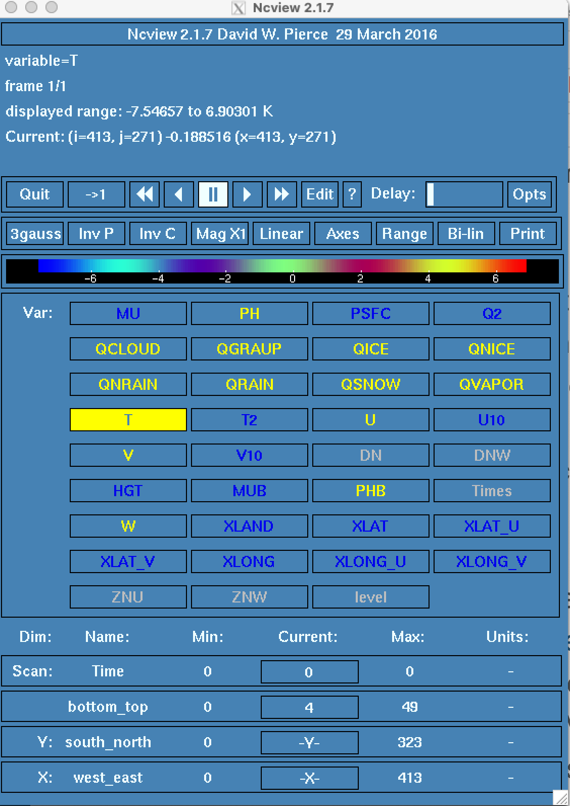
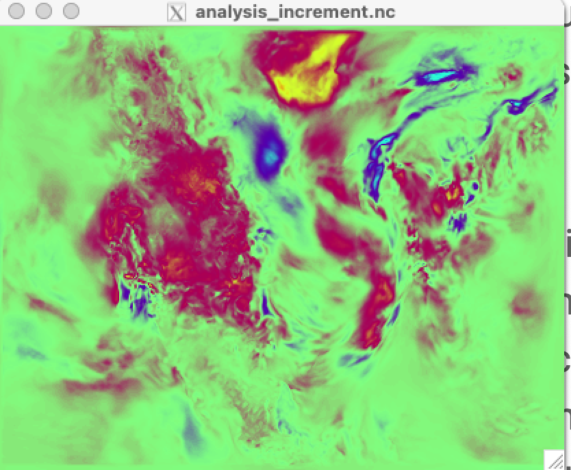
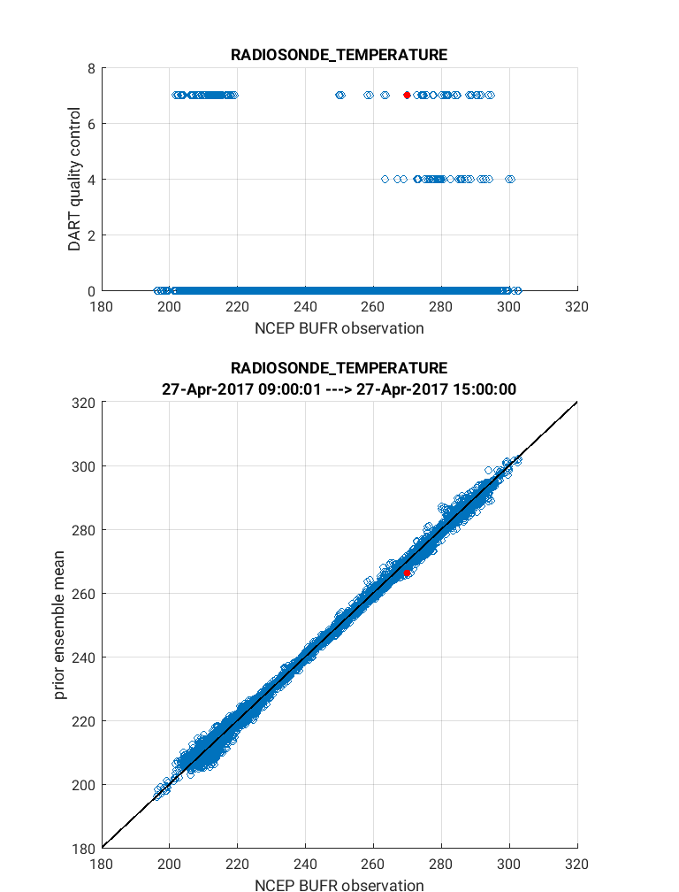
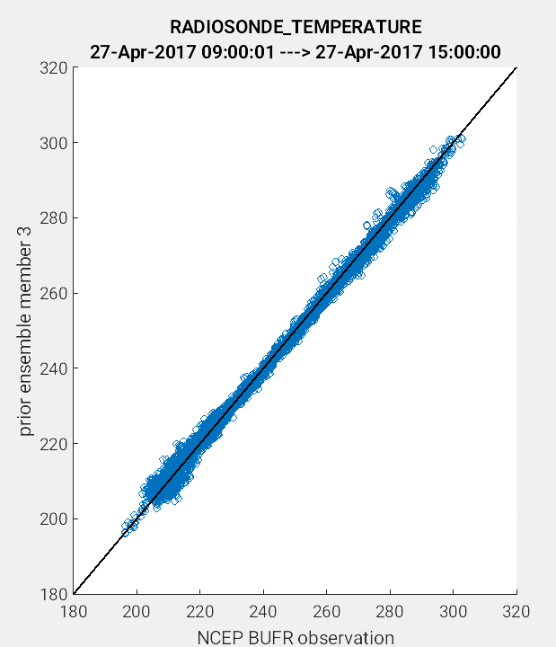

WRF/DART Tutorial Materials for the Manhattan Release.
======================================================

Introduction
------------

This document will describe how to get started with your own Weather
Research and Forecasting (WRF) data assimilation experiments using DART
and focuses on the  WRF-specific aspects of coupling with DART.  These
instructions provide a realistic nested (2-domain) WRFv4.5 example for a 
severe storm event in the Great Plains during 2024. The tutorial provides
the user with NCEP prepbufr atmospheric observations and WRF
grib files to generate observation files and  the inital WRF domain and 
boundary conditions. It is recommended the user work through the tutorial 
example completely and confirm the setup works on their own system.  
At that time, the scripts can be used as a template to apply to your own 
scientfic WRF-DART application.

.. Important ::

  This tutorial was designed to be compatible with WRF Version 4 and later, and was
  tested with WRFv4.5.2. It is mandatory to use the terrain following coordinate
  system (hybrid_opt=0) and not the default sigma hybrid coordinates (hybrid_opt=1)
  when using WRF-DART. Using the sigma hybrid coordinate can lead to adverse effects
  when generating ensemble spread leading to poor forecast performance.  For more 
  details see `DART Issue #650 <https://github.com/NCAR/DART/pull/650>`__.
  
  It is also mandatory to include the prognostic temperature variable ``THM`` within
  the DART state. This means that ``THM`` must be included alongside ``TYPE_T`` within
  the wrf_state_variables namelist.  The current implementation
  of the code sets ``use_theta_m=0`` (&dynamics section of ``namelist.input``) such that 
  ``THM=perturbation potential tempature``. For more discussion on this topic see:
  `DART issue #661 <https://github.com/NCAR/DART/issues/661>`__.

  Earlier versions of WRF (v3.9) may run without errors with more recent versions of
  DART (later than 11.4.0), but the assimilation performance will be deprecated.  
  If you need to run with earlier versions of WRF, please review the changes required
  to switch from WRFv4 to WRFv3 as documented within 
  `DART issue #661 <https://github.com/NCAR/DART/issues/661>`__,
  or contact the DART team.  Earlier WRF versions also require different settings
  within the WRF ``namelist.input`` file to promote vertical stability for the tutorial 
  example. These settings are also described in DART Issue #661.

Prior to running this tutorial, we urge the users to familarize themselves with the
`WRF system <https://www2.mmm.ucar.edu/wrf/users/model_overview.html>`__
(WRF_ARW, WPS and WRFDA), and to read through the `WRFv4.5  User's Guide
<https://www2.mmm.ucar.edu/wrf/users/docs/user_guide_v4/contents.html>`__
and the `WRF model tutorials <https://www2.mmm.ucar.edu/wrf/users/tutorial/tutorial.html>`__

The DART team is not responsible for and does not maintain the WRF code. For WRF related issues check out the
`WRF User Forum <https://forum.mmm.ucar.edu/>`__
or the `WRF github page. <https://github.com/wrf-model>`__

If you are new to DART, we recommend that you become familiar with EnKF
theory by working through the :doc:`../../../theory/readme` and then
understanding the :ref:`DART getting started <Welcome page>` documentation.

May 2024 Great Plains Severe Storm Event
----------------------------------------

This tutorial examines a Derecho and HP Supercell storm event that affected 
the Great Plains area on May 19th 2024. For more information on this event
see `weather.gov <https://www.weather.gov/ict/event_20240519>`__.

The figures below provides snapshots of the local radar during the evolution of
the storm event. The left panel (05-19-2024 18:00 UTC) and middle panel (05-20-2024 00:00 UTC) 
illustrate the timing of storm development, whereas the right panel shows the nested 
domain configuration for WRF. The nested domain (d02) (0.1x0.1 degrees) is centered in Kansas,
whereas the parent domain (d01) (0.2x0.2 degrees) covers a signifcant portion of the Great Plains.

+-------------------------+-------------------------+-------------------------+
| |radar1|                | |radar2|                | |wrf_domain|            |
+-------------------------+-------------------------+-------------------------+

The tutorial uses a 20 member ensemble initialized from the GFS at
05-19-2024 00:00 UTC. It performs an ensemble spinup from 00 to 06 UTC
by applying perturbations to the GFS initial condition.  It then assimilates
atmospheric observations at 06 and 12 UTC respectively. Finally, a forecast
is conducted (no observations assimilated) from 12 to 24 UTC.  This sequence
of ensemble spinup, assimilation mode and forecast mode generally
follows published literature for atmospheric DA.  Although we have strived
to maintain scientific realism in this tutorial, we have made an effort
to reduce the computational expense for reduced runtime by reducing
the ensemble size (20) and coarsening the WRF spatial resolution (0.1 and 0.2 degrees).
**For science applications we recommend at least using 40 ensemble members 
which helps reduce sampling error and improves the assimlation performance.**

On NSF NCAR's *Derecho*,the tutorial requires roughly 40 minutes of computational
run time, but can take longer depending upon the PBS queue wait time.

The goals of this tutorial are to: 1) provide an understanding of the major steps 
within a DA experiment, 2) port and test the WRF-DART scripts on the user's system 
and 3) use the WRF-DART tutorial scripts as a template for the user's own
research application.

.. Important ::

  The tutorial scripting and instructions are intended for the NSF NCAR supercomputer
  Derecho.  The user must modify the scripts and interpret the instructions for
  other HPC systems. The scripting uses examples for a PBS (e.g. Derecho)
  and LSF queuing system. These will need to be modified for other systems (e.g. SLURM).  

Step 1: Setup
-------------

There are several required dependencies for the executables and WRF-DART scripting
components. On NSF NCAR's Derecho, users have reported success building WRF, WPS,
WRFDA, and DART using gfortan with the following module environment. Note: not all
modules listed below are a requirement to compile and run the tutorial.

   ::

     Currently Loaded Modules:
        1) ncarenv/23.09 (S)   3) udunits/2.2.28   5) ncarcompilers/1.0.0   7) cray-mpich/8.1.27   9) netcdf-mpi/4.9.2 
        2) gcc/12.2.0          4) ncview/2.1.9     6) craype/2.7.23         8) hdf5-mpi/1.12.2    10) hdf/4.2.15

In addition, you'll need to load the
`nco <http://nco.sourceforge.net/>`__ and
`ncl <https://www.ncl.ucar.edu/>`__ modules to run the set of scripts
that accompany the tutorial. For Derecho the nco and ncl
packages can be automatically loaded using the following commands:

   ::

     module load nco
     module load ncl/6.6.2

These commands are provided by default with the param.sh script. More details
are provided below.  There are multiple phases for the setup: building the DART executables,
downloading the initial WRF boundary conditions, building (or using
existing) WRF executables, and configuring and staging the scripting
needed to perform an experiment.

Build the DART executables.
~~~~~~~~~~~~~~~~~~~~~~~~~~~

If you have not already, see :ref:`Getting Started <Welcome page>` to
download the DART software package. Set an environment variable
*DART_DIR* to point to your base DART directory. How to do this will
depend on which shell you are using.

===== ====================================================
shell command
===== ====================================================
tcsh  ``setenv DART_DIR <path_to_your_dart_installation>``
bash  ``export DART_DIR=<path_to_your_dart_installation>``
===== ====================================================

In either case, you will replace <path_to_your_dart_installation> with
the actual path to your DART installation. If you are using another
shell, refer to your shell-specific documentation on how to set an
environment variable.

Building the DART executables for the tutorial follows the same process
as building any of the DART executables. Configure the ``mkmf.template``
file for your system, configure the ``input.nml`` for the model you want
to compile, and run ``quickbuild.sh`` (which is not necessarily quick,
but it is quicker than doing it by hand) to compile all the programs you
might need for an experiment with that model.

1. It is assumed you have successfully configured the
   ``$DART_DIR/build_templates/mkmf.template`` file for your system. If
   not, you will need to do so now. See :ref:`Getting Started <Welcome page>`
   for more detail, if necessary.

.. Important ::

   If using gfortan to compile DART on Derecho, a successful configuration 
   of the ``mkmf.template`` includes using the ``mkmf.template.gfortan`` script 
   and customizing the compiler flags as follows:
   FFLAGS  = -O2 -ffree-line-length-none -fallow-argument-mismatch -fallow-invalid-boz $(INCS)

2. [OPTIONAL] Modify the DART code to use 32bit reals. Most WRF/DART
   users run both the WRF model and the DART assimilation code using
   32bit reals. This is not the default for the DART code. Make this
   single code change before building the DART executables to compile
   all reals as 32bit reals.

   Edit ``$DART_DIR/assimilation_code/modules/utilities/types_mod.f90``
   with your favorite editor. Change

   ::

     ! real precision:
     ! TO RUN WITH REDUCED PRECISION REALS (and use correspondingly less memory)
     ! comment OUT the r8 definition below and use the second one:
     integer, parameter :: r4 = SELECTED_REAL_KIND(6,30)
     integer, parameter :: r8 = SELECTED_REAL_KIND(12)   ! 8 byte reals
     !integer, parameter :: r8 = r4                      ! alias r8 to r4
  
   to

   ::

       ! real precision:
       ! TO RUN WITH REDUCED PRECISION REALS (and use correspondingly less memory)
       ! comment OUT the r8 definition below and use the second one:
       integer, parameter :: r4 = SELECTED_REAL_KIND(6,30)
       ! integer, parameter :: r8 = SELECTED_REAL_KIND(12)   ! 8 byte reals
       integer, parameter :: r8 = r4                      ! alias r8 to r4

3. Copy the tutorial DART namelist from
   ``$DART_DIR/models/wrf/tutorial/template_nest/input.nml.template`` to
   ``$DART_DIR/models/wrf/work/input.nml``.

   ::

      cd $DART_DIR/models/wrf
      cp tutorial/template_nest/input.nml.template work/input.nml

4. Build the WRF-DART executables:

   ::

      cd $DART_DIR/models/wrf/work
      ./quickbuild.sh

   Many executables are built, the following executables are needed for the
   tutorial and will be copied to the right place by the *setup.sh* script
   in a subsequent step:
 
   ::

      advance_time
      fill_inflation_restart
      filter
      obs_diag
      obs_seq_to_netcdf
      obs_sequence_tool
      pert_wrf_bc
      wrf_dart_obs_preprocess

Preparing the experiment directory.
~~~~~~~~~~~~~~~~~~~~~~~~~~~~~~~~~~~

Create a "work" directory that can accomodate approximately 40 GB of space 
to run the tutorial. The rest of the instructions assume you have an 
environment variable called *BASE_DIR* that points to this directory.  
On Derecho it is convenient to use your scratch directory for this purpose.

===== ====================================================
shell command
===== ====================================================
tcsh  ``setenv BASE_DIR <path_to_your_working_directory>``
bash  ``export BASE_DIR=<path_to_your_working_directory>``
===== ====================================================

1. The grib files required to generate WRF initial and  boundary conditions
   and the observation files (obs_seq.out) have already been generated for you
   within  a 10GB tar file. Put this file in your ``$BASE_DIR``. 
   Download the file directly to your local system:

   ::

       cd $BASE_DIR
       wget data.dart.ucar.edu/WRF/wrf_dart_nested_tutorial_15Jan2026.tar.gz 
       tar -xzvf wrf_dart_nested_tutorial_15Jan2026.tar.gz

   After untarring the file you should see the following directories:
   *icbc, output, perts,* and *template.* The directory names (case
   sensitive) are important, as the scripts rely on these local paths
   and file names. Only the icbc and output folders contain files.  

2. You will need template WRF namelists from the
   ``$DART_DIR/models/wrf/tutorial/template_nest`` directory:

   ::

       cp $DART_DIR/models/wrf/tutorial/template_nest/*.*   $BASE_DIR/template/.

3. You will also need scripting to run a WRF/DART experiment. Copy the contents of 
   ``$DART_DIR/models/wrf/shell_scripts`` to the ``$BASE_DIR/scripts`` directory.

   ::

       mkdir $BASE_DIR/scripts
       cp -R $DART_DIR/models/wrf/shell_scripts/* $BASE_DIR/scripts

Build or locate the WRF, WPS and WRFDA executables
^^^^^^^^^^^^^^^^^^^^^^^^^^^^^^^^^^^^^^^^^^^^^^^^^^^^^^^^^^^^^

Instruction for donwloading the WRF package is located
`here. <https://www2.mmm.ucar.edu/wrf/users/download/get_source.html>`__
The WRF package consists of 3 parts: the WRF atmospheric model WRF(ARW), the
WRF Preprocessing System (WPS) and WRF Data Assimilation System (WRFDA).  

Importantly, DART is used to perform the ensemble DA for this tutorial, however,
the WRFDA package is required to generate a set of perturbed initial ensemble member
files and also to generate perturbed boundary condition files. The **da_wrfvar.exe**
executable is required to generate a perturbation bank for the ensemble spinup step.
Importantly, DART performs ensemble DA using the **filter** executable, whereas the 
WRFDA package is only used to generature perturbations.
``WRF_RUN`` directory for the tutorial.

WRF and WRFDA should be built with the "dmpar" option, while WPS can be
built "serial"ly. See the WRF documentation for more information
about building these packages. 

.. Warning::
	
 For consistency and to avoid errors, you should build WRF, WPS, WRFDA, and DART with the
 same compiler you use for NetCDF. Likewise MPI should use the same compiler.
 You will need the location of the WRF and WRFDA builds to customize the
 *param.sh* script in the next step. If using gfortran to compile WRF on Derecho
 we recommend using option 34 (gnu dmpar) to configure WRF, option 1 (gnu serial) to 
 configure WPS, and option 34 (gnu dmpar) to configure WRFDA. You will need the location
 of the WRF, WPS,and WRFDA builds to customize the *param.sh* script in the next step.

 Using the gfortan compiler on Derecho required custom flag settings to successfully
 compile the WRF, WPS and WRFDA executables. For more information please see  
 NCAR/DART `github issue 627. <https://github.com/NCAR/DART/issues/627>`__ 
   

Configure ``$BASE_DIR/scripts/param.sh`` with proper paths and varaibles
^^^^^^^^^^^^^^^^^^^^^^^^^^^^^^^^^^^^^^^^^^^^^^^^^^^^^^^^^^^^^^^^^^^^^^^^

The param.sh script sets variables which will be read by other
WRF-DART scripts. There are some specific parameters for either the
Derecho supercomputing system using the
`PBS <https://www.pbsworks.com/>`__ queueing system or the
(decommissioned) Yellowstone system which used the *LSF* queueing
system. If you are not using Derecho, you may still want to use this
script to set your queueing-system specific parameters.

.. important::

   Make sure all the variables within *param.sh* as described in the table below are set appropriately.
   Remember, that Derecho HPC is used for  the default settings.  

 +-------------------------+-----------------------------------------------------------------------------------------------------------------------------------------------------+
 |     Script variable     |                                                                     Description                                                                     |
 +=========================+=====================================================================================================================================================+
 | module load nco         | The nco package.                                                                                                                                    |
 +-------------------------+-----------------------------------------------------------------------------------------------------------------------------------------------------+
 | module load ncl/6.6.2   | The ncl package.                                                                                                                                    |
 +-------------------------+-----------------------------------------------------------------------------------------------------------------------------------------------------+
 | BASE_DIR                | The main working directory.                                                                                                                         |
 +-------------------------+-----------------------------------------------------------------------------------------------------------------------------------------------------+
 | DART_DIR                | The DART directory.                                                                                                                                 |
 +-------------------------+-----------------------------------------------------------------------------------------------------------------------------------------------------+
 | NUM_ENS                 | The total number of WRF ensemble members.  The tutorial uses 20 for computational efficiency.                                                       |
 +-------------------------+-----------------------------------------------------------------------------------------------------------------------------------------------------+
 | ASSIM_INT_HOURS         | The frequency of assimilation steps, and temporal spacing between observations. This tutorial uses 6 hours.                                         |
 +-------------------------+-----------------------------------------------------------------------------------------------------------------------------------------------------+
 | ADAPTIVE_INFLATION      | A DART tool used to adjust ensemble spread. Set to 1 (on) for assimilation mode and set to 0 (off) for forecast mode.                               |
 +-------------------------+-----------------------------------------------------------------------------------------------------------------------------------------------------+
 | NUM_DOMAINS             | The number of WRF domains. This tutorial uses a 2 domain setup (parent d01, nested d02). Scripting works for both single and multi-domains.         |
 +-------------------------+-----------------------------------------------------------------------------------------------------------------------------------------------------+
 | WRF_DM_SRC_DIR          | The directory of the WRF dmpar installation.                                                                                                        |
 +-------------------------+-----------------------------------------------------------------------------------------------------------------------------------------------------+
 | WPS_SRC_DIR             | The directory of the WPS installation.                                                                                                              |
 +-------------------------+-----------------------------------------------------------------------------------------------------------------------------------------------------+
 | VAR_SRC_DIR             | The directory of the WRFDA installation.                                                                                                            |
 +-------------------------+-----------------------------------------------------------------------------------------------------------------------------------------------------+
 | GEO_FILES_DIR           | The root directory of the WPS_GEOG files. NOTE: on Derecho these are available in the /glade/u/home/wrfhelp/WPS_GEOG directory                      |
 +-------------------------+-----------------------------------------------------------------------------------------------------------------------------------------------------+
 | GRIB_DATA_DIR           | The root directory of the GRIB data input into ungrib.exe. For this tutorial the grib files are included, so use ${ICBC_DIR}/grib_data              |
 +-------------------------+-----------------------------------------------------------------------------------------------------------------------------------------------------+
 | GRIB_SRC                | The type of GRIB data (e.g. <Vtable.TYPE>) to use with ungrib.exe to copy the appropriate Vtable file. For the tutorial, the value should be 'GFS'. |
 +-------------------------+-----------------------------------------------------------------------------------------------------------------------------------------------------+
 | COMPUTER_CHARGE_ACCOUNT | The project account for supercomputing charges. See your supercomputing project administrator for more information.                                 |
 +-------------------------+-----------------------------------------------------------------------------------------------------------------------------------------------------+
 | EMAIL                   | An optional e-mail address used by the queueing system to send job summary information.                                                             |
 +-------------------------+-----------------------------------------------------------------------------------------------------------------------------------------------------+

Now that ``param.sh`` is set properly, run the ``setup.sh`` script to create the proper directory structure and
to move the executables and support files to the  proper locations.

::

   cd $BASE_DIR/scripts
   ./setup.sh param.sh

So far, your ``$BASE_DIR`` should contain the following directories:

::

   icbc
   obs_diag
   obsproc
   output
   perts
   post
   rundir
   scripts
   template

Your ``$BASE_DIR/rundir`` directory should contain the following:

**executables:**

 
- :doc:`advance_time <../../../assimilation_code/programs/advance_time/advance_time>`,
- :doc:`fill_inflation_restart <../../../assimilation_code/programs/fill_inflation_restart/fill_inflation_restart>`,
- :doc:`filter <../../../assimilation_code/programs/filter/filter>`,
- :doc:`obs_diag <../../../assimilation_code/programs/obs_diag/threed_sphere/obs_diag>`,
- :doc:`obs_seq_to_netcdf <../../../assimilation_code/programs/obs_seq_to_netcdf/obs_seq_to_netcdf>`,
- :doc:`obs_sequence_tool <../../../assimilation_code/programs/obs_sequence_tool/obs_sequence_tool>`,
- ``pert_wrf_bc`` (no helper page),
- :doc:`wrf_dart_obs_preprocess <../../../models/wrf/WRF_DART_utilities/wrf_dart_obs_preprocess>`

**directories:** 

- ``WRFIN`` (empty)
- ``WRFOUT`` (empty)
- ``WRF_RUN`` (wrf executables and support files)

**scripts:** 

- *add_bank_perts.ncl*
- *new_advance_model.sh*

**support data:** 

- *sampling_error_correction_table.nc*

Check to make sure your ``$BASE_DIR/rundir/WRF_RUN`` directory contains:

::

   da_wrfvar.exe
   wrf.exe
   real.exe
   be.dat
   contents of your WRF build run/ directory (support data files for WRF)

.. note::

	
   Be aware that the *setup.sh* script is designed to remove
   ``$BASE_DIR/rundir/WRF_RUN/namelist.input``. Subsequent scripting will
   modify ``$BASE_DIR/template/namlist.input.meso`` to create the
   ``namelist.input`` for the experiment.

For this tutorial, we are providing you with the namelist settings for
a nested WRF domain which specifies the location, spatial resolution and 
relative positioning of the parent and nested domain. These namelist settings 
are used in conjunction with the grib files to generate the intial and boundary conditions.

Let's now look inside the ``$BASE_DIR/scripts`` directory. You should
find the following scripts:

+-----------------------+-------------------------------------------------------------------------------------------+
|      Script name      |                                        Description                                        |
+=======================+===========================================================================================+
| add_bank_perts.ncl    | Applies perturbations to each WRF ensemble member to increase ensemble spread.            |
+-----------------------+-------------------------------------------------------------------------------------------+
| assim_advance.sh      | Advances each WRF ensemble member between each assimilation time.                         |
+-----------------------+-------------------------------------------------------------------------------------------+
| assimilate.sh         | Runs filter at each  assimilation time step.                                              |
+-----------------------+-------------------------------------------------------------------------------------------+
| diagnostics_obs.sh    | Computes observation-space diagnostics and the model-space mean analysis increment.       |
+-----------------------+-------------------------------------------------------------------------------------------+
| driver.sh             | Primary script for running the cycled analysis (DA) system.                               |
+-----------------------+-------------------------------------------------------------------------------------------+
| first_advance.sh      | Advances each WRF ensemble member during initial ensemble spinup.                         |
+-----------------------+-------------------------------------------------------------------------------------------+
| gen_pert_bank.sh      | Generates perturbations using WRFDA CV3.                                                  |
+-----------------------+-------------------------------------------------------------------------------------------+
| gen_retro_icbc.sh     | Generates the wrfinput and wrfbdy mean files for each assimilation time.                  |
+-----------------------+-------------------------------------------------------------------------------------------+
| init_ensemble_var.sh  | Performs the initial ensemble spinup.                                                     |
+-----------------------+-------------------------------------------------------------------------------------------+
| mean_increment.ncl    | Computes the mean state-space increment, which can be used for plotting.                  |
+-----------------------+-------------------------------------------------------------------------------------------+
| new_advance_model.sh  | Advances the WRF model in between assimilation times.                                     |
+-----------------------+-------------------------------------------------------------------------------------------+
| param.sh              | Contains key variables and paths to run the WRF-DART system.                              |
+-----------------------+-------------------------------------------------------------------------------------------+
| prep_ic.sh            | Prepares the initial conditions for each WRF ensemble member.                             |
+-----------------------+-------------------------------------------------------------------------------------------+
| real.sh               | Runs the WRF real.exe program that advances WRF forward in time.                          |
+-----------------------+-------------------------------------------------------------------------------------------+
| setup.sh              | Creates the proper directory structure and puts executables/scripts in proper locations.  |
+-----------------------+-------------------------------------------------------------------------------------------+

You will need to edit the following scripts in the table below to provide the paths to
where you are running the experiment, to connect up files, and to set
desired dates. Search for the string ``'set this appropriately'``
for locations that you need to edit.

::

   cd $BASE_DIR/scripts
   grep -r 'set this appropriately' .

Other than ``param.sh``, which was covered above, make the following
changes:

+--------------------+---------------------------------------------+---------------------------------------------------------------------------------------------------------------------------------------+
|      File name     |           Variable / value                  |                                                 Change description                                                                    |
+====================+=============================================+=======================================================================================================================================+
| driver.sh          | datefnl = 2024051912                        | Change to the final assimilation target date. In this example observations are assimilated at time steps 2024051906 and 2024051912.   |
+--------------------+---------------------------------------------+---------------------------------------------------------------------------------------------------------------------------------------+
| gen_retro_icbc.sh  | datea   = 2024051900                        | Set to the starting time of the tutorial.  This is the beginning time of the ensemble spinup.                                         |
+--------------------+---------------------------------------------+---------------------------------------------------------------------------------------------------------------------------------------+
| gen_retro_icbc.sh  | datefnl = 2024052000                        | Set to the final time of the tutorial. This is the end of the forecast mode.                                                          |
+--------------------+---------------------------------------------+---------------------------------------------------------------------------------------------------------------------------------------+
| gen_retro_icbc.sh  | paramfile = /full/path/to/param.sh          | Script sources information from param.sh file.                                                                                        |
+--------------------+---------------------------------------------+---------------------------------------------------------------------------------------------------------------------------------------+
| gen_pert_bank.sh   | datea = 2024051900                          | Set to the starting time of the tutorial.                                                                                             |
+--------------------+---------------------------------------------+---------------------------------------------------------------------------------------------------------------------------------------+
| gen_pert_bank.sh   | num_ens = 60                                | Total number of perturbation members. Set to 3-4X that of model ensemble (20)                                                         |
+--------------------+---------------------------------------------+---------------------------------------------------------------------------------------------------------------------------------------+
| gen_pert_bank.sh   | paramfile = /full/path/to/param.sh          | Script sources information from param.sh file.                                                                                        |
+--------------------+---------------------------------------------+---------------------------------------------------------------------------------------------------------------------------------------+
| gen_pert_bank.sh   | savedir = ${PERTS_DIR}/work/boundary_perts. | Location of perturbation bank.                                                                                                        |             
+--------------------+---------------------------------------------+---------------------------------------------------------------------------------------------------------------------------------------+
| add_bank_pert.ncl  | bank_size = 60                              | Recommended to set to same value as gen_pert_bank.sh num_ens value (60). Cannot be greater than total perturbations in bank.          |
+--------------------+---------------------------------------------+---------------------------------------------------------------------------------------------------------------------------------------+ 

The setup is now complete. The tarred tutorial file provides the grib files and  
should be located within the ``$BASE_DIR/icbc`` directory that will be used to 
generate the WRF initial and boundary condition files.
The ``$BASE_DIR/output`` directory contains the NCEP prepbufr observations (obs_seq.out) 
within each assimilation time sub-directory. 

The ``$BASE_DIR/template`` directory should contain namelists for WRF, WPS,
and DART. 

Step 2: Create Initial and Boundary Conditions
----------------------------------------------

We use GFS data to generate the initial and boundary conditions
that will be used in the tutorial. The ``gen_retro_icbc.sh`` script 
executes a series of operations to extract the grib data, runs 
WPS executables geogrid, ungrib, metgrid, and then twice executes *real.exe* to generate 
a pair of WRF files and a boundary file for each analysis time and
domain. These files are then added to a subdirectory corresponding to the 
date within the ``$BASE_DIR/output`` directory.

::

   cd $BASE_DIR/scripts
   ./gen_retro_icbc.sh

.. note::

Once the script completes, you should confirm the following files
have been created within the ``$BASE_DIR/output/2024051900``
directory:

::

   wrfbdy_d01_154636_21600_mean
   wrfinput_d01_154636_0_mean
   wrfinput_d01_154636_21600_mean
   wrfinput_d02_154636_0_mean
   wrfinput_d02_154636_21600_mean

These filenames are appended with the Gregorian dates used within DART. 
Similar files (with different dates) should appear in all of the output 
sub-directories between the *datea* and *datef* dates set in the ``gen_retro_icbc.sh``
script.

Step 3: Generate Perturbation Bank
----------------------------------

We use the WRFDA random CV option 3 to provide an initial set of random errors that
we refer to as the 'perturbation bank.' During the subsequent ensemble
spinup (Step 4) these perturbations are added to the  deterministic,
single instance GFS state generated in Step 2. Furthermore, during the
subsequent assimilation cycling (Step 8), these perturbations are added to the forecast 
(target) boundary state, such that boundaries include random errors introducing 
uncertainty, which promotes ensemble spread to the WRF ensemble domain(s).

The spatial pattern and magnitude of the perturbations are controlled through
the ``&wrfvar7`` ``cv_options``, ``as1``, ``as2``, ``as3`` and ``as4`` namelist settings included 
within the ``namelist.input.3dvar`` template.  These settings were customized for
this tutorial example. These will likely need to be modified for your own science 
application.  For more information please see the WRFDA documentation. 

::

   cd $BASE_DIR/scripts
   ./gen_pert_bank.sh

.. note::

The script will generate a batch job for each perturbation (60 total).
The rule of thumb is to generate 3-4X as many perturbations as the
model ensemble (20). This is done to increase the probability each
ensemble member receives a unique perturbation.  You should confirm 
the following files have been created within the 
``$PERTS_DIR/work/boundary_perts`` directory:

::

   pert_bank_mem_01.nc
   pert_bank_mem_02.nc
   ..
   ..
   pert_bank_mem_60.nc

Step 4: Perform Ensemble Spinup
-------------------------------

Next, we generate an initial ensemble of WRF states to prepare for the 
first assimilation (analysis) step. We run the script
``init_ensemble_var.sh``, which takes two arguments: a date string for the
starting time and the path to the  ``param.sh`` script.

The ``init_ensemble_var.sh`` script adds perturbations to the single instance
WRF domain (generated in Step 2) which generates an ensemble of WRF simulations.
Please note that the perturbations are added to the WRF state  randomly, thus the results of the 
tutorial should be similar each time it is run, but it will not be deterministic.  
If there are multiple domains (like in this tutorial example) the code will automatically
apply the perurbations from the parent domain to the nested domains through
downscaling.  This ensures that the location of perturbations are consistent across
the domain boundaries. Next, the  model ensemble is then advanced (spun-up) from the 
starting date (2024051900) to the first assimilation time (2024051906). To accomplish this,
the ``init_ensemble_var.sh`` script orchestrates a series of calls as shown below:

1. add_bank_perts.ncl
2. first_advance.sh
3. new_advance_model.sh

This series of scripts  executes ``wrf.exe`` to advance the WRF model
using the following  mpi run command within ``first_advance.sh`` as follows: 

::

   mpiexec -n 4 -ppn 4 ./wrf.exe

Please be aware that the mpi run command is customized for the Derecho environment. 
In addition, the processor setup was customized for the tutorial WRF domain setup. Please refer 
to the WRF documentation for more details on how to optimize the processor setup
for other WRF domains. This script submits 20 batch jobs to the queuing system.
It assumes a PBS batch system and the 'qsub' command for submitting jobs. If you 
have a different batch system, you will need to modify the commands such as  #PBS and 'qsub'.
Fore more information you should familiarize yourself with `running jobs on
Derecho <https://arc.ucar.edu/knowledge_base/74317833>`__ or your own HPC system.

The ``init_ensemble_var.sh`` script requires two command-line arguments -
a date string for the starting time and the path to the  ``param.sh`` script as 
shown below: 

::

   cd $BASE_DIR/scripts
   ./init_ensemble_var.sh 2024051900 param.sh

When the scripts complete for the all ensemble members, you should find 20 new files
for each domain (40 total files) in the directory ``output/2024051900/PRIORS`` 
named *prior_d01.0001*, *prior_d02.0001*, etc. 

Step 5: Prepare observations [Informational Only]
-------------------------------------------------

.. Important::

   The observation sequence (obs_seq.out) files used in this tutorial are already provided
   for you within the output directory. Proceed to step 7 if you wish to complete only the
   required tutorial steps.  If you are interested in customizing a WRF-DART experiment
   for your own application, steps 5 and 6 provide useful guidance. The obs_seq.out files 
   provided in this tutorial are generated from  the NCEP PREPBUFR data files which are
   located at the `NSF NCAR Research Data Archive <https://rda.ucar.edu>`__ 
   (ds090 or ds337).   Although we  **do not** provide explicit instructions here to 
   reconstruct the tutorial obs_seq.out files, you can follow the links for the prepbufr
   observation converter provided below. We used prepbufr data from the 
   A26943-202405prepqmB.tar file that includes the date range for this tutorial 
   (prepqm24051900.nr through prepqm24052100.nr). 

Observation processing is critical to the success of running
DART and is covered in :ref:`Getting Started <Welcome page>`. In
brief, to add your own observations to WRF-DART you will need to
understand the relationship between observation definitions and
observation sequences, observation types and observation quantities (see Step 6), and
understand how observation converters extract observations from their
native formats into the DART specific format. 

Unlike many observation converters provided with DART, the PREPBUFR converter is unique
because it requires the installation of an externally hosted package, and also 
involves a 2-stage conversion process (native format-->ascii-->obs_seq)
as described below:

- Download PREPBUFR data from the NSF NCAR RDA `ds090 <NCEP+NCAR_obs_>`_  or `ds337 <NCEP_obs_>`_ 
- Unzip RDA files, and locate the prepqm[YYMMDDHH].nr files of interest
- Install NCEP PREPBUFR text converter package (``install.sh``)
  See :doc:`prepbufr <../../../observations/obs_converters/NCEP/prep_bufr/prep_bufr>`
- Run PREPBUFR text conversion scripting (``prepbufr.csh``) 
- Run text (ascii) to obs_seq executable (``create_real_obs``)
  See :doc:`ascii_to_obs <../../../observations/obs_converters/NCEP/ascii_to_obs/create_real_obs>`

.. Hint::

   The **Quickstart Instructions** included within the prepbufr link provided above
   is the fastest way to get started to convert your own PREPBUFR observations. The MADIS
   observation converter instructions are :doc:`here <../../../observations/obs_converters/MADIS/MADIS>`.

Step 6: Overview of Forward Operators [Informational Only] 
--------------------------------------------------------------

This section is for informational purposes only and does not include any 
required steps to complete the tutorial. It provides a description of
the DART settings that control the forward operator which
calculates the prior and posterior model estimates for the observations. 
An introduction to important namelist variables that control the operation of the forward
operator are located in the :ref:`WRF namelist documentation<wrfnamelist>`.

The ``obs_seq.out`` files provided with the tutorial contains over
10 different observation types (e.g. RADIOSONDE, AIRCRAFT etc). 
Here we examine a single temperature observation type. Please note 
that METAR type observations are not used in this tutorial example, 
but the file structure and concepts are exactly the same.

::

 obs_sequence
 obs_kind_definitions
           30
           41 METAR_TEMPERATURE_2_METER
 ..
 ..
   num_copies:            1  num_qc:            1
   num_obs:        70585  max_num_obs:        70585
 NCEP BUFR observation
 NCEP QC index
   first:            1  last:        70585
  OBS        1
    288.750000000000
    1.00000000000000
        -1       2          -1
 obdef
 loc3d
      4.819552185804497        0.6141813398083548         518.0000000000000     -1
 kind
           41
  43200     152057
    3.06250000000000
 ..
 ..
 ..

A critical piece of observation metadata includes the observation type 
(``METAR_TEMPERATURE_2_METER``) which is linked to the quantity
(``QTY_2M_TEMPERATURE``) through the observation definition file 
(``obs_def_metar_mod.f90``). This file is included within the 
``&preprocess_nml`` section of the namelist file as:

::

 &preprocess_nml
            overwrite_output = .true.
      input_obs_qty_mod_file = '../../../assimilation_code/modules/observations/DEFAULT_obs_kind_mod.F90'
     output_obs_qty_mod_file = '../../../assimilation_code/modules/observations/obs_kind_mod.f90'
      input_obs_def_mod_file = '../../../observations/forward_operators/DEFAULT_obs_def_mod.F90'
     output_obs_def_mod_file = '../../../observations/forward_operators/obs_def_mod.f90'
     quantity_files          = '../../../assimilation_code/modules/observations/atmosphere_quantities_mod.f90'
     obs_type_files          = '../../../observations/forward_operators/obs_def_reanalysis_bufr_mod.f90',
                              '../../../observations/forward_operators/obs_def_altimeter_mod.f90',
                              '../../../observations/forward_operators/obs_def_radar_mod.f90',
                              '../../../observations/forward_operators/obs_def_metar_mod.f90',
     ..
     ..
     ..     

During the DART compilation described  within Step 1 this information is 
included within the ``obs_def_mod.f90``.

The vertical coordinate type is the 4th column beneath the loc3d header within ``obs_seq.out``.
In this example the value -1 indicates the vertical coordinate is ``VERTISSURFACE``. It defines the
vertical units of the observation (e.g. pressure, meters above sea level, model levels etc).  
This serves two purposes -- foremost it is required during the vertical spatial interpolation
to calculate the precise location of the expected observation. 
A second crtical function is that it defines whether it is a surface observation. 
Observations with a vertical coordinate of ``VERTISSURFACE`` are defined as surface
observations. All other coordinates are considered non-surface observations 
(e.g. profile observations). Of note is that the vertical coordinate ``VERTISSURFACE`` and 
``VERTISHEIGHT`` are functionally identical (i.e. meters above sea level), however
only the ``VERTISSURFACE`` is a surface observation.

For more information on the vertical coordinate metadata see the detailed structure of
an :ref:`obs_seq file<observationlocations>`. 

In order to connect this observation to the appropriate WRF output variables
the ``wrf_state_variables`` within ``&model_nml`` defines the *WRF field name* and
the *WRF TYPE* in the 1st and 3rd columns as shown in the tutorial example below:

::

 &model_nml
   wrf_state_variables     = 'T2','QTY_TEMPERATURE','TYPE_T2','UPDATE','999'

 ..
 .. 

For more information on the ``&model_nml`` variables see the :ref:`WRF documentation page<wrfnamelist>`.

As described above, the linkage between the observation type and the WRF output field 
is defined through the physical quantity, surface variable designation (observation
vertical coordinate), and WRF TYPE.  The current design of the WRF ``model_mod.f90``
is such that the quantity is a general classification (e.g. temperature, wind
specific humidity), whereas the WRF TYPE classification is more precisely
mapped to the WRF output field. The table below summarizes the dependency between 
the observation type and the WRF output field for a select number of observation types 
within the tutorial.

.. Note::

   The number of WRF output fields required to support an observation type can vary.  For
   observation types where there is a direct analog to a WRF output field, the forward
   operator consists of only spatial interpolation, thus requires only a single output 
   variable (e.g. METAR_TEMPERATURE_2_METER).  For observation types that require multiple
   WRF output fields, the forward operator is more complex than a simple spatial interpolation.
   For more information see the notes below the table.  A rule of thumb is a surface 
   observation should use a surface output field (e.g. T2, U10). WRF surface output fields
   are appended by a numeric value indicating surface height in meters. It is possible to use
   a non-surface WRF output field (3D field) to estimate a surface observation, however, this
   requires a vertical interpolation of the 3D WRF field where the observed surface height does 
   not coincide with the model levels.  This either requires a vertical interpolation or an
   extrapolation which can be **inaccurate and is not recommended**.  

+----------------------------------+---------+-------------------------------+--------------+------------+
|  DART Observation Type           | Surface |       DART Quantity           |  WRF Type    | WRF output |
|                                  | Obs ?   |                               |              | field      |
+==================================+=========+===============================+==============+============+
| ``METAR_TEMPERATURE_2_METER``    | Yes     | ``QTY_2M_TEMPERATURE``        | ``TYPE_T2``  | ``T2``     |
|                                  |         |                               |              |            |
+----------------------------------+---------+-------------------------------+--------------+------------+
| ``RADIOSONDE_TEMPERATURE``       | No      | ``QTY_POTENTIAL_TEMPERATURE`` | ``TYPE_T``   | ``THM``    |
|                                  |         | ``QTY_VAPOR_MIXING_RATIO``    | ``TYPE_QV``  | ``QVAPOR`` |
|                                  |         | ``QTY_PRESSURE``              | ``TYPE_MU``  | ``MU PH``  |
|                                  |         | ``QTY_GEOPOTENTIAL_HEIGHT``   | ``TYPE_GZ``  |            |
+----------------------------------+---------+-------------------------------+--------------+------------+
| ``METAR_U_10_METER_WIND``        | Yes     | ``QTY_U_WIND_COMPONENT``      | ``TYPE_U10`` | ``U10``    |
|                                  |         | ``QTY_V_WIND_COMPONENT``      | ``TYPE_V10`` | ``V10``    |    
+----------------------------------+---------+-------------------------------+--------------+------------+
| ``ACARS_U_WIND_COMPONENT``       | No      | ``QTY_U_WIND_COMPONENT``      | ``TYPE_U``   | ``U``      |
|                                  |         | ``QTY_V_WIND_COMPONENT``      | ``TYPE_V``   | ``V``      |
+----------------------------------+---------+-------------------------------+--------------+------------+
| ``METAR_DEWPOINT_2_METER``       | Yes     | ``QTY_DEWPOINT``              |              |            |
|                                  |         | ``QTY_SPECIFIC_HUMIDITY``     | ``TYPE_Q2``  | ``Q2``     |
|                                  |         | ``QTY_PRESSURE``              | ``TYPE_PS``  | ``PSFC``   |
+----------------------------------+---------+-------------------------------+--------------+------------+
| ``RADIOSONDE_SPECIFIC_HUMIDITY`` | No      | ``QTY_SPECIFIC_HUMIDITY``     | ``TYPE_QV``  | ``QVAPOR`` |
|                                  |         |                               |              |            |
+----------------------------------+---------+-------------------------------+--------------+------------+

Surface Temperature (e.g. METAR_TEMPERATURE_2_METER)
~~~~~~~~~~~~~~~~~~~~~~~~~~~~~~~~~~~~~~~~~~~~~~~~~~~~

WRF output includes a direct analog for sensible temperature surface observations (e.g. T2), thus
the forward operator requires only 1 variable to calculate the expected observation. 
The calculation includes a horizontal interpolation of the 2D temperature variable (e.g. T2).

Non-Surface Temperature (e.g. RADIOSONDE_TEMPERATURE)
~~~~~~~~~~~~~~~~~~~~~~~~~~~~~~~~~~~~~~~~~~~~~~~~~~~~~

In contrast to surface temperature observations, non-surface temperature observations require 4 WRF 
output fields. This is because observations are sensible temperature, whereas the 3D WRF 
temperature field is provided in perturbation potential temperature. Thus, the forward
operator first requires a physical conversion between perturbation potential temperature to
sensible temperature, followed by a spatial interpolation (this includes horizontal interpolation
on WRF levels k and k+1, followed by vertical interpolation).

.. Important::

   There are two different 3D temperature WRF output fields that can work to calculate non-
   surface temperature observations (e.g. T or THM, T=THM when use_theta_m=0). However, and **of
   utmost importance** is the variable THM is required to be within the ``&model_nml`` if the 
   3D temperature field is to be updated in the ``filter`` step. **This is because the WRF field *T*
   is a diagnostic variable with no impact on the forecast step, whereas the WRF field *THM* is
   a prognostic field which will impact the forecast.**  

Surface Wind (e.g. METAR_U_10_METER_WIND)
~~~~~~~~~~~~~~~~~~~~~~~~~~~~~~~~~~~~~~~~~

Surface winds have a direct WRF output analog (e.g. U10)
and requires horizontal interpolation of the 2D zonal wind field.  However, the
meridional wind (e.g. V10) is also required in order to convert from modeled *gridded* winds to
*true* wind observations. This requirement is an artifact of winds measured on a sphere being
mapped on a 2D grid.

Non-Surface Wind (e.g. ACARS_U_WIND_COMPONENT)
~~~~~~~~~~~~~~~~~~~~~~~~~~~~~~~~~~~~~~~~~~~~~~

This is identical to surface winds as described above, except the spatial interpolation requires
horizontal interpolation on the k and k+1 WRF levels, followed by vertical interpolation.

Surface Dewpoint (e.g. METAR_DEWPOINT_2_METER)
~~~~~~~~~~~~~~~~~~~~~~~~~~~~~~~~~~~~~~~~~~~~~~

The calculation of surface dewpoint requires a physical conversion using both surface
pressure (PSFC) and surface vapor mixing ratio (Q2), follwed by horizontal interpolation.

Non-Surface Specific Humidity (e.g. RADIOSONDE_SPECIFIC_HUMIDITY)
~~~~~~~~~~~~~~~~~~~~~~~~~~~~~~~~~~~~~~~~~~~~~~~~~~~~~~~~~~~~~~~~~

Specific humidity observations require the (water) vapor mixing ratio (QVAPOR) for the forward operator.  
Although specific humidity and vapor mixing ratio are nearly identical, especially in dry
air, they are actually two distinct physical properties -- the ratio of water mass to total air mass
versus ratio of water vapor mass to dry air mass respectively. Therefore the forward operator
includes this physical conversion followed by a spatial interpolation (i.e. horizontal interpolation of k and
k+1 WRF vertical levels followed by vertical interpolation).

Step 7: Create the First Set of Inflation Files
-----------------------------------------------

In this section we describe how to create the initial adaptive inflation
files. These will be used by DART to control how the ensemble is
inflated (increases spread) during the first assimilation cycle.

It is convenient to create initial inflation files before you start an
experiment. The initial inflation files may be created with
``fill_inflation_restart``, which was built by the ``quickbuild.sh`` step.
A pair of inflation files is needed for each WRF domain.

Within the ``$BASE_DIR/rundir`` directory, the ``input.nml`` file has
settings that control the behavior of ``fill_inflation_restart``. Within
this file there is the section:

::

   &fill_inflation_restart_nml
      write_prior_inf = .true.
      prior_inf_mean  = 1.00
      prior_inf_sd    = 0.6

      write_post_inf  = .false.
      post_inf_mean   = 1.00
      post_inf_sd     = 0.6

      input_state_files = 'wrfinput_d01','wrfinput_d02'
      single_file       = .false.
      verbose           = .false.
      /

These settings create a prior inflation file with a inflation mean of 1.0
and a prior inflation standard deviation of 0.6. These are reasonable
defaults to use. The *input_state_files* variable controls which file to
use as a template. You can either modify this namelist value to point to
one of the *wrfinput_d01_XXX* files under ``$BASE_DIR/output/<DATE>``,
for any given date, or you can copy one of the files to this directory.
The actual contents of the file referenced by *input_state_files* do not
matter, as this is only used as a template for the
*fill_inflation_restart* program to write the default inflation values.
Note that the number of files specified by *input_state_files* must
match the number of domains specified in *model_nml:num_domains*, i.e.
the program needs one template for each domain. This is a
comma-separated list of strings in single 'quotes'.

After running the program, the inflation files must then be moved to the
directory expected by the ``driver.sh`` script.

Run the following commands with the dates for this particular tutorial:

::

   cd $BASE_DIR/rundir
   cp ../output/2024051900/wrfinput_d01_154636_0_mean ./wrfinput_d01
   cp ../output/2024051900/wrfinput_d02_154636_0_mean ./wrfinput_d02
   cp ../output/2024051900/wrfinput_d01_154636_0_mean $DART_DIR/models/wrf/work/wrfinput_d01
   cp ../output/2024051900/wrfinput_d02_154636_0_mean $DART_DIR/models/wrf/work/wrfinput_d02
   ./fill_inflation_restart
   mkdir ../output/2024051900/Inflation_input
   mv input_priorinf_*.nc ../output/2024051900/Inflation_input/

Please note that the inflation files are manually generated and moved
during the first assimilation time step only.  During all subseqent times the
inflation files are automatically generated and moved by the scripting.

Step 8: Perform the Assimilation  (ASSIMILATION MODE)
-----------------------------------------------------

We are now ready to assimilate observations.  The ``driver.sh`` script 
accomplishes this through a series of scripts that 1) assimilates
observations using the DART filter, 2) calculates observation space
diagnostics for that assimilation time step,  and  3) advances the WRF 
ensemble members to the next assimilation time step.  It then repeats this
cycle for the remaining assimilation steps.  The sequence of scripts that
are run are as follows:

1. prep_ic.sh        (Extracts the DART state from the WRF prior state)
2. assimilate.sh     (Executes DART filter and produces obs_seq.final)
3. diagnostic_obs.sh (Calculates observation space diagnostics: analysis_increment.nc, mean_increment.nc)
4. assim_advance.sh  
5. new_advance_model.sh (Advances WRF model to next assimilation time)
6. add_bank_pert.ncl    (Adds uncertainty to boundary conditions)

For each assimilation cycle there are two instances where a batch job
is submitted to Derecho which uses an mpi run command.  The first instance
is during the execution of DART ``filter`` within ``assimilate.sh``  where 
``filter`` is executed as follows:

::

  mpiexec -n 256 -ppn 128 ./filter || exit 1

The second instance is during the advancement of the WRF ensemble to reach
the next assimilation time step. This occurs within the ``assim_advance.sh``
script as follows:

::

  mpiexec -n 4 -ppn 4 ./wrf.exe

Remember that (similar to Step 4) these batch sumbission commands are specific to the Derecho 
environment and the WRF domain.  These will likely  need to be modified to work for other 
WRF-DART science applications.

An important reminder is that ``driver.sh`` is the  most complex step of the tutorial. A single 
forecast/assimilation cycle of this tutorial can take up to 10 minutes on Derecho 
- longer if debug options are enabled or if there is a wait time during 
the queue submission.

The main ``driver.sh`` script  expects a starting date (YYYYMMDDHH) and 
the ``param.sh`` file as command line arguments. The run time output is 
redirected to a file named ``run.out`` as:

::

   cd $BASE_DIR/scripts
   ./driver.sh 2024051906 param.sh >& run.out &

You can monitor the progress of the ``driver.sh`` execution by periodically viewing 
the ``run.out`` file.  When the ``driver.sh`` is completed and successful the 
``run.out`` file should print out:  **Reached the final date, Script exiting normally**.
In addition, a successful run will produce ``obs_seq.final``, ``analysis_increment.nc`` and
``mean_incremant.nc`` files for each each assimilation time step located within 
``${OUTPUT_DIR}/2024051906``, and ``${OUTPUT_DIR}/2024051912``.

If the script **does not** complete successfully based on the criteria just described,  
and viewing the ``run.out`` file provides inconclusive troubleshooting guidance, you must 
view the specific log files for the individual DART scripts located either in ``${RUNDIR}`` or the 
``${RUNDIR}/advance_temp${ens}`` folders.  These log files include: ``dart_log.out``, ``assimilate_${datea}.0*``, 
``assim_advance_${ens}.o*``, and ``add_perts.out``.  If there were problems during the WRF simulation
you can view the WRF ``rsl.out.0000`` and ``rsl.error.0000`` files within ``${RUNDIR}/advance_temp${ens}``.

.. Important::

   During the execution of the ``driver.sh``, immediately after the assimilation step,
   batch jobs are submitted to Derecho to advance the WRF model forward in time for each 
   ensemble member.  The script monitors the time from submission to successful completion.  
   If the WRF job does not complete within the specified time (``advance_thresh``), then
   the script assumes that the job has failed and will resubmit 1 additional time before the script 
   exits.  The default behavior is that the ``advance_thresh`` is the same as the assigned walltime
   for the job (``ADVANCE_TIME`` set in ``param.sh``).  This wait time is designed for
   this system setup (i.e. a responsive HPC like Derecho, and a tested WRF-DART setup). However, WRF jobs can
   exceed the ``advance_thresh`` if the job is queued for a long time, or if the WRF model fails.
   Long queue times can occur based on user demand and the priority of your job 
   (``ADVANCE_PRIORITY``) set in ``param.sh``.  Furthermore it is not uncommon for the WRF model to fail
   for untested WRF-DART science applications where DART settings have not yet been optimized. In these
   cases you may have to adjust the ``advance_thresh`` or maximum retry setting.
    

Step 9: Perform the Forecast (FORECAST MODE)
--------------------------------------------

The next step is to run the WRF model forecast to quantify the impact the
assimilation of observations had on the forecast skill.  This is a common
step within the atmospheric DA literature.  Here, we reuse the same ``driver.sh``
script as described in Step 8 except we modify the namelist settings to switch
from assimilate to forecast mode. 

First modify ``input.nml`` for both within ``${RUN_DIR}`` and ``${TEMPLATE_DIR}`` such that
the adaptive inflation is turned off by setting ``inf_flavor = 0``.
In addition, set all observation types to be  **evaluated** as shown below:

::

  &obs_kind_nml
      evaluate_these_obs_types = 'RADIOSONDE_TEMPERATURE',
                                 'RADIOSONDE_U_WIND_COMPONENT',
                                 'RADIOSONDE_V_WIND_COMPONENT',
                                 'RADIOSONDE_SPECIFIC_HUMIDITY',
                                 'RADIOSONDE_SURFACE_ALTIMETER',
                                 'ACARS_U_WIND_COMPONENT',
                                 'ACARS_V_WIND_COMPONENT',
                                 'ACARS_TEMPERATURE',
                                 'ACARS_DEWPOINT',
                                 'SAT_U_WIND_COMPONENT',
                                 'SAT_V_WIND_COMPONENT',
                                 'GPSRO_REFRACTIVITY',
                                 'PROFILER_U_WIND_COMPONENT',
                                 'PROFILER_V_WIND_COMPONENT',
                                 'METAR_U_10_METER_WIND',
                                 'METAR_V_10_METER_WIND',
                                 'METAR_TEMPERATURE_2_METER',
                                 'METAR_DEWPOINT_2_METER',
                                 'METAR_ALTIMETER',
                                 'MARINE_SFC_U_WIND_COMPONENT',
                                 'MARINE_SFC_V_WIND_COMPONENT',
                                 'MARINE_SFC_TEMPERATURE',
                                 'MARINE_SFC_ALTIMETER',
                                 'MARINE_SFC_DEWPOINT',
                                 'LAND_SFC_TEMPERATURE',
                                 'LAND_SFC_U_WIND_COMPONENT',
                                 'LAND_SFC_V_WIND_COMPONENT',
                                 'LAND_SFC_ALTIMETER',
                                 'LAND_SFC_DEWPOINT',
  assimilate_these_obs_types  =  ''

Next, turn off the ensemble perturbation within ``add_bank_perts.ncl`` for  both
the ``${RUNDIR}`` and ``${BASE_DIR}/scripts`` as follows:

::

  ; Shuts off perturbations, only used for forecast mode
  ;perturbation scaling:
  scale_T = 0.0
  scale_U = 0.0
  scale_V = 0.0
  scale_Q = 0.0
  scale_M = 0.0

Finally, turn off the adaptive inflation within the ``param.sh`` file by setting
``ADAPTIVE_INFLATION = 0``.

Modify your ``driver.sh`` to run a forecast until 20240520 by setting ``datefnl = 2024052000``.
Then execute the following command:

::

  cd ${BASE_DIR}/scripts
  ./driver.sh 2024051918 param.sh >& run.out &

To monitor the progress and success of the scripts follow the same guidance as described in Step 8.
Remember all the steps and output files produced during forecast mode are nearly identical to assimilation mode.
The only difference is that the scripting will not update the WRF posterior state.  We are performing
an extended forecast (free) simulation.

.. Important::
 
   The purpose of the forecast mode is to be run only after all assimilation steps are completed, thus 
   providing a assessment of forecast skill performance that is common for atmospheric DA
   science publications. Once forecast mode has been completed the user **should not** switch
   back to assimilation mode because the inflation files will not be available. Forecast mode should not 
   be used in an attempt to skip certain assimilation time steps with reduced or no observations. 
   Instead, the inflation setting should be modified to account for observations that strongly vary
   in space and time.  See the inflation documentation for more details. 

Step 10: Diagnose the Assimilation and Forecast Results
-------------------------------------------------------

Once you have successfully completed steps 1-9, it is important to
check the quality of the assimilation. In order to do this, DART provides
analysis system diagnostics in both state and observation space. Here we
provide instructions to diagnose performance based on a single assimilation
time step (2024051912).  However, be aware that you can perform these
same diagnostics for any assimilation/forecast performed during the tutorial.
We leave that as an exercise to be performed on your own.

.. Important::

   If the tutorial is performed successfully your diagnostic plots should look similar
   to the figures shown here, but they will not be identical because the
   assimilation results are not deterministic.  This is primarily because the 
   perturbations are randomly chosen to generate the ensemble spread.  This 
   influences all subsequent steps in the tutorial and will lead to unique results.

As a preliminary check, confirm that the analysis system actually updated 
the WRF state. Locate the file in the ``$BASE_DIR/output/2024051912`` directory called
``analysis_increment_d01.nc`` which is the difference of the ensemble mean state
between the background (prior) and the analysis (posterior) after running 
``filter``. Use a tool, such as **ncview**, to look at this file as follows:

::

   cd $BASE_DIR/output/2024051912
   module load ncview
   ncview analysis_increment_d01.nc

The ``analysis_increment_d01.nc`` file includes the following atmospheric variables: 
such as ``MU, PH, PSFC, QRAIN, QCLOUD, QGRAUP, QICE, QNICE, QSNOW, QVAPOR, THM, U, V`` and ``T2``.
The example figure below shows the increments for QVAPOR (water vapor mixing ratio)
only. You can use **ncview** to advance through all atmospheric pressure levels, by clicking
on the "bottom_top" button within the ncview gui.
You should see spatial patterns that look something like the meteorology of the day.

+--------------------------+--------------------------------+
| |ncview1|                | |ncview2|                      |
+--------------------------+--------------------------------+

For more information on how the increments were calculated,  we recommend
that you review the 
:doc:`Diagnostics Section <../../../guide/checking-your-assimilation>`
of the DART Documentation. There are seven sections within the diagnostics
section including 1) Checking your initial assimilation, 2) Computing
filter increments and so on. Be sure to advance through all the sections.

The existence of increments proves the model state was adjusted, however,
this says nothing about the quality of the assimilation.  For example,
how many of the observations were assimilated? Does the posterior state
better represent the observed conditions of the atmosphere?  These questions
can be addressed with the tools described in the remainder of this section. 
All of the diagnostic files (**obs_epoch.nc** and **obs_diag_output.nc**) 
have already been generated from the tutorial. 
(**driver.sh** executes  **diagnostics_obs.sh**). Therefore you are ready
to start the next sections.

Visualize the observation locations and acceptance rate 
---------------------------------------------------------

The example below uses the **plot_obs_netcdf.m** script to visualize 
the observation type: ``RADIOSONDE_TEMPERATURE`` which includes both horizontal
and vertical coverage across North America. We recommend to view the script's 
contents with a text editor, paying special attention to the beginning of the file
which is notated with a variety of examples. Then to run the example do the 
following:

::

 cd $DARTROOT/diagnostics/matlab
 module load matlab
 matlab -nodesktop

Within Matlab declare the following variables, then run the script 
**plot_obs_netcdf.m** as follows below being sure to modify the
``fname`` variable for your specific case.

::

 >> fname = '$BASEDIR/output/2024051912/obs_epoch_002.nc';
 >> ObsTypeString = 'RADIOSONDE_TEMPERATURE'; % 'ACARS_U_WIND_COMPONENT'  
 >> region        = [250 270 30 45 -Inf Inf];
 >> CopyString    = 'NCEP BUFR observation';
 >> QCString      = 'DART quality control';
 >> maxgoodQC     = 2;
 >> verbose       = 1;   % anything > 0 == 'true'
 >> twoup         = 1;   % anything > 0 == 'true'
 >> plotdat = plot_obs_netcdf(fname, ObsTypeString, region, CopyString, QCString, maxgoodQC, verbose, twoup);

Below are two examples of the figure produced by **plot_obs_netcdf.m** for
observations of RADIOSONDE_TEMPERATURE (left) and ACARS_U_WIND_COMPONENT (right)
respectively. Note that the top panel includes both the 3-D location of all possible
observations, which are color-coded based upon the temperature or wind value.  
The bottom panel, on the other hand, provides only
the location of the observations that were rejected by the assimilation.
The color code indicates the reason for the rejection based on the
:doc:`DART quality control (QC). <../../../guide/dart-quality-control>`
In this example observations were rejected based on violation of the 
outlier threshold (QC = 7), and forward operator failure (QC = 4).  
Text is included within the figures that give more details regarding the
rejected observations  (bottom left of figure), and percentage of observations
that were rejected (flagged, located within title of figure).

+-----------------------------------+------------------------------+
| |radiosonde_obs1|                 | |radiosonde_obs2|            |
+-----------------------------------+------------------------------+

.. Tip::
 The user can manually adjust the appearance of the data by accessing the 
 'Rotate 3D' option either by clicking on the top of the figure or through
 the menu bar as Tools > Rotate 3D. Use your cursor to rotate the map to the
 desired orientation.

The **plot_obs_netcdf.m** also provides information for all the
observations available for assimilation at that time step.  You can adjust
the ObsTypeString setting to examine one observation type at a time.

::

   N =   1019      RADIOSONDE_U_WIND_COMPONENT (type   1) tween levels 470.00 and 99000.00
   N =   1019      RADIOSONDE_V_WIND_COMPONENT (type   2) tween levels 470.00 and 99000.00
   N =    751           RADIOSONDE_TEMPERATURE (type   5) tween levels 440.00 and 99000.00
   N =    312     RADIOSONDE_SPECIFIC_HUMIDITY (type   6) tween levels 30000.00 and 99000.00
   N =      1        AIRCRAFT_U_WIND_COMPONENT (type  12) tween levels 21660.00 and 21660.00
   N =      1        AIRCRAFT_V_WIND_COMPONENT (type  13) tween levels 21660.00 and 21660.00
   N =   3440           ACARS_U_WIND_COMPONENT (type  16) tween levels 17870.00 and 99780.00
   N =   3440           ACARS_V_WIND_COMPONENT (type  17) tween levels 17870.00 and 99780.00
   N =   3375                ACARS_TEMPERATURE (type  18) tween levels 17870.00 and 99780.00
   N =      7     RADIOSONDE_SURFACE_ALTIMETER (type  40) tween levels 195.00 and 1095.00
   N =     25               LAND_SFC_ALTIMETER (type  43) tween levels 141.00 and 2299.00

Next we will demonstrate the use of the **link_obs.m** script which
provides visual tools to explore how the observations impacted the 
assimilation. The script generates 3 different figures which includes
a unique linking feature that allows the user to identify the features
of a specific observation including physical location, QC value, and 
prior/posterior estimated values. In the example below the 'linked'
observation appears 'red' in all figures.  To execute **link_obs.m** do the 
following within Matlab being sure to modify ``fname`` for your case:

::

 >> clear all
 >> close all
 >> fname = '$BASEDIR/output/2024051912/obs_epoch_002.nc';
 >> ObsTypeString = 'RADIOSONDE_TEMPERATURE';  
 >> region        = [250 270 30 45 -Inf Inf];
 >> ObsCopyString = 'NCEP BUFR observation';  
 >> CopyString    =  'prior ensemble mean';
 >> QCString      = 'DART quality control';
 >> global obsmat;
 >> link_obs(fname, ObsTypeString, ObsCopyString, CopyString, QCString, region)

+-----------------------------------+------------------------------+
| |linkobs1|                        | |linkobs2|                   |
+-----------------------------------+------------------------------+

.. Tip::
 To access the linking feature, click near the top of the figure such
 that a list of icons appear. Next click on the 'brush data' icon then
 click on a data point you wish to link. It will appear red.  Alternatively
 you can access the brush tool through the menu bar (Tools > Brush).
  

Another useful application of the **link_obs.m** script is to visualize
the improvement of the model estimate of the observation through the 1:1 plot.
One way to do this is to compare the prior and posterior model estimate of the
either the ensemble mean or a single ensemble member. In the example figures below,
a 1:1 plot was generated for the prior and posterior values for ensemble member 3.
(Left Figure: ``CopyString =  'prior ensemble member 3'`` and Right Figure:
``CopyString = posterior ensemble member 3'``).  Note how the prior member 
estimate (left figure) compares less favorably to the observations as compared
to the posterior member estimate (right figure). The improved alignment 
(blue circles closer to 1:1 line) between the posterior estimate and the observations
indicates that the DART filter update provided an improved representation of the
observed atmospheric state. 

+-------------------------+-------------------------+
| |oneline1|              | |oneline2|              |
+-------------------------+-------------------------+

So far the example figures have provided primarily qualitative estimates 
of the assimilation performance. The next step demonstrates how to apply more
quantitative measures to assess assimilation skill.

Quantification of model-observation mismatch and ensemble spread 
----------------------------------------------------------------

The **plot_rmse_xxx_profile.nc** script is one of the best tools to evaluate 
assimilation performance across a 3-D domain such as the atmosphere.
It uses the **obs_diag_output.nc** file as an input to generate RMSE, 
observation acceptance and other statistics.  Here we choose the ensemble
total spread statistic to plot alongside RMSE, however, you can choose
other statistics including 'bias', 'ens_mean' and 'spread'.  For a full
list of statistics perform the command ``ncdump -v CopyMetaData obs_diag_output.nc``.
The figure below illustrates vertical profile statistics for observations
of RADIOSONDE_TEMPERAURE (left) and ACARS_U_WIND_COMPONENT (right).

::

 >> fname ='$BASEDIR/output/2024051912/obs_diag_output.nc';
 >> copy = 'totalspread'; 
 >> obsname = 'RADIOSONDE_TEMPERATURE';  %ACARS_U_WIND_COMPONENT
 >> plotdat = plot_rmse_xxx_profile(fname,copy,'obsname',obsname)

+--------------------------+----------------------------------+
| |profile1|               | |profile2|                       |
+--------------------------+----------------------------------+

Note in the figure above that the prior RMSE and total spread values
(solid black and teal lines) are significantly greater than the posterior
values (dashed black and teal lines). This is exactly the behavior we would 
expect (desire) because the decreased RMSE indicates the posterior model 
state has an improved representation of the atmosphere.  It is common for 
the introduction of observations to also reduce the total spread because
the prior ensemble spread will compress to better match the observations. 
In general, it is preferable for the magnitude of the total spread to be 
similar to the RMSE.  If there are strong departures between the total spread
and RMSE this suggests the adaptive inflation settings may need to be adjusted
to avoid filter divergence.  Note that these statistics are given for each 
pressure level (1-11) within the WRF model.  Accompanying each level is also
the total possible (pink circle) and total assimilated (pink asterisk) observations.
Note that for each level the percentage of assimilated observations is 
quite high (>90%). This high acceptance percentage is typical of a high-quality 
assimilation and consistent with the strong reduction in RMSE.

Remember, a full list of observations rejection criteria are provided
:doc:`here. <../../../guide/dart-quality-control>` Regardless of the reason for
the failure, a successful simulation assimilates the vast majority of observations
as shown in the figure above. 

Although the **plot_rmse_xxx_profile.m** script is valuable for visualizing 
vertical profiles of assimilation statistics, it doesnt capture the temporal
evolution. Temporal evolving statistics are valuable because the skill of an 
assimilation often begins poorly because of biases between the model and observations,
which should improve with time.  Also the quality of the assimilation may change
because of changes in the quality of the observations.  In these cases the 
**plot_rmse_xxx_evolution.m** script is used to illustrate temporal changes in 
assimilation skill. 

This time evolving diagnostic works best when all the assimilation times
steps are combined into one **obs_diag.output.nc** file, however the 
**obs_diag_output.nc** files automatically generated during the tutorial are for 
indivdual assimilation times.  We leave it as an exercise on your own to
generate a custom **obs_diag_output.nc** that combines several differenct assimilation
time steps.  Please use the instructions in the next section as a guide.

Generating the obs_diag_output.nc and obs_epoch*.nc files manually **[OPTIONAL]**
---------------------------------------------------------------------------------

This step is optional because the WRF-DART Tutorial automatically generates 
the diagnostic files (obs_diag_output.nc and obs_epoch_*.nc). However, these
files were generated with pre-set options (e.g. spatial and temporal domains, and bin size etc.)
that you may wish to modify. Therefore this section
describes the steps to generate the diagnostic files directly from the DART scripts
by using the WRF Tutorial as an example.

Generating the obs_epoch*.nc file
------------------------------------

::

 cd $DARTROOT/models/wrf/work

Generate a list of all the **obs_seq.final** files for all steps
in the tutorial.  This command creates a text list file.

::

 ls ${BASE_DIR}/output/2024*/obs_seq.final > obs_seq_tutorial.txt

The DART exectuable ``obs_seq_to_netcdf`` is used to generate the obs_epoch 
type files. Modify the ``obs_seq_to_netcdf`` and 'schedule' namelist settings
(using a text editor like `vi`) with the **input.nml** file to specify the spatial domain 
and temporal binning. The values below are intended to include the entire time
period of the assimilation.

::

 &obs_seq_to_netcdf_nml
   obs_sequence_name = ''
   obs_sequence_list = 'obs_seq_tutorial.txt',
   lonlim1 =   0.0
   lonlim2 = 360.0
   latlim1 = -90.0
   latlim2 =  90.0
   verbose = .false.
   /

 &schedule_nml
   calendar       = 'Gregorian',
   first_bin_start =  1601, 1, 1, 0, 0, 0,
   first_bin_end   =  2999, 1, 1, 0, 0, 0,
   last_bin_end   =   2999, 1, 1, 0, 0, 0,
   bin_interval_days    = 1000000,
   bin_interval_seconds = 0,
   max_num_bins         = 1000,
   print_table          = .true
   /

Finally, run the exectuable:

::

 ./obs_seq_to_netcdf

This should generate obs_epoch*.nc files.

Generating the obs_diag_output.nc file
-----------------------------------------

::

 cd $DARTROOT/models/wrf/work

The DART exectuable **obs_diag** is used to generate the obs_diag_output 
files. Modify the ``obs_diag`` namelist settings
(using a text editor like `vi`) with the **input.nml** file to specify the spatial domain
and temporal binning. Follow the same steps to generate the **obs_seq_tutorial.txt**
file as described in the previous section.

::

 &obs_diag_nml
   obs_sequence_name = '',
   obs_sequence_list = 'obs_seq_tutorial.txt',
   first_bin_center =  2024, 5, 19, 0, 0, 0 ,
   last_bin_center  =  2024, 5, 19, 18, 0, 0 ,
   bin_separation   =     0, 0, 0, 6, 0, 0 ,
   bin_width        =     0, 0, 0, 6, 0, 0 ,
   time_to_skip     =     0, 0, 0, 0, 0, 0 ,
   max_num_bins  = 1000,
   Nregions   = 1,
   lonlim1    =   0.0, 
   lonlim2    = 360.0, 
   latlim1    = 10.0, 
   latlim2    = 65.0,  
   reg_names  = 'Full Domain',
   print_mismatched_locs = .false.,
   verbose = .true.
   /

Finally, run the exectuable:

::

 ./obs_diag

This should produce an obs_diag_output.nc file. 

If you encounter difficulties setting up, running, or evaluating your
system performance, please consider contact DART support  at dart(at)ucar(dot)edu.

Additional materials from previous in-person tutorials
------------------------------------------------------

-  Introduction - :doc:`DART Lab
   materials <../../../guide/DART_LAB/DART_LAB>`
-  WRF-DART basic building blocks
   -`slides <https://www.image.ucar.edu/wrfdart/classic/wrf_workshop_building_blocks.pdf>`__
   (some material is outdated)
-  Computing environment support
   -`slides <https://www.image.ucar.edu/wrfdart/classic/wrf_workshop_computing_environment.pdf>`__
-  WRF-DART application examples
   -`slides <https://www.image.ucar.edu/wrfdart/classic/wrf_workshop_application_examples.pdf>`__
   (some material is outdated)
-  Observation processing
   -`slides <https://www.image.ucar.edu/wrfdart/classic/wrf_workshop_observation_processing.pdf>`__
-  DART diagnostics - :doc:`observation diagnostics <../../../guide/matlab-observation-space>`

More Resources
--------------

-  `Check or Submit DART Issues <https://github.com/NCAR/DART/issues>`__
-  `DAReS website <http://dart.ucar.edu>`__
-  :ref:`Preparing MATLAB<configMatlab>` to use with DART.
-  `WRF model users page <http://www.mmm.ucar.edu/wrf/users>`__

.. |radar1| image:: ../../../guide/images/WRF_tutorial_radar1.png
   :height: 200px
   :width: 100%

.. |radar2| image:: ../../../guide/images/WRF_tutorial_radar2.png
   :height: 200px
   :width: 100%

.. |wrf_domain| image:: ../../../guide/images/WRF_tutorial_domain.png
   :height: 200px
   :width: 100%

.. |radiosonde_obs1| image:: ../../../guide/images/WRF_tutorial_radiosonde_obs1.png
   :height: 300px
   :width: 100%

.. |radiosonde_obs2| image:: ../../../guide/images/WRF_tutorial_radiosonde_obs2.png
   :height: 300px
   :width: 100%

.. |linkobs1| image:: ../../../guide/images/WRF_tutorial_linkobs1.png
   :height: 300px
   :width: 100%

.. |oneline2| image:: ../../../guide/images/WRF_tutorial_oneline2.png
   :height: 300px
   :width: 100%

.. |profile1| image:: ../../../guide/images/WRF_tutorial_profile1.png
   :height: 300px
   :width: 100%

.. |profile2| image:: ../../../guide/images/WRF_tutorial_profile2.png
   :height: 300px
   :width: 100%

.. |evolution1| image:: ../../../guide/images/WRF_tutorial_evolution1.png
   :height: 300px
   :width: 100%

.. |evolution2| image:: ../../../guide/images/WRF_tutorial_evolution2.png
   :height: 300px
   :width: 100%
