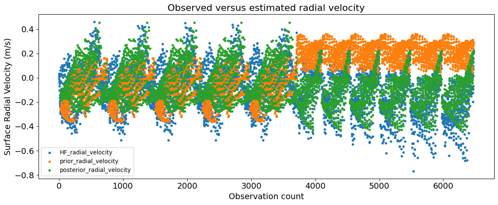

========
HF Radar
========
This utility converts High-Frequency (HF) radar ocean surface current products
into a DART observation sequence (`obs_seq`) file.

.. contents:: 
   :depth: 3
   :local:

Overview
--------
HF radar systems measure near–surface ocean currents by transmitting and receiving
radio waves that scatter off surface gravity waves. These systems are widely deployed
by national and regional ocean observing networks, including:

* The `U.S. Integrated Ocean Observing System (IOOS) <https://ioos.noaa.gov/project/hf-radar/>`_ HF radar network,
* The `CODAR SeaSonde <https://codar.com>`_ instrument family (Commercial provider
  of HF radar systems commonly used in U.S. and international networks),
* `Indonesian Coastal Observations (BMKG/Baron Weather) <https://www.bmkg.go.id/>`_
  local installations at *BATU*, *DALI*, and *BADA* sites used for the **InaCAWO–ROMS**
  project with NSF NCAR.

The converter supports two data families:

* **Totals (vector currents):** gridded eastward (``u``) and northward (``v``) surface currents
  with optional per-cell standard deviations (``stdu``, ``stdv``).
* **Radials (single-site line-of-sight currents):** curvilinear grids with
  bearing angle (``bear``), range (``rnge``), QC flag (``vflg``), and radial velocity (``velo``).

Each observation is written with a DART kind and associated error variance.
All locations are set to ``VERTISSURFACE``.

Forward operators
-----------------
* ``HFRADAR_U_CURRENT_COMPONENT`` uses observed ``u``
* ``HFRADAR_V_CURRENT_COMPONENT`` uses observed ``v``
* ``HFRADAR_RADIAL_VELOCITY`` with operator: :math:`U \cos(\phi) + V \sin(\phi)`,
  where :math:`\phi` is the beam bearing in **radians**.

Input data expectations
-----------------------
**Totals files** (regular lat/lon):

- Dimensions: ``lat(nlat)``, ``lon(nlon)``

- Variables:

   + ``u(lon,lat)``, ``v(lon,lat)`` with attribute ``_FillValue`` and units m/s or cm/s
   + optional ``stdu(lon,lat)``, ``stdv(lon,lat)`` having the same units as velocities
   + ``time`` dimension (length 1)

**Radials files** (curvilinear x/y):

- Dimensions: ``x(nx)``, ``y(ny)`` (2-D variables)

- Variables:

   + ``lat(y,x)``, ``lon(y,x)`` degrees; longitudes auto-shifted to [0,360)
   + ``bear(y,x)`` degrees clockwise from true north (FO converts it to radians)
   + ``velo(y,x)`` units m/s or cm/s, auto-converted to m/s
   + ``rnge(y,x)`` kilometers from instrument
   + ``vflg(y,x)`` QC flag; treated as a non-negative scalar; typical good range [0,1023]

- Global attributes: ``Site`` (instrument/site name). If the attribute is not available, 
  the converter sets the instrument to "UNKNOWN".

.. note::
 
  **Time handling (both types):**
  The converter reads the time variable and units attribute, parses the
  calendar reference, and constructs the DART time.  
  Example accepted formats:

  .. code-block:: text

    seconds since YYYY-MM-DD hh:mm:ss
    hours since   YYYY-MM-DD hh:mm:ss

Build & run
-----------
Build like other DART converters. Then run with an ``input.nml`` that includes
``obs_def_ocean_nml`` for the forward operator and ``hf_to_obs_nml``.
The program writes a single output sequence defined by ``file_out``.

.. code-block:: bash

   ./hf_to_obs

Observation Errors
^^^^^^^^^^^^^^^^^^
- Observation error standard deviations for totals U and V are 
  read from input HF radar NetCDF file, if available. If the 
  uncertainties are not part of the raw data, they are set 0.001 m/s.
- Radial (single-site) files almost never include explicit per-cell
  uncertainties, because each radial velocity comes from a spectral peak fit in the Doppler spectrum,
  and the uncertainty often depends on SNR, spectral width, antenna pattern, and geometric precision.
- The radial observation errors are set based on the `IOOS <https://ioos.noaa.gov/>`_,
  `SEACOOS <https://sccoos.org/>`_ guidelines, where a typical :math:`\sigma_0`
  range for a coastal CODAR radial is 0.15 m/s.
- We also apply an error growth with range to mimic degradation:
  :math:`\sigma(r) = \sigma_0 \left(1 + \alpha \frac{r}{r_{max}}\right)`;
  :math:`\alpha \approx 1.0`
- Finally, all error SD values are clamped to the range [0.001, 0.4] m/s.

Namelist
--------
This namelist is added to the rest of DART program namelists in file ``input.nml``. Namelists start
with an ampersand '&' and terminate with a slash '/'.

.. code-block:: fortran

   &hf_to_obs_nml
      file_in          = 'CODAR_BADA_2025_10_06_0310-1759720200.nc',  ! single file (or '')
      file_list        = 'HF_file_list',                              ! text file of paths (or '')
      file_out         = 'obs_seq.hf',
      radial_rmin_km   = -1.0,     ! <0: derive from data (skip ~first 1 km)
      radial_rmax_km   = -1.0,     ! <0: derive from data (max finite range)
      avg_obs_per_file = 500000,   ! pre-allocation hint
      debug            = .true.
   /

- You must set **exactly one** of ``file_in`` or ``file_list``.
- If both ``radial_rmin_km`` and ``radial_rmax_km`` are negative, the converter
  automatically derives them from the data extents.
- Velocities in cm/s are automatically converted to m/s.
- QC filter: 0 ≤ flag < 1024; out-of-range or NaN values are excluded.

.. list-table::
   :header-rows: 1
   :widths: 20 10 25 45

   * - **Namelist item**
     - **Type**
     - **Default / Allowed values**
     - **Description**

   * - ``file_in``
     - character(len=256)
     - ' ' (empty string)
     - Path to a single HF radar NetCDF input file.  
       Mutually exclusive with ``file_list``.  

   * - ``file_list``
     - character(len=256)
     - ' ' (empty string)
     - Path to a text file containing a list of NetCDF files,  
       one filename per line.  
       Only one of ``file_in`` or ``file_list`` may be set.

   * - ``file_out``
     - character(len=256)
     - ``'obs_seq.hf'``
     - Name of the DART observation sequence output file.  
       If the file already exists, it will be replaced.

   * - ``radial_rmin_km``
     - real(r8)
     - ``-1.0``  
       (< 0 means it will be derived from data)
     - Minimum accepted range (km) for radial observations.  
       If negative, the converter uses the data minimum + 1 km as the lower bound.

   * - ``radial_rmax_km``
     - real(r8)
     - ``-1.0``  
       (< 0 means it will be derived from data)
     - Maximum accepted range (km) for radial observations.  
       If negative, the converter uses the data maximum range found in the file.

   * - ``avg_obs_per_file``
     - integer
     - ``500000``
     - Estimated average number of observations per input file.  
       Used to pre-allocate sequence memory efficiently.

   * - ``debug``
     - logical
     - ``.true.``
     - If true, prints detailed progress information and  
       a summary of counts, statistics, and instrument sites.

Key Routines
------------
Below are brief descriptions of the main routines used in ``hf_to_obs``:

* **configure_HF_file:**
  Opens the NetCDF file, determines whether it contains totals or radials,
  reads the time variable and its units (seconds/hours since base date),
  and constructs a DART ``time_type`` object.
  Sets ``hf_kind = 0`` for totals and ``hf_kind = 1`` for radials.

* **read_hf_totals:**
  Reads gridded totals: ``u(lon,lat)``, ``v(lon,lat)``, and optional
  ``stdu``, ``stdv`` fields. Ensures units are in m/s and applies
  lower/upper bounds to the observation error standard deviations.
  Missing values are detected via NetCDF ``_FillValue``.

* **read_hf_radials:**
  Reads single-site radial velocities and supporting metadata including
  bearing (``bear``), range (``rnge``), and QC flags (``vflg``).
  Performs range-dependent error assignment and filters bad or out-of-range data.
  The radar site name is obtained from the global ``Site`` attribute.

* **fill_obs:**
  Populates and inserts a new observation into the DART ``obs_sequence``.
  Handles both scalar (U, V) and angular (radial) observations.
  For radials, it assigns a unique instrument ID and calls
  ``set_hf_radial_vel()`` to store the instrument geometry for use by
  the forward operator.

Output
------
An observation sequence file is obtained after running the converter.
Here is a sample output from an obs_seq.hf file. Note that for
``HFRADAR_RADIAL_VELOCITY`` extra metadata are gathered, including the
instrument ID and the bearing angle. These are used in the FO
comutations as described above.

.. code-block:: text

  obs_sequence
  obs_type_definitions
           3     
          61 HFRADAR_U_CURRENT_COMPONENT    
          62 HFRADAR_V_CURRENT_COMPONENT    
          63 HFRADAR_RADIAL_VELOCITY      
  num_copies:      1  num_qc:       1     
  num_obs:         3  max_num_obs:  3  
  HF radar observation      
  HF radar QC      
  first:           1  last:         3
  OBS      1     
  3.405999898910522E-002
  0.000000000000000E+000
          -1           2          -1    
  obdef
  loc3d
     1.849769674874062       -0.1033755157457358         0.000000000000000     -1    
  kind
          63    
  HFRADAR
  InsID
        1361  
  angle
   240.000000000000     
           1     
   600     155141
  2.600160803059251E-002 
  OBS    2
  0.126917576546429
  0.000000000000000E+000
         1        3          -1
  obdef
  loc3d
     1.849701730907843       -0.1025887102601352         0.000000000000000     -1
  kind
          61
  14400     155141
  2.482996394614055E-003
  OBS    3
  0.210487239870864
  0.000000000000000E+000
        -1          2          -1
  obdef
  loc3d
     1.849701730907843       -0.1025887102601352         0.000000000000000     -1
  kind
          62
  14400     155141
  1.225000039840094E-003

Debug summary
^^^^^^^^^^^^^
With ``debug = .true.``, the converter prints a run summary like:

.. code-block:: text

   --- HF converter summary (all files) ---
       Totals kept     : 2764 (22.52%)
       Radials kept    : 3707 (63.91%)
       Dropped by flag : 0
       Dropped by range: 13
       NaN drops (U)   : 4756
       NaN drops (V)   : 4756
       NaN drops (rad) : 2080
       +++++++++++++++++
          U   value min/max/mean (m/s)   :  -6.8351E-01  2.5335E-01 -1.5772E-01
          V   value min/max/mean (m/s)   :  -7.6822E-01  3.7016E-01 -1.2603E-01
        Radial value min/max/mean (m/s)  :  -5.1548E-01  4.5989E-01 -5.2203E-02
       +++++++++++++++++
          U   error SD min/max/mean (m/s):   1.0000E-03  9.9933E-02  7.4407E-03
          V   error SD min/max/mean (m/s):   1.0000E-03  3.2380E-01  1.4143E-02
        Radial error SD min/max/mean     :   1.6125E-01  3.0000E-01  2.1777E-01
       +++++++++++++++++
       Radial instruments processed (3): BATU, DALI, BADA 

The converter also prints a log of all processed data files and associated
functionality. The example below shows how the converter reads in a radial
evlocity file (`Input file #2`) and a totals velocity file (`Input file #6`).
Important information such as unit conversion, applied instrument range, and
observation error computations are reported.

.. code-block:: text 

 Input file: #2 ../data/BATU_2025_10_06_00_20_00_radial.nc                                                                                                                                                                                                                      
    * Reading in Radial Velocity: 2025 Oct 06 00:20:00
      Bear angle is in degrees. The FO will convert it to radians.
      Obs "Radial Sea Water Velocity" unit is in cm s-1; converting to m/s.
      Using radial range window: [  3.00 km,  40.02 km]
    * Computed obs errors using a range-dependent strategy.

 ...
     
 Input file: #6 ../data/CODAR_BADA_2025_10_06_0310-1759720200.nc                                                                                                                                                                                                                
    * Reading in TOTAL U and V data: 2025 Oct 06 03:10:00
    * Read in U, V, stdU, and stdV from the input obs file.
      Obs "Eastward Sea Water Velocity" unit is in m/s; no conversion needed.
      Obs "Northward Sea Water Velocity" unit is in m/s; no conversion needed.
    * Clamped obs errors to configured min/max.

The image below shows a scatter plot (obtained using
`pyDARTdiags <https://ncar.github.io/pyDARTdiags/>`_) of the observed and
estimated (prior, posterior) radial velocities in a regional
ocean example. Note that radial velocities (and total ones too)
can be either positive or negative.

Troubleshooting
^^^^^^^^^^^^^^^
* **time dimension > 1 not supported** (Totals):
  The converter currently expects a singleton ``time`` for totals. Split
  multi-time files before converting (e.g., with NCO).
* **Unknown units for observed currents**:
  Ensure ``u/v/velo`` units are either m/s or cm/s.
* **Few radials kept**:
  Check ``vflg`` range conventions and adjust the keep rule in the code if your
  site encodes “bad/missing” differently. Also verify ``rnge`` units (km).
* **Inconsistent 2-D dimensions**:
  Confirm that ``lat, lon, velo, bear, rnge, vflg`` all share shape ``(y,x)``.

Performance & other tips
^^^^^^^^^^^^^^^^^^^^^^^^
* Set ``avg_obs_per_file`` in the namelist close to your typical per-file
  observation count for efficiency.
* Set ``debug = .false.`` in the namelist for production runs. Printing timestamps,
  unit conversions, and summaries for every file may dominate wall-time.

.. tip::
  * Promote radial error parameters (baseline growth; :math:`\alpha`) to the 
    namelist if you want to tune them for obs error computations per network/season.
